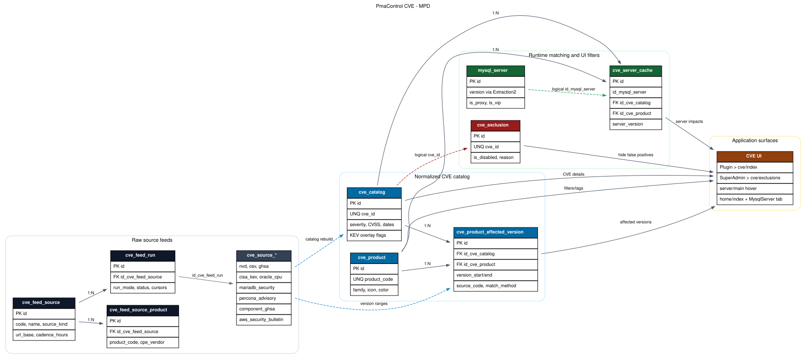

# CVE

Cette page décrit la machinerie CVE de PmaControl: ingestion des sources, normalisation du catalogue, matching avec les serveurs, écrans UI et règles anti-faux positifs.

## Références tickets et PR

Les références ci-dessous viennent des branches, commits et PR locaux liés à la feature.

| Référence | Sujet | Résultat utile pour la feature CVE |
| --- | --- | --- |
| #780 | Feature principale CVE | Suivre les CVE MySQL-like depuis MySQL 4.1, les rattacher à produit/version, afficher l'impact dans le parc. |
| #781 | Source feed schema | Ajout des tables `cve_feed_*` et `cve_source_*`, plus le backfill des sources externes. |
| #789 | Plugin CVE inventory | Ajout du plugin `cve-inventory`, du catalogue normalisé et de l'écran `cve/index`. |
| #791 | ACL CVE | Exposition contrôlée de `Cve/index` via `config_sample/acl.config.ini`. |
| #793 | Colonne CVE serveur | Ajout des impacts CVE dans `server/main` avec hover et cache serveur. |
| #795 | Tags composants, Oracle CPU, exclusions | Séparation XtraBackup/PMM/MariaDB Backup, Oracle MySQL Risk Matrix, écran SuperAdmin `cve/exclusions`. |

Points fonctionnels extraits des tickets:

- Les CVE doivent couvrir les produits MySQL-like et composants proches: MySQL, MariaDB, Percona, Percona XtraDB Cluster, ProxySQL, MaxScale, HAProxy, Vitess, TiDB, SingleStore, Aurora MySQL, RDS MySQL, Galera, XtraBackup, PMM et MariaDB Backup.
- NVD est la base historique, avec backfill depuis 2004 pour couvrir MySQL 4.1.
- Les sources vendor sont préférées quand elles donnent des versions corrigées ou des matrices produit plus précises.
- Les faux positifs doivent pouvoir être masqués sans supprimer les données sources.
- Les composants non serveur, par exemple PMM, XtraBackup, MariaDB Backup ou Enterprise Manager, doivent rester taggés séparément et ne pas polluer les écrans serveur MySQL.

## MPD

Le MPD est maintenu en DOT et rendu en SVG:

- [cve_mpd.dot](cve_mpd.dot)
- [cve_mpd.svg](cve_mpd.svg)



Régénération du SVG:

```bash
dot -Tsvg docs/cve_mpd.dot -o docs/cve_mpd.svg
```

## Flux Global

1. `script/cve_source_backfill.php` récupère les sources externes et écrit les tables brutes `cve_source_*`.
2. Chaque exécution est tracée dans `cve_feed_run`, rattachée à `cve_feed_source`.
3. `script/cve_catalog_rebuild.php` lit les sources brutes, reconstruit `cve_catalog` et `cve_product_affected_version`, puis vide `cve_server_cache`.
4. `ServerCveImpactMatcher` relie les versions réellement détectées sur les serveurs aux plages de versions vulnérables.
5. Les écrans lisent le catalogue et le cache, en excluant les CVE désactivées via `cve_exclusion`.

## Sources De Données

Les sources sont déclarées dans `cve_feed_source`; les couples source/produit sont déclarés dans `cve_feed_source_product`.

| Source | Table brute | Rôle |
| --- | --- | --- |
| NVD JSON 2.0 | `cve_source_nvd` | Source primaire CVE/CVSS/CPE, historique depuis 2004. |
| CISA KEV | `cve_source_cisa_kev` | Overlay `known_exploited` et ransomware. |
| Oracle CPU | `cve_source_oracle_cpu` | Matrices Oracle MySQL, produits Oracle précis, CVSS/fixed versions. |
| MariaDB Security | `cve_source_mariadb_security` | Advisories MariaDB Server et MaxScale. |
| Percona Advisory | `cve_source_percona_advisory` | Advisories Percona, XtraBackup, PMM, Percona Server. |
| AWS Security Bulletin | `cve_source_aws_security_bulletin` | Aurora MySQL et RDS MySQL, versions moteur AWS. |
| GHSA | `cve_source_ghsa` | Advisories GitHub génériques, surtout OSS. |
| Component GHSA | `cve_source_component_ghsa` | ProxySQL, MaxScale, HAProxy, Vitess. |
| OSV | `cve_source_osv` | Ranges OSS complémentaires. |

Les tables brutes gardent `raw_json`, `payload_hash`, `is_current`, `date_first_seen` et `date_last_seen`. Cela permet de conserver l'historique source tout en reconstruisant un catalogue normalisé propre.

## Tables Normalisées

- `cve_product`: référentiel produits. `product_code` est la clé stable utilisée partout dans le code et les URLs.
- `cve_catalog`: une ligne par CVE normalisée. Contient `cve_id`, résumé, sévérité, scores CVSS, dates, CWE, références et flags CISA KEV.
- `cve_product_affected_version`: table de liaison CVE/produit/plage de versions. Les colonnes `version_start_*` et `version_end_*` rendent le matching automatique possible. `match_method` et `match_confidence` gardent la provenance de la règle.
- `cve_server_cache`: cache des CVE qui matchent un serveur PmaControl. Il est recalculé par serveur avec un TTL de 24h (`ServerCveImpactMatcher::CACHE_TTL_SECONDS`) ou invalidé lors d'une exclusion.
- `cve_exclusion`: liste SuperAdmin des CVE à cacher. Le lien vers `cve_catalog` est logique via `cve_id`, pour autoriser une exclusion avant ou après l'arrivée de la CVE dans le catalogue.

## Produits Et Tags

Les tags sont volontairement plus fins que "MySQL":

- `mysql`, `mariadb`, `percona`, `percona_xtradb_cluster`, `tidb`, `singlestore`, `vitess` représentent des moteurs ou compatibles MySQL.
- `proxysql`, `maxscale`, `haproxy` représentent des proxy/routeurs proches du trafic MySQL.
- `aurora_mysql` et `rds_mysql` sont séparés de MySQL upstream, car AWS peut backporter ou corriger différemment.
- `xtrabackup`, `pmm`, `mariadb_backup`, `mysql_enterprise_monitor`, `mysql_workbench`, etc. sont des composants. Ils ne doivent pas devenir des CVE serveur MySQL par défaut.

Exemples de règles importantes:

- Une CPE Percona ciblant `monitoring_and_management` devient `pmm`, pas `percona`.
- Une CPE Percona ciblant `xtrabackup` devient `xtrabackup`, pas `percona`.
- Une CPE MariaDB ciblant `mariadb_backup` ou `mariabackup` devient `mariadb_backup`, pas `mariadb`.
- Une CVE Spring/Enterprise Manager comme `CVE-2022-22965` est hors scope serveur MySQL et peut être exclue.
- Une CVE Percona XtraDB Cluster comme `CVE-2020-15180` doit être rattachée à `percona_xtradb_cluster`, avec les bornes NVD conservées.

## Backfill Et Rebuild

Backfill complet:

```bash
php script/cve_source_backfill.php --database=pmacontrol --source=all --nvd-start-year=2004
```

Backfill ciblé:

```bash
php script/cve_source_backfill.php --database=pmacontrol --source=nvd --nvd-start-year=2004 --nvd-end-year=2026
php script/cve_source_backfill.php --database=pmacontrol --source=cisa_kev
php script/cve_source_backfill.php --database=pmacontrol --source=oracle_cpu
```

Reconstruction du catalogue:

```bash
php script/cve_catalog_rebuild.php --database=pmacontrol
```

Le rebuild:

- resème les produits actifs;
- lit les sources `is_current=1`;
- fusionne les métadonnées CVE par priorité et sévérité;
- insère les plages affectées dédupliquées par `match_hash`;
- supprime puis reconstruit `cve_catalog`, `cve_product_affected_version` et `cve_server_cache`.

La cadence attendue est quotidienne. Exemple cron:

```cron
15 2 * * * cd /srv/www/pmacontrol && php script/cve_source_backfill.php --database=pmacontrol --source=all --quiet && php script/cve_catalog_rebuild.php --database=pmacontrol --quiet
```

## Matching Serveur

Le matching est dans `App\Library\Cve\ServerCveImpactMatcher`.

1. Le contexte serveur est construit depuis `mysql_server` et les métriques `Extraction2`.
2. Les VIP sont ignorées: une VIP ne porte pas de version logicielle propre.
3. Le type produit est déduit de la version et de `version_comment`, avec `Format::getMySQLNumVersion`.
4. Les serveurs `is_proxy=1` sont traités comme ProxySQL si le contexte le confirme.
5. Les lignes `cve_product_affected_version` du produit sont testées contre la version normalisée.
6. Les matches sont écrits dans `cve_server_cache`.

Les plages structurées utilisent:

- `version_start_including` => `>=`
- `version_start_excluding` => `>`
- `version_end_including` => `<=`
- `version_end_excluding` => `<`

Si une source ne fournit pas de plage structurée, le matcher ne doit pas afficher une CVE serveur sur une simple phrase non exploitable. La ligne reste visible dans l'inventaire CVE, mais pas forcément dans l'impact serveur.

## Interfaces

- `Plugin > CVE Inventory`: route `cve/index`. Liste les CVE et les versions impactées, avec tags produits. Le filtre `/cve/index/<product_code>` affiche un produit spécifique.
- `SuperAdmin > CVE exclusions`: route `cve/exclusions`. Recherche par CVE, produit, titre ou source. Une CVE cochée est masquée des vues inventory, server hover, home et détail serveur.
- `server/main`: colonne CVE ajoutée après le serveur. Le hover affiche les CVE impactantes du serveur, avec sévérité, CVSS et flag KEV.
- `home/index`: vue parc: liste des CVE qui impactent au moins un serveur, avec nombre de serveurs touchés.
- `MysqlServer/main/<id>/cve`: onglet détail serveur avec les CVE du serveur, risques, criticité et sources.

## Faux Positifs Et Applicabilité

Les faux positifs ne doivent pas être supprimés des sources. Il faut les exclure ou les recatégoriser:

- Exclusion manuelle via `cve_exclusion` quand la CVE est clairement hors périmètre.
- Correction de `product_code` quand la CVE concerne un composant précis.
- Ajout d'une source vendor quand NVD est trop générique.
- Rebuild du catalogue après correction.

Exemples connus:

- `CVE-2022-22965` est Spring Framework/Spring4Shell; elle peut entrer via Oracle Enterprise Manager metadata, mais ne concerne pas un serveur MySQL-like.
- `CVE-2019-3822` ne doit pas être visible sur Aurora MySQL si la source ne prouve pas un impact Aurora/RDS.
- Les CVE PMM, MongoDB, Percona Toolkit ou XtraBackup ne doivent pas être affichées comme Percona Server.

## Migrations

Migrations principales:

- `sql/incremental_v2/20260506_cve_source_feeds.sql`
- `sql/incremental_v2/20260506_cve_catalog_plugin.sql`
- `sql/incremental_v2/20260506_cve_component_tags.sql`
- `sql/incremental_v2/20260506_zz_cve_component_feed_source_products.sql`
- `sql/incremental_v2/20260506_zzz_cve_oracle_mysql_product_tags.sql`
- `sql/incremental_v2/20260506_zzzz_cve_exclusion_admin.sql`
- `sql/incremental_v2/20260506_zzzzz_cve_percona_xtradb_cluster.sql`

Les migrations ajoutent aussi les menus:

- `Plugins > CVE Inventory` pour l'écran catalogue.
- `SuperAdmin > CVE exclusions` pour la désactivation des faux positifs.

## Contrôles SQL Utiles

Volume par table:

```sql
SELECT table_name, table_rows
FROM information_schema.tables
WHERE table_schema = DATABASE()
  AND table_name LIKE 'cve_%'
ORDER BY table_name;
```

CVEs par produit:

```sql
SELECT p.product_code, p.product_name, COUNT(DISTINCT av.id_cve_catalog) AS cves
FROM cve_product p
LEFT JOIN cve_product_affected_version av
  ON av.id_cve_product = p.id
 AND av.is_current = 1
GROUP BY p.id, p.product_code, p.product_name
ORDER BY cves DESC, p.product_code;
```

Exclusions actives:

```sql
SELECT e.cve_id, e.reason, e.disabled_by, e.disabled_at
FROM cve_exclusion e
WHERE e.is_disabled = 1
ORDER BY e.disabled_at DESC, e.cve_id;
```

Cache serveur:

```sql
SELECT sc.id_mysql_server, sc.product_code, COUNT(*) AS matching_cves
FROM cve_server_cache sc
WHERE sc.is_active = 1
GROUP BY sc.id_mysql_server, sc.product_code
ORDER BY matching_cves DESC;
```

## Tests

Tests ciblés:

```bash
vendor/bin/phpunit \
  tests/Library/Cve/CveCatalogBuilderTest.php \
  tests/Library/Cve/ServerCveImpactMatcherTest.php \
  tests/Schema/CveCatalogPluginMigrationTest.php \
  tests/Schema/CveSourceFeedsMigrationTest.php \
  tests/Controller/CveAclTest.php \
  tests/Controller/CveExclusionsTest.php \
  tests/Script/CveSourceBackfillScriptTest.php
```

Ces tests couvrent:

- mapping CPE vers produit;
- tags composants;
- parsing Oracle CPU;
- rejet des composants hors scope;
- matching version/ranges;
- ACL;
- migrations;
- payload CSRF et normalisation de l'écran exclusions.

## Règles De Maintenance

- Ne pas fusionner toutes les CVE Percona dans `percona`; vérifier PMM, XtraBackup, Toolkit, MongoDB et XtraDB Cluster.
- Ne pas hériter automatiquement de MySQL vers Aurora/RDS sans source AWS ou mapping CPE explicite.
- Ajouter une exclusion seulement si la CVE est hors périmètre fonctionnel, pas pour masquer un problème de parsing.
- Après toute modification source, produit ou exclusion, relancer `script/cve_catalog_rebuild.php`.
- Toute nouvelle source doit avoir une ligne `cve_feed_source`, des mappings `cve_feed_source_product`, une table brute si nécessaire, et un test de migration.
