# Dot3 — Documentation fonctionnelle et technique

Cette documentation décrit le fonctionnement de **Dot3** (générateur de graphes Graphviz)
à partir des fichiers suivants :

- `App/Controller/Dot3.php`
- `App/Library/Graphviz.php`
- `sql/full/pmacontrol.sql` (table `dot3_legend`)
- `documentation/vip-servers.md` (complément VIP)

---

## 1) Objectif

Dot3 produit une **cartographie Graphviz** des serveurs MySQL, des clusters Galera,
des proxys (ProxySQL/MaxScale) et des VIP. Le rendu final (SVG/PNG) est stocké en base
dans `dot3_graph` et lié à la topologie détectée via `dot3_cluster`.

---

## 2) Exécution (`Dot3/run`)

Dot3 est exécuté via la route **`Dot3/run`** (WEB/CLI selon le routeur Glial).
Exemples usuels :

```bash
# Exécution CLI (exemple standard Glial)
php index.php Dot3/run

# Avec une date (si le routeur la passe en paramètre)
php index.php Dot3/run 2024-11-01
```

> Le paramètre date est optionnel. S’il est fourni, Dot3 reconstruit l’état historique
> à partir des tables temporisées (`row_start`, `row_end`).

---

## 3) Flux fonctionnel (résumé)

### 3.1 Génération d’informations (`generateInformation`)

1. **Collecte** via `Extraction2::display()` des variables, statuts et métriques utiles
   (MySQL, Galera, ProxySQL, MaxScale, VIP, SSH stats, etc.).
2. **Mapping** IP:port ➜ `id_mysql_server` (table `mysql_server`, `alias_dns`, `proxysql_server`).
3. **Ajout VIP** (IP/port DNS) et **tunnels**.
4. **Sauvegarde JSON** dans `dot3_information` (avec MD5) pour éviter les régénérations
   inutiles.

### 3.2 Construction des groupes (`getGroup`)

Les groupes sont fusionnés pour définir chaque graphe :

- **Galera** (`generateGroupGalera`) via `wsrep_cluster_address` + `wsrep_incoming_addresses`.
- **Master/Slave** (`generateGroupMasterSlave`) via `@slave`.
- **ProxySQL** (`generateGroupProxySQL`) via `mysql_servers`.
- **MaxScale** (`generateGroupMaxScale`) via les services MaxScale.
- **VIP** (`generateGroupVip`) via `destination_id` / `destination_previous_id`.

### 3.3 Construction des nœuds et liens

- `buildServer()` : applique le thème `NODE_*` selon la disponibilité MySQL.
- `buildGaleraCluster()` : construit les clusters Galera + segments (gmcast.segment).
- `buildGaleraSstHintLink()` : ajoute un lien SST “hint” donor → joiner offline.
- `createGarb()` : crée un **arbitre Galera** (`garb`) si détecté dans `wsrep_incoming_addresses`.
- `buildLink()` : liens Master/Slave (réplication).
- `buildLinkVIP()` : liens VIP actifs / précédents.
- `buildLinkBetweenProxySQL()` : liens entre ProxySQL.
- `linkHostGroup()` : liens ProxySQL → backends (hostgroup).
- `linkMaxScale()` : liens MaxScale → backends.

### 3.4 Génération Graphviz

`writeDot()` assemble le DOT :

- `Graphviz::generateStart()`
- `Graphviz::generateServer()` (nœuds MySQL/ProxySQL/MaxScale/VIP)
- `Graphviz::generateGalera()` (clusters Galera + segments)
- `Graphviz::generateEdge()` (liens)
- `Graphviz::generateEnd()`

Le DOT est ensuite compilé par `Graphviz::generateDot()` en **SVG + PNG**.

### 3.5 Persistance

- `dot3_graph` : DOT + SVG + dimensions + MD5
- `dot3_cluster` : lien entre topologie et génération
- `dot3_cluster__mysql_server` : liste des serveurs dans le cluster

---

## 3.6 Règles d’ajout d’un arbitre Galera (garb)

Dot3 peut **ajouter un nœud arbitre** (garb) lorsqu’il est présent dans
`wsrep_incoming_addresses` d’un nœud Galera.

### 3.6.1 Détection

Dans `generateGroupGalera()` :

- `wsrep_incoming_addresses` est parsé par `getIdMysqlServerFromGalera()`.
- Si un élément commence par `:` (ex. `:4567`), Dot3 considère qu’il s’agit d’un **garb**.

### 3.6.2 Création (fonction `createGarb()`)

Dot3 crée alors un nœud **virtuel** :

1. **Duplique** le serveur source (`id_mysql_server`),
2. **Attribue** un nouvel ID (max + 1),
3. **Remplace** les informations clés :
   - `display_name = 'garb'`
   - `hostname = 'garb'`
   - `id_mysql_server = <nouvel id>`
4. **Injecte** ce nœud dans `self::$information[self::$id_dot3_information]['information']`.

### 3.6.3 Rendu Graphviz

- Le nœud `garb` est intégré au cluster Galera comme un nœud classique.
- Dans `Graphviz::generateServer()` :
  - `ip_real` est forcée à `N/A`.
  - le port est affiché en fallback si besoin.

---

---

## 4) Ports Graphviz utilisés

| Port | Usage |
|------|-------|
| `target` | Port par défaut des nœuds |
| `vip_active` | Flèche VIP vers destination active |
| `vip_previous` | Flèche VIP vers destination précédente |

> Les ports ProxySQL/MaxScale sont générés dynamiquement avec `crc32()`.

---

## 5) Règles de couleurs (`dot3_legend`)

La table `dot3_legend` alimente `Dot3::$config` via `loadConfigColor()`.
Chaque entrée définit :

- **const** : clé technique utilisée dans le code (`NODE_OK`, `REPLICATION_OK`, …)
- **name** : label fonctionnel
- **font** / **color** / **background** / **style** : rendu Graphviz
- **order** : tri dans les légendes

### 5.1 GALERA

| Const | Libellé | Font | Color | Background | Style | Ordre |
|---|---|---|---|---|---|---|
| `GALERA_AVAILABLE` | galera all ok | `#ffffff` | `#008000` | `#008000` | `filled` | 1 |
| `GALERA_DEGRADED` |  | `#ffffff` | `#e3ea12` | `#e3ea12` | `filled` | 2 |
| `GALERA_WARNING` | N*2  node should be N*2+1 | `#ffffff` | `#FFA500` | `#FFA500` | `filled` | 3 |
| `GALERA_CRITICAL` | only 2 node | `#ffffff` | `#008000` | `#008000` | `filled` | 4 |
| `GALERA_EMERGENCY` | only one node in galera | `#ffffff` | `#FF0000` | `#FF0000` | `dashed` | 5 |
| `GALERA_OUTOFORDER` | galera HS | `#ffffff` | `#FF0000` | `#000000` | `filled` | 6 |
| `GALERA_NOTICE` | N*2  node should be N*2+1 & N >= 4 | `#32CD32` | `#008000` | `#32CD32` | `filled` | 33 |

### 5.2 SEGMENT

| Const | Libellé | Font | Color | Background | Style | Ordre |
|---|---|---|---|---|---|---|
| `SEGMENT_OK` | segment ok | `#ffffff` | `#008000` | `#008000` | `dashed` | 1 |
| `SEGMENT_KO` | segment out of order | `#ffffff` | `#FF0000` | `#FF5733` | `dashed` | 2 |
| `SEGMENT_PARTIAL` | un neud est hs | `#ffffff` | `#f8b400` | `#f8b400` | `dashed` | 3 |

### 5.3 NODE

| Const | Libellé | Font | Color | Background | Style | Ordre |
|---|---|---|---|---|---|---|
| `NODE_OK` | Healty | `#FFFFFF` | `#008000` | `#008000` | `solid` | 1 |
| `NODE_ERROR` | Out of order | `#FFFFFF` | `#FF5733` | `#FF5733` | `dotted` | 2 |
| `NODE_BUSY` | Going down | `#FFFFFF` | `#A52A2A` | `#A52A2A` | `dashed` | 3 |
| `NODE_RECEIVE_IST` | Node receiving Incremental State Transfert | `#FFFFFF` | `#EC971F` | `#EC971F` | `filled` | 5 |
| `NODE_NOT_PRIMARY` | Node probably desynced | `#FFFFFF` | `#FFA500` | `#FFA500` | `solid` | 10 |
| `NODE_DONOR` | Node donnor | `#FFFFFF` | `#00FF00` | `#00FF00` | `solid` | 11 |
| `NODE_DONOR_DESYNCED` | Node donor desynced | `#FFFFFF` | `#337AB7` | `#337AB7` | `solid` | 11 |
| `NODE_MANUAL_DESYNC` | node desync manually | `#FFFFFF` | `#0000FF` | `#0000FF` | `solid` | 12 |
| `NODE_SST` | Galera SST | `#000000` | `#000000` | `#E3EA12` | `solid` | 12 |
| `NODE_JOINER` | node joining cluster | `#FFFFFF` | `#000000` | `#000000` | `dashed` | 15 |
| `NODE_INITIALIZED` | Node initialized | `#FFFFFF` | `#7FFF00` | `#7FFF00` | `solid` | 16 |
| `NODE_WAITING` | Waiting for SST | `#FFFFFF` | `#00008B` | `#00008B` | `solid` | 17 |
| `NODE_IST` | Receive IST | `#FFFFFF` | `#FFD700` | `#FFD700` | `solid` | 20 |

### 5.4 REPLICATION

| Const | Libellé | Font | Color | Background | Style | Ordre |
|---|---|---|---|---|---|---|
| `REPLICATION_OK` | Healty | `#FFFFFF` | `#008000` | `#008000` | `solid` | 1 |
| `REPLICATION_DELAY` | Delay | `#FFFFFF` | `#FFA500` | `#FFA500` | `filled` | 2 |
| `REPLICATION_STOPPED` | Stopped | `#FFFFFF` | `#0000FF` | `#0000FF` | `filled` | 4 |
| `REPLICATION_ERROR_SQL` | Error SQL | `#FFFFFF` | `#FF0000` | `#FF0000` | `filled` | 5 |
| `REPLICATION_ERROR_IO` | Error IO | `#FFFFFF` | `#FF0000` | `#FF0000` | `dashed` | 6 |
| `REPLICATION_ERROR_CONNECT` | Can't connect | `#FFFFFF` | `#696969` | `#696969` | `dashed` | 8 |
| `REPLICATION_BUG` | Cannot found binlog | `#FFFFFF` | `#FB2BAF` | `#FB2BAF` | `dashed` | 8 |
| `REPLICATION_SST` | Galera SST | `#FFFFFF` | `#00008B` | `#00008B` | `solid` | 12 |
| `REPLICATION_BLACKOUT` | Out of order | `#FFFFFF` | `#000000` | `#000000` | `dashed` | 15 |

### 5.5 PROXYSQL

| Const | Libellé | Font | Color | Background | Style | Ordre |
|---|---|---|---|---|---|---|
| `PROXYSQL_ONLINE` | server online | `#ffffff` | `#008000` | `#008000` | `filled` | 1 |
| `PROXYSQL_SHUNNED` | serveur ecarté par ProxySQL | `#ffffff` | `#FF0000` | `#CC5500` | `dashed` | 2 |
| `PROXYSQL_OFFLINE_SOFT` | keep connection but don't accept new | `#333333` | `#FFAC1C` | `#ffc107` | `dashed` | 3 |
| `PROXYSQL_OFFLINE_HARD` | drop all connexion and don't allow to connect | `#ffffff` | `#AA4A44` | `#AA4A44` | `filled` | 4 |
| `PROXYSQL_CONFIG` | Problem config with credentials | `#ffffff` | `#0062CC` | `#0062CC` | `solid` | 4 |
| `PROXYSQL_MIRRORING` | keep connection but don't accept new | `#ffffff` | `#FF6677` | `#FF6677` | `filled` | 45 |

### 5.6 MAXSCALE

| Const | Libellé | Font | Color | Background | Style | Ordre |
|---|---|---|---|---|---|---|
| `MAXSCALE_CONFIG` | main info | `#ffffff` | `#0062CC` | `#0062CC` | `filled` | 1 |
| `MAXSCALE_CATEGORY` | masxcale categories | `#ffffff` | `#0062CC` | `#0062CC` | `filled` | 2 |
| `MAXSCALE_RUNNING` | server online | `#ffffff` | `#ffffff` | `#008000` | `filled` | 1 |
| `MAXSCALE_DOWN` | serveur considérer HS par MaxScale | `#ffffff` | `#ffffff` | `#CC5500` | `filled` | 2 |
| `MAXSCALE_UNSYNC` | maxscale unsync for master slave | `arial` | `#ffffff` | `#337ab7` | `filled` | 5 |

### 5.7 Autres types (hors périmètre demandé)

| Type | Const | Libellé | Font | Color | Background | Style | Ordre |
|---|---|---|---|---|---|---|---|
| `PROXYSQL_EDGE` | `EDGE_WRITER_ON` | arrow for writer on | `#ffffff` | `#000000` | `#DD0000` | `filled` | 1 |
| `PROXYSQL_EDGE` | `EDGE_READER` | Arrow for reader on | `#ffffff` | `#FFFFFF` | `#DD0000` | `filled` | 2 |
| `SERVER` | `SERVER_CONFIG` | color of tr / td for line of configuration | `#000001` | `#000002` | `#EEEEEF` | `dashed` | 1 |

---

## 6) Schéma DOT (fonctionnement global)

```dot
digraph dot3_flow {
  rankdir=LR;
  node [shape=box, fontname="Arial", fontsize=10];

  "Dot3::run" -> "generateInformation";
  "generateInformation" -> "dot3_information (JSON + md5)";
  "dot3_information (JSON + md5)" -> "getGroup";
  "getGroup" -> "buildServer";
  "buildServer" -> "buildGaleraCluster";
  "buildGaleraCluster" -> "buildLink / buildLinkVIP / linkHostGroup / linkMaxScale";
  "buildLink / buildLinkVIP / linkHostGroup / linkMaxScale" -> "writeDot";
  "writeDot" -> "Graphviz::generateDot";
  "Graphviz::generateDot" -> "DOT (.dot)";
  "Graphviz::generateDot" -> "SVG/PNG";
  "SVG/PNG" -> "dot3_graph";
  "dot3_graph" -> "dot3_cluster";
  "dot3_cluster" -> "dot3_cluster__mysql_server";

  "Sources" -> "generateInformation";
  "mysql_server + metrics" -> "Sources";
  "proxysql_server / maxscale_server / vip" -> "Sources";
}
```



---

## 7) Notes complémentaires

- **VIP** : voir `documentation/vip-servers.md` pour les règles métiers détaillées.
- **Graphviz** : la commande `dot` doit être disponible sur le serveur.
- **Arbitre Galera (garb)** : un nœud `garb` peut être créé si détecté dans `wsrep_incoming_addresses`.
