% PmaControl Documentation
% Generated on 2026-03-12

# Index

- [alert](#alert)
- [api rest](#api-rest)
- [Dot3](#dot3)
- [Galera](#galera)
- [Listener](#listener)
- [pmacontrol tables documentation](#pmacontrol-tables-documentation)
- [schema model structure](#schema-model-structure)
- [vip servers](#vip-servers)

# alert

# Alert Timeline

Source: interface d'alertes exportée le 11 mars 2026.

## All Types

### 10 March, 2026

14:02:10 PM  
Action Required  
A new optimized configuration has been recommended

### 09 March, 2026

14:02:11 PM  
Info  
Database service has been restarted

### 06 March, 2026

18:50:51 PM  
Info  
Database service has been restarted

18:49:24 PM  
Info  
Database service has been restarted

18:43:06 PM  
Info  
Database service has been restarted

17:17:56 PM  
Info  
Database service has been restarted

17:16:59 PM  
Info  
Database service has been restarted

16:09:04 PM  
Improvement  
Releem agent connectivity restored

16:06:41 PM  
Info  
Database service has been restarted

13:12:04 PM  
Warning  
Multiple unexpected restarts detected

10:18:04 AM  
Warning  
Releem agent is unreachable

09:56:45 AM  
Info  
Database service has been restarted

09:56:35 AM  
Info  
Database service has been restarted

09:56:34 AM  
Info  
Database service has been restarted

09:16:18 AM  
Info  
Database service has been restarted

09:16:18 AM  
Info  
Database service has been restarted

09:16:18 AM  
Info  
Database service has been restarted

09:15:40 AM  
Info  
Database service has been restarted

08:57:04 AM  
Improvement  
Releem agent connectivity restored

08:56:22 AM  
Info  
Database service has been restarted

08:54:04 AM  
Warning  
Releem agent is unreachable

08:42:41 AM  
Info  
Database service has been restarted

00:07:15 AM  
Info  
Database service has been restarted

### 05 March, 2026

23:58:36 PM  
Info  
Database service has been restarted

10:34:37 AM  
Info  
Database service has been restarted

### 04 March, 2026

18:06:06 PM  
Info  
Database service has been restarted

### 03 March, 2026

14:18:03 PM  
Improvement  
Releem agent connectivity restored

14:15:04 PM  
Warning  
Releem agent is unreachable

14:14:40 PM  
Info  
Database service has been restarted

### 02 March, 2026

14:54:04 PM  
Improvement  
Releem agent connectivity restored

14:52:44 PM  
Info  
Database service has been restarted

14:52:43 PM  
Info  
Database service has been restarted

14:52:43 PM  
Info  
Database service has been restarted

### 01 March, 2026

22:48:04 PM  
Warning  
Releem agent is unreachable

### 28 February, 2026

08:19:19 AM  
Action Required  
A new optimized configuration has been recommended

### 25 February, 2026

20:19:19 PM  
Info  
OS version has been updated

### 24 February, 2026

16:44:59 PM  
Info  
Database version has been updated

16:42:57 PM  
Info  
Database service has been restarted

16:12:04 PM  
Improvement  
Low disk space issue resolved

05:09:04 AM  
Warning  
Low disk space detected

### 23 February, 2026

14:42:04 PM  
Improvement  
Low disk space issue resolved

14:30:03 PM  
Improvement  
Releem agent connectivity restored

14:29:03 PM  
Info  
Database service has been restarted

03:00:04 AM  
Warning  
Releem agent is unreachable

### 22 February, 2026

09:48:04 AM  
Warning  
Low disk space detected

05:08:49 AM  
Improvement  
High Connection Utilisation issue resolved

### 21 February, 2026

08:19:19 AM  
Action Required  
A new optimized configuration has been recommended

07:03:47 AM  
Warning  
High(>80%) Connection Utilisation detected

07:02:47 AM  
Improvement  
High Connection Utilisation issue resolved

06:54:47 AM  
Warning  
High(>80%) Connection Utilisation detected

06:48:47 AM  
Improvement  
High Connection Utilisation issue resolved

06:35:47 AM  
Warning  
High(>80%) Connection Utilisation detected

06:34:47 AM  
Improvement  
High Connection Utilisation issue resolved

06:32:47 AM  
Warning  
High(>80%) Connection Utilisation detected

05:57:47 AM  
Improvement  
High Connection Utilisation issue resolved

01:10:46 AM  
Warning  
High(>80%) Connection Utilisation detected

01:09:46 AM  
Warning  
Critical(>90%) Connection Utilisation detected

01:03:46 AM  
Warning  
High(>80%) Connection Utilisation detected

01:01:48 AM  
Warning  
Critical(>90%) Connection Utilisation detected

01:00:46 AM  
Warning  
High(>80%) Connection Utilisation detected

00:59:46 AM  
Warning  
Critical(>90%) Connection Utilisation detected

00:50:46 AM  
Warning  
High(>80%) Connection Utilisation detected

00:49:46 AM  
Warning  
Critical(>90%) Connection Utilisation detected

00:48:46 AM  
Warning  
High(>80%) Connection Utilisation detected

00:47:46 AM  
Warning  
Critical(>90%) Connection Utilisation detected

00:44:46 AM  
Warning  
High(>80%) Connection Utilisation detected

00:00:46 AM  
Warning  
Critical(>90%) Connection Utilisation detected

### 20 February, 2026

23:59:46 PM  
Warning  
High(>80%) Connection Utilisation detected

23:50:46 PM  
Warning  
Critical(>90%) Connection Utilisation detected

23:46:46 PM  
Warning  
High(>80%) Connection Utilisation detected

23:44:46 PM  
Warning  
Critical(>90%) Connection Utilisation detected

22:29:46 PM  
Warning  
High(>80%) Connection Utilisation detected

22:25:46 PM  
Warning  
Critical(>90%) Connection Utilisation detected

22:24:46 PM  
Warning  
High(>80%) Connection Utilisation detected

22:17:46 PM  
Warning  
Critical(>90%) Connection Utilisation detected

22:08:46 PM  
Warning  
High(>80%) Connection Utilisation detected

22:07:46 PM  
Warning  
Critical(>90%) Connection Utilisation detected

20:24:46 PM  
Warning  
High(>80%) Connection Utilisation detected

18:27:46 PM  
Warning  
Critical(>90%) Connection Utilisation detected

18:25:46 PM  
Warning  
High(>80%) Connection Utilisation detected

18:16:46 PM  
Warning  
Critical(>90%) Connection Utilisation detected

18:10:46 PM  
Warning  
High(>80%) Connection Utilisation detected

18:08:46 PM  
Warning  
Critical(>90%) Connection Utilisation detected

18:07:46 PM  
Warning  
High(>80%) Connection Utilisation detected

16:34:18 PM  
Info  
Database service has been restarted

### 19 February, 2026

17:12:04 PM  
Improvement  
Low disk space issue resolved

16:21:04 PM  
Warning  
Low disk space detected

### 16 February, 2026

20:19:19 PM  
Action Required  
A new optimized configuration has been recommended

### 13 February, 2026

15:38:33 PM  
Improvement  
High Connection Utilisation issue resolved

15:36:33 PM  
Warning  
High(>80%) Connection Utilisation detected

### 05 February, 2026

20:21:31 PM  
Info  
Database version has been updated

20:21:31 PM  
Info  
OS version has been updated

20:21:03 PM  
Improvement  
Releem agent connectivity restored

20:20:20 PM  
Improvement  
High Connection Utilisation issue resolved

20:19:19 PM  
Info  
Database service has been restarted

20:06:03 PM  
Warning  
Releem agent is unreachable

19:56:13 PM  
Warning  
High(>80%) Connection Utilisation detected

19:55:24 PM  
Info  
Database version has been updated

19:55:24 PM  
Info  
OS version has been updated

19:54:13 PM  
Improvement  
High Connection Utilisation issue resolved

19:53:41 PM  
Info  
Database service has been restarted

19:52:13 PM  
Warning  
High(>80%) Connection Utilisation detected

19:51:11 PM  
Info  
Database service has been restarted

19:36:53 PM  
Warning  
Critical(>90%) Connection Utilisation detected

18:35:53 PM  
Warning  
High(>80%) Connection Utilisation detected

18:26:53 PM  
Warning  
Critical(>90%) Connection Utilisation detected

18:20:52 PM  
Improvement  
High Connection Utilisation issue resolved

18:20:30 PM  
Info  
Database service has been restarted

18:03:53 PM  
Warning  
Critical(>90%) Connection Utilisation detected

18:02:53 PM  
Warning  
High(>80%) Connection Utilisation detected

### 30 January, 2026

14:36:03 PM  
Improvement  
Releem agent connectivity restored

14:33:07 PM  
Info  
Database service has been restarted

13:09:03 PM  
Warning  
Releem agent is unreachable

### 29 January, 2026

16:19:15 PM  
Info  
Database service has been restarted

### 21 January, 2026

11:09:38 AM  
Action Required  
A new optimized configuration has been recommended

### 17 January, 2026

01:30:03 AM  
Improvement  
Low disk space issue resolved

00:50:19 AM  
Action Required  
Configuration changes partially applied

00:49:40 AM  
Info  
Database service has been restarted

### 14 January, 2026

08:54:04 AM  
Warning  
Low disk space detected

04:39:04 AM  
Improvement  
Low disk space issue resolved

### 13 January, 2026

18:27:03 PM  
Warning  
Low disk space detected

### 01 January, 2026

11:09:38 AM  
Action Required  
A new optimized configuration has been recommended

### 27 December, 2025

23:09:38 PM  
Action Required  
A new optimized configuration has been recommended

### 21 December, 2025

19:39:04 PM  
Improvement  
Low disk space issue resolved

10:18:04 AM  
Warning  
Low disk space detected

04:21:03 AM  
Improvement  
Low disk space issue resolved

### 20 December, 2025

20:42:03 PM  
Warning  
Low disk space detected

11:09:38 AM  
Action Required  
A new optimized configuration has been recommended

04:33:04 AM  
Improvement  
Low disk space issue resolved

03:42:04 AM  
Warning  
Low disk space detected

### 09 December, 2025

11:09:38 AM  
Action Required  
A new optimized configuration has been recommended

### 05 December, 2025

21:21:06 PM  
Action Required  
Configuration changes partially applied

### 04 December, 2025

23:09:38 PM  
Action Required  
A new optimized configuration has been recommended

### 30 November, 2025

11:09:38 AM  
Action Required  
A new optimized configuration has been recommended

### 26 November, 2025

11:09:38 AM  
Action Required  
A new optimized configuration has been recommended

### 22 November, 2025

01:26:42 AM  
Improvement  
Configuration changes applied successfully

01:25:58 AM  
Info  
Database service has been restarted

### 20 November, 2025

23:09:39 PM  
Action Required  
A new optimized configuration has been recommended

17:07:27 PM  
Info  
Database service has been restarted

11:12:03 AM  
Improvement  
Releem agent connectivity restored

### 17 November, 2025

22:18:04 PM  
Warning  
Releem agent is unreachable

20:57:58 PM  
Info  
Database service has been restarted

01:42:57 AM  
Info  
Database service has been restarted

<div style="page-break-after: always;"></div>

# api rest

# PmaControl REST API

## Scope

The REST API documents and exposes the configuration I/O that is currently editable from the UI for these resources:

- `tags`
- `clients`
- `environments`
- `aliases`
- `storage-areas`
- `servers`

Base route: `/fr/api/config/{resource}`

Supported verbs:

- `GET /fr/api/config/{resource}`: list all items.
- `GET /fr/api/config/{resource}/{id}`: read one item.
- `POST /fr/api/config/{resource}`: create one item from a JSON body.
- `PUT /fr/api/config/{resource}/{id}`: update one item from a JSON body.
- `PATCH /fr/api/config/{resource}/{id}`: partial update.
- `DELETE /fr/api/config/{resource}/{id}`: delete or soft-delete depending on the resource policy.

OpenAPI-like JSON export: `/fr/api/openApi`

## Resource payloads

### `tags`

```json
{
  "name": "critical",
  "color": "#ffffff",
  "background": "#d9534f"
}
```

### `clients`

```json
{
  "libelle": "ACME",
  "logo": "",
  "is_monitored": true
}
```

### `environments`

```json
{
  "libelle": "production",
  "key": "prod",
  "class": "danger",
  "letter": "P"
}
```

### `aliases`

```json
{
  "id_mysql_server": 42,
  "dns": "db01.example.net",
  "port": 3306
}
```

### `storage-areas`

```json
{
  "id_ssh_key": 1,
  "id_geolocalisation_city": 10,
  "id_geolocalisation_country": 76,
  "ip": "10.10.10.10",
  "port": 22,
  "path": "/var/backups/mysql",
  "libelle": "Primary SFTP vault"
}
```

### `servers`

```json
{
  "id_client": 1,
  "id_environment": 2,
  "name": "db-prod-01",
  "display_name": "db-prod-01",
  "ip": "10.0.0.15",
  "hostname": "db-prod-01.internal",
  "login": "root",
  "passwd": "secret",
  "database": "mysql",
  "port": 3306,
  "is_ssl": false,
  "ssh_nat": "",
  "ssh_port": 22,
  "ssh_login": "",
  "is_sudo": false,
  "is_root": true,
  "is_monitored": true,
  "is_proxy": false,
  "is_vip": false
}
```

## Delete policies

- `tags`, `aliases`, `storage-areas`: hard delete.
- `clients`: hard delete with a guard blocking client `99`.
- `environments`: hard delete only for records with `id > 6`.
- `servers`: soft delete through `is_deleted = 1`.

<div style="page-break-after: always;"></div>

# Dot3

# Dot3 — Documentation fonctionnelle et technique

Cette documentation décrit le fonctionnement de **Dot3** (générateur de graphes Graphviz)
à partir des fichiers suivants :

- `App/Controller/Dot3.php`
- `App/Library/Graphviz.php`
- `sql/full/pmacontrol.sql` (table `dot3_legend`)
- `documentation/vip-servers.md` (complément VIP)

---

## 1) Objectif

Dot3 produit une **cartographie Graphviz** des serveurs MySQL, des clusters Galera,
des proxys (ProxySQL/MaxScale) et des VIP. Le rendu final (SVG/PNG) est stocké en base
dans `dot3_graph` et lié à la topologie détectée via `dot3_cluster`.

---

## 2) Exécution (`Dot3/run`)

Dot3 est exécuté via la route **`Dot3/run`** (WEB/CLI selon le routeur Glial).
Exemples usuels :

```bash
# Exécution CLI (exemple standard Glial)
php index.php Dot3/run

# Avec une date (si le routeur la passe en paramètre)
php index.php Dot3/run 2024-11-01
```

> Le paramètre date est optionnel. S’il est fourni, Dot3 reconstruit l’état historique
> à partir des tables temporisées (`row_start`, `row_end`).

---

## 3) Flux fonctionnel (résumé)

### 3.1 Génération d’informations (`generateInformation`)

1. **Collecte** via `Extraction2::display()` des variables, statuts et métriques utiles
   (MySQL, Galera, ProxySQL, MaxScale, VIP, SSH stats, etc.).
2. **Mapping** IP:port ➜ `id_mysql_server` (table `mysql_server`, `alias_dns`, `proxysql_server`).
3. **Ajout VIP** (IP/port DNS) et **tunnels**.
4. **Sauvegarde JSON** dans `dot3_information` (avec MD5) pour éviter les régénérations
   inutiles.

### 3.2 Construction des groupes (`getGroup`)

Les groupes sont fusionnés pour définir chaque graphe :

- **Galera** (`generateGroupGalera`) via `wsrep_cluster_address` + `wsrep_incoming_addresses`.
- **Master/Slave** (`generateGroupMasterSlave`) via `@slave`.
- **ProxySQL** (`generateGroupProxySQL`) via `mysql_servers`.
- **MaxScale** (`generateGroupMaxScale`) via les services MaxScale.
- **VIP** (`generateGroupVip`) via `destination_id` / `destination_previous_id`.

### 3.3 Construction des nœuds et liens

- `buildServer()` : applique le thème `NODE_*` selon la disponibilité MySQL.
- `buildGaleraCluster()` : construit les clusters Galera + segments (gmcast.segment).
- `buildGaleraSstHintLink()` : ajoute un lien SST “hint” donor → joiner offline.
- `createGarb()` : crée un **arbitre Galera** (`garb`) si détecté dans `wsrep_incoming_addresses`.
- `buildLink()` : liens Master/Slave (réplication).
- `buildLinkVIP()` : liens VIP actifs / précédents.
- `buildLinkBetweenProxySQL()` : liens entre ProxySQL.
- `linkHostGroup()` : liens ProxySQL → backends (hostgroup).
- `linkMaxScale()` : liens MaxScale → backends.

### 3.4 Génération Graphviz

`writeDot()` assemble le DOT :

- `Graphviz::generateStart()`
- `Graphviz::generateServer()` (nœuds MySQL/ProxySQL/MaxScale/VIP)
- `Graphviz::generateGalera()` (clusters Galera + segments)
- `Graphviz::generateEdge()` (liens)
- `Graphviz::generateEnd()`

Le DOT est ensuite compilé par `Graphviz::generateDot()` en **SVG + PNG**.

### 3.5 Persistance

- `dot3_graph` : DOT + SVG + dimensions + MD5
- `dot3_cluster` : lien entre topologie et génération
- `dot3_cluster__mysql_server` : liste des serveurs dans le cluster

---

## 3.6 Règles d’ajout d’un arbitre Galera (garb)

Dot3 peut **ajouter un nœud arbitre** (garb) lorsqu’il est présent dans
`wsrep_incoming_addresses` d’un nœud Galera.

### 3.6.1 Détection

Dans `generateGroupGalera()` :

- `wsrep_incoming_addresses` est parsé par `getIdMysqlServerFromGalera()`.
- Si un élément commence par `:` (ex. `:4567`), Dot3 considère qu’il s’agit d’un **garb**.

### 3.6.2 Création (fonction `createGarb()`)

Dot3 crée alors un nœud **virtuel** :

1. **Duplique** le serveur source (`id_mysql_server`),
2. **Attribue** un nouvel ID (max + 1),
3. **Remplace** les informations clés :
   - `display_name = 'garb'`
   - `hostname = 'garb'`
   - `id_mysql_server = <nouvel id>`
4. **Injecte** ce nœud dans `self::$information[self::$id_dot3_information]['information']`.

### 3.6.3 Rendu Graphviz

- Le nœud `garb` est intégré au cluster Galera comme un nœud classique.
- Dans `Graphviz::generateServer()` :
  - `ip_real` est forcée à `N/A`.
  - le port est affiché en fallback si besoin.

---

---

## 4) Ports Graphviz utilisés

| Port | Usage |
|------|-------|
| `target` | Port par défaut des nœuds |
| `vip_active` | Flèche VIP vers destination active |
| `vip_previous` | Flèche VIP vers destination précédente |

> Les ports ProxySQL/MaxScale sont générés dynamiquement avec `crc32()`.

---

## 5) Règles de couleurs (`dot3_legend`)

La table `dot3_legend` alimente `Dot3::$config` via `loadConfigColor()`.
Chaque entrée définit :

- **const** : clé technique utilisée dans le code (`NODE_OK`, `REPLICATION_OK`, …)
- **name** : label fonctionnel
- **font** / **color** / **background** / **style** : rendu Graphviz
- **order** : tri dans les légendes

### 5.1 GALERA

| Const | Libellé | Font | Color | Background | Style | Ordre |
|---|---|---|---|---|---|---|
| `GALERA_AVAILABLE` | galera all ok | `#ffffff` | `#008000` | `#008000` | `filled` | 1 |
| `GALERA_DEGRADED` |  | `#ffffff` | `#e3ea12` | `#e3ea12` | `filled` | 2 |
| `GALERA_WARNING` | N*2  node should be N*2+1 | `#ffffff` | `#FFA500` | `#FFA500` | `filled` | 3 |
| `GALERA_CRITICAL` | only 2 node | `#ffffff` | `#008000` | `#008000` | `filled` | 4 |
| `GALERA_EMERGENCY` | only one node in galera | `#ffffff` | `#FF0000` | `#FF0000` | `dashed` | 5 |
| `GALERA_OUTOFORDER` | galera HS | `#ffffff` | `#FF0000` | `#000000` | `filled` | 6 |
| `GALERA_NOTICE` | N*2  node should be N*2+1 & N >= 4 | `#32CD32` | `#008000` | `#32CD32` | `filled` | 33 |

### 5.2 SEGMENT

| Const | Libellé | Font | Color | Background | Style | Ordre |
|---|---|---|---|---|---|---|
| `SEGMENT_OK` | segment ok | `#ffffff` | `#008000` | `#008000` | `dashed` | 1 |
| `SEGMENT_KO` | segment out of order | `#ffffff` | `#FF0000` | `#FF5733` | `dashed` | 2 |
| `SEGMENT_PARTIAL` | un neud est hs | `#ffffff` | `#f8b400` | `#f8b400` | `dashed` | 3 |

### 5.3 NODE

| Const | Libellé | Font | Color | Background | Style | Ordre |
|---|---|---|---|---|---|---|
| `NODE_OK` | Healty | `#FFFFFF` | `#008000` | `#008000` | `solid` | 1 |
| `NODE_ERROR` | Out of order | `#FFFFFF` | `#FF5733` | `#FF5733` | `dotted` | 2 |
| `NODE_BUSY` | Going down | `#FFFFFF` | `#A52A2A` | `#A52A2A` | `dashed` | 3 |
| `NODE_RECEIVE_IST` | Node receiving Incremental State Transfert | `#FFFFFF` | `#EC971F` | `#EC971F` | `filled` | 5 |
| `NODE_NOT_PRIMARY` | Node probably desynced | `#FFFFFF` | `#FFA500` | `#FFA500` | `solid` | 10 |
| `NODE_DONOR` | Node donnor | `#FFFFFF` | `#00FF00` | `#00FF00` | `solid` | 11 |
| `NODE_DONOR_DESYNCED` | Node donor desynced | `#FFFFFF` | `#337AB7` | `#337AB7` | `solid` | 11 |
| `NODE_MANUAL_DESYNC` | node desync manually | `#FFFFFF` | `#0000FF` | `#0000FF` | `solid` | 12 |
| `NODE_SST` | Galera SST | `#000000` | `#000000` | `#E3EA12` | `solid` | 12 |
| `NODE_JOINER` | node joining cluster | `#FFFFFF` | `#000000` | `#000000` | `dashed` | 15 |
| `NODE_INITIALIZED` | Node initialized | `#FFFFFF` | `#7FFF00` | `#7FFF00` | `solid` | 16 |
| `NODE_WAITING` | Waiting for SST | `#FFFFFF` | `#00008B` | `#00008B` | `solid` | 17 |
| `NODE_IST` | Receive IST | `#FFFFFF` | `#FFD700` | `#FFD700` | `solid` | 20 |

### 5.4 REPLICATION

| Const | Libellé | Font | Color | Background | Style | Ordre |
|---|---|---|---|---|---|---|
| `REPLICATION_OK` | Healty | `#FFFFFF` | `#008000` | `#008000` | `solid` | 1 |
| `REPLICATION_DELAY` | Delay | `#FFFFFF` | `#FFA500` | `#FFA500` | `filled` | 2 |
| `REPLICATION_STOPPED` | Stopped | `#FFFFFF` | `#0000FF` | `#0000FF` | `filled` | 4 |
| `REPLICATION_ERROR_SQL` | Error SQL | `#FFFFFF` | `#FF0000` | `#FF0000` | `filled` | 5 |
| `REPLICATION_ERROR_IO` | Error IO | `#FFFFFF` | `#FF0000` | `#FF0000` | `dashed` | 6 |
| `REPLICATION_ERROR_CONNECT` | Can't connect | `#FFFFFF` | `#696969` | `#696969` | `dashed` | 8 |
| `REPLICATION_BUG` | Cannot found binlog | `#FFFFFF` | `#FB2BAF` | `#FB2BAF` | `dashed` | 8 |
| `REPLICATION_SST` | Galera SST | `#FFFFFF` | `#00008B` | `#00008B` | `solid` | 12 |
| `REPLICATION_BLACKOUT` | Out of order | `#FFFFFF` | `#000000` | `#000000` | `dashed` | 15 |

### 5.5 PROXYSQL

| Const | Libellé | Font | Color | Background | Style | Ordre |
|---|---|---|---|---|---|---|
| `PROXYSQL_ONLINE` | server online | `#ffffff` | `#008000` | `#008000` | `filled` | 1 |
| `PROXYSQL_SHUNNED` | serveur ecarté par ProxySQL | `#ffffff` | `#FF0000` | `#CC5500` | `dashed` | 2 |
| `PROXYSQL_OFFLINE_SOFT` | keep connection but don't accept new | `#333333` | `#FFAC1C` | `#ffc107` | `dashed` | 3 |
| `PROXYSQL_OFFLINE_HARD` | drop all connexion and don't allow to connect | `#ffffff` | `#AA4A44` | `#AA4A44` | `filled` | 4 |
| `PROXYSQL_CONFIG` | Problem config with credentials | `#ffffff` | `#0062CC` | `#0062CC` | `solid` | 4 |
| `PROXYSQL_MIRRORING` | keep connection but don't accept new | `#ffffff` | `#FF6677` | `#FF6677` | `filled` | 45 |

### 5.6 MAXSCALE

| Const | Libellé | Font | Color | Background | Style | Ordre |
|---|---|---|---|---|---|---|
| `MAXSCALE_CONFIG` | main info | `#ffffff` | `#0062CC` | `#0062CC` | `filled` | 1 |
| `MAXSCALE_CATEGORY` | masxcale categories | `#ffffff` | `#0062CC` | `#0062CC` | `filled` | 2 |
| `MAXSCALE_RUNNING` | server online | `#ffffff` | `#ffffff` | `#008000` | `filled` | 1 |
| `MAXSCALE_DOWN` | serveur considérer HS par MaxScale | `#ffffff` | `#ffffff` | `#CC5500` | `filled` | 2 |
| `MAXSCALE_UNSYNC` | maxscale unsync for master slave | `arial` | `#ffffff` | `#337ab7` | `filled` | 5 |

### 5.7 Autres types (hors périmètre demandé)

| Type | Const | Libellé | Font | Color | Background | Style | Ordre |
|---|---|---|---|---|---|---|---|
| `PROXYSQL_EDGE` | `EDGE_WRITER_ON` | arrow for writer on | `#ffffff` | `#000000` | `#DD0000` | `filled` | 1 |
| `PROXYSQL_EDGE` | `EDGE_READER` | Arrow for reader on | `#ffffff` | `#FFFFFF` | `#DD0000` | `filled` | 2 |
| `SERVER` | `SERVER_CONFIG` | color of tr / td for line of configuration | `#000001` | `#000002` | `#EEEEEF` | `dashed` | 1 |

---

## 6) Schéma DOT (fonctionnement global)

```dot
digraph dot3_flow {
  rankdir=LR;
  node [shape=box, fontname="Arial", fontsize=10];

  "Dot3::run" -> "generateInformation";
  "generateInformation" -> "dot3_information (JSON + md5)";
  "dot3_information (JSON + md5)" -> "getGroup";
  "getGroup" -> "buildServer";
  "buildServer" -> "buildGaleraCluster";
  "buildGaleraCluster" -> "buildLink / buildLinkVIP / linkHostGroup / linkMaxScale";
  "buildLink / buildLinkVIP / linkHostGroup / linkMaxScale" -> "writeDot";
  "writeDot" -> "Graphviz::generateDot";
  "Graphviz::generateDot" -> "DOT (.dot)";
  "Graphviz::generateDot" -> "SVG/PNG";
  "SVG/PNG" -> "dot3_graph";
  "dot3_graph" -> "dot3_cluster";
  "dot3_cluster" -> "dot3_cluster__mysql_server";

  "Sources" -> "generateInformation";
  "mysql_server + metrics" -> "Sources";
  "proxysql_server / maxscale_server / vip" -> "Sources";
}
```



---

## 7) Notes complémentaires

- **VIP** : voir `documentation/vip-servers.md` pour les règles métiers détaillées.
- **Graphviz** : la commande `dot` doit être disponible sur le serveur.
- **Arbitre Galera (garb)** : un nœud `garb` peut être créé si détecté dans `wsrep_incoming_addresses`.

<div style="page-break-after: always;"></div>

# Galera

# Galera Cluster — Règles PmaControl

Cette documentation décrit les règles spécifiques utilisées par **Dot3** pour
calculer l’état du cluster Galera et notamment l’indicateur **Nodes available**
affiché dans la box Galera (`Nodes available : X/Y`).

## Définition de *Nodes available*

Dans Dot3, **X** (Nodes available) ne correspond pas simplement aux nœuds
en ligne (`mysql_available=1`). L’objectif est de refléter *les nœuds réellement
actifs et utilisables dans le quorum*.

La règle appliquée est :

- Le nœud doit être **Primary** (`wsrep_cluster_status=Primary`)
- Et il doit être :
  - **Synced** (`wsrep_local_state_comment=Synced`)
  - **ou** en état **Donor/Desync/Unsync** **si** `wsrep_desync = OFF`

Autrement dit :

```
Nodes available (X) =
  mysql_available=1
  AND wsrep_cluster_status=Primary
  AND (
        wsrep_local_state_comment=Synced
        OR (Donor/Desync/Unsync AND wsrep_desync=OFF)
      )
```

✅ Cette règle permet d’exclure les nœuds :
- `Non-Primary`
- `Disconnected`
- `Inconsistent`
- `Donor` **avec** `wsrep_desync=ON` (désynchronisé volontairement)

## Nombre total de nœuds (Y)

Le dénominateur **Y** est **toujours le nombre total de nœuds détectés dans le cluster**.
Il n’est **jamais modifié** par cette règle (même si un nœud est offline).

Cela permet de conserver un indicateur stable sur la taille réelle du cluster.

## Emplacement dans le code

- Calcul effectué dans :
  `pmacontrol/App/Controller/Dot3.php` → `buildGaleraCluster()`

- Affichage dans :
  `pmacontrol/App/Library/Graphviz.php` → `generateGalera()`

***

Si tu veux compléter cette doc (ex : segments, quorum, garb), dis‑le moi 👍

<div style="page-break-after: always;"></div>

# Listener

# Listener — Documentation fonctionnelle et technique

Cette documentation décrit le fonctionnement du **Listener** (post-traitements déclenchés
après l’intégration des fichiers temporisés) et les points d’extension principaux.

Fichiers concernés :

- `App/Controller/Listener.php`
- `App/model/IdentifierPmacontrol/listener_main.php`
- Tables : `ts_max_date`, `ts_date_by_server`, `ts_file`, `listener_main`

---

## 1) Objectif

Le Listener exécute des **post-traitements** quand de nouvelles données sont intégrées
dans un fichier temporisé (`ts_file`). Il compare `ts_max_date.date` à
`ts_max_date.last_date_listener` afin de détecter les mises à jour, puis déclenche
les méthodes métiers associées (ex: rafraîchissement des bases, variables, aliases DNS).

---

## 2) Flux global

### 2.1 Chargement des listeners (`Listener::load` / `Listener::init`)

`Listener::load()` déclare la liste des traitements à exécuter pour chaque `ts_file`.
`Listener::init()` synchronise ensuite la table `listener_main` (une ligne par couple
`class` / `method`) pour que le scheduler sache quels fichiers surveiller.

Extraits (simplifiés) :

```php
// Listener::load()
self::$load_listener['mysql_schemata']['mysql_database'] = "Listerner::updateDatabase";
self::$load_listener['mysql_global_variable']['variables'] = "Listerner::afterUpdateVariable";
self::$load_listener['performance_schema']['performance_schema'] = "Digest::integrate";
self::$load_listener['ssh_hardware']['ssh_hardware'] = "Alias::updateAlias";
```

---

### 2.2 Détection des mises à jour (`Listener::check`)

Le listener recherche les fichiers dont la date a changé :

```sql
SELECT id_ts_file, id_mysql_server
FROM ts_max_date
WHERE last_date_listener != date
  AND id_ts_file IN (SELECT DISTINCT id_ts_file FROM listener_main);
```

Pour chaque couple `(id_mysql_server, id_ts_file)`, le listener prépare la plage à traiter.

---

### 2.3 Détermination des dates à traiter (`Listener::getUpdateTodo`)

Cette étape identifie la nouvelle fenêtre à traiter via `ts_date_by_server` :

```sql
SELECT MIN(date) AS min_date, MAX(date) AS max_date
FROM ts_date_by_server
WHERE id_mysql_server = ?
  AND id_ts_file = ?
  AND date > (SELECT last_date_listener FROM ts_max_date ...)
```

Le résultat est ensuite transmis à `dispatch()`.

---

### 2.4 Routage des traitements (`Listener::dispatch`)

Le dispatch appelle la méthode métier selon le `ts_file` :

```php
switch ($arr['ts_file']) {
    case EngineV4::FILE_MYSQL_DATABASE:
        $this->updateDatabase($arr);
        break;

    case EngineV4::FILE_MYSQL_VARIABLE:
        $this->afterUpdateVariable($arr);
        break;

    case "performance_schema":
        Digest::integrate([$arr['id_mysql_server'], $arr['min_date']]);
        break;

    case "ssh_hardware":
        $alias = new Alias();
        $alias->updateAlias($arr);
        break;
}
```

---

### 2.5 Mise à jour des marqueurs (`Listener::updateListener`)

Après exécution, la date `last_date_listener` est avancée afin de ne pas retraiter
les mêmes données :

```sql
UPDATE ts_date_by_server SET is_listened=1
WHERE id_mysql_server = ? AND id_ts_file = ? AND date = ?;

UPDATE ts_max_date SET last_date_listener = ?
WHERE id_mysql_server = ? AND id_ts_file = ?;
```

---

## 3) Cas métier : SSH Hardware → Alias DNS

Lorsqu’un fichier **`ssh_hardware`** change de date dans `ts_max_date`,
le Listener déclenche automatiquement :

```php
Alias->updateAlias($arr)
```

Cette étape permet de synchroniser les alias DNS basés sur
`ssh_hardware::ips` (voir `Alias::addAliasFromSshIps`).

---

## 4) Ajouter un nouveau listener

1. **Déclarer le listener** dans `Listener::load()` :
   ```php
   self::$load_listener['<ts_file>']['<from>'] = "Classe::methode";
   ```
2. **Ajouter le routage** dans `Listener::dispatch()`.
3. **S’assurer que `ts_file` existe** (sinon il sera créé lors de l’intégration).
4. (Optionnel) Ajouter la doc correspondante.

---

## 5) Points d’attention

- `listener_main` contient les couples `class/method` et l’`id_ts_file` associé.
- `Listener::init()` doit être exécuté pour insérer les nouveaux listeners dans `listener_main`.
- Le listener ne traite **que les fichiers dont `last_date_listener != date`**.

<div style="page-break-after: always;"></div>

# pmacontrol tables documentation

# Documentation Base `pmacontrol`

- Générée le: 2026-03-07 02:39:13
- Source schéma: serveur MCP (`php-mcp-mysql`) + `information_schema`
- Nombre de tables détectées: 162

## Méthodologie

- Schéma réel extrait via MCP (`db_select`) depuis `information_schema.tables`, `information_schema.columns`, `information_schema.key_column_usage`.
- Corrélation code par recherche texte dans `App/Controller`, `App/view`, `App/Library`, `App/Mutual`, `App/model`.
- Écrans dérivés des occurrences dans contrôleurs (`/Controller/action`) et des vues associées quand présentes.

## Table `alias_dns`

- Rôle: Table métier utilisée par Aspirateur::resolveVipDestinationIdFromAliasDns, Mysql::getAlias, Dot3::generateInformation, Dot3::generateGroupMaxScale, Alias::index.
- Modèle PHP: `App/model/IdentifierPmacontrol/alias_dns.php`
- Type/engine: `SYSTEM VERSIONED` / `InnoDB`
- Volumétrie (estimateur moteur): rows=`1165378`, data=`85590016`, index=`98861056`
- Collation: `latin1_swedish_ci`
- Dates: create=`2026-03-05 20:23:43`, update=`2026-03-07 03:33:34`

### Colonnes

| # | Colonne | Type | Null | Défaut | Clé | Extra |
|---:|---|---|---|---|---|---|
| 1 | `id` | `int(11)` | `NO` | `NULL` | `PRI` | `auto_increment` |
| 2 | `id_mysql_server` | `int(11)` | `YES` | `NULL` | `MUL` | `` |
| 3 | `dns` | `varchar(200)` | `NO` | `NULL` | `MUL` | `` |
| 4 | `port` | `int(11)` | `NO` | `NULL` | `` | `` |
| 5 | `is_from_ssh` | `int(11)` | `YES` | `0` | `` | `` |

### Clés étrangères

- Aucune FK explicite détectée dans `information_schema.key_column_usage`.

### Corrélation Code PHP

- Références contrôleurs: 18
  - `App/Controller/Aspirateur.php:1075`
  - `App/Controller/Mysql.php:1437`
  - `App/Controller/Mysql.php:1438`
  - `App/Controller/Mysql.php:1439`
  - `App/Controller/Dot3.php:192`
  - `App/Controller/Dot3.php:683`
  - `App/Controller/Alias.php:29`
  - `App/Controller/Alias.php:90`
  - `App/Controller/Alias.php:91`
  - `App/Controller/Alias.php:92`
  - `App/Controller/Alias.php:93`
  - `App/Controller/Alias.php:94`
  - `App/Controller/Alias.php:120`
  - `App/Controller/Alias.php:247`
  - `App/Controller/Alias.php:250`
  - `App/Controller/Alias.php:311`
  - `App/Controller/Alias.php:375`
  - `App/Controller/Alias.php:388`
- Références vues: 0
- Références autres (lib/model): 6
  - `App/Library/Galera.php:288`
  - `App/Library/Galera.php:289`
  - `App/Library/Mysql.php:700`
  - `App/Library/Mysql.php:719`
  - `App/Library/Mysql.php:1122`
  - `App/Library/Mysql.php:1148`
- Écrans/Routes probables:
  - `/Mysql/getAlias`
  - `/Dot3/generateInformation`
  - `/Dot3/generateGroupMaxScale`
  - `/Alias/index`
  - `/Alias/index -> App/view/Alias/index.view.php`
  - `/Alias/updateAlias`
  - `/Alias/delete`
  - `/Alias/addHostname`
  - `/Alias/addAliasFromHostname`
  - `/Alias/addAliasFromSshIps`

## Table `archive`

- Rôle: Archivage de données et historique.
- Modèle PHP: `App/model/IdentifierPmacontrol/archive.php`
- Type/engine: `BASE TABLE` / `InnoDB`
- Volumétrie (estimateur moteur): rows=`0`, data=`16384`, index=`32768`
- Collation: `latin1_swedish_ci`
- Dates: create=`2024-09-15 01:05:23`, update=`n/a`

### Colonnes

| # | Colonne | Type | Null | Défaut | Clé | Extra |
|---:|---|---|---|---|---|---|
| 1 | `id` | `int(11)` | `NO` | `NULL` | `PRI` | `auto_increment` |
| 2 | `id_cleaner_main` | `int(11)` | `NO` | `NULL` | `MUL` | `` |
| 3 | `id_backup_storage_area` | `int(11)` | `NO` | `NULL` | `MUL` | `` |
| 4 | `is_crypted` | `int(11)` | `NO` | `NULL` | `` | `` |
| 5 | `md5_sql` | `char(32)` | `NO` | `NULL` | `` | `` |
| 6 | `size_sql` | `bigint(20) unsigned` | `NO` | `NULL` | `` | `` |
| 7 | `md5_compressed` | `char(32)` | `NO` | `NULL` | `` | `` |
| 8 | `size_compressed` | `int(11)` | `NO` | `NULL` | `` | `` |
| 9 | `md5_crypted` | `char(32)` | `NO` | `NULL` | `` | `` |
| 10 | `md5_remote` | `char(32)` | `NO` | `NULL` | `` | `` |
| 11 | `size_remote` | `bigint(20) unsigned` | `NO` | `NULL` | `` | `` |
| 12 | `size_crypted` | `bigint(20) unsigned` | `NO` | `NULL` | `` | `` |
| 13 | `date` | `datetime` | `NO` | `NULL` | `` | `` |
| 14 | `time_to_compress` | `int(11)` | `NO` | `NULL` | `` | `` |
| 15 | `time_to_crypt` | `int(11)` | `NO` | `NULL` | `` | `` |
| 16 | `time_to_transfert` | `int(11)` | `NO` | `NULL` | `` | `` |
| 17 | `pathfile` | `text` | `NO` | `NULL` | `` | `` |

### Clés étrangères

- `archive_ibfk_1`: `id_backup_storage_area` -> `backup_storage_area.id`
- `archive_ibfk_2`: `id_cleaner_main` -> `cleaner_main.id`

### Corrélation Code PHP

- Références contrôleurs: 64
  - `App/Controller/Plugin.php:230`
  - `App/Controller/Plugin.php:272`
  - `App/Controller/Cleaner.php:733`
  - `App/Controller/Cleaner.php:2300`
  - `App/Controller/Cleaner.php:2339`
  - `App/Controller/Cleaner.php:2340`
  - `App/Controller/Cleaner.php:2341`
  - `App/Controller/Cleaner.php:2342`
  - `App/Controller/Cleaner.php:2343`
  - `App/Controller/Cleaner.php:2344`
  - `App/Controller/Cleaner.php:2345`
  - `App/Controller/Cleaner.php:2348`
  - `App/Controller/Cleaner.php:2349`
  - `App/Controller/Cleaner.php:2350`
  - `App/Controller/Cleaner.php:2351`
  - `App/Controller/Cleaner.php:2353`
  - `App/Controller/Cleaner.php:2354`
  - `App/Controller/Cleaner.php:2355`
  - `App/Controller/Cleaner.php:2356`
  - `App/Controller/Cleaner.php:2359`
  - `...` (44 occurrences supplémentaires)
- Références vues: 4
  - `App/view/Archives/index.view.php:40`
  - `App/view/Archives/file_available.view.php:46`
  - `App/view/Cleaner/add.view.php:106`
  - `App/view/Cleaner/add.view.php:132`
- Références autres (lib/model): 0
- Écrans/Routes probables:
  - `/Plugin/copyfile`
  - `/Plugin/logpluginfile`
  - `/Cleaner/launch`
  - `/Cleaner/before`
  - `/Cleaner/pushArchive`
  - `/Archives/index`
  - `/Archives/index -> App/view/Archives/index.view.php`
  - `/Archives/file_available`
  - `/Archives/file_available -> App/view/Archives/file_available.view.php`
  - `/Archives/load`
  - `/Archives/menu`
  - `/Archives/menu -> App/view/Archives/menu.view.php`
  - `/Archives/before`
  - `/Archives/detail`
  - `/Archives/detail -> App/view/Archives/detail.view.php`
  - `/Archives/load_archive`

## Table `archive_load`

- Rôle: Archivage de données et historique.
- Modèle PHP: `App/model/IdentifierPmacontrol/archive_load.php`
- Type/engine: `BASE TABLE` / `InnoDB`
- Volumétrie (estimateur moteur): rows=`0`, data=`16384`, index=`0`
- Collation: `latin1_swedish_ci`
- Dates: create=`2024-09-15 01:05:23`, update=`n/a`

### Colonnes

| # | Colonne | Type | Null | Défaut | Clé | Extra |
|---:|---|---|---|---|---|---|
| 1 | `id` | `int(11)` | `NO` | `NULL` | `PRI` | `auto_increment` |
| 2 | `id_cleaner_main` | `int(11)` | `NO` | `NULL` | `` | `` |
| 3 | `id_mysql_server` | `int(11)` | `NO` | `NULL` | `` | `` |
| 4 | `database` | `varchar(64)` | `NO` | `NULL` | `` | `` |
| 5 | `date_start` | `datetime` | `NO` | `NULL` | `` | `` |
| 6 | `date_end` | `datetime` | `YES` | `NULL` | `` | `` |
| 7 | `progression` | `tinyint(4)` | `NO` | `NULL` | `` | `` |
| 8 | `duration` | `int(11)` | `NO` | `NULL` | `` | `` |
| 9 | `pid` | `int(11)` | `NO` | `NULL` | `` | `` |
| 10 | `status` | `varchar(20)` | `NO` | `NULL` | `` | `` |
| 11 | `id_user_main` | `int(11)` | `NO` | `NULL` | `` | `` |

### Clés étrangères

- Aucune FK explicite détectée dans `information_schema.key_column_usage`.

### Corrélation Code PHP

- Références contrôleurs: 35
  - `App/Controller/Archives.php:202`
  - `App/Controller/Archives.php:207`
  - `App/Controller/Archives.php:214`
  - `App/Controller/Archives.php:238`
  - `App/Controller/Archives.php:465`
  - `App/Controller/Archives.php:502`
  - `App/Controller/Archives.php:503`
  - `App/Controller/Archives.php:504`
  - `App/Controller/Archives.php:505`
  - `App/Controller/Archives.php:525`
  - `App/Controller/Archives.php:573`
  - `App/Controller/Archives.php:602`
  - `App/Controller/Archives.php:610`
  - `App/Controller/Archives.php:677`
  - `App/Controller/Archives.php:681`
  - `App/Controller/Archives.php:685`
  - `App/Controller/Archives.php:722`
  - `App/Controller/Archives.php:723`
  - `App/Controller/Archives.php:724`
  - `App/Controller/Archives.php:725`
  - `...` (15 occurrences supplémentaires)
- Références vues: 6
  - `App/view/Archives/detail.view.php:54`
  - `App/view/Archives/detail.view.php:55`
  - `App/view/Archives/detail.view.php:59`
  - `App/view/Archives/detail.view.php:60`
  - `App/view/Archives/detail.view.php:61`
  - `App/view/Archives/detail.view.php:66`
- Références autres (lib/model): 0
- Écrans/Routes probables:
  - `/Archives/load`
  - `/Archives/history`
  - `/Archives/history -> App/view/Archives/history.view.php`
  - `/Archives/menu`
  - `/Archives/menu -> App/view/Archives/menu.view.php`
  - `/Archives/testPid`
  - `/Archives/detail`
  - `/Archives/detail -> App/view/Archives/detail.view.php`
  - `/Archives/load_archive`

## Table `archive_load_detail`

- Rôle: Archivage de données et historique.
- Modèle PHP: `App/model/IdentifierPmacontrol/archive_load_detail.php`
- Type/engine: `BASE TABLE` / `InnoDB`
- Volumétrie (estimateur moteur): rows=`0`, data=`16384`, index=`32768`
- Collation: `latin1_swedish_ci`
- Dates: create=`2024-09-15 01:05:23`, update=`n/a`

### Colonnes

| # | Colonne | Type | Null | Défaut | Clé | Extra |
|---:|---|---|---|---|---|---|
| 1 | `id` | `int(11)` | `NO` | `NULL` | `PRI` | `auto_increment` |
| 2 | `id_archive` | `int(11)` | `NO` | `NULL` | `MUL` | `` |
| 3 | `id_archive_load` | `int(11)` | `NO` | `NULL` | `MUL` | `` |
| 4 | `status` | `varchar(20)` | `NO` | `NULL` | `` | `` |
| 5 | `md5_sql` | `char(32)` | `NO` | `''` | `` | `` |
| 6 | `md5_compressed` | `char(32)` | `NO` | `''` | `` | `` |
| 7 | `md5_crypted` | `char(32)` | `NO` | `''` | `` | `` |
| 8 | `md5_remote` | `char(32)` | `NO` | `''` | `` | `` |
| 9 | `size_sql` | `bigint(20) unsigned` | `NO` | `0` | `` | `` |
| 10 | `size_compressed` | `bigint(20) unsigned` | `NO` | `0` | `` | `` |
| 11 | `size_remote` | `bigint(20) unsigned` | `NO` | `0` | `` | `` |
| 12 | `size_crypted` | `bigint(20) unsigned` | `NO` | `0` | `` | `` |
| 13 | `time_to_uncompress` | `int(11)` | `NO` | `0` | `` | `` |
| 14 | `time_to_decrypt` | `int(11)` | `NO` | `0` | `` | `` |
| 15 | `time_to_transfert` | `int(11)` | `NO` | `0` | `` | `` |
| 16 | `time_to_mysql` | `int(11)` | `NO` | `0` | `` | `` |
| 17 | `date_start` | `datetime` | `YES` | `NULL` | `` | `` |
| 18 | `date_end` | `datetime` | `YES` | `NULL` | `` | `` |
| 19 | `error_msg` | `text` | `NO` | `''` | `` | `` |

### Clés étrangères

- `archive_load_detail_ibfk_1`: `id_archive` -> `archive.id`
- `archive_load_detail_ibfk_2`: `id_archive_load` -> `archive_load.id`

### Corrélation Code PHP

- Références contrôleurs: 38
  - `App/Controller/Archives.php:208`
  - `App/Controller/Archives.php:267`
  - `App/Controller/Archives.php:275`
  - `App/Controller/Archives.php:276`
  - `App/Controller/Archives.php:277`
  - `App/Controller/Archives.php:306`
  - `App/Controller/Archives.php:307`
  - `App/Controller/Archives.php:308`
  - `App/Controller/Archives.php:309`
  - `App/Controller/Archives.php:310`
  - `App/Controller/Archives.php:317`
  - `App/Controller/Archives.php:318`
  - `App/Controller/Archives.php:319`
  - `App/Controller/Archives.php:329`
  - `App/Controller/Archives.php:330`
  - `App/Controller/Archives.php:331`
  - `App/Controller/Archives.php:332`
  - `App/Controller/Archives.php:357`
  - `App/Controller/Archives.php:358`
  - `App/Controller/Archives.php:359`
  - `...` (18 occurrences supplémentaires)
- Références vues: 0
- Références autres (lib/model): 0
- Écrans/Routes probables:
  - `/Archives/load`
  - `/Archives/detail`
  - `/Archives/detail -> App/view/Archives/detail.view.php`

## Table `azerty`

- Rôle: Rôle à confirmer: table présente dans le schéma mais peu référencée explicitement dans le code applicatif.
- Modèle PHP: `App/model/IdentifierPmacontrol/azerty.php`
- Type/engine: `BASE TABLE` / `InnoDB`
- Volumétrie (estimateur moteur): rows=`0`, data=`16384`, index=`0`
- Collation: `utf8mb4_general_ci`
- Dates: create=`2025-11-26 04:36:34`, update=`n/a`

### Colonnes

| # | Colonne | Type | Null | Défaut | Clé | Extra |
|---:|---|---|---|---|---|---|
| 1 | `a` | `int(11)` | `YES` | `NULL` | `` | `` |

### Clés étrangères

- Aucune FK explicite détectée dans `information_schema.key_column_usage`.

### Corrélation Code PHP

- Références contrôleurs: 0
- Références vues: 0
- Références autres (lib/model): 0
- Écrans/Routes probables:
  - Aucun écran direct détecté (table potentiellement technique ou utilisée indirectement).

## Table `azerty2`

- Rôle: Rôle à confirmer: table présente dans le schéma mais peu référencée explicitement dans le code applicatif.
- Modèle PHP: `App/model/IdentifierPmacontrol/azerty2.php`
- Type/engine: `BASE TABLE` / `InnoDB`
- Volumétrie (estimateur moteur): rows=`0`, data=`16384`, index=`0`
- Collation: `utf8mb4_general_ci`
- Dates: create=`2025-11-26 04:47:01`, update=`n/a`

### Colonnes

| # | Colonne | Type | Null | Défaut | Clé | Extra |
|---:|---|---|---|---|---|---|
| 1 | `a` | `int(11)` | `YES` | `NULL` | `` | `` |

### Clés étrangères

- Aucune FK explicite détectée dans `information_schema.key_column_usage`.

### Corrélation Code PHP

- Références contrôleurs: 0
- Références vues: 0
- Références autres (lib/model): 0
- Écrans/Routes probables:
  - Aucun écran direct détecté (table potentiellement technique ou utilisée indirectement).

## Table `azerty3`

- Rôle: Rôle à confirmer: table présente dans le schéma mais peu référencée explicitement dans le code applicatif.
- Modèle PHP: `App/model/IdentifierPmacontrol/azerty3.php`
- Type/engine: `BASE TABLE` / `InnoDB`
- Volumétrie (estimateur moteur): rows=`0`, data=`16384`, index=`0`
- Collation: `utf8mb4_general_ci`
- Dates: create=`2025-11-26 05:03:31`, update=`n/a`

### Colonnes

| # | Colonne | Type | Null | Défaut | Clé | Extra |
|---:|---|---|---|---|---|---|
| 1 | `a` | `int(11)` | `YES` | `NULL` | `` | `` |
| 2 | `b` | `int(11)` | `YES` | `NULL` | `` | `` |
| 3 | `c` | `int(11)` | `YES` | `NULL` | `` | `` |
| 4 | `d` | `int(11)` | `YES` | `NULL` | `` | `` |
| 5 | `d2` | `int(11)` | `YES` | `NULL` | `` | `` |

### Clés étrangères

- Aucune FK explicite détectée dans `information_schema.key_column_usage`.

### Corrélation Code PHP

- Références contrôleurs: 0
- Références vues: 0
- Références autres (lib/model): 0
- Écrans/Routes probables:
  - Aucun écran direct détecté (table potentiellement technique ou utilisée indirectement).

## Table `backup_database`

- Rôle: Gestion des sauvegardes (jobs, dumps, destinations, historique).
- Modèle PHP: `App/model/IdentifierPmacontrol/backup_database.php`
- Type/engine: `BASE TABLE` / `InnoDB`
- Volumétrie (estimateur moteur): rows=`0`, data=`16384`, index=`32768`
- Collation: `utf8mb3_general_ci`
- Dates: create=`2024-09-15 01:05:23`, update=`n/a`

### Colonnes

| # | Colonne | Type | Null | Défaut | Clé | Extra |
|---:|---|---|---|---|---|---|
| 1 | `id` | `int(11)` | `NO` | `NULL` | `PRI` | `auto_increment` |
| 2 | `id_backup_dump` | `int(11)` | `NO` | `NULL` | `MUL` | `` |
| 3 | `database_name` | `int(11)` | `NO` | `NULL` | `MUL` | `` |
| 4 | `file_name` | `varchar(250)` | `NO` | `NULL` | `` | `` |
| 5 | `is_active` | `int(11)` | `NO` | `NULL` | `` | `` |
| 6 | `is_completed` | `int(11)` | `NO` | `NULL` | `` | `` |
| 7 | `date_start` | `datetime` | `NO` | `NULL` | `` | `` |
| 8 | `date_end` | `datetime` | `NO` | `NULL` | `` | `` |
| 9 | `master_data` | `text` | `NO` | `NULL` | `` | `` |
| 10 | `slave_data` | `text` | `NO` | `NULL` | `` | `` |
| 11 | `time_backup` | `int(11)` | `NO` | `NULL` | `` | `` |
| 12 | `time_compress` | `int(11)` | `NO` | `NULL` | `` | `` |
| 13 | `time_transfer` | `int(11)` | `NO` | `NULL` | `` | `` |
| 14 | `size_file` | `int(11)` | `NO` | `NULL` | `` | `` |
| 15 | `size_compress` | `int(11)` | `NO` | `NULL` | `` | `` |
| 16 | `size_transfer` | `int(11)` | `NO` | `NULL` | `` | `` |
| 17 | `md5_file` | `int(11)` | `NO` | `NULL` | `` | `` |
| 18 | `md5_compress` | `int(11)` | `NO` | `NULL` | `` | `` |
| 19 | `md5_transfer` | `int(11)` | `NO` | `NULL` | `` | `` |

### Clés étrangères

- `backup_database_ibfk_1`: `id_backup_dump` -> `backup_dump.id`

### Corrélation Code PHP

- Références contrôleurs: 30
  - `App/Controller/Backup.php:275`
  - `App/Controller/Backup.php:291`
  - `App/Controller/Backup.php:292`
  - `App/Controller/Backup.php:293`
  - `App/Controller/Backup.php:294`
  - `App/Controller/Backup.php:296`
  - `App/Controller/Backup.php:297`
  - `App/Controller/Backup.php:502`
  - `App/Controller/Backup.php:636`
  - `App/Controller/Backup.php:637`
  - `App/Controller/Backup.php:638`
  - `App/Controller/Backup.php:640`
  - `App/Controller/Backup.php:642`
  - `App/Controller/Backup.php:644`
  - `App/Controller/Backup.php:877`
  - `App/Controller/Backup.php:1133`
  - `App/Controller/Backup.php:1332`
  - `App/Controller/Backup.php:1333`
  - `App/Controller/Backup.php:1334`
  - `App/Controller/Backup.php:1335`
  - `...` (10 occurrences supplémentaires)
- Références vues: 5
  - `App/view/Backup/settings.view.php:108`
  - `App/view/Backup/settings.view.php:111`
  - `App/view/Backup/settings.view.php:115`
  - `App/view/Backup/settings.view.php:119`
  - `App/view/Backup/settings.view.php:120`
- Références autres (lib/model): 0
- Écrans/Routes probables:
  - `/Backup/settings`
  - `/Backup/settings -> App/view/Backup/settings.view.php`
  - `/Backup/saveDb`
  - `/Backup/toggleShedule`
  - `/Backup/dump`
  - `/Backup/dump -> App/view/Backup/dump.view.php`
  - `/Backup/graph`
  - `/Backup/graph -> App/view/Backup/graph.view.php`
  - `/Backup/add`
  - `/Backup/add -> App/view/Backup/add.view.php`

## Table `backup_dump`

- Rôle: Gestion des sauvegardes (jobs, dumps, destinations, historique).
- Modèle PHP: `App/model/IdentifierPmacontrol/backup_dump.php`
- Type/engine: `BASE TABLE` / `InnoDB`
- Volumétrie (estimateur moteur): rows=`0`, data=`16384`, index=`49152`
- Collation: `utf8mb4_general_ci`
- Dates: create=`2025-11-25 00:44:28`, update=`n/a`

### Colonnes

| # | Colonne | Type | Null | Défaut | Clé | Extra |
|---:|---|---|---|---|---|---|
| 1 | `id` | `int(11)` | `NO` | `NULL` | `PRI` | `auto_increment` |
| 2 | `id_backup_main` | `int(11)` | `NO` | `NULL` | `MUL` | `` |
| 3 | `id_mysql_server` | `int(11)` | `NO` | `NULL` | `MUL` | `` |
| 4 | `id_job` | `int(11)` | `NO` | `NULL` | `MUL` | `` |
| 5 | `date_start` | `datetime` | `NO` | `NULL` | `` | `` |
| 6 | `date_end` | `datetime` | `YES` | `NULL` | `` | `` |

### Clés étrangères

- `backup_dump_ibfk_2`: `id_job` -> `job.id`
- `backup_dump_ibfk_3`: `id_backup_main` -> `backup_main.id`

### Corrélation Code PHP

- Références contrôleurs: 26
  - `App/Controller/Backup.php:508`
  - `App/Controller/Backup.php:509`
  - `App/Controller/Backup.php:510`
  - `App/Controller/Backup.php:512`
  - `App/Controller/Backup.php:561`
  - `App/Controller/Backup.php:562`
  - `App/Controller/Backup.php:563`
  - `App/Controller/Backup.php:564`
  - `App/Controller/Backup.php:565`
  - `App/Controller/Backup.php:567`
  - `App/Controller/Backup.php:568`
  - `App/Controller/Backup.php:569`
  - `App/Controller/Backup.php:571`
  - `App/Controller/Backup.php:573`
  - `App/Controller/Backup.php:574`
  - `App/Controller/Backup.php:575`
  - `App/Controller/Backup.php:577`
  - `App/Controller/Backup.php:578`
  - `App/Controller/Backup.php:876`
  - `App/Controller/Backup.php:1134`
  - `...` (6 occurrences supplémentaires)
- Références vues: 0
- Références autres (lib/model): 0
- Écrans/Routes probables:
  - `/Backup/saveDb`
  - `/Backup/dump`
  - `/Backup/dump -> App/view/Backup/dump.view.php`
  - `/Backup/graph`
  - `/Backup/graph -> App/view/Backup/graph.view.php`
  - `/Backup/doBackup`

## Table `backup_main`

- Rôle: Gestion des sauvegardes (jobs, dumps, destinations, historique).
- Modèle PHP: `App/model/IdentifierPmacontrol/backup_main.php`
- Type/engine: `BASE TABLE` / `InnoDB`
- Volumétrie (estimateur moteur): rows=`0`, data=`16384`, index=`65536`
- Collation: `latin1_swedish_ci`
- Dates: create=`2025-11-25 00:45:40`, update=`n/a`

### Colonnes

| # | Colonne | Type | Null | Défaut | Clé | Extra |
|---:|---|---|---|---|---|---|
| 1 | `id` | `int(11)` | `NO` | `NULL` | `PRI` | `auto_increment` |
| 2 | `id_mysql_server` | `int(11)` | `NO` | `NULL` | `MUL` | `` |
| 3 | `id_backup_storage_area` | `int(11)` | `NO` | `NULL` | `MUL` | `` |
| 4 | `id_backup_type` | `int(11)` | `NO` | `NULL` | `MUL` | `` |
| 5 | `id_crontab` | `int(11)` | `NO` | `NULL` | `MUL` | `` |
| 6 | `name` | `varchar(64)` | `NO` | `NULL` | `` | `` |
| 7 | `database` | `text` | `NO` | `NULL` | `` | `` |
| 8 | `date_inserted` | `datetime` | `NO` | `NULL` | `` | `` |
| 9 | `is_active` | `int(11)` | `NO` | `NULL` | `` | `` |
| 10 | `is_hide` | `int(11)` | `NO` | `0` | `` | `` |
| 11 | `pid` | `int(11)` | `NO` | `0` | `` | `` |

### Clés étrangères

- `backup_main_ibfk_1`: `id_backup_storage_area` -> `backup_storage_area.id`
- `backup_main_ibfk_2`: `id_backup_type` -> `backup_type.id`
- `backup_main_ibfk_3`: `id_crontab` -> `crontab.id`

### Corrélation Code PHP

- Références contrôleurs: 21
  - `App/Controller/Backup.php:330`
  - `App/Controller/Backup.php:490`
  - `App/Controller/Backup.php:595`
  - `App/Controller/Backup.php:601`
  - `App/Controller/Backup.php:618`
  - `App/Controller/Backup.php:637`
  - `App/Controller/Backup.php:638`
  - `App/Controller/Backup.php:654`
  - `App/Controller/Backup.php:1333`
  - `App/Controller/Backup.php:1334`
  - `App/Controller/Backup.php:1335`
  - `App/Controller/Backup.php:1337`
  - `App/Controller/Backup.php:1338`
  - `App/Controller/Backup.php:1340`
  - `App/Controller/Backup.php:1344`
  - `App/Controller/Backup.php:1345`
  - `App/Controller/Backup.php:1356`
  - `App/Controller/Backup.php:1357`
  - `App/Controller/Backup.php:1800`
  - `App/Controller/Backup.php:1897`
  - `...` (1 occurrences supplémentaires)
- Références vues: 7
  - `App/view/Backup/add.view.php:24`
  - `App/view/Backup/add.view.php:40`
  - `App/view/Backup/add.view.php:41`
  - `App/view/Backup/add.view.php:51`
  - `App/view/Backup/add.view.php:66`
  - `App/view/Backup/add.view.php:85`
  - `App/view/Backup/add.view.php:91`
- Références autres (lib/model): 0
- Écrans/Routes probables:
  - `/Backup/settings`
  - `/Backup/settings -> App/view/Backup/settings.view.php`
  - `/Backup/saveDb`
  - `/Backup/deleteShedule`
  - `/Backup/toggleShedule`
  - `/Backup/add`
  - `/Backup/add -> App/view/Backup/add.view.php`
  - `/Backup/launchBackup`
  - `/Backup/doBackup`

## Table `backup_storage_area`

- Rôle: Gestion des sauvegardes (jobs, dumps, destinations, historique).
- Modèle PHP: `App/model/IdentifierPmacontrol/backup_storage_area.php`
- Type/engine: `BASE TABLE` / `InnoDB`
- Volumétrie (estimateur moteur): rows=`0`, data=`16384`, index=`32768`
- Collation: `utf8mb3_general_ci`
- Dates: create=`2024-09-15 01:05:23`, update=`n/a`

### Colonnes

| # | Colonne | Type | Null | Défaut | Clé | Extra |
|---:|---|---|---|---|---|---|
| 1 | `id` | `int(11)` | `NO` | `NULL` | `PRI` | `auto_increment` |
| 2 | `id_ssh_key` | `int(11)` | `NO` | `NULL` | `MUL` | `` |
| 3 | `id_geolocalisation_city` | `int(11)` | `NO` | `NULL` | `MUL` | `` |
| 4 | `id_geolocalisation_country` | `int(11)` | `NO` | `NULL` | `` | `` |
| 5 | `ip` | `varchar(15)` | `NO` | `NULL` | `` | `` |
| 6 | `port` | `int(11)` | `NO` | `NULL` | `` | `` |
| 7 | `path` | `text` | `NO` | `NULL` | `` | `` |
| 8 | `libelle` | `varchar(64)` | `NO` | `NULL` | `` | `` |

### Clés étrangères

- `backup_storage_area_ibfk_1`: `id_ssh_key` -> `ssh_key.id`

### Corrélation Code PHP

- Références contrôleurs: 28
  - `App/Controller/Backup.php:334`
  - `App/Controller/Backup.php:363`
  - `App/Controller/Backup.php:491`
  - `App/Controller/Backup.php:879`
  - `App/Controller/Backup.php:1394`
  - `App/Controller/StorageArea.php:38`
  - `App/Controller/StorageArea.php:52`
  - `App/Controller/StorageArea.php:53`
  - `App/Controller/StorageArea.php:61`
  - `App/Controller/StorageArea.php:67`
  - `App/Controller/StorageArea.php:82`
  - `App/Controller/StorageArea.php:132`
  - `App/Controller/StorageArea.php:134`
  - `App/Controller/StorageArea.php:142`
  - `App/Controller/StorageArea.php:144`
  - `App/Controller/StorageArea.php:146`
  - `App/Controller/StorageArea.php:148`
  - `App/Controller/StorageArea.php:149`
  - `App/Controller/StorageArea.php:178`
  - `App/Controller/StorageArea.php:208`
  - `...` (8 occurrences supplémentaires)
- Références vues: 11
  - `App/view/Cleaner/add.view.php:115`
  - `App/view/StorageArea/add.view.php:26`
  - `App/view/StorageArea/add.view.php:30`
  - `App/view/StorageArea/add.view.php:34`
  - `App/view/StorageArea/add.view.php:42`
  - `App/view/StorageArea/add.view.php:65`
  - `App/view/StorageArea/add.view.php:69`
  - `App/view/StorageArea/add.view.php:85`
  - `App/view/StorageArea/add.view.php:117`
  - `App/view/StorageArea/add.view.php:122`
  - `...` (1 occurrences supplémentaires)
- Références autres (lib/model): 3
  - `App/Library/Scp.php:24`
  - `App/Library/Scp.php:107`
  - `App/Library/Transfer.php:30`
- Écrans/Routes probables:
  - `/Backup/settings`
  - `/Backup/settings -> App/view/Backup/settings.view.php`
  - `/Backup/saveDb`
  - `/Backup/dump`
  - `/Backup/dump -> App/view/Backup/dump.view.php`
  - `/Backup/add`
  - `/Backup/add -> App/view/Backup/add.view.php`
  - `/StorageArea/index`
  - `/StorageArea/index -> App/view/StorageArea/index.view.php`
  - `/StorageArea/add`
  - `/StorageArea/add -> App/view/StorageArea/add.view.php`
  - `/StorageArea/listStorage`
  - `/StorageArea/listStorage -> App/view/StorageArea/listStorage.view.php`
  - `/StorageArea/getStorageSpace`
  - `/StorageArea/delete`
  - `/Archives/file_available`
  - `/Archives/file_available -> App/view/Archives/file_available.view.php`
  - `/Archives/load`
  - `/Cleaner/add`
  - `/Cleaner/add -> App/view/Cleaner/add.view.php`

## Table `backup_storage_space`

- Rôle: Gestion des sauvegardes (jobs, dumps, destinations, historique).
- Modèle PHP: `App/model/IdentifierPmacontrol/backup_storage_space.php`
- Type/engine: `BASE TABLE` / `InnoDB`
- Volumétrie (estimateur moteur): rows=`0`, data=`16384`, index=`16384`
- Collation: `utf8mb3_general_ci`
- Dates: create=`2024-09-15 01:05:23`, update=`n/a`

### Colonnes

| # | Colonne | Type | Null | Défaut | Clé | Extra |
|---:|---|---|---|---|---|---|
| 1 | `id` | `int(11)` | `NO` | `NULL` | `PRI` | `auto_increment` |
| 2 | `id_backup_storage_area` | `int(11)` | `NO` | `NULL` | `MUL` | `` |
| 3 | `date` | `datetime` | `NO` | `NULL` | `` | `` |
| 4 | `size` | `bigint(20)` | `NO` | `NULL` | `` | `` |
| 5 | `used` | `bigint(20)` | `NO` | `NULL` | `` | `` |
| 6 | `available` | `bigint(20)` | `NO` | `NULL` | `` | `` |
| 7 | `percent` | `int(11)` | `NO` | `NULL` | `` | `` |
| 8 | `backup` | `bigint(20)` | `NO` | `NULL` | `` | `` |

### Clés étrangères

- `backup_storage_space_ibfk_1`: `id_backup_storage_area` -> `backup_storage_area.id`

### Corrélation Code PHP

- Références contrôleurs: 9
  - `App/Controller/StorageArea.php:187`
  - `App/Controller/StorageArea.php:188`
  - `App/Controller/StorageArea.php:256`
  - `App/Controller/StorageArea.php:257`
  - `App/Controller/StorageArea.php:258`
  - `App/Controller/StorageArea.php:259`
  - `App/Controller/StorageArea.php:260`
  - `App/Controller/StorageArea.php:261`
  - `App/Controller/StorageArea.php:262`
- Références vues: 0
- Références autres (lib/model): 0
- Écrans/Routes probables:
  - `/StorageArea/listStorage`
  - `/StorageArea/listStorage -> App/view/StorageArea/listStorage.view.php`
  - `/StorageArea/getStorageSpace`

## Table `backup_type`

- Rôle: Gestion des sauvegardes (jobs, dumps, destinations, historique).
- Modèle PHP: `App/model/IdentifierPmacontrol/backup_type.php`
- Type/engine: `BASE TABLE` / `InnoDB`
- Volumétrie (estimateur moteur): rows=`4`, data=`16384`, index=`16384`
- Collation: `utf8mb3_general_ci`
- Dates: create=`2024-09-15 01:05:23`, update=`n/a`

### Colonnes

| # | Colonne | Type | Null | Défaut | Clé | Extra |
|---:|---|---|---|---|---|---|
| 1 | `id` | `int(11)` | `NO` | `NULL` | `PRI` | `auto_increment` |
| 2 | `libelle` | `varchar(50)` | `NO` | `NULL` | `UNI` | `` |

### Clés étrangères

- Aucune FK explicite détectée dans `information_schema.key_column_usage`.

### Corrélation Code PHP

- Références contrôleurs: 11
  - `App/Controller/Backup.php:329`
  - `App/Controller/Backup.php:333`
  - `App/Controller/Backup.php:350`
  - `App/Controller/Backup.php:483`
  - `App/Controller/Backup.php:493`
  - `App/Controller/Backup.php:520`
  - `App/Controller/Backup.php:533`
  - `App/Controller/Backup.php:878`
  - `App/Controller/Backup.php:1381`
  - `App/Controller/Backup.php:1919`
  - `App/Controller/Export.php:28`
- Références vues: 1
  - `App/view/Backup/settings.view.php:67`
- Références autres (lib/model): 0
- Écrans/Routes probables:
  - `/Backup/settings`
  - `/Backup/settings -> App/view/Backup/settings.view.php`
  - `/Backup/saveDb`
  - `/Backup/dump`
  - `/Backup/dump -> App/view/Backup/dump.view.php`
  - `/Backup/add`
  - `/Backup/add -> App/view/Backup/add.view.php`
  - `/Backup/doBackup`

## Table `benchmark_config`

- Rôle: Mesure de performance et historique d'exécutions de benchmark.
- Modèle PHP: `App/model/IdentifierPmacontrol/benchmark_config.php`
- Type/engine: `BASE TABLE` / `InnoDB`
- Volumétrie (estimateur moteur): rows=`0`, data=`16384`, index=`0`
- Collation: `utf8mb3_general_ci`
- Dates: create=`2024-09-15 01:05:23`, update=`n/a`

### Colonnes

| # | Colonne | Type | Null | Défaut | Clé | Extra |
|---:|---|---|---|---|---|---|
| 1 | `id` | `int(11)` | `NO` | `NULL` | `PRI` | `auto_increment` |
| 2 | `threads` | `text` | `NO` | `NULL` | `` | `` |
| 3 | `lua_script` | `varchar(255)` | `NO` | `NULL` | `` | `` |
| 4 | `tables_count` | `int(11)` | `NO` | `NULL` | `` | `` |
| 5 | `table_size` | `int(11)` | `NO` | `NULL` | `` | `` |
| 6 | `max_time` | `int(11)` | `NO` | `NULL` | `` | `` |
| 7 | `mode` | `varchar(64)` | `NO` | `NULL` | `` | `` |
| 8 | `script` | `varchar(250)` | `NO` | `NULL` | `` | `` |
| 9 | `pid` | `int(11)` | `NO` | `NULL` | `` | `` |

### Clés étrangères

- Aucune FK explicite détectée dans `information_schema.key_column_usage`.

### Corrélation Code PHP

- Références contrôleurs: 5
  - `App/Controller/Export.php:28`
  - `App/Controller/Benchmark.php:787`
  - `App/Controller/Benchmark.php:813`
  - `App/Controller/Benchmark.php:834`
  - `App/Controller/Benchmark.php:1048`
- Références vues: 0
- Références autres (lib/model): 0
- Écrans/Routes probables:
  - `/Benchmark/bench`
  - `/Benchmark/bench -> App/view/Benchmark/bench.view.php`
  - `/Benchmark/queue`

## Table `benchmark_main`

- Rôle: Mesure de performance et historique d'exécutions de benchmark.
- Modèle PHP: `App/model/IdentifierPmacontrol/benchmark_main.php`
- Type/engine: `BASE TABLE` / `InnoDB`
- Volumétrie (estimateur moteur): rows=`26`, data=`16384`, index=`16384`
- Collation: `utf8mb3_general_ci`
- Dates: create=`2025-11-25 00:45:40`, update=`n/a`

### Colonnes

| # | Colonne | Type | Null | Défaut | Clé | Extra |
|---:|---|---|---|---|---|---|
| 1 | `id` | `int(11)` | `NO` | `NULL` | `PRI` | `auto_increment` |
| 2 | `id_mysql_server` | `int(11)` | `NO` | `NULL` | `MUL` | `` |
| 3 | `id_user_main` | `int(11)` | `NO` | `NULL` | `` | `` |
| 4 | `date` | `datetime` | `NO` | `NULL` | `` | `` |
| 5 | `date_start` | `datetime` | `NO` | `NULL` | `` | `` |
| 6 | `date_end` | `datetime` | `NO` | `NULL` | `` | `` |
| 7 | `sysbench_version` | `varchar(64)` | `NO` | `NULL` | `` | `` |
| 8 | `threads` | `text` | `NO` | `NULL` | `` | `` |
| 9 | `tables_count` | `int(11)` | `NO` | `NULL` | `` | `` |
| 10 | `table_size` | `int(11)` | `NO` | `NULL` | `` | `` |
| 11 | `max_time` | `int(11)` | `NO` | `NULL` | `` | `` |
| 12 | `mode` | `text` | `NO` | `NULL` | `` | `` |
| 13 | `status` | `varchar(20)` | `NO` | `NULL` | `` | `` |
| 14 | `progression` | `float` | `NO` | `NULL` | `` | `` |

### Clés étrangères

- Aucune FK explicite détectée dans `information_schema.key_column_usage`.

### Corrélation Code PHP

- Références contrôleurs: 31
  - `App/Controller/Benchmark.php:69`
  - `App/Controller/Benchmark.php:80`
  - `App/Controller/Benchmark.php:218`
  - `App/Controller/Benchmark.php:222`
  - `App/Controller/Benchmark.php:496`
  - `App/Controller/Benchmark.php:579`
  - `App/Controller/Benchmark.php:581`
  - `App/Controller/Benchmark.php:594`
  - `App/Controller/Benchmark.php:595`
  - `App/Controller/Benchmark.php:597`
  - `App/Controller/Benchmark.php:602`
  - `App/Controller/Benchmark.php:611`
  - `App/Controller/Benchmark.php:630`
  - `App/Controller/Benchmark.php:760`
  - `App/Controller/Benchmark.php:767`
  - `App/Controller/Benchmark.php:772`
  - `App/Controller/Benchmark.php:773`
  - `App/Controller/Benchmark.php:774`
  - `App/Controller/Benchmark.php:776`
  - `App/Controller/Benchmark.php:839`
  - `...` (11 occurrences supplémentaires)
- Références vues: 6
  - `App/view/Benchmark/bench.view.php:36`
  - `App/view/Benchmark/bench.view.php:40`
  - `App/view/Benchmark/bench.view.php:44`
  - `App/view/Benchmark/bench.view.php:49`
  - `App/view/Benchmark/bench.view.php:53`
  - `App/view/Benchmark/graph.view.php:14`
- Références autres (lib/model): 0
- Écrans/Routes probables:
  - `/Benchmark/run`
  - `/Benchmark/index`
  - `/Benchmark/index -> App/view/Benchmark/index.view.php`
  - `/Benchmark/graph`
  - `/Benchmark/graph -> App/view/Benchmark/graph.view.php`
  - `/Benchmark/bench`
  - `/Benchmark/bench -> App/view/Benchmark/bench.view.php`
  - `/Benchmark/current`
  - `/Benchmark/current -> App/view/Benchmark/current.view.php`
  - `/Benchmark/queue`

## Table `benchmark_run`

- Rôle: Mesure de performance et historique d'exécutions de benchmark.
- Modèle PHP: `App/model/IdentifierPmacontrol/benchmark_run.php`
- Type/engine: `BASE TABLE` / `InnoDB`
- Volumétrie (estimateur moteur): rows=`168`, data=`278528`, index=`16384`
- Collation: `utf8mb4_general_ci`
- Dates: create=`2024-09-15 01:05:23`, update=`n/a`

### Colonnes

| # | Colonne | Type | Null | Défaut | Clé | Extra |
|---:|---|---|---|---|---|---|
| 1 | `id` | `int(11)` | `NO` | `NULL` | `PRI` | `auto_increment` |
| 2 | `id_benchmark_main` | `int(11)` | `NO` | `NULL` | `MUL` | `` |
| 3 | `date` | `datetime` | `NO` | `NULL` | `` | `` |
| 4 | `threads` | `int(11)` | `NO` | `NULL` | `` | `` |
| 5 | `mode` | `varchar(250)` | `NO` | `NULL` | `` | `` |
| 6 | `read` | `int(11)` | `NO` | `NULL` | `` | `` |
| 7 | `write` | `int(11)` | `NO` | `NULL` | `` | `` |
| 8 | `other` | `int(11)` | `NO` | `NULL` | `` | `` |
| 9 | `total` | `int(11)` | `NO` | `NULL` | `` | `` |
| 10 | `transaction` | `int(11)` | `NO` | `NULL` | `` | `` |
| 11 | `error` | `int(11)` | `NO` | `NULL` | `` | `` |
| 12 | `time` | `double` | `NO` | `NULL` | `` | `` |
| 13 | `reponse_min` | `double` | `NO` | `NULL` | `` | `` |
| 14 | `reponse_max` | `double` | `NO` | `NULL` | `` | `` |
| 15 | `reponse_avg` | `double` | `NO` | `NULL` | `` | `` |
| 16 | `reponse_percentile95` | `double` | `NO` | `NULL` | `` | `` |
| 17 | `result` | `text` | `NO` | `NULL` | `` | `` |

### Clés étrangères

- `benchmark_run_ibfk_1`: `id_benchmark_main` -> `benchmark_main.id`

### Corrélation Code PHP

- Références contrôleurs: 3
  - `App/Controller/Benchmark.php:190`
  - `App/Controller/Benchmark.php:648`
  - `App/Controller/Benchmark.php:933`
- Références vues: 0
- Références autres (lib/model): 0
- Écrans/Routes probables:
  - `/Benchmark/run`
  - `/Benchmark/graph`
  - `/Benchmark/graph -> App/view/Benchmark/graph.view.php`
  - `/Benchmark/current`
  - `/Benchmark/current -> App/view/Benchmark/current.view.php`

## Table `binlogsize`

- Rôle: Rôle à confirmer: table présente dans le schéma mais peu référencée explicitement dans le code applicatif.
- Modèle PHP: `App/model/IdentifierPmacontrol/binlogsize.php`
- Type/engine: `BASE TABLE` / `InnoDB`
- Volumétrie (estimateur moteur): rows=`0`, data=`16384`, index=`0`
- Collation: `utf8mb4_general_ci`
- Dates: create=`2025-07-27 03:15:35`, update=`n/a`

### Colonnes

| # | Colonne | Type | Null | Défaut | Clé | Extra |
|---:|---|---|---|---|---|---|
| 1 | `id` | `int(11)` | `NO` | `NULL` | `PRI` | `auto_increment` |
| 2 | `max_size_gb` | `decimal(10,2)` | `NO` | `10.00` | `` | `` |

### Clés étrangères

- Aucune FK explicite détectée dans `information_schema.key_column_usage`.

### Corrélation Code PHP

- Références contrôleurs: 0
- Références vues: 0
- Références autres (lib/model): 0
- Écrans/Routes probables:
  - Aucun écran direct détecté (table potentiellement technique ou utilisée indirectement).

## Table `binlog_backup`

- Rôle: Suivi des binlogs (taille, backup, historique).
- Modèle PHP: `App/model/IdentifierPmacontrol/binlog_backup.php`
- Type/engine: `BASE TABLE` / `InnoDB`
- Volumétrie (estimateur moteur): rows=`0`, data=`16384`, index=`16384`
- Collation: `utf8mb3_general_ci`
- Dates: create=`2025-11-25 00:45:40`, update=`n/a`

### Colonnes

| # | Colonne | Type | Null | Défaut | Clé | Extra |
|---:|---|---|---|---|---|---|
| 1 | `id` | `int(11)` | `NO` | `NULL` | `PRI` | `auto_increment` |
| 2 | `id_mysql_server` | `int(11)` | `NO` | `NULL` | `MUL` | `` |
| 3 | `logfile_name` | `varchar(64)` | `NO` | `NULL` | `` | `` |
| 4 | `logfile_size` | `bigint(20)` | `NO` | `NULL` | `` | `` |
| 5 | `md5` | `char(32)` | `NO` | `NULL` | `` | `` |
| 6 | `date_backup` | `datetime` | `NO` | `NULL` | `` | `` |

### Clés étrangères

- Aucune FK explicite détectée dans `information_schema.key_column_usage`.

### Corrélation Code PHP

- Références contrôleurs: 7
  - `App/Controller/Binlog.php:219`
  - `App/Controller/Binlog.php:292`
  - `App/Controller/Binlog.php:295`
  - `App/Controller/Binlog.php:296`
  - `App/Controller/Binlog.php:297`
  - `App/Controller/Binlog.php:298`
  - `App/Controller/Binlog.php:299`
- Références vues: 0
- Références autres (lib/model): 0
- Écrans/Routes probables:
  - `/Binlog/backupServer`

## Table `binlog_history`

- Rôle: Suivi des binlogs (taille, backup, historique).
- Modèle PHP: `App/model/IdentifierPmacontrol/binlog_history.php`
- Type/engine: `BASE TABLE` / `InnoDB`
- Volumétrie (estimateur moteur): rows=`0`, data=`16384`, index=`16384`
- Collation: `utf8mb3_general_ci`
- Dates: create=`2024-09-15 01:05:23`, update=`n/a`

### Colonnes

| # | Colonne | Type | Null | Défaut | Clé | Extra |
|---:|---|---|---|---|---|---|
| 1 | `id` | `int(11)` | `NO` | `NULL` | `PRI` | `auto_increment` |
| 2 | `id_binlog_max` | `int(11)` | `NO` | `NULL` | `MUL` | `` |
| 3 | `date` | `datetime` | `NO` | `NULL` | `` | `` |
| 4 | `file` | `varchar(64)` | `NO` | `NULL` | `` | `` |

### Clés étrangères

- `binlog_history_ibfk_1`: `id_binlog_max` -> `binlog_max.id`

### Corrélation Code PHP

- Références contrôleurs: 0
- Références vues: 0
- Références autres (lib/model): 0
- Écrans/Routes probables:
  - Aucun écran direct détecté (table potentiellement technique ou utilisée indirectement).

## Table `binlog_max`

- Rôle: Suivi des binlogs (taille, backup, historique).
- Modèle PHP: `App/model/IdentifierPmacontrol/binlog_max.php`
- Type/engine: `BASE TABLE` / `InnoDB`
- Volumétrie (estimateur moteur): rows=`9`, data=`16384`, index=`16384`
- Collation: `utf8mb3_general_ci`
- Dates: create=`2024-09-15 01:05:23`, update=`n/a`

### Colonnes

| # | Colonne | Type | Null | Défaut | Clé | Extra |
|---:|---|---|---|---|---|---|
| 1 | `id` | `int(11)` | `NO` | `NULL` | `PRI` | `auto_increment` |
| 2 | `id_mysql_server` | `int(11)` | `NO` | `NULL` | `UNI` | `` |
| 3 | `size_max` | `bigint(20)` | `NO` | `NULL` | `` | `` |
| 4 | `number_file_max` | `int(11)` | `NO` | `NULL` | `` | `` |

### Clés étrangères

- Aucune FK explicite détectée dans `information_schema.key_column_usage`.

### Corrélation Code PHP

- Références contrôleurs: 10
  - `App/Controller/Binlog.php:56`
  - `App/Controller/Binlog.php:58`
  - `App/Controller/Binlog.php:62`
  - `App/Controller/Binlog.php:77`
  - `App/Controller/Binlog.php:93`
  - `App/Controller/Binlog.php:106`
  - `App/Controller/Binlog.php:154`
  - `App/Controller/Binlog.php:326`
  - `App/Controller/Binlog.php:347`
  - `App/Controller/Binlog.php:421`
- Références vues: 1
  - `App/view/Binlog/add.view.php:20`
- Références autres (lib/model): 0
- Écrans/Routes probables:
  - `/Binlog/add`
  - `/Binlog/add -> App/view/Binlog/add.view.php`
  - `/Binlog/max`
  - `/Binlog/max -> App/view/Binlog/max.view.php`
  - `/Binlog/view`
  - `/Binlog/view -> App/view/Binlog/view.view.php`
  - `/Binlog/purgeAll`
  - `/Binlog/purgeServer`
  - `/Binlog/liste`
  - `/Binlog/liste -> App/view/Binlog/liste.view.php`

## Table `cleaner_foreign_key`

- Rôle: Nettoyage automatique et règles de maintenance.
- Modèle PHP: `App/model/IdentifierPmacontrol/cleaner_foreign_key.php`
- Type/engine: `BASE TABLE` / `InnoDB`
- Volumétrie (estimateur moteur): rows=`0`, data=`16384`, index=`16384`
- Collation: `utf8mb3_general_ci`
- Dates: create=`2024-09-15 01:05:23`, update=`n/a`

### Colonnes

| # | Colonne | Type | Null | Défaut | Clé | Extra |
|---:|---|---|---|---|---|---|
| 1 | `id` | `int(11)` | `NO` | `NULL` | `PRI` | `auto_increment` |
| 2 | `id_cleaner_main` | `int(11)` | `NO` | `NULL` | `MUL` | `` |
| 3 | `constraint_schema` | `varchar(64)` | `NO` | `NULL` | `` | `` |
| 4 | `constraint_table` | `varchar(64)` | `NO` | `NULL` | `` | `` |
| 5 | `constraint_column` | `varchar(64)` | `NO` | `NULL` | `` | `` |
| 6 | `referenced_schema` | `varchar(64)` | `NO` | `NULL` | `` | `` |
| 7 | `referenced_table` | `varchar(64)` | `NO` | `NULL` | `` | `` |
| 8 | `referenced_column` | `varchar(64)` | `NO` | `NULL` | `` | `` |

### Clés étrangères

- `cleaner_foreign_key_ibfk_1`: `id_cleaner_main` -> `cleaner_main.id`

### Corrélation Code PHP

- Références contrôleurs: 8
  - `App/Controller/Datamodel.php:17`
  - `App/Controller/Datamodel.php:18`
  - `App/Controller/Datamodel.php:19`
  - `App/Controller/Datamodel.php:22`
  - `App/Controller/Cleaner.php:642`
  - `App/Controller/Cleaner.php:643`
  - `App/Controller/Cleaner.php:644`
  - `App/Controller/Cleaner.php:1685`
- Références vues: 14
  - `App/view/Datamodel/add.view.php:55`
  - `App/view/Datamodel/add.view.php:58`
  - `App/view/Datamodel/add.view.php:61`
  - `App/view/Datamodel/add.view.php:64`
  - `App/view/Datamodel/add.view.php:67`
  - `App/view/Datamodel/add.view.php:70`
  - `App/view/Cleaner/getColumnByTable.view.php:7`
  - `App/view/Cleaner/settings.view.php:121`
  - `App/view/Cleaner/settings.view.php:122`
  - `App/view/Cleaner/settings.view.php:123`
  - `...` (4 occurrences supplémentaires)
- Références autres (lib/model): 0
- Écrans/Routes probables:
  - `/Datamodel/add`
  - `/Datamodel/add -> App/view/Datamodel/add.view.php`
  - `/Cleaner/settings`
  - `/Cleaner/settings -> App/view/Cleaner/settings.view.php`

## Table `cleaner_main`

- Rôle: Nettoyage automatique et règles de maintenance.
- Modèle PHP: `App/model/IdentifierPmacontrol/cleaner_main.php`
- Type/engine: `BASE TABLE` / `InnoDB`
- Volumétrie (estimateur moteur): rows=`1`, data=`16384`, index=`49152`
- Collation: `utf8mb3_general_ci`
- Dates: create=`2025-11-25 00:45:40`, update=`n/a`

### Colonnes

| # | Colonne | Type | Null | Défaut | Clé | Extra |
|---:|---|---|---|---|---|---|
| 1 | `id` | `int(11)` | `NO` | `NULL` | `PRI` | `auto_increment` |
| 2 | `id_mysql_server` | `int(11)` | `NO` | `NULL` | `MUL` | `` |
| 3 | `id_backup_storage_area` | `int(11)` | `YES` | `0` | `` | `` |
| 4 | `is_crypted` | `int(11)` | `NO` | `NULL` | `` | `` |
| 5 | `id_user_main` | `int(11)` | `NO` | `NULL` | `` | `` |
| 6 | `database` | `varchar(64)` | `NO` | `NULL` | `MUL` | `` |
| 7 | `libelle` | `varchar(50)` | `NO` | `NULL` | `UNI` | `` |
| 8 | `main_table` | `varchar(64)` | `NO` | `NULL` | `` | `` |
| 9 | `query` | `text` | `NO` | `NULL` | `` | `` |
| 10 | `wait_time_in_sec` | `int(11)` | `NO` | `NULL` | `` | `` |
| 11 | `log_file` | `varchar(250)` | `NO` | `''` | `` | `` |
| 12 | `cleaner_db` | `varchar(50)` | `NO` | `NULL` | `` | `` |
| 13 | `prefix` | `varchar(50)` | `NO` | `NULL` | `` | `` |
| 14 | `pid` | `int(11)` | `NO` | `0` | `` | `` |
| 15 | `limit` | `int(11)` | `NO` | `1000` | `` | `` |

### Clés étrangères

- Aucune FK explicite détectée dans `information_schema.key_column_usage`.

### Corrélation Code PHP

- Références contrôleurs: 45
  - `App/Controller/Archives.php:48`
  - `App/Controller/Archives.php:526`
  - `App/Controller/Cleaner.php:309`
  - `App/Controller/Cleaner.php:314`
  - `App/Controller/Cleaner.php:380`
  - `App/Controller/Cleaner.php:381`
  - `App/Controller/Cleaner.php:383`
  - `App/Controller/Cleaner.php:384`
  - `App/Controller/Cleaner.php:387`
  - `App/Controller/Cleaner.php:388`
  - `App/Controller/Cleaner.php:390`
  - `App/Controller/Cleaner.php:394`
  - `App/Controller/Cleaner.php:399`
  - `App/Controller/Cleaner.php:402`
  - `App/Controller/Cleaner.php:410`
  - `App/Controller/Cleaner.php:412`
  - `App/Controller/Cleaner.php:600`
  - `App/Controller/Cleaner.php:611`
  - `App/Controller/Cleaner.php:637`
  - `App/Controller/Cleaner.php:703`
  - `...` (25 occurrences supplémentaires)
- Références vues: 25
  - `App/view/Cleaner/index.view.php:22`
  - `App/view/Cleaner/index.view.php:25`
  - `App/view/Cleaner/add.view.php:21`
  - `App/view/Cleaner/add.view.php:22`
  - `App/view/Cleaner/add.view.php:31`
  - `App/view/Cleaner/add.view.php:39`
  - `App/view/Cleaner/add.view.php:46`
  - `App/view/Cleaner/add.view.php:51`
  - `App/view/Cleaner/add.view.php:58`
  - `App/view/Cleaner/add.view.php:66`
  - `...` (15 occurrences supplémentaires)
- Références autres (lib/model): 0
- Écrans/Routes probables:
  - `/Archives/index`
  - `/Archives/index -> App/view/Archives/index.view.php`
  - `/Archives/history`
  - `/Archives/history -> App/view/Archives/history.view.php`
  - `/Cleaner/index`
  - `/Cleaner/index -> App/view/Cleaner/index.view.php`
  - `/Cleaner/add`
  - `/Cleaner/add -> App/view/Cleaner/add.view.php`
  - `/Cleaner/delete`
  - `/Cleaner/settings`
  - `/Cleaner/settings -> App/view/Cleaner/settings.view.php`
  - `/Cleaner/launch`
  - `/Cleaner/start`
  - `/Cleaner/stop`
  - `/Cleaner/restart`
  - `/Cleaner/getTableImpacted`
  - `/Cleaner/purge_clean_db`
  - `/Cleaner/edit`
  - `/Cleaner/edit -> App/view/Cleaner/edit.view.php`
  - `/Cleaner/view`
  - `...` (6 routes supplémentaires)

## Table `client`

- Rôle: Table métier utilisée par Webservice::addAccount, MaxScale::index, Benchmark::getFilter, Worker::addToQueue, Binlog::view.
- Modèle PHP: `App/model/IdentifierPmacontrol/client.php`
- Type/engine: `BASE TABLE` / `InnoDB`
- Volumétrie (estimateur moteur): rows=`9`, data=`16384`, index=`32768`
- Collation: `latin1_swedish_ci`
- Dates: create=`2026-03-05 11:16:16`, update=`n/a`

### Colonnes

| # | Colonne | Type | Null | Défaut | Clé | Extra |
|---:|---|---|---|---|---|---|
| 1 | `id` | `int(11)` | `NO` | `NULL` | `PRI` | `auto_increment` |
| 2 | `libelle` | `varchar(100)` | `NO` | `NULL` | `UNI` | `` |
| 3 | `logo` | `varchar(250)` | `NO` | `''` | `` | `` |
| 4 | `date` | `datetime` | `NO` | `current_timestamp()` | `` | `` |
| 5 | `is_monitored` | `int(11)` | `NO` | `1` | `MUL` | `` |
| 6 | `is_display` | `int(11)` | `NO` | `1` | `` | `` |

### Clés étrangères

- Aucune FK explicite détectée dans `information_schema.key_column_usage`.

### Corrélation Code PHP

- Références contrôleurs: 91
  - `App/Controller/Backup.php:41`
  - `App/Controller/Webservice.php:208`
  - `App/Controller/MaxScale.php:43`
  - `App/Controller/Benchmark.php:960`
  - `App/Controller/Benchmark.php:961`
  - `App/Controller/Benchmark.php:963`
  - `App/Controller/Benchmark.php:964`
  - `App/Controller/Benchmark.php:965`
  - `App/Controller/Benchmark.php:973`
  - `App/Controller/Benchmark.php:974`
  - `App/Controller/Worker.php:741`
  - `App/Controller/Test/CleanerTest.php:17`
  - `App/Controller/Binlog.php:152`
  - `App/Controller/Binlog.php:419`
  - `App/Controller/DeployRsaKey.php:201`
  - `App/Controller/DeployRsaKey.php:259`
  - `App/Controller/DeployRsaKey.php:260`
  - `App/Controller/DeployRsaKey.php:262`
  - `App/Controller/DeployRsaKey.php:263`
  - `App/Controller/DeployRsaKey.php:264`
  - `...` (71 occurrences supplémentaires)
- Références vues: 26
  - `App/view/Client/index.view.php:28`
  - `App/view/Client/index.view.php:29`
  - `App/view/Client/index.view.php:34`
  - `App/view/Client/index.view.php:38`
  - `App/view/Client/index.view.php:46`
  - `App/view/Client/index.view.php:55`
  - `App/view/Client/index.view.php:59`
  - `App/view/Client/index.view.php:62`
  - `App/view/Client/index.view.php:63`
  - `App/view/Client/index.view.php:64`
  - `...` (16 occurrences supplémentaires)
- Références autres (lib/model): 19
  - `App/Library/Util.php:28`
  - `App/Library/Util.php:29`
  - `App/Library/Util.php:31`
  - `App/Library/Util.php:32`
  - `App/Library/Util.php:33`
  - `App/Library/Util.php:39`
  - `App/Library/Util.php:40`
  - `App/Library/Mysql.php:232`
  - `App/Library/Display.php.orig:41`
  - `App/Library/Filter.php:28`
  - `...` (9 occurrences supplémentaires)
- Écrans/Routes probables:
  - `/Webservice/addAccount`
  - `/MaxScale/index`
  - `/MaxScale/index -> App/view/MaxScale/index.view.php`
  - `/Worker/addToQueue`
  - `/Binlog/view`
  - `/Binlog/view -> App/view/Binlog/view.view.php`
  - `/Binlog/liste`
  - `/Binlog/liste -> App/view/Binlog/liste.view.php`
  - `/DeployRsaKey/index`
  - `/DeployRsaKey/index -> App/view/DeployRsaKey/index.view.php`
  - `/Mysql/add`
  - `/Mysql/add -> App/view/Mysql/add.view.php`
  - `/Architecture/index`
  - `/Architecture/index -> App/view/Architecture/index.view.php`
  - `/Server/hardware`
  - `/Server/hardware -> App/view/Server/hardware.view.php`
  - `/Server/listing`
  - `/Server/listing -> App/view/Server/listing.view.php`
  - `/Server/main`
  - `/Server/main -> App/view/Server/main.view.php`
  - `...` (25 routes supplémentaires)

## Table `contener_id_seq`

- Rôle: Rôle à confirmer: table présente dans le schéma mais peu référencée explicitement dans le code applicatif.
- Modèle PHP: `App/model/IdentifierPmacontrol/contener_id_seq.php`
- Type/engine: `SEQUENCE` / `InnoDB`
- Volumétrie (estimateur moteur): rows=`1`, data=`0`, index=`0`
- Collation: `utf8mb4_general_ci`
- Dates: create=`2025-11-11 00:22:11`, update=`n/a`

### Colonnes

| # | Colonne | Type | Null | Défaut | Clé | Extra |
|---:|---|---|---|---|---|---|
| 1 | `next_not_cached_value` | `bigint(21)` | `NO` | `NULL` | `` | `` |
| 2 | `minimum_value` | `bigint(21)` | `NO` | `NULL` | `` | `` |
| 3 | `maximum_value` | `bigint(21)` | `NO` | `NULL` | `` | `` |
| 4 | `start_value` | `bigint(21)` | `NO` | `NULL` | `` | `` |
| 5 | `increment` | `bigint(21)` | `NO` | `NULL` | `` | `` |
| 6 | `cache_size` | `bigint(21) unsigned` | `NO` | `NULL` | `` | `` |
| 7 | `cycle_option` | `tinyint(1) unsigned` | `NO` | `NULL` | `` | `` |
| 8 | `cycle_count` | `bigint(21)` | `NO` | `NULL` | `` | `` |

### Clés étrangères

- Aucune FK explicite détectée dans `information_schema.key_column_usage`.

### Corrélation Code PHP

- Références contrôleurs: 0
- Références vues: 0
- Références autres (lib/model): 0
- Écrans/Routes probables:
  - Aucun écran direct détecté (table potentiellement technique ou utilisée indirectement).

## Table `country_flag`

- Rôle: Rôle à confirmer: table présente dans le schéma mais peu référencée explicitement dans le code applicatif.
- Modèle PHP: `App/model/IdentifierPmacontrol/country_flag.php`
- Type/engine: `BASE TABLE` / `InnoDB`
- Volumétrie (estimateur moteur): rows=`26`, data=`16384`, index=`0`
- Collation: `utf8mb4_general_ci`
- Dates: create=`2025-04-05 15:14:56`, update=`n/a`

### Colonnes

| # | Colonne | Type | Null | Défaut | Clé | Extra |
|---:|---|---|---|---|---|---|
| 1 | `id` | `int(11)` | `NO` | `NULL` | `PRI` | `auto_increment` |
| 2 | `letter` | `char(1)` | `NO` | `NULL` | `` | `` |
| 3 | `emotj` | `char(1)` | `NO` | `NULL` | `` | `` |

### Clés étrangères

- Aucune FK explicite détectée dans `information_schema.key_column_usage`.

### Corrélation Code PHP

- Références contrôleurs: 0
- Références vues: 0
- Références autres (lib/model): 1
  - `App/Library/Country.php:36`
- Écrans/Routes probables:
  - Aucun écran direct détecté (table potentiellement technique ou utilisée indirectement).

## Table `crontab`

- Rôle: Planification de tâches et historique d'exécution.
- Modèle PHP: `App/model/IdentifierPmacontrol/crontab.php`
- Type/engine: `BASE TABLE` / `InnoDB`
- Volumétrie (estimateur moteur): rows=`0`, data=`16384`, index=`0`
- Collation: `utf8mb3_general_ci`
- Dates: create=`2024-09-15 01:05:23`, update=`n/a`

### Colonnes

| # | Colonne | Type | Null | Défaut | Clé | Extra |
|---:|---|---|---|---|---|---|
| 1 | `id` | `int(11)` | `NO` | `NULL` | `PRI` | `auto_increment` |
| 2 | `minute` | `char(10)` | `NO` | `NULL` | `` | `` |
| 3 | `hour` | `char(10)` | `NO` | `NULL` | `` | `` |
| 4 | `day_of_month` | `char(10)` | `NO` | `NULL` | `` | `` |
| 5 | `month` | `char(10)` | `NO` | `NULL` | `` | `` |
| 6 | `day_of_week` | `char(10)` | `NO` | `NULL` | `` | `` |
| 7 | `command` | `text` | `NO` | `NULL` | `` | `` |
| 8 | `comment` | `text` | `NO` | `NULL` | `` | `` |
| 9 | `pid` | `int(11)` | `NO` | `0` | `` | `` |

### Clés étrangères

- Aucune FK explicite détectée dans `information_schema.key_column_usage`.

### Corrélation Code PHP

- Références contrôleurs: 49
  - `App/Controller/Backup.php:9`
  - `App/Controller/Backup.php:281`
  - `App/Controller/Backup.php:282`
  - `App/Controller/Backup.php:284`
  - `App/Controller/Backup.php:286`
  - `App/Controller/Backup.php:288`
  - `App/Controller/Backup.php:302`
  - `App/Controller/Backup.php:304`
  - `App/Controller/Backup.php:307`
  - `App/Controller/Backup.php:308`
  - `App/Controller/Backup.php:309`
  - `App/Controller/Backup.php:311`
  - `App/Controller/Backup.php:312`
  - `App/Controller/Backup.php:314`
  - `App/Controller/Backup.php:321`
  - `App/Controller/Backup.php:335`
  - `App/Controller/Backup.php:494`
  - `App/Controller/Backup.php:603`
  - `App/Controller/Backup.php:604`
  - `App/Controller/Backup.php:619`
  - `...` (29 occurrences supplémentaires)
- Références vues: 19
  - `App/view/Crontab/admin_crontab.view.php:5`
  - `App/view/Crontab/admin_crontab.view.php:48`
  - `App/view/Crontab/admin_crontab.view.php:58`
  - `App/view/Crontab/admin_crontab.view.php:59`
  - `App/view/Crontab/admin_crontab.view.php:60`
  - `App/view/Crontab/admin_crontab.view.php:61`
  - `App/view/Crontab/admin_crontab.view.php:62`
  - `App/view/Crontab/admin_crontab.view.php:63`
  - `App/view/Support/UpdateTriChrono.view.php:24`
  - `App/view/Backup/add.view.php:109`
  - `...` (9 occurrences supplémentaires)
- Références autres (lib/model): 0
- Écrans/Routes probables:
  - `/Backup/settings`
  - `/Backup/settings -> App/view/Backup/settings.view.php`
  - `/Backup/saveDb`
  - `/Backup/deleteShedule`
  - `/Backup/toggleShedule`
  - `/Backup/add`
  - `/Backup/add -> App/view/Backup/add.view.php`
  - `/Agent/launch`
  - `/Agent/check_daemon`
  - `/Crontab/admin_crontab`
  - `/Crontab/admin_crontab -> App/view/Crontab/admin_crontab.view.php`
  - `/Control/getToDays`

## Table `crontab_history`

- Rôle: Planification de tâches et historique d'exécution.
- Modèle PHP: `App/model/IdentifierPmacontrol/crontab_history.php`
- Type/engine: `BASE TABLE` / `InnoDB`
- Volumétrie (estimateur moteur): rows=`0`, data=`16384`, index=`16384`
- Collation: `utf8mb3_general_ci`
- Dates: create=`2024-09-15 01:05:23`, update=`n/a`

### Colonnes

| # | Colonne | Type | Null | Défaut | Clé | Extra |
|---:|---|---|---|---|---|---|
| 1 | `id` | `int(11)` | `NO` | `NULL` | `PRI` | `auto_increment` |
| 2 | `id_crontab` | `int(11)` | `NO` | `NULL` | `MUL` | `` |
| 3 | `date_started` | `datetime` | `NO` | `NULL` | `` | `` |
| 4 | `date_end` | `datetime` | `NO` | `NULL` | `` | `` |
| 5 | `code_retour` | `int(11)` | `NO` | `NULL` | `` | `` |

### Clés étrangères

- `crontab_history_ibfk_1`: `id_crontab` -> `crontab.id`

### Corrélation Code PHP

- Références contrôleurs: 0
- Références vues: 0
- Références autres (lib/model): 0
- Écrans/Routes probables:
  - Aucun écran direct détecté (table potentiellement technique ou utilisée indirectement).

## Table `daemon_main`

- Rôle: État/configuration des démons de collecte/exécution.
- Modèle PHP: `App/model/IdentifierPmacontrol/daemon_main.php`
- Type/engine: `BASE TABLE` / `InnoDB`
- Volumétrie (estimateur moteur): rows=`17`, data=`32768`, index=`16384`
- Collation: `latin1_swedish_ci`
- Dates: create=`2025-01-04 19:27:45`, update=`2026-03-06 18:52:45`

### Colonnes

| # | Colonne | Type | Null | Défaut | Clé | Extra |
|---:|---|---|---|---|---|---|
| 1 | `id` | `int(11)` | `NO` | `NULL` | `PRI` | `auto_increment` |
| 2 | `name` | `varchar(64)` | `NO` | `NULL` | `UNI` | `` |
| 3 | `date` | `datetime` | `NO` | `NULL` | `` | `` |
| 4 | `pid` | `int(11)` | `NO` | `NULL` | `` | `` |
| 5 | `refresh_time` | `int(11)` | `NO` | `NULL` | `` | `` |
| 6 | `max_delay` | `int(11)` | `NO` | `NULL` | `` | `` |
| 7 | `class` | `varchar(64)` | `NO` | `NULL` | `` | `` |
| 8 | `method` | `varchar(64)` | `NO` | `NULL` | `` | `` |
| 9 | `params` | `varchar(255)` | `NO` | `NULL` | `` | `` |
| 10 | `debug` | `int(11)` | `NO` | `NULL` | `` | `` |

### Clés étrangères

- Aucune FK explicite détectée dans `information_schema.key_column_usage`.

### Corrélation Code PHP

- Références contrôleurs: 24
  - `App/Controller/Worker.php:631`
  - `App/Controller/Worker.php:648`
  - `App/Controller/Scan.php:319`
  - `App/Controller/Scan.php:432`
  - `App/Controller/Server.php:110`
  - `App/Controller/Agent.php:72`
  - `App/Controller/Agent.php:107`
  - `App/Controller/Agent.php:144`
  - `App/Controller/Agent.php:169`
  - `App/Controller/Agent.php:179`
  - `App/Controller/Agent.php:197`
  - `App/Controller/Agent.php:252`
  - `App/Controller/Agent.php:400`
  - `App/Controller/Agent.php:410`
  - `App/Controller/Agent.php:434`
  - `App/Controller/Agent.php:448`
  - `App/Controller/Agent.php:460`
  - `App/Controller/Agent.php:542`
  - `App/Controller/Agent.php:554`
  - `App/Controller/Daemon.php:68`
  - `...` (4 occurrences supplémentaires)
- Références vues: 0
- Références autres (lib/model): 2
  - `App/Library/Table.php:25`
  - `App/Library/System.php:19`
- Écrans/Routes probables:
  - `/Worker/addToQueue`
  - `/Scan/pingAll`
  - `/Scan/scanAllPort`
  - `/Server/listing`
  - `/Server/listing -> App/view/Server/listing.view.php`
  - `/Agent/start`
  - `/Agent/stop`
  - `/Agent/launch`
  - `/Agent/logs`
  - `/Agent/logs -> App/view/Agent/logs.view.php`
  - `/Agent/check_daemon`
  - `/Daemon/refresh`
  - `/Daemon/update`
  - `/MysqlServer/toggleMonitored`

## Table `database_size`

- Rôle: Métriques/objets liés aux bases MySQL.
- Modèle PHP: `App/model/IdentifierPmacontrol/database_size.php`
- Type/engine: `BASE TABLE` / `InnoDB`
- Volumétrie (estimateur moteur): rows=`6`, data=`16384`, index=`0`
- Collation: `utf8mb3_general_ci`
- Dates: create=`2024-09-15 01:05:23`, update=`n/a`

### Colonnes

| # | Colonne | Type | Null | Défaut | Clé | Extra |
|---:|---|---|---|---|---|---|
| 1 | `id` | `int(11)` | `NO` | `NULL` | `PRI` | `auto_increment` |
| 2 | `label` | `char(3)` | `NO` | `NULL` | `` | `` |
| 3 | `min` | `bigint(20)` | `NO` | `NULL` | `` | `` |
| 4 | `max` | `bigint(20)` | `NO` | `NULL` | `` | `` |
| 5 | `color` | `varchar(20)` | `NO` | `NULL` | `` | `` |
| 6 | `background` | `varchar(20)` | `NO` | `NULL` | `` | `` |

### Clés étrangères

- Aucune FK explicite détectée dans `information_schema.key_column_usage`.

### Corrélation Code PHP

- Références contrôleurs: 2
  - `App/Controller/Export.php:28`
  - `App/Controller/Database.php:1270`
- Références vues: 0
- Références autres (lib/model): 2
  - `App/Library/Database.php:17`
  - `App/Library/Database.php:31`
- Écrans/Routes probables:
  - `/Database/size`
  - `/Database/size -> App/view/Database/size.view.php`

## Table `docker_database_instance`

- Rôle: Inventaire Docker (serveurs, images, instances).
- Modèle PHP: `App/model/IdentifierPmacontrol/docker_database_instance.php`
- Type/engine: `BASE TABLE` / `InnoDB`
- Volumétrie (estimateur moteur): rows=`0`, data=`32768`, index=`32768`
- Collation: `utf8mb4_general_ci`
- Dates: create=`2025-11-11 00:14:08`, update=`n/a`

### Colonnes

| # | Colonne | Type | Null | Défaut | Clé | Extra |
|---:|---|---|---|---|---|---|
| 1 | `id` | `int(11) unsigned` | `NO` | `NULL` | `PRI` | `auto_increment` |
| 2 | `id_docker_server` | `int(11) unsigned` | `YES` | `NULL` | `MUL` | `` |
| 3 | `id_docker_image` | `int(11) unsigned` | `NO` | `NULL` | `MUL` | `` |
| 4 | `container_name` | `char(64)` | `NO` | `NULL` | `` | `` |
| 5 | `exposed_port` | `int(11) unsigned` | `NO` | `NULL` | `` | `` |
| 6 | `internal_port` | `int(11) unsigned` | `NO` | `3306` | `` | `` |
| 7 | `status` | `enum('running','exited','paused','unknown')` | `NO` | `'unknown'` | `` | `` |
| 8 | `db_user` | `varchar(32)` | `YES` | `NULL` | `` | `` |
| 9 | `db_password` | `varchar(32)` | `YES` | `NULL` | `` | `` |
| 10 | `date_inserted` | `timestamp` | `NO` | `current_timestamp()` | `` | `` |
| 11 | `date_modified` | `timestamp` | `NO` | `current_timestamp()` | `` | `on update current_timestamp()` |
| 12 | `cold_config` | `text` | `NO` | `NULL` | `` | `` |
| 13 | `hot_config` | `text` | `NO` | `NULL` | `` | `` |

### Clés étrangères

- Aucune FK explicite détectée dans `information_schema.key_column_usage`.

### Corrélation Code PHP

- Références contrôleurs: 0
- Références vues: 0
- Références autres (lib/model): 0
- Écrans/Routes probables:
  - Aucun écran direct détecté (table potentiellement technique ou utilisée indirectement).

## Table `docker_image`

- Rôle: Inventaire Docker (serveurs, images, instances).
- Modèle PHP: `App/model/IdentifierPmacontrol/docker_image.php`
- Type/engine: `BASE TABLE` / `InnoDB`
- Volumétrie (estimateur moteur): rows=`787`, data=`114688`, index=`0`
- Collation: `utf8mb4_general_ci`
- Dates: create=`2025-01-22 23:12:55`, update=`n/a`

### Colonnes

| # | Colonne | Type | Null | Défaut | Clé | Extra |
|---:|---|---|---|---|---|---|
| 1 | `id` | `int(11)` | `NO` | `NULL` | `PRI` | `auto_increment` |
| 2 | `id_docker_software` | `int(11)` | `NO` | `NULL` | `` | `` |
| 3 | `tag` | `varchar(64)` | `NO` | `NULL` | `` | `` |
| 4 | `sha256` | `char(64)` | `NO` | `''` | `` | `` |
| 5 | `created` | `datetime` | `NO` | `current_timestamp()` | `` | `` |
| 6 | `size` | `varchar(32)` | `NO` | `''` | `` | `` |

### Clés étrangères

- Aucune FK explicite détectée dans `information_schema.key_column_usage`.

### Corrélation Code PHP

- Références contrôleurs: 0
- Références vues: 0
- Références autres (lib/model): 0
- Écrans/Routes probables:
  - Aucun écran direct détecté (table potentiellement technique ou utilisée indirectement).

## Table `docker_image__docker_server`

- Rôle: Inventaire Docker (serveurs, images, instances).
- Modèle PHP: `App/model/IdentifierPmacontrol/docker_image__docker_server.php`
- Type/engine: `BASE TABLE` / `InnoDB`
- Volumétrie (estimateur moteur): rows=`7`, data=`16384`, index=`49152`
- Collation: `utf8mb4_general_ci`
- Dates: create=`2025-11-10 03:01:34`, update=`n/a`

### Colonnes

| # | Colonne | Type | Null | Défaut | Clé | Extra |
|---:|---|---|---|---|---|---|
| 1 | `id` | `int(11)` | `NO` | `NULL` | `PRI` | `auto_increment` |
| 2 | `id_docker_image` | `int(11)` | `NO` | `NULL` | `MUL` | `` |
| 3 | `id_docker_server` | `int(11)` | `NO` | `NULL` | `MUL` | `` |
| 4 | `date_inserted` | `timestamp` | `YES` | `current_timestamp()` | `` | `` |

### Clés étrangères

- `fk_img`: `id_docker_image` -> `docker_image.id`
- `fk_srv`: `id_docker_server` -> `docker_server.id`

### Corrélation Code PHP

- Références contrôleurs: 0
- Références vues: 0
- Références autres (lib/model): 0
- Écrans/Routes probables:
  - Aucun écran direct détecté (table potentiellement technique ou utilisée indirectement).

## Table `docker_mysql_instance`

- Rôle: Inventaire Docker (serveurs, images, instances).
- Modèle PHP: `App/model/IdentifierPmacontrol/docker_mysql_instance.php`
- Type/engine: `BASE TABLE` / `InnoDB`
- Volumétrie (estimateur moteur): rows=`0`, data=`16384`, index=`16384`
- Collation: `utf8mb4_general_ci`
- Dates: create=`2024-09-15 01:05:23`, update=`n/a`

### Colonnes

| # | Colonne | Type | Null | Défaut | Clé | Extra |
|---:|---|---|---|---|---|---|
| 1 | `id` | `int(11)` | `NO` | `NULL` | `PRI` | `auto_increment` |
| 2 | `id_docker_image` | `int(11)` | `NO` | `NULL` | `MUL` | `` |
| 3 | `port` | `int(11)` | `NO` | `NULL` | `` | `` |
| 4 | `config` | `text` | `NO` | `NULL` | `` | `` |
| 5 | `container_id` | `char(12)` | `NO` | `NULL` | `` | `` |
| 6 | `name` | `varchar(64)` | `NO` | `NULL` | `` | `` |
| 7 | `login` | `varchar(64)` | `NO` | `NULL` | `` | `` |
| 8 | `password` | `varchar(128)` | `NO` | `NULL` | `` | `` |

### Clés étrangères

- `docker_mysql_instance_ibfk_1`: `id_docker_image` -> `docker_image.id`

### Corrélation Code PHP

- Références contrôleurs: 0
- Références vues: 0
- Références autres (lib/model): 0
- Écrans/Routes probables:
  - Aucun écran direct détecté (table potentiellement technique ou utilisée indirectement).

## Table `docker_server`

- Rôle: Inventaire Docker (serveurs, images, instances).
- Modèle PHP: `App/model/IdentifierPmacontrol/docker_server.php`
- Type/engine: `BASE TABLE` / `InnoDB`
- Volumétrie (estimateur moteur): rows=`1`, data=`16384`, index=`32768`
- Collation: `utf8mb4_general_ci`
- Dates: create=`2025-11-25 00:45:40`, update=`n/a`

### Colonnes

| # | Colonne | Type | Null | Défaut | Clé | Extra |
|---:|---|---|---|---|---|---|
| 1 | `id` | `int(11)` | `NO` | `NULL` | `PRI` | `auto_increment` |
| 2 | `id_ssh_key` | `int(11)` | `NO` | `NULL` | `MUL` | `` |
| 3 | `id_mysql_server` | `int(11)` | `YES` | `NULL` | `UNI` | `` |
| 4 | `display_name` | `varchar(128)` | `NO` | `NULL` | `` | `` |
| 5 | `hostname` | `varchar(255)` | `NO` | `NULL` | `` | `` |
| 6 | `port` | `int(11)` | `NO` | `22` | `` | `` |
| 7 | `is_active` | `tinyint(1)` | `NO` | `1` | `` | `` |
| 8 | `date_inserted` | `datetime` | `NO` | `current_timestamp()` | `` | `` |
| 9 | `date_modified` | `timestamp` | `NO` | `current_timestamp()` | `` | `on update current_timestamp()` |

### Clés étrangères

- `docker_server_ibfk_1`: `id_ssh_key` -> `ssh_key.id`

### Corrélation Code PHP

- Références contrôleurs: 1
  - `App/Controller/Event.php:21`
- Références vues: 5
  - `App/view/Docker/add.view.php:19`
  - `App/view/Docker/add.view.php:34`
  - `App/view/Docker/add.view.php:39`
  - `App/view/Docker/add.view.php:54`
  - `App/view/Docker/add.view.php:84`
- Références autres (lib/model): 1
  - `App/Library/Ssh.php:279`
- Écrans/Routes probables:
  - `/Event/list`

## Table `docker_software`

- Rôle: Inventaire Docker (serveurs, images, instances).
- Modèle PHP: `App/model/IdentifierPmacontrol/docker_software.php`
- Type/engine: `BASE TABLE` / `InnoDB`
- Volumétrie (estimateur moteur): rows=`6`, data=`16384`, index=`0`
- Collation: `utf8mb4_general_ci`
- Dates: create=`2024-09-15 01:05:23`, update=`n/a`

### Colonnes

| # | Colonne | Type | Null | Défaut | Clé | Extra |
|---:|---|---|---|---|---|---|
| 1 | `id` | `int(11)` | `NO` | `NULL` | `PRI` | `auto_increment` |
| 2 | `name` | `varchar(64)` | `NO` | `NULL` | `` | `` |
| 3 | `date_inserted` | `datetime` | `NO` | `NULL` | `` | `` |
| 4 | `display_name` | `varchar(64)` | `NO` | `NULL` | `` | `` |
| 5 | `color` | `varchar(15)` | `NO` | `NULL` | `` | `` |
| 6 | `background` | `varchar(15)` | `NO` | `NULL` | `` | `` |

### Clés étrangères

- Aucune FK explicite détectée dans `information_schema.key_column_usage`.

### Corrélation Code PHP

- Références contrôleurs: 1
  - `App/Controller/Export.php:27`
- Références vues: 0
- Références autres (lib/model): 0
- Écrans/Routes probables:
  - Aucun écran direct détecté (table potentiellement technique ou utilisée indirectement).

## Table `dot3_cluster`

- Rôle: Topologie, graphe et représentation des dépendances.
- Modèle PHP: `App/model/IdentifierPmacontrol/dot3_cluster.php`
- Type/engine: `BASE TABLE` / `InnoDB`
- Volumétrie (estimateur moteur): rows=`2610604`, data=`92913664`, index=`122929152`
- Collation: `utf8mb4_general_ci`
- Dates: create=`2025-11-15 22:18:05`, update=`2026-03-07 03:33:35`

### Colonnes

| # | Colonne | Type | Null | Défaut | Clé | Extra |
|---:|---|---|---|---|---|---|
| 1 | `id` | `int(11)` | `NO` | `NULL` | `PRI` | `auto_increment` |
| 2 | `id_dot3_information` | `int(11)` | `NO` | `NULL` | `MUL` | `` |
| 3 | `id_dot3_graph` | `int(11)` | `NO` | `NULL` | `MUL` | `` |
| 4 | `date_inserted` | `datetime` | `NO` | `current_timestamp()` | `` | `` |

### Clés étrangères

- `dot3_cluster_ibfk_1`: `id_dot3_information` -> `dot3_information.id`
- `dot3_cluster_ibfk_2`: `id_dot3_graph` -> `dot3_graph.id`

### Corrélation Code PHP

- Références contrôleurs: 24
  - `App/Controller/Audit.php:204`
  - `App/Controller/Audit.php:627`
  - `App/Controller/Audit.php:706`
  - `App/Controller/Audit.php:709`
  - `App/Controller/Audit.php:1213`
  - `App/Controller/Audit.php:1216`
  - `App/Controller/CheckConfig.php:241`
  - `App/Controller/CheckConfig.php:245`
  - `App/Controller/Cluster.php:52`
  - `App/Controller/Cluster.php:57`
  - `App/Controller/Cluster.php:59`
  - `App/Controller/Cluster.php:186`
  - `App/Controller/Architecture.php:73`
  - `App/Controller/Architecture.php:74`
  - `App/Controller/Architecture.php:79`
  - `App/Controller/Architecture.php:83`
  - `App/Controller/Dot3.php:812`
  - `App/Controller/Dot3.php:813`
  - `App/Controller/Dot3.php:819`
  - `App/Controller/Dot3.php:822`
  - `...` (4 occurrences supplémentaires)
- Références vues: 0
- Références autres (lib/model): 0
- Écrans/Routes probables:
  - `/Audit/server`
  - `/Audit/server -> App/view/Audit/server.view.php`
  - `/Audit/cluster`
  - `/Audit/byCluster`
  - `/Audit/getConfig`
  - `/CheckConfig/index`
  - `/CheckConfig/index -> App/view/CheckConfig/index.view.php`
  - `/Cluster/svg`
  - `/Cluster/svg -> App/view/Cluster/svg.view.php`
  - `/Cluster/history`
  - `/Cluster/history -> App/view/Cluster/history.view.php`
  - `/Architecture/index`
  - `/Architecture/index -> App/view/Architecture/index.view.php`
  - `/Dot3/saveGraph`
  - `/Dot3/download`
  - `/ProxySQL/cluster`
  - `/ProxySQL/cluster -> App/view/ProxySQL/cluster.view.php`

## Table `dot3_cluster__mysql_server`

- Rôle: Topologie, graphe et représentation des dépendances.
- Modèle PHP: `App/model/IdentifierPmacontrol/dot3_cluster__mysql_server.php`
- Type/engine: `BASE TABLE` / `InnoDB`
- Volumétrie (estimateur moteur): rows=`10751819`, data=`389906432`, index=`454803456`
- Collation: `utf8mb4_general_ci`
- Dates: create=`2025-11-25 00:45:40`, update=`2026-03-07 03:33:35`

### Colonnes

| # | Colonne | Type | Null | Défaut | Clé | Extra |
|---:|---|---|---|---|---|---|
| 1 | `id` | `int(11)` | `NO` | `NULL` | `PRI` | `auto_increment` |
| 2 | `id_dot3_cluster` | `int(11)` | `NO` | `NULL` | `MUL` | `` |
| 3 | `id_mysql_server` | `int(11)` | `NO` | `NULL` | `MUL` | `` |
| 4 | `date_inserted` | `datetime` | `NO` | `current_timestamp()` | `` | `` |

### Clés étrangères

- `dot3_cluster__mysql_server_ibfk_1`: `id_dot3_cluster` -> `dot3_cluster.id`

### Corrélation Code PHP

- Références contrôleurs: 24
  - `App/Controller/Architecture.php:92`
  - `App/Controller/Dot3.php:829`
  - `App/Controller/Dot3.php:830`
  - `App/Controller/Dot3.php:831`
  - `App/Controller/Dot3.php:833`
  - `App/Controller/Dot3.php:2417`
  - `App/Controller/Slave.php:259`
  - `App/Controller/Slave.php:265`
  - `App/Controller/ProxySQL.php:1263`
  - `App/Controller/ProxySQL.php:1265`
  - `App/Controller/Audit.php:201`
  - `App/Controller/Audit.php:203`
  - `App/Controller/Audit.php:598`
  - `App/Controller/Audit.php:711`
  - `App/Controller/Audit.php:1218`
  - `App/Controller/CheckConfig.php:242`
  - `App/Controller/Cluster.php:49`
  - `App/Controller/Cluster.php:51`
  - `App/Controller/Cluster.php:57`
  - `App/Controller/Cluster.php:59`
  - `...` (4 occurrences supplémentaires)
- Références vues: 2
  - `App/view/Cluster/replay.view.php:13`
  - `App/view/Cluster/replay.view.php:15`
- Références autres (lib/model): 0
- Écrans/Routes probables:
  - `/Architecture/index`
  - `/Architecture/index -> App/view/Architecture/index.view.php`
  - `/Dot3/saveGraph`
  - `/Dot3/download`
  - `/Slave/show`
  - `/Slave/show -> App/view/Slave/show.view.php`
  - `/ProxySQL/cluster`
  - `/ProxySQL/cluster -> App/view/ProxySQL/cluster.view.php`
  - `/Audit/server`
  - `/Audit/server -> App/view/Audit/server.view.php`
  - `/Audit/cluster`
  - `/Audit/byCluster`
  - `/Audit/getConfig`
  - `/CheckConfig/index`
  - `/CheckConfig/index -> App/view/CheckConfig/index.view.php`
  - `/Cluster/svg`
  - `/Cluster/svg -> App/view/Cluster/svg.view.php`
  - `/Cluster/replay`
  - `/Cluster/replay -> App/view/Cluster/replay.view.php`
  - `/Cluster/history`
  - `...` (1 routes supplémentaires)

## Table `dot3_graph`

- Rôle: Topologie, graphe et représentation des dépendances.
- Modèle PHP: `App/model/IdentifierPmacontrol/dot3_graph.php`
- Type/engine: `BASE TABLE` / `InnoDB`
- Volumétrie (estimateur moteur): rows=`36169`, data=`1948794880`, index=`2637824`
- Collation: `utf8mb4_general_ci`
- Dates: create=`2025-03-03 23:49:46`, update=`2026-03-07 03:31:35`

### Colonnes

| # | Colonne | Type | Null | Défaut | Clé | Extra |
|---:|---|---|---|---|---|---|
| 1 | `id` | `int(11)` | `NO` | `NULL` | `PRI` | `auto_increment` |
| 2 | `filename` | `varchar(128)` | `NO` | `NULL` | `` | `` |
| 3 | `dot` | `text` | `NO` | `NULL` | `` | `` |
| 4 | `svg` | `mediumtext` | `NO` | `NULL` | `` | `` |
| 5 | `md5` | `char(32)` | `NO` | `NULL` | `UNI` | `` |
| 6 | `date_inserted` | `datetime` | `NO` | `current_timestamp()` | `` | `` |
| 7 | `height` | `int(11)` | `NO` | `0` | `` | `` |
| 8 | `width` | `int(11)` | `NO` | `0` | `` | `` |

### Clés étrangères

- Aucune FK explicite détectée dans `information_schema.key_column_usage`.

### Corrélation Code PHP

- Références contrôleurs: 20
  - `App/Controller/Audit.php:205`
  - `App/Controller/Audit.php:628`
  - `App/Controller/Audit.php:710`
  - `App/Controller/Audit.php:1217`
  - `App/Controller/Cluster.php:53`
  - `App/Controller/Cluster.php:187`
  - `App/Controller/Architecture.php:72`
  - `App/Controller/Architecture.php:82`
  - `App/Controller/Dot3.php:777`
  - `App/Controller/Dot3.php:786`
  - `App/Controller/Dot3.php:792`
  - `App/Controller/Dot3.php:803`
  - `App/Controller/Dot3.php:804`
  - `App/Controller/Dot3.php:805`
  - `App/Controller/Dot3.php:806`
  - `App/Controller/Dot3.php:807`
  - `App/Controller/Dot3.php:808`
  - `App/Controller/Dot3.php:809`
  - `App/Controller/Dot3.php:2429`
  - `App/Controller/ProxySQL.php:1267`
- Références vues: 0
- Références autres (lib/model): 0
- Écrans/Routes probables:
  - `/Audit/server`
  - `/Audit/server -> App/view/Audit/server.view.php`
  - `/Audit/cluster`
  - `/Audit/byCluster`
  - `/Audit/getConfig`
  - `/Cluster/svg`
  - `/Cluster/svg -> App/view/Cluster/svg.view.php`
  - `/Cluster/history`
  - `/Cluster/history -> App/view/Cluster/history.view.php`
  - `/Architecture/index`
  - `/Architecture/index -> App/view/Architecture/index.view.php`
  - `/Dot3/saveGraph`
  - `/Dot3/download`
  - `/ProxySQL/cluster`
  - `/ProxySQL/cluster -> App/view/ProxySQL/cluster.view.php`

## Table `dot3_information`

- Rôle: Topologie, graphe et représentation des dépendances.
- Modèle PHP: `App/model/IdentifierPmacontrol/dot3_information.php`
- Type/engine: `BASE TABLE` / `InnoDB`
- Volumétrie (estimateur moteur): rows=`179378`, data=`72736063488`, index=`2637824`
- Collation: `utf8mb4_general_ci`
- Dates: create=`2025-03-03 23:49:57`, update=`2026-03-07 03:33:34`

### Colonnes

| # | Colonne | Type | Null | Défaut | Clé | Extra |
|---:|---|---|---|---|---|---|
| 1 | `id` | `int(11)` | `NO` | `NULL` | `PRI` | `auto_increment` |
| 2 | `date_generated` | `datetime` | `NO` | `NULL` | `` | `` |
| 3 | `information` | `mediumtext` | `NO` | `NULL` | `` | `` |
| 4 | `md5` | `char(32)` | `NO` | `NULL` | `` | `` |
| 5 | `date_inserted` | `datetime` | `NO` | `current_timestamp()` | `` | `` |
| 6 | `is_svg_generated` | `int(11)` | `NO` | `0` | `MUL` | `` |

### Clés étrangères

- Aucune FK explicite détectée dans `information_schema.key_column_usage`.

### Corrélation Code PHP

- Références contrôleurs: 58
  - `App/Controller/Dot3.php:337`
  - `App/Controller/Dot3.php:339`
  - `App/Controller/Dot3.php:341`
  - `App/Controller/Dot3.php:342`
  - `App/Controller/Dot3.php:343`
  - `App/Controller/Dot3.php:344`
  - `App/Controller/Dot3.php:350`
  - `App/Controller/Dot3.php:351`
  - `App/Controller/Dot3.php:352`
  - `App/Controller/Dot3.php:910`
  - `App/Controller/Dot3.php:912`
  - `App/Controller/Dot3.php:915`
  - `App/Controller/Dot3.php:916`
  - `App/Controller/Dot3.php:918`
  - `App/Controller/Dot3.php:920`
  - `App/Controller/Dot3.php:935`
  - `App/Controller/Dot3.php:939`
  - `App/Controller/Dot3.php:943`
  - `App/Controller/Dot3.php:946`
  - `App/Controller/Dot3.php:947`
  - `...` (38 occurrences supplémentaires)
- Références vues: 0
- Références autres (lib/model): 0
- Écrans/Routes probables:
  - `/Dot3/generateInformation`
  - `/Dot3/getGroup`
  - `/Dot3/buildLink`
  - `/Dot3/buildLinkVIP`
  - `/Dot3/buildGaleraSstHintLink`
  - `/Dot3/buildServer`
  - `/Dot3/linkProxySQLAdmin`
  - `/Dot3/linkHostGroup`
  - `/Dot3/linkMaxScale`
  - `/Dot3/loadConfigColor`
  - `/Dot3/download`
  - `/Dot3/buildGaleraCluster`
  - `/Dot3/buildLinkBetweenProxySQL`

## Table `dot3_information_extra`

- Rôle: Topologie, graphe et représentation des dépendances.
- Modèle PHP: `App/model/IdentifierPmacontrol/dot3_information_extra.php`
- Type/engine: `BASE TABLE` / `InnoDB`
- Volumétrie (estimateur moteur): rows=`0`, data=`16384`, index=`16384`
- Collation: `utf8mb4_general_ci`
- Dates: create=`2024-09-15 01:05:24`, update=`n/a`

### Colonnes

| # | Colonne | Type | Null | Défaut | Clé | Extra |
|---:|---|---|---|---|---|---|
| 1 | `id` | `int(11)` | `NO` | `NULL` | `PRI` | `auto_increment` |
| 2 | `id_dot3_information` | `int(11)` | `NO` | `NULL` | `MUL` | `` |
| 3 | `date_generated` | `datetime` | `NO` | `NULL` | `` | `` |
| 4 | `information` | `text` | `NO` | `NULL` | `` | `` |
| 5 | `md5` | `char(32)` | `NO` | `NULL` | `` | `` |
| 6 | `date_inserted` | `datetime` | `NO` | `current_timestamp()` | `` | `` |

### Clés étrangères

- `dot3_information_extra_ibfk_1`: `id_dot3_information` -> `dot3_information.id`

### Corrélation Code PHP

- Références contrôleurs: 1
  - `App/Controller/Dot3.php:2421`
- Références vues: 0
- Références autres (lib/model): 0
- Écrans/Routes probables:
  - `/Dot3/download`

## Table `dot3_legend`

- Rôle: Topologie, graphe et représentation des dépendances.
- Modèle PHP: `App/model/IdentifierPmacontrol/dot3_legend.php`
- Type/engine: `BASE TABLE` / `InnoDB`
- Volumétrie (estimateur moteur): rows=`48`, data=`16384`, index=`0`
- Collation: `utf8mb4_general_ci`
- Dates: create=`2025-09-23 12:02:15`, update=`n/a`

### Colonnes

| # | Colonne | Type | Null | Défaut | Clé | Extra |
|---:|---|---|---|---|---|---|
| 1 | `id` | `int(11)` | `NO` | `NULL` | `PRI` | `auto_increment` |
| 2 | `const` | `varchar(30)` | `NO` | `NULL` | `` | `` |
| 3 | `name` | `varchar(50)` | `NO` | `NULL` | `` | `` |
| 4 | `font` | `varchar(20)` | `NO` | `NULL` | `` | `` |
| 5 | `color` | `varchar(20)` | `NO` | `NULL` | `` | `` |
| 6 | `background` | `varchar(20)` | `NO` | `NULL` | `` | `` |
| 7 | `style` | `varchar(20)` | `NO` | `NULL` | `` | `` |
| 8 | `order` | `int(11)` | `NO` | `NULL` | `` | `` |
| 9 | `type` | `varchar(20)` | `NO` | `NULL` | `` | `` |
| 10 | `condition` | `text` | `NO` | `NULL` | `` | `` |

### Clés étrangères

- Aucune FK explicite détectée dans `information_schema.key_column_usage`.

### Corrélation Code PHP

- Références contrôleurs: 9
  - `App/Controller/Dot3.php:2153`
  - `App/Controller/Dot3.php:2179`
  - `App/Controller/Dot3.php:2294`
  - `App/Controller/Color.php:24`
  - `App/Controller/Color.php:36`
  - `App/Controller/Color.php:39`
  - `App/Controller/Color.php:58`
  - `App/Controller/Color.php:85`
  - `App/Controller/Export.php:27`
- Références vues: 4
  - `App/view/Color/index.view.php:23`
  - `App/view/Color/index.view.php:77`
  - `App/view/Color/index.view.php:85`
  - `App/view/Color/index.view.php:93`
- Références autres (lib/model): 0
- Écrans/Routes probables:
  - `/Dot3/loadConfigColor`
  - `/Dot3/legend`
  - `/Dot3/legend -> App/view/Dot3/legend.view.php`
  - `/Color/index`
  - `/Color/index -> App/view/Color/index.view.php`

## Table `environment`

- Rôle: Table métier utilisée par Backup::settings, Pmm::export, Binlog::view, Binlog::liste, Environment::index.
- Modèle PHP: `App/model/IdentifierPmacontrol/environment.php`
- Type/engine: `BASE TABLE` / `InnoDB`
- Volumétrie (estimateur moteur): rows=`6`, data=`16384`, index=`16384`
- Collation: `latin1_swedish_ci`
- Dates: create=`2024-09-15 01:05:23`, update=`n/a`

### Colonnes

| # | Colonne | Type | Null | Défaut | Clé | Extra |
|---:|---|---|---|---|---|---|
| 1 | `id` | `int(11)` | `NO` | `NULL` | `PRI` | `auto_increment` |
| 2 | `libelle` | `varchar(20)` | `NO` | `NULL` | `UNI` | `` |
| 3 | `key` | `char(13)` | `NO` | `NULL` | `` | `` |
| 4 | `class` | `varchar(50)` | `NO` | `NULL` | `` | `` |
| 5 | `letter` | `char(1)` | `NO` | `NULL` | `` | `` |

### Clés étrangères

- Aucune FK explicite détectée dans `information_schema.key_column_usage`.

### Corrélation Code PHP

- Références contrôleurs: 77
  - `App/Controller/Backup.php:332`
  - `App/Controller/Pmm.php:40`
  - `App/Controller/Binlog.php:153`
  - `App/Controller/Binlog.php:420`
  - `App/Controller/Environment.php:16`
  - `App/Controller/Environment.php:19`
  - `App/Controller/Environment.php:28`
  - `App/Controller/Environment.php:48`
  - `App/Controller/Environment.php:65`
  - `App/Controller/Environment.php:67`
  - `App/Controller/Environment.php:74`
  - `App/Controller/Environment.php:78`
  - `App/Controller/Environment.php:81`
  - `App/Controller/Environment.php:109`
  - `App/Controller/Environment.php:112`
  - `App/Controller/DeployRsaKey.php:202`
  - `App/Controller/DeployRsaKey.php:251`
  - `App/Controller/DeployRsaKey.php:252`
  - `App/Controller/DeployRsaKey.php:254`
  - `App/Controller/DeployRsaKey.php:255`
  - `...` (57 occurrences supplémentaires)
- Références vues: 31
  - `App/view/Mysql/add.view.php:69`
  - `App/view/Server/cache.view.php:18`
  - `App/view/DeployRsaKey/index.view.php:139`
  - `App/view/Server/settings.view.php:48`
  - `App/view/Server/main.view.php:181`
  - `App/view/Server/main.view.php:287`
  - `App/view/Pmacontrol/backups.view.php:19`
  - `App/view/Pmacontrol/security.view.php:19`
  - `App/view/Pmacontrol/product.view.php:25`
  - `App/view/Pmacontrol/docs.view.php:20`
  - `...` (21 occurrences supplémentaires)
- Références autres (lib/model): 22
  - `App/Library/Util.php:20`
  - `App/Library/Util.php:21`
  - `App/Library/Util.php:23`
  - `App/Library/Util.php:24`
  - `App/Library/Util.php:25`
  - `App/Library/Util.php:36`
  - `App/Library/Util.php:37`
  - `App/Library/Util.php:59`
  - `App/Library/Filter.php:20`
  - `App/Library/Filter.php:21`
  - `...` (12 occurrences supplémentaires)
- Écrans/Routes probables:
  - `/Backup/settings`
  - `/Backup/settings -> App/view/Backup/settings.view.php`
  - `/Pmm/export`
  - `/Binlog/view`
  - `/Binlog/view -> App/view/Binlog/view.view.php`
  - `/Binlog/liste`
  - `/Binlog/liste -> App/view/Binlog/liste.view.php`
  - `/Environment/index`
  - `/Environment/index -> App/view/Environment/index.view.php`
  - `/Environment/update`
  - `/Environment/add`
  - `/Environment/add -> App/view/Environment/add.view.php`
  - `/Environment/delete`
  - `/DeployRsaKey/index`
  - `/DeployRsaKey/index -> App/view/DeployRsaKey/index.view.php`
  - `/Mysql/add`
  - `/Mysql/add -> App/view/Mysql/add.view.php`
  - `/Database/create`
  - `/Database/create -> App/view/Database/create.view.php`
  - `/Server/hardware`
  - `...` (20 routes supplémentaires)

## Table `event_log`

- Rôle: Journalisation d'événements.
- Modèle PHP: `App/model/IdentifierPmacontrol/event_log.php`
- Type/engine: `BASE TABLE` / `InnoDB`
- Volumétrie (estimateur moteur): rows=`0`, data=`16384`, index=`32768`
- Collation: `utf8mb4_general_ci`
- Dates: create=`2025-11-11 14:11:19`, update=`n/a`

### Colonnes

| # | Colonne | Type | Null | Défaut | Clé | Extra |
|---:|---|---|---|---|---|---|
| 1 | `id` | `int(11)` | `NO` | `NULL` | `PRI` | `auto_increment` |
| 2 | `id_mysql_server` | `int(11)` | `YES` | `NULL` | `` | `` |
| 3 | `id_proxysql_server` | `int(11)` | `YES` | `NULL` | `` | `` |
| 4 | `id_maxscale_server` | `int(11)` | `YES` | `NULL` | `` | `` |
| 5 | `id_docker_host` | `int(11)` | `YES` | `NULL` | `` | `` |
| 6 | `type` | `varchar(64)` | `NO` | `NULL` | `MUL` | `` |
| 7 | `message` | `text` | `NO` | `NULL` | `` | `` |
| 8 | `date_start` | `datetime(6)` | `NO` | `NULL` | `` | `` |
| 9 | `date_end` | `datetime(6)` | `YES` | `NULL` | `MUL` | `` |

### Clés étrangères

- Aucune FK explicite détectée dans `information_schema.key_column_usage`.

### Corrélation Code PHP

- Références contrôleurs: 5
  - `App/Controller/Event.php:17`
  - `App/Controller/Check.php:15`
  - `App/Controller/Check.php:49`
  - `App/Controller/Check.php:62`
  - `App/Controller/Check.php:78`
- Références vues: 0
- Références autres (lib/model): 0
- Écrans/Routes probables:
  - `/Event/list`

## Table `event_main`

- Rôle: Journalisation d'événements.
- Modèle PHP: `App/model/IdentifierPmacontrol/event_main.php`
- Type/engine: `BASE TABLE` / `InnoDB`
- Volumétrie (estimateur moteur): rows=`0`, data=`16384`, index=`0`
- Collation: `utf8mb4_general_ci`
- Dates: create=`2025-02-23 21:40:56`, update=`n/a`

### Colonnes

| # | Colonne | Type | Null | Défaut | Clé | Extra |
|---:|---|---|---|---|---|---|
| 1 | `id` | `int(11)` | `NO` | `NULL` | `PRI` | `auto_increment` |
| 2 | `id_event_type` | `int(11)` | `NO` | `NULL` | `` | `` |
| 3 | `id_mysql_server` | `int(11)` | `YES` | `NULL` | `` | `` |
| 4 | `id_proxysql_server` | `int(11)` | `YES` | `NULL` | `` | `` |
| 5 | `date_start` | `datetime` | `NO` | `NULL` | `` | `` |
| 6 | `date_end` | `datetime` | `NO` | `NULL` | `` | `` |
| 7 | `level` | `enum('DEBUG','INFO','NOTICE','WARNING','ERROR','EMERGENCY''')` | `NO` | `NULL` | `` | `` |
| 8 | `message` | `text` | `NO` | `NULL` | `` | `` |

### Clés étrangères

- Aucune FK explicite détectée dans `information_schema.key_column_usage`.

### Corrélation Code PHP

- Références contrôleurs: 0
- Références vues: 0
- Références autres (lib/model): 0
- Écrans/Routes probables:
  - Aucun écran direct détecté (table potentiellement technique ou utilisée indirectement).

## Table `export_option`

- Rôle: Table métier utilisée par Export::index, Export::_export, Export::getExportOption, Export::option.
- Modèle PHP: `App/model/IdentifierPmacontrol/export_option.php`
- Type/engine: `BASE TABLE` / `InnoDB`
- Volumétrie (estimateur moteur): rows=`13`, data=`16384`, index=`0`
- Collation: `latin1_swedish_ci`
- Dates: create=`2024-09-15 01:05:23`, update=`n/a`

### Colonnes

| # | Colonne | Type | Null | Défaut | Clé | Extra |
|---:|---|---|---|---|---|---|
| 1 | `id` | `int(11)` | `NO` | `NULL` | `PRI` | `auto_increment` |
| 2 | `libelle` | `varchar(64)` | `NO` | `NULL` | `` | `` |
| 3 | `key` | `varchar(32)` | `NO` | `NULL` | `` | `` |
| 4 | `active` | `int(11)` | `NO` | `NULL` | `` | `` |
| 5 | `table_name` | `varchar(64)` | `NO` | `NULL` | `` | `` |
| 6 | `config_file` | `varchar(64)` | `NO` | `NULL` | `` | `` |
| 7 | `crypted_fields` | `varchar(250)` | `NO` | `NULL` | `` | `` |
| 8 | `splited_fields` | `varchar(255)` | `NO` | `NULL` | `` | `` |
| 9 | `sql` | `text` | `NO` | `NULL` | `` | `` |

### Clés étrangères

- Aucune FK explicite détectée dans `information_schema.key_column_usage`.

### Corrélation Code PHP

- Références contrôleurs: 11
  - `App/Controller/Export.php:28`
  - `App/Controller/Export.php:125`
  - `App/Controller/Export.php:419`
  - `App/Controller/Export.php:518`
  - `App/Controller/Export.php:522`
  - `App/Controller/Export.php:536`
  - `App/Controller/Export.php:540`
  - `App/Controller/Export.php:541`
  - `App/Controller/Export.php:546`
  - `App/Controller/Export.php:586`
  - `App/Controller/Export.php:592`
- Références vues: 1
  - `App/view/Export/index.view.php:54`
- Références autres (lib/model): 0
- Écrans/Routes probables:
  - `/Export/index`
  - `/Export/index -> App/view/Export/index.view.php`
  - `/Export/getExportOption`
  - `/Export/option`

## Table `foreign_key_blacklist`

- Rôle: Table métier utilisée par ForeignKey::blackList.
- Modèle PHP: `App/model/IdentifierPmacontrol/foreign_key_blacklist.php`
- Type/engine: `BASE TABLE` / `InnoDB`
- Volumétrie (estimateur moteur): rows=`0`, data=`16384`, index=`16384`
- Collation: `utf8mb4_general_ci`
- Dates: create=`2025-11-25 00:45:40`, update=`n/a`

### Colonnes

| # | Colonne | Type | Null | Défaut | Clé | Extra |
|---:|---|---|---|---|---|---|
| 1 | `id` | `int(11)` | `NO` | `NULL` | `PRI` | `auto_increment` |
| 2 | `id_mysql_server` | `int(11)` | `NO` | `0` | `MUL` | `` |
| 3 | `constraint_schema` | `varchar(64)` | `NO` | `''` | `` | `` |
| 4 | `constraint_table` | `varchar(64)` | `NO` | `''` | `` | `` |
| 5 | `constraint_column` | `varchar(64)` | `NO` | `''` | `` | `` |
| 6 | `id_mysql_server__link` | `int(11)` | `NO` | `NULL` | `` | `` |
| 7 | `referenced_schema` | `varchar(64)` | `NO` | `''` | `` | `` |
| 8 | `referenced_table` | `varchar(64)` | `NO` | `''` | `` | `` |
| 9 | `referenced_column` | `varchar(64)` | `NO` | `''` | `` | `` |
| 10 | `is_automatic` | `int(11)` | `NO` | `1` | `` | `` |
| 11 | `date_inserted` | `datetime` | `NO` | `current_timestamp()` | `` | `` |

### Clés étrangères

- Aucune FK explicite détectée dans `information_schema.key_column_usage`.

### Corrélation Code PHP

- Références contrôleurs: 1
  - `App/Controller/ForeignKey.php:889`
- Références vues: 0
- Références autres (lib/model): 0
- Écrans/Routes probables:
  - `/ForeignKey/blackList`

## Table `foreign_key_proposal`

- Rôle: Table métier utilisée par ForeignKey::autoId, ForeignKey::proposal.
- Modèle PHP: `App/model/IdentifierPmacontrol/foreign_key_proposal.php`
- Type/engine: `BASE TABLE` / `InnoDB`
- Volumétrie (estimateur moteur): rows=`0`, data=`16384`, index=`16384`
- Collation: `utf8mb4_general_ci`
- Dates: create=`2025-11-25 00:45:40`, update=`n/a`

### Colonnes

| # | Colonne | Type | Null | Défaut | Clé | Extra |
|---:|---|---|---|---|---|---|
| 1 | `id` | `int(11)` | `NO` | `NULL` | `PRI` | `auto_increment` |
| 2 | `id_mysql_server` | `int(11)` | `NO` | `0` | `MUL` | `` |
| 3 | `constraint_schema` | `varchar(64)` | `NO` | `''` | `` | `` |
| 4 | `constraint_table` | `varchar(64)` | `NO` | `''` | `` | `` |
| 5 | `constraint_column` | `varchar(64)` | `NO` | `''` | `` | `` |
| 6 | `id_mysql_server__link` | `int(11)` | `NO` | `NULL` | `` | `` |
| 7 | `referenced_schema` | `varchar(64)` | `NO` | `''` | `` | `` |
| 8 | `referenced_table` | `varchar(64)` | `NO` | `''` | `` | `` |
| 9 | `referenced_column` | `varchar(64)` | `NO` | `''` | `` | `` |
| 10 | `is_automatic` | `int(11)` | `NO` | `1` | `` | `` |
| 11 | `date_inserted` | `datetime` | `NO` | `current_timestamp()` | `` | `` |

### Clés étrangères

- Aucune FK explicite détectée dans `information_schema.key_column_usage`.

### Corrélation Code PHP

- Références contrôleurs: 9
  - `App/Controller/ForeignKey.php:157`
  - `App/Controller/ForeignKey.php:158`
  - `App/Controller/ForeignKey.php:159`
  - `App/Controller/ForeignKey.php:160`
  - `App/Controller/ForeignKey.php:161`
  - `App/Controller/ForeignKey.php:162`
  - `App/Controller/ForeignKey.php:163`
  - `App/Controller/ForeignKey.php:164`
  - `App/Controller/ForeignKey.php:860`
- Références vues: 0
- Références autres (lib/model): 0
- Écrans/Routes probables:
  - `/ForeignKey/autoId`
  - `/ForeignKey/proposal`

## Table `foreign_key_real`

- Rôle: Table métier utilisée par Table::mpd, ForeignKey::getRealForeignKey, ForeignKey::importRealForeignKey, ForeignKey::real.
- Modèle PHP: `App/model/IdentifierPmacontrol/foreign_key_real.php`
- Type/engine: `BASE TABLE` / `InnoDB`
- Volumétrie (estimateur moteur): rows=`1183`, data=`212992`, index=`196608`
- Collation: `utf8mb4_general_ci`
- Dates: create=`2024-09-15 01:05:24`, update=`n/a`

### Colonnes

| # | Colonne | Type | Null | Défaut | Clé | Extra |
|---:|---|---|---|---|---|---|
| 1 | `id` | `int(11)` | `NO` | `NULL` | `PRI` | `auto_increment` |
| 2 | `id_mysql_server` | `int(11)` | `NO` | `0` | `MUL` | `` |
| 3 | `constraint_schema` | `varchar(64)` | `NO` | `''` | `` | `` |
| 4 | `constraint_table` | `varchar(64)` | `NO` | `''` | `` | `` |
| 5 | `constraint_column` | `varchar(64)` | `NO` | `''` | `` | `` |
| 6 | `id_mysql_server__link` | `int(11)` | `NO` | `NULL` | `` | `` |
| 7 | `referenced_schema` | `varchar(64)` | `NO` | `''` | `` | `` |
| 8 | `referenced_table` | `varchar(64)` | `NO` | `''` | `` | `` |
| 9 | `referenced_column` | `varchar(64)` | `NO` | `''` | `` | `` |
| 10 | `constraint_name` | `varchar(255)` | `NO` | `NULL` | `` | `` |
| 11 | `date_inserted` | `datetime` | `NO` | `current_timestamp()` | `` | `` |

### Clés étrangères

- Aucune FK explicite détectée dans `information_schema.key_column_usage`.

### Corrélation Code PHP

- Références contrôleurs: 7
  - `App/Controller/Table.php:101`
  - `App/Controller/ForeignKey.php:694`
  - `App/Controller/ForeignKey.php:745`
  - `App/Controller/ForeignKey.php:757`
  - `App/Controller/ForeignKey.php:758`
  - `App/Controller/ForeignKey.php:759`
  - `App/Controller/ForeignKey.php:829`
- Références vues: 0
- Références autres (lib/model): 7
  - `App/Library/Table.php:67`
  - `App/Library/Table.php:183`
  - `App/Library/Table.php:195`
  - `App/Library/Table.php:196`
  - `App/Library/Table.php:197`
  - `App/Library/Table.php:211`
  - `App/Library/Table.php:212`
- Écrans/Routes probables:
  - `/Table/mpd`
  - `/Table/mpd -> App/view/Table/mpd.view.php`
  - `/ForeignKey/getRealForeignKey`
  - `/ForeignKey/importRealForeignKey`
  - `/ForeignKey/real`
  - `/ForeignKey/real -> App/view/ForeignKey/real.view.php`

## Table `foreign_key_remove_prefix`

- Rôle: Table métier utilisée par ForeignKey::getPrefix, ForeignKey::settingPrefix, ForeignKey::add, ForeignKey::dropForeignKey.
- Modèle PHP: `App/model/IdentifierPmacontrol/foreign_key_remove_prefix.php`
- Type/engine: `BASE TABLE` / `InnoDB`
- Volumétrie (estimateur moteur): rows=`2`, data=`16384`, index=`16384`
- Collation: `utf8mb4_general_ci`
- Dates: create=`2025-11-25 00:45:40`, update=`n/a`

### Colonnes

| # | Colonne | Type | Null | Défaut | Clé | Extra |
|---:|---|---|---|---|---|---|
| 1 | `id` | `int(11)` | `NO` | `NULL` | `PRI` | `auto_increment` |
| 2 | `id_mysql_server` | `int(11)` | `NO` | `NULL` | `MUL` | `` |
| 3 | `database_name` | `varchar(255)` | `NO` | `NULL` | `` | `` |
| 4 | `prefix` | `varchar(255)` | `NO` | `NULL` | `` | `` |

### Clés étrangères

- Aucune FK explicite détectée dans `information_schema.key_column_usage`.

### Corrélation Code PHP

- Références contrôleurs: 7
  - `App/Controller/ForeignKey.php:310`
  - `App/Controller/ForeignKey.php:614`
  - `App/Controller/ForeignKey.php:629`
  - `App/Controller/ForeignKey.php:631`
  - `App/Controller/ForeignKey.php:633`
  - `App/Controller/ForeignKey.php:638`
  - `App/Controller/ForeignKey.php:655`
- Références vues: 3
  - `App/view/ForeignKey/add.view.php:21`
  - `App/view/ForeignKey/add.view.php:33`
  - `App/view/ForeignKey/add.view.php:43`
- Références autres (lib/model): 0
- Écrans/Routes probables:
  - `/ForeignKey/getPrefix`
  - `/ForeignKey/settingPrefix`
  - `/ForeignKey/settingPrefix -> App/view/ForeignKey/settingPrefix.view.php`
  - `/ForeignKey/add`
  - `/ForeignKey/add -> App/view/ForeignKey/add.view.php`
  - `/ForeignKey/dropForeignKey`

## Table `foreign_key_virtual`

- Rôle: Table métier utilisée par Mysql::tableListLinked, Mysql::getVirtualForeignKey, Mysql::audit, Table::mpd, ForeignKey::autoId.
- Modèle PHP: `App/model/IdentifierPmacontrol/foreign_key_virtual.php`
- Type/engine: `SYSTEM VERSIONED` / `InnoDB`
- Volumétrie (estimateur moteur): rows=`6960`, data=`1589248`, index=`7061504`
- Collation: `utf8mb4_general_ci`
- Dates: create=`2025-11-25 00:45:40`, update=`n/a`

### Colonnes

| # | Colonne | Type | Null | Défaut | Clé | Extra |
|---:|---|---|---|---|---|---|
| 1 | `id` | `int(11)` | `NO` | `NULL` | `PRI` | `auto_increment` |
| 2 | `id_mysql_server` | `int(11)` | `NO` | `0` | `MUL` | `` |
| 3 | `constraint_schema` | `varchar(64)` | `NO` | `''` | `MUL` | `` |
| 4 | `constraint_table` | `varchar(64)` | `NO` | `''` | `` | `` |
| 5 | `constraint_column` | `varchar(64)` | `NO` | `''` | `MUL` | `` |
| 6 | `id_mysql_server__link` | `int(11)` | `NO` | `NULL` | `` | `` |
| 7 | `referenced_schema` | `varchar(64)` | `NO` | `''` | `MUL` | `` |
| 8 | `referenced_table` | `varchar(64)` | `NO` | `''` | `` | `` |
| 9 | `referenced_column` | `varchar(64)` | `NO` | `''` | `` | `` |
| 10 | `is_automatic` | `int(11)` | `NO` | `1` | `` | `` |
| 11 | `date_inserted` | `datetime` | `NO` | `current_timestamp()` | `` | `` |

### Clés étrangères

- Aucune FK explicite détectée dans `information_schema.key_column_usage`.

### Corrélation Code PHP

- Références contrôleurs: 23
  - `App/Controller/Mysql.php:1497`
  - `App/Controller/Mysql.php:1499`
  - `App/Controller/Mysql.php:1531`
  - `App/Controller/Mysql.php:1612`
  - `App/Controller/Table.php:112`
  - `App/Controller/ForeignKey.php:69`
  - `App/Controller/ForeignKey.php:71`
  - `App/Controller/ForeignKey.php:143`
  - `App/Controller/ForeignKey.php:144`
  - `App/Controller/ForeignKey.php:145`
  - `App/Controller/ForeignKey.php:146`
  - `App/Controller/ForeignKey.php:147`
  - `App/Controller/ForeignKey.php:148`
  - `App/Controller/ForeignKey.php:149`
  - `App/Controller/ForeignKey.php:150`
  - `App/Controller/ForeignKey.php:151`
  - `App/Controller/ForeignKey.php:155`
  - `App/Controller/ForeignKey.php:167`
  - `App/Controller/ForeignKey.php:226`
  - `App/Controller/ForeignKey.php:273`
  - `...` (3 occurrences supplémentaires)
- Références vues: 0
- Références autres (lib/model): 3
  - `App/Library/Table.php:63`
  - `App/Library/Table.php:213`
  - `App/Library/Table.php:214`
- Écrans/Routes probables:
  - `/Mysql/tableListLinked`
  - `/Mysql/getVirtualForeignKey`
  - `/Mysql/audit`
  - `/Mysql/audit -> App/view/Mysql/audit.view.php`
  - `/Table/mpd`
  - `/Table/mpd -> App/view/Table/mpd.view.php`
  - `/ForeignKey/autoId`
  - `/ForeignKey/cleanUp`
  - `/ForeignKey/fill`
  - `/ForeignKey/fill -> App/view/ForeignKey/fill.view.php`
  - `/ForeignKey/addForeignKey`
  - `/ForeignKey/rmForeignKey`
  - `/ForeignKey/virtual`
  - `/ForeignKey/virtual -> App/view/ForeignKey/virtual.view.php`

## Table `geolocalisation_city`

- Rôle: Référentiels géographiques (pays, villes, etc.).
- Modèle PHP: `App/model/IdentifierPmacontrol/geolocalisation_city.php`
- Type/engine: `BASE TABLE` / `InnoDB`
- Volumétrie (estimateur moteur): rows=`161703`, data=`11026432`, index=`10518528`
- Collation: `utf8mb3_general_ci`
- Dates: create=`2024-09-15 01:05:21`, update=`n/a`

### Colonnes

| # | Colonne | Type | Null | Défaut | Clé | Extra |
|---:|---|---|---|---|---|---|
| 1 | `id` | `int(11)` | `NO` | `NULL` | `PRI` | `auto_increment` |
| 2 | `id_geolocalisation_country` | `int(11)` | `NO` | `NULL` | `MUL` | `` |
| 3 | `id_country` | `varchar(10)` | `NO` | `'0'` | `` | `` |
| 4 | `libelle` | `varchar(250)` | `NO` | `NULL` | `MUL` | `` |
| 5 | `capital` | `enum('0','1')` | `NO` | `'0'` | `` | `` |
| 6 | `population` | `int(10) unsigned` | `NO` | `0` | `` | `` |
| 7 | `latitude` | `float` | `NO` | `0` | `` | `` |
| 8 | `longitude` | `float` | `NO` | `0` | `` | `` |
| 9 | `code_zip` | `varchar(100)` | `NO` | `NULL` | `` | `` |
| 10 | `code_insee` | `varchar(100)` | `NO` | `NULL` | `` | `` |
| 11 | `distance` | `float` | `NO` | `NULL` | `` | `` |

### Clés étrangères

- `geolocalisation_city_ibfk_1`: `id_geolocalisation_country` -> `geolocalisation_country.id`

### Corrélation Code PHP

- Références contrôleurs: 8
  - `App/Controller/Install.php:397`
  - `App/Controller/Install.php:467`
  - `App/Controller/Install.php:479`
  - `App/Controller/StorageArea.php:180`
  - `App/Controller/Export.php:24`
  - `App/Controller/User.php:37`
  - `App/Controller/User.php:153`
  - `App/Controller/User.php:622`
- Références vues: 0
- Références autres (lib/model): 0
- Écrans/Routes probables:
  - `/Install/createAdmin`
  - `/StorageArea/listStorage`
  - `/StorageArea/listStorage -> App/view/StorageArea/listStorage.view.php`
  - `/User/index`
  - `/User/index -> App/view/User/index.view.php`
  - `/User/city`
  - `/User/city -> App/view/User/city.view.php`
  - `/User/profil`
  - `/User/profil -> App/view/User/profil.view.php`

## Table `geolocalisation_continent`

- Rôle: Référentiels géographiques (pays, villes, etc.).
- Modèle PHP: `App/model/IdentifierPmacontrol/geolocalisation_continent.php`
- Type/engine: `BASE TABLE` / `InnoDB`
- Volumétrie (estimateur moteur): rows=`7`, data=`16384`, index=`0`
- Collation: `utf8mb3_general_ci`
- Dates: create=`2024-09-15 01:05:23`, update=`n/a`

### Colonnes

| # | Colonne | Type | Null | Défaut | Clé | Extra |
|---:|---|---|---|---|---|---|
| 1 | `id` | `int(11)` | `NO` | `NULL` | `PRI` | `auto_increment` |
| 2 | `iso` | `char(2)` | `NO` | `NULL` | `` | `` |
| 3 | `name` | `varchar(20)` | `NO` | `NULL` | `` | `` |

### Clés étrangères

- Aucune FK explicite détectée dans `information_schema.key_column_usage`.

### Corrélation Code PHP

- Références contrôleurs: 1
  - `App/Controller/Export.php:25`
- Références vues: 0
- Références autres (lib/model): 0
- Écrans/Routes probables:
  - Aucun écran direct détecté (table potentiellement technique ou utilisée indirectement).

## Table `geolocalisation_country`

- Rôle: Référentiels géographiques (pays, villes, etc.).
- Modèle PHP: `App/model/IdentifierPmacontrol/geolocalisation_country.php`
- Type/engine: `BASE TABLE` / `InnoDB`
- Volumétrie (estimateur moteur): rows=`246`, data=`49152`, index=`32768`
- Collation: `utf8mb3_general_ci`
- Dates: create=`2024-09-15 01:05:23`, update=`n/a`

### Colonnes

| # | Colonne | Type | Null | Défaut | Clé | Extra |
|---:|---|---|---|---|---|---|
| 1 | `id` | `int(11)` | `NO` | `NULL` | `PRI` | `auto_increment` |
| 2 | `id_geolocalisation_continent` | `int(11)` | `NO` | `NULL` | `MUL` | `` |
| 3 | `name_fr` | `varchar(250)` | `NO` | `NULL` | `` | `` |
| 4 | `name_eng` | `varchar(200)` | `NO` | `NULL` | `` | `` |
| 5 | `libelle` | `varchar(200)` | `NO` | `NULL` | `` | `` |
| 6 | `alias` | `varchar(200)` | `NO` | `NULL` | `` | `` |
| 7 | `name_webtitle` | `varchar(255)` | `NO` | `NULL` | `` | `` |
| 8 | `adj` | `varchar(200)` | `NO` | `NULL` | `` | `` |
| 9 | `iso` | `char(2)` | `NO` | `NULL` | `UNI` | `` |
| 10 | `iso3` | `varchar(3)` | `YES` | `NULL` | `` | `` |
| 11 | `population` | `int(10) unsigned` | `NO` | `0` | `` | `` |
| 12 | `latitude` | `float` | `NO` | `0` | `` | `` |
| 13 | `longitude` | `float` | `NO` | `0` | `` | `` |
| 14 | `description` | `text` | `NO` | `NULL` | `` | `` |
| 15 | `num_code` | `varchar(10)` | `YES` | `NULL` | `` | `` |

### Clés étrangères

- `geolocalisation_country_ibfk_1`: `id_geolocalisation_continent` -> `geolocalisation_continent.id`

### Corrélation Code PHP

- Références contrôleurs: 15
  - `App/Controller/Export.php:25`
  - `App/Controller/User.php:213`
  - `App/Controller/User.php:217`
  - `App/Controller/User.php:483`
  - `App/Controller/User.php:494`
  - `App/Controller/User.php:612`
  - `App/Controller/User.php:621`
  - `App/Controller/Archives.php:530`
  - `App/Controller/StorageArea.php:154`
  - `App/Controller/StorageArea.php:156`
  - `App/Controller/StorageArea.php:179`
  - `App/Controller/Install.php:389`
  - `App/Controller/Install.php:442`
  - `App/Controller/Install.php:454`
  - `App/Controller/Cleaner.php:3072`
- Références vues: 4
  - `App/view/StorageArea/add.view.php:65`
  - `App/view/Translation/admin_translation.view.php:90`
  - `App/view/Translation/admin_translation.view.php:96`
  - `App/view/User/register.view.php:48`
- Références autres (lib/model): 0
- Écrans/Routes probables:
  - `/User/register`
  - `/User/register -> App/view/User/register.view.php`
  - `/User/block_last_registered`
  - `/User/block_last_online`
  - `/User/profil`
  - `/User/profil -> App/view/User/profil.view.php`
  - `/Archives/history`
  - `/Archives/history -> App/view/Archives/history.view.php`
  - `/StorageArea/add`
  - `/StorageArea/add -> App/view/StorageArea/add.view.php`
  - `/StorageArea/listStorage`
  - `/StorageArea/listStorage -> App/view/StorageArea/listStorage.view.php`
  - `/Install/createAdmin`

## Table `global_variable`

- Rôle: Table métier utilisée par Audit::queryCache, Audit::getConfig, CheckConfig::index, Listener::afterUpdateVariable, Variable::index.
- Modèle PHP: `App/model/IdentifierPmacontrol/global_variable.php`
- Type/engine: `SYSTEM VERSIONED` / `InnoDB`
- Volumétrie (estimateur moteur): rows=`634231`, data=`50429952`, index=`54591488`
- Collation: `utf8mb4_general_ci`
- Dates: create=`2025-03-11 05:02:24`, update=`2026-03-07 03:33:36`

### Colonnes

| # | Colonne | Type | Null | Défaut | Clé | Extra |
|---:|---|---|---|---|---|---|
| 1 | `id` | `int(11)` | `NO` | `NULL` | `PRI` | `auto_increment` |
| 2 | `id_mysql_server` | `int(11)` | `NO` | `NULL` | `MUL` | `` |
| 3 | `variable_name` | `varchar(128)` | `NO` | `NULL` | `MUL` | `` |
| 4 | `value` | `text` | `NO` | `NULL` | `` | `` |

### Clés étrangères

- Aucune FK explicite détectée dans `information_schema.key_column_usage`.

### Corrélation Code PHP

- Références contrôleurs: 19
  - `App/Controller/Audit.php:505`
  - `App/Controller/Audit.php:1184`
  - `App/Controller/CheckConfig.php:146`
  - `App/Controller/Listener.php:506`
  - `App/Controller/Listener.php:558`
  - `App/Controller/Listener.php:571`
  - `App/Controller/Listener.php:575`
  - `App/Controller/Listener.php:597`
  - `App/Controller/Variable.php:46`
  - `App/Controller/Variable.php:50`
  - `App/Controller/Variable.php:90`
  - `App/Controller/Variable.php:99`
  - `App/Controller/Variable.php:133`
  - `App/Controller/Variable.php:145`
  - `App/Controller/Variable.php:171`
  - `App/Controller/Variable.php:181`
  - `App/Controller/ProxySQL.php:1051`
  - `App/Controller/ProxySQL.php:1053`
  - `App/Controller/ProxySQL.php:1055`
- Références vues: 0
- Références autres (lib/model): 0
- Écrans/Routes probables:
  - `/Audit/queryCache`
  - `/Audit/queryCache -> App/view/Audit/queryCache.view.php`
  - `/Audit/getConfig`
  - `/CheckConfig/index`
  - `/CheckConfig/index -> App/view/CheckConfig/index.view.php`
  - `/Listener/afterUpdateVariable`
  - `/Variable/index`
  - `/Variable/index -> App/view/Variable/index.view.php`
  - `/Variable/tsVariable`
  - `/ProxySQL/menu`
  - `/ProxySQL/menu -> App/view/ProxySQL/menu.view.php`

## Table `group`

- Rôle: Gestion des groupes, droits et rattachements.
- Modèle PHP: `App/model/IdentifierPmacontrol/group.php`
- Type/engine: `BASE TABLE` / `InnoDB`
- Volumétrie (estimateur moteur): rows=`7`, data=`16384`, index=`0`
- Collation: `utf8mb3_unicode_ci`
- Dates: create=`2024-09-15 01:05:23`, update=`n/a`

### Colonnes

| # | Colonne | Type | Null | Défaut | Clé | Extra |
|---:|---|---|---|---|---|---|
| 1 | `id` | `int(11)` | `NO` | `NULL` | `PRI` | `auto_increment` |
| 2 | `id_parent` | `int(11)` | `NO` | `NULL` | `` | `` |
| 3 | `name` | `varchar(50)` | `YES` | `NULL` | `` | `` |
| 4 | `description` | `text` | `YES` | `NULL` | `` | `` |

### Clés étrangères

- Aucune FK explicite détectée dans `information_schema.key_column_usage`.

### Corrélation Code PHP

- Références contrôleurs: 158
  - `App/Controller/Aspirateur.php:1955`
  - `App/Controller/Aspirateur.php:2336`
  - `App/Controller/Aspirateur.php:2340`
  - `App/Controller/Aspirateur.php:2343`
  - `App/Controller/Aspirateur.php:3108`
  - `App/Controller/Aspirateur.php:3355`
  - `App/Controller/Backup.php:345`
  - `App/Controller/Graph.php:301`
  - `App/Controller/Archives.php:50`
  - `App/Controller/Archives.php:218`
  - `App/Controller/Index.php:93`
  - `App/Controller/Index.php:214`
  - `App/Controller/Index.php:220`
  - `App/Controller/Index.php:225`
  - `App/Controller/CheckDataOnCluster.php:105`
  - `App/Controller/CheckDataOnCluster.php:106`
  - `App/Controller/CheckDataOnCluster.php:110`
  - `App/Controller/CheckDataOnCluster.php:120`
  - `App/Controller/CheckDataOnCluster.php:121`
  - `App/Controller/CheckDataOnCluster.php:133`
  - `...` (138 occurrences supplémentaires)
- Références vues: 122
  - `App/view/Log/index.view.php:57`
  - `App/view/Log/index.view.php:58`
  - `App/view/Log/index.view.php:62`
  - `App/view/Log/index.view.php:76`
  - `App/view/Log/index.view.php:77`
  - `App/view/Log/index.view.php:80`
  - `App/view/Log/index.view.php:97`
  - `App/view/Architecture/view.view.php:7`
  - `App/view/Cleaner/index.view.php:38`
  - `App/view/Cleaner/index.view.php:41`
  - `...` (112 occurrences supplémentaires)
- Références autres (lib/model): 52
  - `App/Library/Extraction2.php:95`
  - `App/Library/Extraction2.php:121`
  - `App/Library/Extraction2.php:211`
  - `App/Library/Extraction2.php:334`
  - `App/Library/Extraction2.php:460`
  - `App/Library/Extraction2.php:482`
  - `App/Mutual/bi.sql:16`
  - `App/Mutual/bi.sql:23`
  - `App/Mutual/bi.sql:32`
  - `App/Mutual/bi.sql:47`
  - `...` (42 occurrences supplémentaires)
- Écrans/Routes probables:
  - `/Aspirateur/getLockingQueries`
  - `/Aspirateur/getMysqlLatencyByQuery`
  - `/Aspirateur/getVelocity`
  - `/Backup/settings`
  - `/Backup/settings -> App/view/Backup/settings.view.php`
  - `/Graph/agregate`
  - `/Graph/agregate -> App/view/Graph/agregate.view.php`
  - `/Archives/index`
  - `/Archives/index -> App/view/Archives/index.view.php`
  - `/Archives/load`
  - `/Index/buildCash`
  - `/Index/dashboard`
  - `/CheckDataOnCluster/index`
  - `/CheckDataOnCluster/index -> App/view/CheckDataOnCluster/index.view.php`
  - `/MaxScale/index`
  - `/MaxScale/index -> App/view/MaxScale/index.view.php`
  - `/PhpLiveRegex/evaluate`
  - `/Worker/addToQueue`
  - `/Audit/byCluster`
  - `/Audit/getConfig`
  - `...` (90 routes supplémentaires)

## Table `haproxy_main`

- Rôle: Inventaire/configuration des noeuds HAProxy.
- Modèle PHP: `App/model/IdentifierPmacontrol/haproxy_main.php`
- Type/engine: `BASE TABLE` / `InnoDB`
- Volumétrie (estimateur moteur): rows=`0`, data=`16384`, index=`0`
- Collation: `latin1_swedish_ci`
- Dates: create=`2024-09-15 01:05:24`, update=`n/a`

### Colonnes

| # | Colonne | Type | Null | Défaut | Clé | Extra |
|---:|---|---|---|---|---|---|
| 1 | `id` | `int(11)` | `NO` | `NULL` | `PRI` | `auto_increment` |
| 2 | `hostname` | `varchar(100)` | `NO` | `NULL` | `` | `` |
| 3 | `ip` | `char(15)` | `NO` | `NULL` | `` | `` |
| 4 | `vip` | `char(15)` | `NO` | `NULL` | `` | `` |
| 5 | `csv` | `varchar(250)` | `NO` | `NULL` | `` | `` |
| 6 | `stats_login` | `varchar(50)` | `NO` | `NULL` | `` | `` |
| 7 | `stats_password` | `varchar(50)` | `NO` | `NULL` | `` | `` |
| 8 | `private_key` | `varchar(250)` | `NO` | `NULL` | `` | `` |
| 9 | `user_private_key` | `varchar(25)` | `NO` | `NULL` | `` | `` |
| 10 | `path_conf` | `varchar(200)` | `NO` | `NULL` | `` | `` |
| 11 | `date_refresh` | `datetime` | `NO` | `NULL` | `` | `` |
| 12 | `config` | `text` | `NO` | `NULL` | `` | `` |

### Clés étrangères

- Aucune FK explicite détectée dans `information_schema.key_column_usage`.

### Corrélation Code PHP

- Références contrôleurs: 1
  - `App/Controller/Haproxy.php:21`
- Références vues: 0
- Références autres (lib/model): 0
- Écrans/Routes probables:
  - `/Haproxy/refreshConfiguration`

## Table `haproxy_main_input`

- Rôle: Inventaire/configuration des noeuds HAProxy.
- Modèle PHP: `App/model/IdentifierPmacontrol/haproxy_main_input.php`
- Type/engine: `BASE TABLE` / `InnoDB`
- Volumétrie (estimateur moteur): rows=`0`, data=`16384`, index=`16384`
- Collation: `latin1_swedish_ci`
- Dates: create=`2024-09-15 01:05:24`, update=`n/a`

### Colonnes

| # | Colonne | Type | Null | Défaut | Clé | Extra |
|---:|---|---|---|---|---|---|
| 1 | `id` | `int(11)` | `NO` | `NULL` | `PRI` | `auto_increment` |
| 2 | `id_haproxy_main` | `int(11)` | `NO` | `NULL` | `MUL` | `` |
| 3 | `name` | `varchar(50)` | `NO` | `NULL` | `` | `` |
| 4 | `mask` | `varchar(15)` | `NO` | `NULL` | `` | `` |
| 5 | `port` | `int(11)` | `NO` | `NULL` | `` | `` |
| 6 | `mode` | `varchar(30)` | `NO` | `NULL` | `` | `` |

### Clés étrangères

- `haproxy_main_input_ibfk_1`: `id_haproxy_main` -> `haproxy_main.id`

### Corrélation Code PHP

- Références contrôleurs: 0
- Références vues: 0
- Références autres (lib/model): 0
- Écrans/Routes probables:
  - Aucun écran direct détecté (table potentiellement technique ou utilisée indirectement).

## Table `haproxy_main_output`

- Rôle: Inventaire/configuration des noeuds HAProxy.
- Modèle PHP: `App/model/IdentifierPmacontrol/haproxy_main_output.php`
- Type/engine: `BASE TABLE` / `InnoDB`
- Volumétrie (estimateur moteur): rows=`0`, data=`16384`, index=`16384`
- Collation: `latin1_swedish_ci`
- Dates: create=`2024-09-15 01:05:24`, update=`n/a`

### Colonnes

| # | Colonne | Type | Null | Défaut | Clé | Extra |
|---:|---|---|---|---|---|---|
| 1 | `id` | `int(11)` | `NO` | `NULL` | `PRI` | `auto_increment` |
| 2 | `id_haproxy_input` | `int(11)` | `NO` | `NULL` | `MUL` | `` |
| 3 | `name` | `varchar(50)` | `NO` | `NULL` | `` | `` |
| 4 | `ip` | `varchar(15)` | `NO` | `NULL` | `` | `` |
| 5 | `port` | `int(11)` | `NO` | `NULL` | `` | `` |
| 6 | `check_port` | `int(11)` | `NO` | `NULL` | `` | `` |
| 7 | `extra` | `varchar(200)` | `NO` | `NULL` | `` | `` |

### Clés étrangères

- `haproxy_main_output_ibfk_1`: `id_haproxy_input` -> `haproxy_main_input.id`

### Corrélation Code PHP

- Références contrôleurs: 0
- Références vues: 0
- Références autres (lib/model): 0
- Écrans/Routes probables:
  - Aucun écran direct détecté (table potentiellement technique ou utilisée indirectement).

## Table `ha_proxy_stats`

- Rôle: Rôle à confirmer: table présente dans le schéma mais peu référencée explicitement dans le code applicatif.
- Modèle PHP: `App/model/IdentifierPmacontrol/ha_proxy_stats.php`
- Type/engine: `BASE TABLE` / `InnoDB`
- Volumétrie (estimateur moteur): rows=`0`, data=`16384`, index=`32768`
- Collation: `latin1_swedish_ci`
- Dates: create=`2024-09-15 01:05:24`, update=`n/a`

### Colonnes

| # | Colonne | Type | Null | Défaut | Clé | Extra |
|---:|---|---|---|---|---|---|
| 1 | `id` | `int(11)` | `NO` | `NULL` | `PRI` | `auto_increment` |
| 2 | `id_haproxy_main` | `int(11)` | `NO` | `NULL` | `MUL` | `` |
| 3 | `id_haprox_input` | `int(11)` | `NO` | `NULL` | `MUL` | `` |
| 4 | `date` | `datetime` | `NO` | `NULL` | `` | `` |
| 5 | `server_status` | `char(10)` | `NO` | `NULL` | `` | `` |
| 6 | `server_role` | `int(11)` | `NO` | `NULL` | `` | `` |
| 7 | `queue_cur` | `int(11)` | `NO` | `NULL` | `` | `` |
| 8 | `queue_max` | `int(11)` | `NO` | `NULL` | `` | `` |
| 9 | `queue_limit` | `int(11)` | `NO` | `NULL` | `` | `` |
| 10 | `session_rate_cur` | `int(11)` | `NO` | `NULL` | `` | `` |
| 11 | `session_rate_max` | `int(11)` | `NO` | `NULL` | `` | `` |
| 12 | `session_rate_limit` | `int(11)` | `NO` | `NULL` | `` | `` |
| 13 | `session_cur` | `int(11)` | `NO` | `NULL` | `` | `` |
| 14 | `session_max` | `int(11)` | `NO` | `NULL` | `` | `` |
| 15 | `session_limit` | `int(11)` | `NO` | `NULL` | `` | `` |
| 16 | `bytes_in` | `int(11)` | `NO` | `NULL` | `` | `` |
| 17 | `bytes_out` | `int(11)` | `NO` | `NULL` | `` | `` |
| 18 | `enabled` | `int(11)` | `NO` | `NULL` | `` | `` |

### Clés étrangères

- `ha_proxy_stats_ibfk_1`: `id_haproxy_main` -> `haproxy_main.id`
- `ha_proxy_stats_ibfk_2`: `id_haprox_input` -> `haproxy_main_input.id`

### Corrélation Code PHP

- Références contrôleurs: 0
- Références vues: 0
- Références autres (lib/model): 0
- Écrans/Routes probables:
  - Aucun écran direct détecté (table potentiellement technique ou utilisée indirectement).

## Table `history_action`

- Rôle: Table métier utilisée par User::profil.
- Modèle PHP: `App/model/IdentifierPmacontrol/history_action.php`
- Type/engine: `BASE TABLE` / `InnoDB`
- Volumétrie (estimateur moteur): rows=`0`, data=`16384`, index=`0`
- Collation: `utf8mb3_general_ci`
- Dates: create=`2024-09-15 01:05:24`, update=`n/a`

### Colonnes

| # | Colonne | Type | Null | Défaut | Clé | Extra |
|---:|---|---|---|---|---|---|
| 1 | `id` | `int(11)` | `NO` | `NULL` | `PRI` | `auto_increment` |
| 2 | `title` | `varchar(50)` | `NO` | `NULL` | `` | `` |
| 3 | `action` | `varchar(80)` | `NO` | `NULL` | `` | `` |
| 4 | `point` | `int(11)` | `NO` | `NULL` | `` | `` |

### Clés étrangères

- Aucune FK explicite détectée dans `information_schema.key_column_usage`.

### Corrélation Code PHP

- Références contrôleurs: 2
  - `App/Controller/User.php:635`
  - `App/Controller/User.php:642`
- Références vues: 0
- Références autres (lib/model): 0
- Écrans/Routes probables:
  - `/User/profil`
  - `/User/profil -> App/view/User/profil.view.php`

## Table `history_etat`

- Rôle: Rôle à confirmer: table présente dans le schéma mais peu référencée explicitement dans le code applicatif.
- Modèle PHP: `App/model/IdentifierPmacontrol/history_etat.php`
- Type/engine: `BASE TABLE` / `InnoDB`
- Volumétrie (estimateur moteur): rows=`3`, data=`16384`, index=`0`
- Collation: `utf8mb3_general_ci`
- Dates: create=`2024-09-15 01:05:23`, update=`n/a`

### Colonnes

| # | Colonne | Type | Null | Défaut | Clé | Extra |
|---:|---|---|---|---|---|---|
| 1 | `id` | `int(11)` | `NO` | `NULL` | `PRI` | `auto_increment` |
| 2 | `libelle` | `varchar(50)` | `NO` | `NULL` | `` | `` |

### Clés étrangères

- Aucune FK explicite détectée dans `information_schema.key_column_usage`.

### Corrélation Code PHP

- Références contrôleurs: 1
  - `App/Controller/Export.php:26`
- Références vues: 0
- Références autres (lib/model): 0
- Écrans/Routes probables:
  - Aucun écran direct détecté (table potentiellement technique ou utilisée indirectement).

## Table `history_table`

- Rôle: Rôle à confirmer: table présente dans le schéma mais peu référencée explicitement dans le code applicatif.
- Modèle PHP: `App/model/IdentifierPmacontrol/history_table.php`
- Type/engine: `BASE TABLE` / `InnoDB`
- Volumétrie (estimateur moteur): rows=`0`, data=`16384`, index=`16384`
- Collation: `utf8mb3_unicode_ci`
- Dates: create=`2024-09-15 01:05:24`, update=`n/a`

### Colonnes

| # | Colonne | Type | Null | Défaut | Clé | Extra |
|---:|---|---|---|---|---|---|
| 1 | `id` | `int(11)` | `NO` | `NULL` | `PRI` | `auto_increment` |
| 2 | `name` | `varchar(50)` | `NO` | `NULL` | `UNI` | `` |
| 3 | `date_insterted` | `datetime` | `NO` | `NULL` | `` | `` |

### Clés étrangères

- Aucune FK explicite détectée dans `information_schema.key_column_usage`.

### Corrélation Code PHP

- Références contrôleurs: 0
- Références vues: 0
- Références autres (lib/model): 0
- Écrans/Routes probables:
  - Aucun écran direct détecté (table potentiellement technique ou utilisée indirectement).

## Table `home_box`

- Rôle: Table métier utilisée par Home::index.
- Modèle PHP: `App/model/IdentifierPmacontrol/home_box.php`
- Type/engine: `BASE TABLE` / `InnoDB`
- Volumétrie (estimateur moteur): rows=`4`, data=`16384`, index=`16384`
- Collation: `latin1_swedish_ci`
- Dates: create=`2024-09-15 01:05:23`, update=`n/a`

### Colonnes

| # | Colonne | Type | Null | Défaut | Clé | Extra |
|---:|---|---|---|---|---|---|
| 1 | `id` | `int(11)` | `NO` | `NULL` | `PRI` | `auto_increment` |
| 2 | `title` | `varchar(50)` | `NO` | `NULL` | `` | `` |
| 3 | `icon` | `varchar(100)` | `NO` | `NULL` | `` | `` |
| 4 | `class` | `varchar(50)` | `NO` | `NULL` | `MUL` | `` |
| 5 | `method` | `varchar(50)` | `NO` | `NULL` | `` | `` |
| 6 | `order` | `int(11)` | `NO` | `NULL` | `` | `` |
| 7 | `button_msg` | `varchar(255)` | `NO` | `NULL` | `` | `` |
| 8 | `button_url` | `varchar(250)` | `NO` | `NULL` | `` | `` |

### Clés étrangères

- Aucune FK explicite détectée dans `information_schema.key_column_usage`.

### Corrélation Code PHP

- Références contrôleurs: 2
  - `App/Controller/Home.php:20`
  - `App/Controller/Export.php:28`
- Références vues: 0
- Références autres (lib/model): 0
- Écrans/Routes probables:
  - `/Home/index`
  - `/Home/index -> App/view/Home/index.view.php`

## Table `id_distribution`

- Rôle: Rôle à confirmer: table présente dans le schéma mais peu référencée explicitement dans le code applicatif.
- Modèle PHP: `App/model/IdentifierPmacontrol/id_distribution.php`
- Type/engine: `BASE TABLE` / `InnoDB`
- Volumétrie (estimateur moteur): rows=`44`, data=`16384`, index=`0`
- Collation: `utf8mb4_general_ci`
- Dates: create=`2025-10-31 11:52:05`, update=`n/a`

### Colonnes

| # | Colonne | Type | Null | Défaut | Clé | Extra |
|---:|---|---|---|---|---|---|
| 1 | `id` | `int(11)` | `NO` | `NULL` | `PRI` | `` |
| 2 | `cnt` | `bigint(20)` | `NO` | `NULL` | `` | `` |

### Clés étrangères

- Aucune FK explicite détectée dans `information_schema.key_column_usage`.

### Corrélation Code PHP

- Références contrôleurs: 0
- Références vues: 0
- Références autres (lib/model): 0
- Écrans/Routes probables:
  - Aucun écran direct détecté (table potentiellement technique ou utilisée indirectement).

## Table `index_stats`

- Rôle: Table métier utilisée par Index::buildCash, Index::dashboard, Table::index.
- Modèle PHP: `App/model/IdentifierPmacontrol/index_stats.php`
- Type/engine: `BASE TABLE` / `InnoDB`
- Volumétrie (estimateur moteur): rows=`7698`, data=`1589248`, index=`2113536`
- Collation: `utf8mb4_general_ci`
- Dates: create=`2025-03-14 01:24:13`, update=`n/a`

### Colonnes

| # | Colonne | Type | Null | Défaut | Clé | Extra |
|---:|---|---|---|---|---|---|
| 1 | `id` | `int(11)` | `NO` | `NULL` | `PRI` | `auto_increment` |
| 2 | `id_mysql_server` | `int(11)` | `NO` | `NULL` | `` | `` |
| 3 | `id_mysql_database` | `int(11)` | `NO` | `NULL` | `MUL` | `` |
| 4 | `id_mysql_table` | `int(11)` | `NO` | `NULL` | `` | `` |
| 5 | `table_schema` | `varchar(64)` | `NO` | `NULL` | `MUL` | `` |
| 6 | `table_name` | `varchar(64)` | `NO` | `NULL` | `MUL` | `` |
| 7 | `index_name` | `varchar(64)` | `NO` | `NULL` | `` | `` |
| 8 | `columns` | `text` | `NO` | `NULL` | `` | `` |
| 9 | `cardinalty` | `varchar(255)` | `NO` | `NULL` | `` | `` |
| 10 | `data_type` | `varchar(255)` | `NO` | `NULL` | `` | `` |
| 11 | `size_max` | `varchar(255)` | `NO` | `NULL` | `` | `` |
| 12 | `size_by_row` | `bigint(20)` | `NO` | `NULL` | `` | `` |
| 13 | `size_for_table` | `bigint(20)` | `NO` | `NULL` | `` | `` |
| 14 | `is_redundant` | `tinyint(4)` | `NO` | `NULL` | `` | `` |
| 15 | `is_unused` | `tinyint(4)` | `NO` | `NULL` | `` | `` |

### Clés étrangères

- `index_stats_ibfk_1`: `id_mysql_database` -> `mysql_database.id`

### Corrélation Code PHP

- Références contrôleurs: 6
  - `App/Controller/Index.php:28`
  - `App/Controller/Index.php:131`
  - `App/Controller/Index.php:214`
  - `App/Controller/Index.php:220`
  - `App/Controller/Index.php:225`
  - `App/Controller/Table.php:570`
- Références vues: 0
- Références autres (lib/model): 1
  - `App/Library/Graphviz.php:118`
- Écrans/Routes probables:
  - `/Index/buildCash`
  - `/Index/dashboard`
  - `/Table/index`

## Table `infra_vip_dns`

- Rôle: Table métier utilisée par Dns::check.
- Modèle PHP: `App/model/IdentifierPmacontrol/infra_vip_dns.php`
- Type/engine: `BASE TABLE` / `InnoDB`
- Volumétrie (estimateur moteur): rows=`1`, data=`16384`, index=`16384`
- Collation: `utf8mb4_general_ci`
- Dates: create=`2025-11-25 00:45:40`, update=`n/a`

### Colonnes

| # | Colonne | Type | Null | Défaut | Clé | Extra |
|---:|---|---|---|---|---|---|
| 1 | `id` | `int(11)` | `NO` | `NULL` | `PRI` | `auto_increment` |
| 2 | `id_mysql_server` | `int(11)` | `YES` | `NULL` | `MUL` | `` |
| 3 | `id_mysql_server__target` | `int(11)` | `NO` | `NULL` | `` | `` |
| 4 | `id_mysql_server__previous` | `int(11)` | `NO` | `NULL` | `` | `` |
| 5 | `name` | `varchar(255)` | `NO` | `NULL` | `` | `` |
| 6 | `port` | `int(11)` | `NO` | `3306` | `` | `` |
| 7 | `type` | `enum('VIP','DNS')` | `NO` | `'VIP'` | `` | `` |
| 8 | `ip_address` | `varchar(45)` | `YES` | `NULL` | `` | `` |
| 9 | `last_resolved_ip` | `varchar(45)` | `YES` | `NULL` | `` | `` |
| 10 | `last_checked` | `datetime` | `YES` | `NULL` | `` | `` |
| 11 | `status` | `enum('OK','CHANGED','UNKNOWN','ERROR')` | `YES` | `'UNKNOWN'` | `` | `` |
| 12 | `note` | `text` | `YES` | `NULL` | `` | `` |
| 13 | `created_at` | `datetime` | `YES` | `current_timestamp()` | `` | `` |
| 14 | `updated_at` | `datetime` | `YES` | `current_timestamp()` | `` | `on update current_timestamp()` |

### Clés étrangères

- Aucune FK explicite détectée dans `information_schema.key_column_usage`.

### Corrélation Code PHP

- Références contrôleurs: 6
  - `App/Controller/Dns.php:27`
  - `App/Controller/Dns.php:47`
  - `App/Controller/Dns.php:61`
  - `App/Controller/Dns.php:73`
  - `App/Controller/Dns.php:99`
  - `App/Controller/Dns.php:114`
- Références vues: 0
- Références autres (lib/model): 0
- Écrans/Routes probables:
  - `/Dns/check`

## Table `integrate_all_run_time`

- Rôle: Table métier utilisée par Integrate::integrateAll, Control::generateAllTables.
- Modèle PHP: `App/model/IdentifierPmacontrol/integrate_all_run_time.php`
- Type/engine: `BASE TABLE` / `InnoDB`
- Volumétrie (estimateur moteur): rows=`25036319`, data=`1999634432`, index=`0`
- Collation: `utf8mb4_general_ci`
- Dates: create=`2025-11-07 21:12:59`, update=`2026-03-07 03:33:36`

### Colonnes

| # | Colonne | Type | Null | Défaut | Clé | Extra |
|---:|---|---|---|---|---|---|
| 1 | `id` | `int(11)` | `NO` | `NULL` | `PRI` | `auto_increment` |
| 2 | `loop` | `int(11)` | `NO` | `NULL` | `` | `` |
| 3 | `files` | `varchar(255)` | `YES` | `NULL` | `` | `` |
| 4 | `date_start` | `datetime(6)` | `NO` | `NULL` | `` | `` |
| 5 | `date_end` | `datetime(6)` | `YES` | `current_timestamp(6)` | `` | `` |
| 6 | `duration` | `int(11)` | `NO` | `NULL` | `` | `` |

### Clés étrangères

- Aucune FK explicite détectée dans `information_schema.key_column_usage`.

### Corrélation Code PHP

- Références contrôleurs: 2
  - `App/Controller/Integrate.php:412`
  - `App/Controller/Control.php:687`
- Références vues: 0
- Références autres (lib/model): 0
- Écrans/Routes probables:
  - `/Integrate/integrateAll`
  - `/Control/generateAllTables`

## Table `job`

- Rôle: Table métier utilisée par Backup::runBackup, Backup::doBackup, Backup::getLogFile, Job::index, Job::callback.
- Modèle PHP: `App/model/IdentifierPmacontrol/job.php`
- Type/engine: `BASE TABLE` / `InnoDB`
- Volumétrie (estimateur moteur): rows=`2`, data=`16384`, index=`0`
- Collation: `utf8mb3_general_ci`
- Dates: create=`2024-09-15 01:05:24`, update=`n/a`

### Colonnes

| # | Colonne | Type | Null | Défaut | Clé | Extra |
|---:|---|---|---|---|---|---|
| 1 | `id` | `int(11)` | `NO` | `NULL` | `PRI` | `auto_increment` |
| 2 | `uuid` | `char(36)` | `NO` | `NULL` | `` | `` |
| 3 | `class` | `varchar(64)` | `NO` | `NULL` | `` | `` |
| 4 | `method` | `varchar(64)` | `NO` | `NULL` | `` | `` |
| 5 | `param` | `text` | `NO` | `NULL` | `` | `` |
| 6 | `date_start` | `datetime` | `NO` | `NULL` | `` | `` |
| 7 | `date_end` | `datetime` | `YES` | `NULL` | `` | `` |
| 8 | `pid` | `int(11)` | `NO` | `NULL` | `` | `` |
| 9 | `log` | `varchar(255)` | `NO` | `NULL` | `` | `` |
| 10 | `error` | `varchar(255)` | `NO` | `NULL` | `` | `` |
| 11 | `status` | `varchar(32)` | `NO` | `'NOT STARTED'` | `` | `` |

### Clés étrangères

- Aucune FK explicite détectée dans `information_schema.key_column_usage`.

### Corrélation Code PHP

- Références contrôleurs: 33
  - `App/Controller/Backup.php:1873`
  - `App/Controller/Backup.php:1889`
  - `App/Controller/Backup.php:1964`
  - `App/Controller/Backup.php:1966`
  - `App/Controller/Backup.php:1973`
  - `App/Controller/Myxplain.php:84`
  - `App/Controller/Job.php:13`
  - `App/Controller/Job.php:17`
  - `App/Controller/Job.php:27`
  - `App/Controller/Job.php:28`
  - `App/Controller/Job.php:29`
  - `App/Controller/Job.php:34`
  - `App/Controller/Job.php:35`
  - `App/Controller/Job.php:71`
  - `App/Controller/Job.php:84`
  - `App/Controller/Job.php:85`
  - `App/Controller/Job.php:86`
  - `App/Controller/Job.php:106`
  - `App/Controller/Job.php:107`
  - `App/Controller/Job.php:108`
  - `...` (13 occurrences supplémentaires)
- Références vues: 16
  - `App/view/Job/index.view.php:62`
  - `App/view/Job/index.view.php:68`
  - `App/view/Job/index.view.php:69`
  - `App/view/Job/index.view.php:70`
  - `App/view/Job/index.view.php:71`
  - `App/view/Job/index.view.php:72`
  - `App/view/Job/index.view.php:73`
  - `App/view/Job/index.view.php:74`
  - `App/view/Job/index.view.php:78`
  - `App/view/Job/index.view.php:84`
  - `...` (6 occurrences supplémentaires)
- Références autres (lib/model): 0
- Écrans/Routes probables:
  - `/Backup/runBackup`
  - `/Backup/doBackup`
  - `/Backup/getLogFile`
  - `/Job/index`
  - `/Job/index -> App/view/Job/index.view.php`
  - `/Job/callback`
  - `/Job/add`
  - `/Job/restart`
  - `/Database/refresh`
  - `/Database/refresh -> App/view/Database/refresh.view.php`
  - `/Database/databaseRefresh`
  - `/Database/addRefresh`

## Table `kb_assessment`

- Rôle: Rôle à confirmer: table présente dans le schéma mais peu référencée explicitement dans le code applicatif.
- Modèle PHP: `App/model/IdentifierPmacontrol/kb_assessment.php`
- Type/engine: `BASE TABLE` / `InnoDB`
- Volumétrie (estimateur moteur): rows=`0`, data=`16384`, index=`49152`
- Collation: `utf8mb4_general_ci`
- Dates: create=`2026-02-28 04:53:28`, update=`n/a`

### Colonnes

| # | Colonne | Type | Null | Défaut | Clé | Extra |
|---:|---|---|---|---|---|---|
| 1 | `id` | `bigint(20) unsigned` | `NO` | `NULL` | `PRI` | `auto_increment` |
| 2 | `id_mysql_server` | `bigint(20) unsigned` | `NO` | `NULL` | `MUL` | `` |
| 3 | `id_engine` | `bigint(20) unsigned` | `NO` | `NULL` | `MUL` | `` |
| 4 | `detected_version_str` | `varchar(64)` | `YES` | `NULL` | `` | `` |
| 5 | `target_engine_version_id` | `bigint(20) unsigned` | `YES` | `NULL` | `MUL` | `` |
| 6 | `mode` | `enum('upgrade','compat','migration','hardening')` | `NO` | `'upgrade'` | `` | `` |
| 7 | `created_at` | `datetime` | `NO` | `current_timestamp()` | `` | `` |
| 8 | `created_by` | `bigint(20) unsigned` | `YES` | `NULL` | `` | `` |
| 9 | `status` | `enum('running','done','failed')` | `NO` | `'running'` | `` | `` |
| 10 | `error` | `text` | `YES` | `NULL` | `` | `` |

### Clés étrangères

- `fk_assess_engine`: `id_engine` -> `kb_engine.id`
- `fk_assess_target`: `target_engine_version_id` -> `kb_engine_version.id`

### Corrélation Code PHP

- Références contrôleurs: 0
- Références vues: 0
- Références autres (lib/model): 0
- Écrans/Routes probables:
  - Aucun écran direct détecté (table potentiellement technique ou utilisée indirectement).

## Table `kb_assessment_finding`

- Rôle: Rôle à confirmer: table présente dans le schéma mais peu référencée explicitement dans le code applicatif.
- Modèle PHP: `App/model/IdentifierPmacontrol/kb_assessment_finding.php`
- Type/engine: `BASE TABLE` / `InnoDB`
- Volumétrie (estimateur moteur): rows=`0`, data=`16384`, index=`32768`
- Collation: `utf8mb4_general_ci`
- Dates: create=`2026-02-28 04:53:28`, update=`n/a`

### Colonnes

| # | Colonne | Type | Null | Défaut | Clé | Extra |
|---:|---|---|---|---|---|---|
| 1 | `id` | `bigint(20) unsigned` | `NO` | `NULL` | `PRI` | `auto_increment` |
| 2 | `id_assessment` | `bigint(20) unsigned` | `NO` | `NULL` | `MUL` | `` |
| 3 | `id_rule` | `bigint(20) unsigned` | `NO` | `NULL` | `MUL` | `` |
| 4 | `result` | `enum('pass','fail','skip','error')` | `NO` | `NULL` | `` | `` |
| 5 | `severity` | `enum('info','low','medium','high','critical')` | `NO` | `NULL` | `` | `` |
| 6 | `message` | `text` | `YES` | `NULL` | `` | `` |
| 7 | `evidence_json` | `longtext` | `YES` | `NULL` | `` | `` |
| 8 | `created_at` | `datetime` | `NO` | `current_timestamp()` | `` | `` |

### Clés étrangères

- `fk_find_assess`: `id_assessment` -> `kb_assessment.id`
- `fk_find_rule`: `id_rule` -> `kb_rule.id`

### Corrélation Code PHP

- Références contrôleurs: 0
- Références vues: 0
- Références autres (lib/model): 0
- Écrans/Routes probables:
  - Aucun écran direct détecté (table potentiellement technique ou utilisée indirectement).

## Table `kb_document`

- Rôle: Rôle à confirmer: table présente dans le schéma mais peu référencée explicitement dans le code applicatif.
- Modèle PHP: `App/model/IdentifierPmacontrol/kb_document.php`
- Type/engine: `BASE TABLE` / `InnoDB`
- Volumétrie (estimateur moteur): rows=`0`, data=`16384`, index=`65536`
- Collation: `utf8mb4_general_ci`
- Dates: create=`2026-02-28 04:53:27`, update=`n/a`

### Colonnes

| # | Colonne | Type | Null | Défaut | Clé | Extra |
|---:|---|---|---|---|---|---|
| 1 | `id` | `bigint(20) unsigned` | `NO` | `NULL` | `PRI` | `auto_increment` |
| 2 | `id_source` | `bigint(20) unsigned` | `NO` | `NULL` | `MUL` | `` |
| 3 | `id_engine` | `bigint(20) unsigned` | `YES` | `NULL` | `MUL` | `` |
| 4 | `id_engine_version` | `bigint(20) unsigned` | `YES` | `NULL` | `MUL` | `` |
| 5 | `url` | `varchar(1024)` | `NO` | `NULL` | `UNI` | `` |
| 6 | `title` | `varchar(512)` | `YES` | `NULL` | `` | `` |
| 7 | `doc_type` | `enum('html','pdf','md','rst','txt','other')` | `NO` | `'html'` | `` | `` |
| 8 | `published_at` | `datetime` | `YES` | `NULL` | `` | `` |
| 9 | `fetched_at` | `datetime` | `YES` | `NULL` | `` | `` |
| 10 | `content_hash` | `binary(32)` | `YES` | `NULL` | `` | `` |
| 11 | `lang` | `varchar(8)` | `NO` | `'en'` | `` | `` |
| 12 | `status` | `enum('new','fetched','parsed','failed','ignored')` | `NO` | `'new'` | `` | `` |
| 13 | `http_status` | `smallint(6)` | `YES` | `NULL` | `` | `` |
| 14 | `etag` | `varchar(255)` | `YES` | `NULL` | `` | `` |
| 15 | `last_modified` | `varchar(255)` | `YES` | `NULL` | `` | `` |
| 16 | `error` | `text` | `YES` | `NULL` | `` | `` |

### Clés étrangères

- `fk_doc_engine`: `id_engine` -> `kb_engine.id`
- `fk_doc_source`: `id_source` -> `kb_source.id`
- `fk_doc_ver`: `id_engine_version` -> `kb_engine_version.id`

### Corrélation Code PHP

- Références contrôleurs: 0
- Références vues: 0
- Références autres (lib/model): 0
- Écrans/Routes probables:
  - Aucun écran direct détecté (table potentiellement technique ou utilisée indirectement).

## Table `kb_document_chunk`

- Rôle: Rôle à confirmer: table présente dans le schéma mais peu référencée explicitement dans le code applicatif.
- Modèle PHP: `App/model/IdentifierPmacontrol/kb_document_chunk.php`
- Type/engine: `BASE TABLE` / `InnoDB`
- Volumétrie (estimateur moteur): rows=`0`, data=`16384`, index=`49152`
- Collation: `utf8mb4_general_ci`
- Dates: create=`2026-02-28 04:53:27`, update=`n/a`

### Colonnes

| # | Colonne | Type | Null | Défaut | Clé | Extra |
|---:|---|---|---|---|---|---|
| 1 | `id` | `bigint(20) unsigned` | `NO` | `NULL` | `PRI` | `auto_increment` |
| 2 | `id_document` | `bigint(20) unsigned` | `NO` | `NULL` | `MUL` | `` |
| 3 | `chunk_no` | `int(11)` | `NO` | `NULL` | `` | `` |
| 4 | `heading` | `varchar(512)` | `YES` | `NULL` | `` | `` |
| 5 | `content` | `mediumtext` | `NO` | `NULL` | `MUL` | `` |
| 6 | `content_hash` | `binary(32)` | `YES` | `NULL` | `` | `` |
| 7 | `loc_json` | `longtext` | `YES` | `NULL` | `` | `` |

### Clés étrangères

- `fk_chunk_doc`: `id_document` -> `kb_document.id`

### Corrélation Code PHP

- Références contrôleurs: 0
- Références vues: 0
- Références autres (lib/model): 0
- Écrans/Routes probables:
  - Aucun écran direct détecté (table potentiellement technique ou utilisée indirectement).

## Table `kb_engine`

- Rôle: Rôle à confirmer: table présente dans le schéma mais peu référencée explicitement dans le code applicatif.
- Modèle PHP: `App/model/IdentifierPmacontrol/kb_engine.php`
- Type/engine: `BASE TABLE` / `InnoDB`
- Volumétrie (estimateur moteur): rows=`3`, data=`16384`, index=`16384`
- Collation: `utf8mb4_general_ci`
- Dates: create=`2026-02-28 04:53:27`, update=`n/a`

### Colonnes

| # | Colonne | Type | Null | Défaut | Clé | Extra |
|---:|---|---|---|---|---|---|
| 1 | `id` | `bigint(20) unsigned` | `NO` | `NULL` | `PRI` | `auto_increment` |
| 2 | `slug` | `varchar(64)` | `NO` | `NULL` | `UNI` | `` |
| 3 | `name` | `varchar(128)` | `NO` | `NULL` | `` | `` |
| 4 | `vendor` | `varchar(128)` | `YES` | `NULL` | `` | `` |
| 5 | `category` | `enum('server','proxy','router','distributed','analytical','tool')` | `NO` | `'server'` | `` | `` |
| 6 | `mysql_protocol_level` | `enum('full','partial','gateway','unknown')` | `NO` | `'unknown'` | `` | `` |
| 7 | `homepage_url` | `varchar(512)` | `YES` | `NULL` | `` | `` |
| 8 | `created_at` | `datetime` | `NO` | `current_timestamp()` | `` | `` |

### Clés étrangères

- Aucune FK explicite détectée dans `information_schema.key_column_usage`.

### Corrélation Code PHP

- Références contrôleurs: 0
- Références vues: 0
- Références autres (lib/model): 0
- Écrans/Routes probables:
  - Aucun écran direct détecté (table potentiellement technique ou utilisée indirectement).

## Table `kb_engine_feature_support`

- Rôle: Rôle à confirmer: table présente dans le schéma mais peu référencée explicitement dans le code applicatif.
- Modèle PHP: `App/model/IdentifierPmacontrol/kb_engine_feature_support.php`
- Type/engine: `BASE TABLE` / `InnoDB`
- Volumétrie (estimateur moteur): rows=`0`, data=`16384`, index=`65536`
- Collation: `utf8mb4_general_ci`
- Dates: create=`2026-02-28 04:53:27`, update=`n/a`

### Colonnes

| # | Colonne | Type | Null | Défaut | Clé | Extra |
|---:|---|---|---|---|---|---|
| 1 | `id` | `bigint(20) unsigned` | `NO` | `NULL` | `PRI` | `auto_increment` |
| 2 | `id_engine` | `bigint(20) unsigned` | `NO` | `NULL` | `MUL` | `` |
| 3 | `id_feature` | `bigint(20) unsigned` | `NO` | `NULL` | `MUL` | `` |
| 4 | `version_from_id` | `bigint(20) unsigned` | `YES` | `NULL` | `MUL` | `` |
| 5 | `version_to_id` | `bigint(20) unsigned` | `YES` | `NULL` | `MUL` | `` |
| 6 | `support` | `enum('yes','no','partial','unknown')` | `NO` | `'unknown'` | `` | `` |
| 7 | `notes` | `text` | `YES` | `NULL` | `` | `` |

### Clés étrangères

- `fk_efs_engine`: `id_engine` -> `kb_engine.id`
- `fk_efs_feature`: `id_feature` -> `kb_feature.id`
- `fk_efs_vfrom`: `version_from_id` -> `kb_engine_version.id`
- `fk_efs_vto`: `version_to_id` -> `kb_engine_version.id`

### Corrélation Code PHP

- Références contrôleurs: 0
- Références vues: 0
- Références autres (lib/model): 0
- Écrans/Routes probables:
  - Aucun écran direct détecté (table potentiellement technique ou utilisée indirectement).

## Table `kb_engine_version`

- Rôle: Rôle à confirmer: table présente dans le schéma mais peu référencée explicitement dans le code applicatif.
- Modèle PHP: `App/model/IdentifierPmacontrol/kb_engine_version.php`
- Type/engine: `BASE TABLE` / `InnoDB`
- Volumétrie (estimateur moteur): rows=`0`, data=`16384`, index=`32768`
- Collation: `utf8mb4_general_ci`
- Dates: create=`2026-02-28 04:53:27`, update=`n/a`

### Colonnes

| # | Colonne | Type | Null | Défaut | Clé | Extra |
|---:|---|---|---|---|---|---|
| 1 | `id` | `bigint(20) unsigned` | `NO` | `NULL` | `PRI` | `auto_increment` |
| 2 | `id_engine` | `bigint(20) unsigned` | `NO` | `NULL` | `MUL` | `` |
| 3 | `version_str` | `varchar(64)` | `NO` | `NULL` | `` | `` |
| 4 | `version_semver_major` | `int(11)` | `YES` | `NULL` | `` | `` |
| 5 | `version_semver_minor` | `int(11)` | `YES` | `NULL` | `` | `` |
| 6 | `version_semver_patch` | `int(11)` | `YES` | `NULL` | `` | `` |
| 7 | `release_date` | `date` | `YES` | `NULL` | `` | `` |
| 8 | `is_lts` | `tinyint(1)` | `NO` | `0` | `` | `` |
| 9 | `support_end_date` | `date` | `YES` | `NULL` | `` | `` |
| 10 | `doc_url` | `varchar(512)` | `YES` | `NULL` | `` | `` |

### Clés étrangères

- `fk_ev_engine`: `id_engine` -> `kb_engine.id`

### Corrélation Code PHP

- Références contrôleurs: 0
- Références vues: 0
- Références autres (lib/model): 0
- Écrans/Routes probables:
  - Aucun écran direct détecté (table potentiellement technique ou utilisée indirectement).

## Table `kb_feature`

- Rôle: Rôle à confirmer: table présente dans le schéma mais peu référencée explicitement dans le code applicatif.
- Modèle PHP: `App/model/IdentifierPmacontrol/kb_feature.php`
- Type/engine: `BASE TABLE` / `InnoDB`
- Volumétrie (estimateur moteur): rows=`0`, data=`16384`, index=`16384`
- Collation: `utf8mb4_general_ci`
- Dates: create=`2026-02-28 04:53:27`, update=`n/a`

### Colonnes

| # | Colonne | Type | Null | Défaut | Clé | Extra |
|---:|---|---|---|---|---|---|
| 1 | `id` | `bigint(20) unsigned` | `NO` | `NULL` | `PRI` | `auto_increment` |
| 2 | `code` | `varchar(128)` | `NO` | `NULL` | `UNI` | `` |
| 3 | `label` | `varchar(255)` | `NO` | `NULL` | `` | `` |
| 4 | `domain` | `enum('protocol','auth','security','sql','replication','storage','optimizer','observability','tooling')` | `NO` | `NULL` | `` | `` |
| 5 | `description` | `text` | `YES` | `NULL` | `` | `` |

### Clés étrangères

- Aucune FK explicite détectée dans `information_schema.key_column_usage`.

### Corrélation Code PHP

- Références contrôleurs: 0
- Références vues: 0
- Références autres (lib/model): 0
- Écrans/Routes probables:
  - Aucun écran direct détecté (table potentiellement technique ou utilisée indirectement).

## Table `kb_item`

- Rôle: Rôle à confirmer: table présente dans le schéma mais peu référencée explicitement dans le code applicatif.
- Modèle PHP: `App/model/IdentifierPmacontrol/kb_item.php`
- Type/engine: `BASE TABLE` / `InnoDB`
- Volumétrie (estimateur moteur): rows=`0`, data=`16384`, index=`65536`
- Collation: `utf8mb4_general_ci`
- Dates: create=`2026-02-28 04:53:27`, update=`n/a`

### Colonnes

| # | Colonne | Type | Null | Défaut | Clé | Extra |
|---:|---|---|---|---|---|---|
| 1 | `id` | `bigint(20) unsigned` | `NO` | `NULL` | `PRI` | `auto_increment` |
| 2 | `id_engine` | `bigint(20) unsigned` | `YES` | `NULL` | `MUL` | `` |
| 3 | `id_engine_version` | `bigint(20) unsigned` | `YES` | `NULL` | `MUL` | `` |
| 4 | `id_document` | `bigint(20) unsigned` | `NO` | `NULL` | `MUL` | `` |
| 5 | `id_chunk` | `bigint(20) unsigned` | `YES` | `NULL` | `MUL` | `` |
| 6 | `item_type` | `enum('breaking_change','deprecation','new_feature','default_change','bugfix','performance','security','limitation','compatibility','howto')` | `NO` | `NULL` | `` | `` |
| 7 | `severity` | `enum('info','low','medium','high','critical')` | `NO` | `'info'` | `` | `` |
| 8 | `title` | `varchar(512)` | `NO` | `NULL` | `` | `` |
| 9 | `summary` | `text` | `YES` | `NULL` | `` | `` |
| 10 | `details` | `mediumtext` | `YES` | `NULL` | `` | `` |
| 11 | `affected_component` | `varchar(255)` | `YES` | `NULL` | `` | `` |
| 12 | `affected_object` | `varchar(255)` | `YES` | `NULL` | `` | `` |
| 13 | `old_value` | `varchar(255)` | `YES` | `NULL` | `` | `` |
| 14 | `new_value` | `varchar(255)` | `YES` | `NULL` | `` | `` |
| 15 | `created_at` | `datetime` | `NO` | `current_timestamp()` | `` | `` |

### Clés étrangères

- `fk_item_chunk`: `id_chunk` -> `kb_document_chunk.id`
- `fk_item_doc`: `id_document` -> `kb_document.id`
- `fk_item_engine`: `id_engine` -> `kb_engine.id`
- `fk_item_ver`: `id_engine_version` -> `kb_engine_version.id`

### Corrélation Code PHP

- Références contrôleurs: 0
- Références vues: 0
- Références autres (lib/model): 0
- Écrans/Routes probables:
  - Aucun écran direct détecté (table potentiellement technique ou utilisée indirectement).

## Table `kb_item_feature_map`

- Rôle: Rôle à confirmer: table présente dans le schéma mais peu référencée explicitement dans le code applicatif.
- Modèle PHP: `App/model/IdentifierPmacontrol/kb_item_feature_map.php`
- Type/engine: `BASE TABLE` / `InnoDB`
- Volumétrie (estimateur moteur): rows=`0`, data=`16384`, index=`32768`
- Collation: `utf8mb4_general_ci`
- Dates: create=`2026-02-28 04:53:27`, update=`n/a`

### Colonnes

| # | Colonne | Type | Null | Défaut | Clé | Extra |
|---:|---|---|---|---|---|---|
| 1 | `id` | `bigint(20) unsigned` | `NO` | `NULL` | `PRI` | `auto_increment` |
| 2 | `id_item` | `bigint(20) unsigned` | `NO` | `NULL` | `MUL` | `` |
| 3 | `id_feature` | `bigint(20) unsigned` | `NO` | `NULL` | `MUL` | `` |
| 4 | `relation` | `enum('adds','removes','changes','limits','requires','affects')` | `NO` | `NULL` | `` | `` |
| 5 | `notes` | `text` | `YES` | `NULL` | `` | `` |

### Clés étrangères

- `fk_ifm_feat`: `id_feature` -> `kb_feature.id`
- `fk_ifm_item`: `id_item` -> `kb_item.id`

### Corrélation Code PHP

- Références contrôleurs: 0
- Références vues: 0
- Références autres (lib/model): 0
- Écrans/Routes probables:
  - Aucun écran direct détecté (table potentiellement technique ou utilisée indirectement).

## Table `kb_item_tag`

- Rôle: Rôle à confirmer: table présente dans le schéma mais peu référencée explicitement dans le code applicatif.
- Modèle PHP: `App/model/IdentifierPmacontrol/kb_item_tag.php`
- Type/engine: `BASE TABLE` / `InnoDB`
- Volumétrie (estimateur moteur): rows=`0`, data=`16384`, index=`16384`
- Collation: `utf8mb4_general_ci`
- Dates: create=`2026-02-28 04:53:27`, update=`n/a`

### Colonnes

| # | Colonne | Type | Null | Défaut | Clé | Extra |
|---:|---|---|---|---|---|---|
| 1 | `id_item` | `bigint(20) unsigned` | `NO` | `NULL` | `PRI` | `` |
| 2 | `id_tag` | `bigint(20) unsigned` | `NO` | `NULL` | `PRI` | `` |

### Clés étrangères

- `fk_it_item`: `id_item` -> `kb_item.id`
- `fk_it_tag`: `id_tag` -> `kb_tag.id`

### Corrélation Code PHP

- Références contrôleurs: 0
- Références vues: 0
- Références autres (lib/model): 0
- Écrans/Routes probables:
  - Aucun écran direct détecté (table potentiellement technique ou utilisée indirectement).

## Table `kb_rule`

- Rôle: Rôle à confirmer: table présente dans le schéma mais peu référencée explicitement dans le code applicatif.
- Modèle PHP: `App/model/IdentifierPmacontrol/kb_rule.php`
- Type/engine: `BASE TABLE` / `InnoDB`
- Volumétrie (estimateur moteur): rows=`30`, data=`16384`, index=`65536`
- Collation: `utf8mb4_general_ci`
- Dates: create=`2026-02-28 04:53:28`, update=`n/a`

### Colonnes

| # | Colonne | Type | Null | Défaut | Clé | Extra |
|---:|---|---|---|---|---|---|
| 1 | `id` | `bigint(20) unsigned` | `NO` | `NULL` | `PRI` | `auto_increment` |
| 2 | `code` | `varchar(128)` | `NO` | `NULL` | `UNI` | `` |
| 3 | `title` | `varchar(255)` | `NO` | `NULL` | `` | `` |
| 4 | `description` | `text` | `YES` | `NULL` | `` | `` |
| 5 | `id_engine` | `bigint(20) unsigned` | `YES` | `NULL` | `MUL` | `` |
| 6 | `applies_to` | `enum('server','proxy','client','migration')` | `NO` | `'server'` | `` | `` |
| 7 | `severity` | `enum('info','low','medium','high','critical')` | `NO` | `'medium'` | `` | `` |
| 8 | `enabled` | `tinyint(1)` | `NO` | `1` | `` | `` |
| 9 | `version_from_id` | `bigint(20) unsigned` | `YES` | `NULL` | `MUL` | `` |
| 10 | `version_to_id` | `bigint(20) unsigned` | `YES` | `NULL` | `MUL` | `` |
| 11 | `logic_json` | `longtext` | `NO` | `NULL` | `` | `` |
| 12 | `created_at` | `datetime` | `NO` | `current_timestamp()` | `` | `` |

### Clés étrangères

- `fk_rule_engine`: `id_engine` -> `kb_engine.id`
- `fk_rule_vfrom`: `version_from_id` -> `kb_engine_version.id`
- `fk_rule_vto`: `version_to_id` -> `kb_engine_version.id`

### Corrélation Code PHP

- Références contrôleurs: 0
- Références vues: 0
- Références autres (lib/model): 0
- Écrans/Routes probables:
  - Aucun écran direct détecté (table potentiellement technique ou utilisée indirectement).

## Table `kb_rule_item`

- Rôle: Rôle à confirmer: table présente dans le schéma mais peu référencée explicitement dans le code applicatif.
- Modèle PHP: `App/model/IdentifierPmacontrol/kb_rule_item.php`
- Type/engine: `BASE TABLE` / `InnoDB`
- Volumétrie (estimateur moteur): rows=`0`, data=`16384`, index=`16384`
- Collation: `utf8mb4_general_ci`
- Dates: create=`2026-02-28 04:53:28`, update=`n/a`

### Colonnes

| # | Colonne | Type | Null | Défaut | Clé | Extra |
|---:|---|---|---|---|---|---|
| 1 | `id_rule` | `bigint(20) unsigned` | `NO` | `NULL` | `PRI` | `` |
| 2 | `id_item` | `bigint(20) unsigned` | `NO` | `NULL` | `PRI` | `` |

### Clés étrangères

- `fk_ri_item`: `id_item` -> `kb_item.id`
- `fk_ri_rule`: `id_rule` -> `kb_rule.id`

### Corrélation Code PHP

- Références contrôleurs: 0
- Références vues: 0
- Références autres (lib/model): 0
- Écrans/Routes probables:
  - Aucun écran direct détecté (table potentiellement technique ou utilisée indirectement).

## Table `kb_rule_probe`

- Rôle: Rôle à confirmer: table présente dans le schéma mais peu référencée explicitement dans le code applicatif.
- Modèle PHP: `App/model/IdentifierPmacontrol/kb_rule_probe.php`
- Type/engine: `BASE TABLE` / `InnoDB`
- Volumétrie (estimateur moteur): rows=`30`, data=`16384`, index=`16384`
- Collation: `utf8mb4_general_ci`
- Dates: create=`2026-02-28 04:53:28`, update=`n/a`

### Colonnes

| # | Colonne | Type | Null | Défaut | Clé | Extra |
|---:|---|---|---|---|---|---|
| 1 | `id` | `bigint(20) unsigned` | `NO` | `NULL` | `PRI` | `auto_increment` |
| 2 | `id_rule` | `bigint(20) unsigned` | `NO` | `NULL` | `MUL` | `` |
| 3 | `step_no` | `int(11)` | `NO` | `NULL` | `` | `` |
| 4 | `probe_type` | `enum('sql','variable','status','performance_schema','sys_schema','shell')` | `NO` | `'sql'` | `` | `` |
| 5 | `query_text` | `mediumtext` | `NO` | `NULL` | `` | `` |
| 6 | `expect_json` | `longtext` | `YES` | `NULL` | `` | `` |
| 7 | `on_fail_message` | `text` | `YES` | `NULL` | `` | `` |
| 8 | `on_pass_message` | `text` | `YES` | `NULL` | `` | `` |

### Clés étrangères

- `fk_probe_rule`: `id_rule` -> `kb_rule.id`

### Corrélation Code PHP

- Références contrôleurs: 0
- Références vues: 0
- Références autres (lib/model): 0
- Écrans/Routes probables:
  - Aucun écran direct détecté (table potentiellement technique ou utilisée indirectement).

## Table `kb_rule_remediation`

- Rôle: Rôle à confirmer: table présente dans le schéma mais peu référencée explicitement dans le code applicatif.
- Modèle PHP: `App/model/IdentifierPmacontrol/kb_rule_remediation.php`
- Type/engine: `BASE TABLE` / `InnoDB`
- Volumétrie (estimateur moteur): rows=`0`, data=`16384`, index=`16384`
- Collation: `utf8mb4_general_ci`
- Dates: create=`2026-02-28 04:53:28`, update=`n/a`

### Colonnes

| # | Colonne | Type | Null | Défaut | Clé | Extra |
|---:|---|---|---|---|---|---|
| 1 | `id` | `bigint(20) unsigned` | `NO` | `NULL` | `PRI` | `auto_increment` |
| 2 | `id_rule` | `bigint(20) unsigned` | `NO` | `NULL` | `MUL` | `` |
| 3 | `remediation_type` | `enum('sql','config','procedure','link')` | `NO` | `NULL` | `` | `` |
| 4 | `title` | `varchar(255)` | `NO` | `NULL` | `` | `` |
| 5 | `content` | `mediumtext` | `NO` | `NULL` | `` | `` |
| 6 | `risk` | `enum('safe','caution','danger')` | `NO` | `'caution'` | `` | `` |

### Clés étrangères

- `fk_rem_rule`: `id_rule` -> `kb_rule.id`

### Corrélation Code PHP

- Références contrôleurs: 0
- Références vues: 0
- Références autres (lib/model): 0
- Écrans/Routes probables:
  - Aucun écran direct détecté (table potentiellement technique ou utilisée indirectement).

## Table `kb_source`

- Rôle: Rôle à confirmer: table présente dans le schéma mais peu référencée explicitement dans le code applicatif.
- Modèle PHP: `App/model/IdentifierPmacontrol/kb_source.php`
- Type/engine: `BASE TABLE` / `InnoDB`
- Volumétrie (estimateur moteur): rows=`0`, data=`16384`, index=`16384`
- Collation: `utf8mb4_general_ci`
- Dates: create=`2026-02-28 04:53:27`, update=`n/a`

### Colonnes

| # | Colonne | Type | Null | Défaut | Clé | Extra |
|---:|---|---|---|---|---|---|
| 1 | `id` | `bigint(20) unsigned` | `NO` | `NULL` | `PRI` | `auto_increment` |
| 2 | `slug` | `varchar(128)` | `NO` | `NULL` | `UNI` | `` |
| 3 | `name` | `varchar(255)` | `NO` | `NULL` | `` | `` |
| 4 | `source_type` | `enum('docs','release_notes','blog','github','rss','pdf','other')` | `NO` | `NULL` | `` | `` |
| 5 | `base_url` | `varchar(512)` | `YES` | `NULL` | `` | `` |
| 6 | `trust_score` | `tinyint(3) unsigned` | `NO` | `70` | `` | `` |
| 7 | `enabled` | `tinyint(1)` | `NO` | `1` | `` | `` |
| 8 | `fetch_strategy` | `enum('crawl','rss','github_release','manual')` | `NO` | `'manual'` | `` | `` |
| 9 | `created_at` | `datetime` | `NO` | `current_timestamp()` | `` | `` |

### Clés étrangères

- Aucune FK explicite détectée dans `information_schema.key_column_usage`.

### Corrélation Code PHP

- Références contrôleurs: 0
- Références vues: 0
- Références autres (lib/model): 0
- Écrans/Routes probables:
  - Aucun écran direct détecté (table potentiellement technique ou utilisée indirectement).

## Table `kb_tag`

- Rôle: Rôle à confirmer: table présente dans le schéma mais peu référencée explicitement dans le code applicatif.
- Modèle PHP: `App/model/IdentifierPmacontrol/kb_tag.php`
- Type/engine: `BASE TABLE` / `InnoDB`
- Volumétrie (estimateur moteur): rows=`0`, data=`16384`, index=`16384`
- Collation: `utf8mb4_general_ci`
- Dates: create=`2026-02-28 04:53:27`, update=`n/a`

### Colonnes

| # | Colonne | Type | Null | Défaut | Clé | Extra |
|---:|---|---|---|---|---|---|
| 1 | `id` | `bigint(20) unsigned` | `NO` | `NULL` | `PRI` | `auto_increment` |
| 2 | `slug` | `varchar(128)` | `NO` | `NULL` | `UNI` | `` |
| 3 | `label` | `varchar(255)` | `NO` | `NULL` | `` | `` |

### Clés étrangères

- Aucune FK explicite détectée dans `information_schema.key_column_usage`.

### Corrélation Code PHP

- Références contrôleurs: 0
- Références vues: 0
- Références autres (lib/model): 0
- Écrans/Routes probables:
  - Aucun écran direct détecté (table potentiellement technique ou utilisée indirectement).

## Table `ldap_group`

- Rôle: Configuration et intégration LDAP.
- Modèle PHP: `App/model/IdentifierPmacontrol/ldap_group.php`
- Type/engine: `BASE TABLE` / `InnoDB`
- Volumétrie (estimateur moteur): rows=`2`, data=`16384`, index=`16384`
- Collation: `latin1_swedish_ci`
- Dates: create=`2024-09-15 01:05:24`, update=`n/a`

### Colonnes

| # | Colonne | Type | Null | Défaut | Clé | Extra |
|---:|---|---|---|---|---|---|
| 1 | `id` | `int(11)` | `NO` | `NULL` | `PRI` | `auto_increment` |
| 2 | `id_group` | `int(11)` | `NO` | `NULL` | `UNI` | `` |
| 3 | `cn` | `text` | `NO` | `NULL` | `` | `` |

### Clés étrangères

- `ldap_group_ibfk_1`: `id_group` -> `group.id`

### Corrélation Code PHP

- Références contrôleurs: 9
  - `App/Controller/Ldap.php:128`
  - `App/Controller/Ldap.php:132`
  - `App/Controller/Ldap.php:133`
  - `App/Controller/Ldap.php:134`
  - `App/Controller/Ldap.php:137`
  - `App/Controller/Ldap.php:140`
  - `App/Controller/Ldap.php:206`
  - `App/Controller/Ldap.php:318`
  - `App/Controller/Ldap.php:587`
- Références vues: 6
  - `App/view/Ldap/index.view.php:152`
  - `App/view/Ldap/index.view.php:153`
  - `App/view/Ldap/index.view.php:154`
  - `App/view/Ldap/index.view.php:158`
  - `App/view/Ldap/index.view.php:159`
  - `App/view/Ldap/index.view.php:171`
- Références autres (lib/model): 0
- Écrans/Routes probables:
  - `/Ldap/index`
  - `/Ldap/index -> App/view/Ldap/index.view.php`
  - `/Ldap/updateFromInstall`

## Table `link__haproxy_main_output__mysql_server`

- Rôle: Rôle à confirmer: table présente dans le schéma mais peu référencée explicitement dans le code applicatif.
- Modèle PHP: `App/model/IdentifierPmacontrol/link__haproxy_main_output__mysql_server.php`
- Type/engine: `BASE TABLE` / `InnoDB`
- Volumétrie (estimateur moteur): rows=`0`, data=`16384`, index=`32768`
- Collation: `latin1_swedish_ci`
- Dates: create=`2025-11-25 00:45:40`, update=`n/a`

### Colonnes

| # | Colonne | Type | Null | Défaut | Clé | Extra |
|---:|---|---|---|---|---|---|
| 1 | `id` | `int(11)` | `NO` | `NULL` | `PRI` | `auto_increment` |
| 2 | `id_haproxy_output` | `int(11)` | `NO` | `NULL` | `MUL` | `` |
| 3 | `id_mysql_server` | `int(11)` | `NO` | `NULL` | `MUL` | `` |

### Clés étrangères

- `link__haproxy_main_output__mysql_server_ibfk_1`: `id_haproxy_output` -> `haproxy_main_output.id`

### Corrélation Code PHP

- Références contrôleurs: 0
- Références vues: 0
- Références autres (lib/model): 0
- Écrans/Routes probables:
  - Aucun écran direct détecté (table potentiellement technique ou utilisée indirectement).

## Table `link__mysql_server__ssh_key`

- Rôle: Table métier utilisée par Aspirateur::trySshConnection, Backup::launchBackup, Backup::doBackup, DeployRsaKey::index, Ssh::index.
- Modèle PHP: `App/model/IdentifierPmacontrol/link__mysql_server__ssh_key.php`
- Type/engine: `BASE TABLE` / `InnoDB`
- Volumétrie (estimateur moteur): rows=`69`, data=`16384`, index=`32768`
- Collation: `latin1_swedish_ci`
- Dates: create=`2025-11-25 00:45:40`, update=`n/a`

### Colonnes

| # | Colonne | Type | Null | Défaut | Clé | Extra |
|---:|---|---|---|---|---|---|
| 1 | `id` | `int(11)` | `NO` | `NULL` | `PRI` | `auto_increment` |
| 2 | `id_mysql_server` | `int(11)` | `NO` | `NULL` | `MUL` | `` |
| 3 | `id_ssh_key` | `int(11)` | `NO` | `NULL` | `MUL` | `` |
| 4 | `added_on` | `datetime` | `NO` | `NULL` | `` | `` |
| 5 | `active` | `int(11)` | `NO` | `NULL` | `` | `` |

### Clés étrangères

- `link__mysql_server__ssh_key_ibfk_2`: `id_ssh_key` -> `ssh_key.id`

### Corrélation Code PHP

- Références contrôleurs: 16
  - `App/Controller/Aspirateur.php:1181`
  - `App/Controller/Backup.php:1802`
  - `App/Controller/Backup.php:1920`
  - `App/Controller/DeployRsaKey.php:116`
  - `App/Controller/DeployRsaKey.php:155`
  - `App/Controller/DeployRsaKey.php:156`
  - `App/Controller/DeployRsaKey.php:157`
  - `App/Controller/DeployRsaKey.php:158`
  - `App/Controller/DeployRsaKey.php:197`
  - `App/Controller/DeployRsaKey.php:210`
  - `App/Controller/Ssh.php:299`
  - `App/Controller/Ssh.php:351`
  - `App/Controller/Ssh.php:581`
  - `App/Controller/Ssh.php:582`
  - `App/Controller/Ssh.php:583`
  - `App/Controller/Ssh.php:584`
- Références vues: 2
  - `App/view/DeployRsaKey/index.view.php:164`
  - `App/view/DeployRsaKey/index.view.php:179`
- Références autres (lib/model): 2
  - `App/Library/Ssh.php:273`
  - `App/Library/Transfer.php:166`
- Écrans/Routes probables:
  - `/Aspirateur/trySshConnection`
  - `/Backup/launchBackup`
  - `/Backup/doBackup`
  - `/DeployRsaKey/index`
  - `/DeployRsaKey/index -> App/view/DeployRsaKey/index.view.php`
  - `/Ssh/index`
  - `/Ssh/index -> App/view/Ssh/index.view.php`
  - `/Ssh/associate`
  - `/Ssh/tryAssociate`

## Table `link__mysql_server__tag`

- Rôle: Table métier utilisée par Demo::getTestServer, Demo::dropDemo, MasterSlave::getTestServer, Server::stopRefresh, Server::settings.
- Modèle PHP: `App/model/IdentifierPmacontrol/link__mysql_server__tag.php`
- Type/engine: `BASE TABLE` / `InnoDB`
- Volumétrie (estimateur moteur): rows=`71`, data=`16384`, index=`32768`
- Collation: `latin1_swedish_ci`
- Dates: create=`2025-11-25 00:45:40`, update=`n/a`

### Colonnes

| # | Colonne | Type | Null | Défaut | Clé | Extra |
|---:|---|---|---|---|---|---|
| 1 | `id` | `int(11)` | `NO` | `NULL` | `PRI` | `auto_increment` |
| 2 | `id_mysql_server` | `int(11)` | `NO` | `NULL` | `MUL` | `` |
| 3 | `id_tag` | `int(11)` | `NO` | `NULL` | `MUL` | `` |

### Clés étrangères

- `link__mysql_server__tag_ibfk_2`: `id_tag` -> `tag.id`

### Corrélation Code PHP

- Références contrôleurs: 7
  - `App/Controller/Demo.php:41`
  - `App/Controller/Demo.php:430`
  - `App/Controller/MasterSlave.php:40`
  - `App/Controller/Server.php:398`
  - `App/Controller/Server.php:932`
  - `App/Controller/Server.php:939`
  - `App/Controller/Server.php:983`
- Références vues: 0
- Références autres (lib/model): 3
  - `App/Library/Tag.php:38`
  - `App/Library/Tag.php:46`
  - `App/Library/Tag.php:57`
- Écrans/Routes probables:
  - `/Demo/getTestServer`
  - `/Demo/dropDemo`
  - `/MasterSlave/getTestServer`
  - `/Server/stopRefresh`
  - `/Server/settings`
  - `/Server/settings -> App/view/Server/settings.view.php`

## Table `listener_main`

- Rôle: Événements/listeners techniques.
- Modèle PHP: `App/model/IdentifierPmacontrol/listener_main.php`
- Type/engine: `BASE TABLE` / `InnoDB`
- Volumétrie (estimateur moteur): rows=`2`, data=`16384`, index=`32768`
- Collation: `utf8mb4_general_ci`
- Dates: create=`2025-11-14 16:58:00`, update=`n/a`

### Colonnes

| # | Colonne | Type | Null | Défaut | Clé | Extra |
|---:|---|---|---|---|---|---|
| 1 | `id` | `int(11)` | `NO` | `NULL` | `PRI` | `auto_increment` |
| 2 | `id_ts_file` | `int(11)` | `NO` | `NULL` | `MUL` | `` |
| 3 | `class` | `varchar(64)` | `NO` | `NULL` | `MUL` | `` |
| 4 | `method` | `varchar(64)` | `NO` | `NULL` | `` | `` |
| 5 | `is activated` | `int(11)` | `NO` | `1` | `` | `` |

### Clés étrangères

- `listener_main_ibfk_1`: `id_ts_file` -> `ts_file.id`

### Corrélation Code PHP

- Références contrôleurs: 5
  - `App/Controller/Integrate.php:764`
  - `App/Controller/Listener.php:93`
  - `App/Controller/Listener.php:101`
  - `App/Controller/Listener.php:135`
  - `App/Controller/Listener.php:721`
- Références vues: 0
- Références autres (lib/model): 0
- Écrans/Routes probables:
  - `/Integrate/purgeAll`
  - `/Listener/check`
  - `/Listener/test5`

## Table `log`

- Rôle: Table métier utilisée par Aspirateur::getArbitrator, Backup::mydumper, Backup::runBackup, Backup::doBackup, Backup::getLogFile.
- Modèle PHP: `App/model/IdentifierPmacontrol/log.php`
- Type/engine: `BASE TABLE` / `InnoDB`
- Volumétrie (estimateur moteur): rows=`0`, data=`16384`, index=`16384`
- Collation: `utf8mb4_general_ci`
- Dates: create=`2024-09-15 01:05:24`, update=`n/a`

### Colonnes

| # | Colonne | Type | Null | Défaut | Clé | Extra |
|---:|---|---|---|---|---|---|
| 1 | `id` | `int(11)` | `NO` | `NULL` | `PRI` | `auto_increment` |
| 2 | `class` | `varchar(64)` | `NO` | `NULL` | `UNI` | `` |
| 3 | `function` | `varchar(64)` | `NO` | `NULL` | `` | `` |
| 4 | `level` | `enum('DEBUG','INFO','NOTICE','WARNING','ERROR','CRITICAL','ALERT','EMERGENCY')` | `NO` | `NULL` | `` | `` |

### Clés étrangères

- Aucune FK explicite détectée dans `information_schema.key_column_usage`.

### Corrélation Code PHP

- Références contrôleurs: 159
  - `App/Controller/Aspirateur.php:286`
  - `App/Controller/Aspirateur.php:303`
  - `App/Controller/Aspirateur.php:1790`
  - `App/Controller/Backup.php:1468`
  - `App/Controller/Backup.php:1860`
  - `App/Controller/Backup.php:1861`
  - `App/Controller/Backup.php:1863`
  - `App/Controller/Backup.php:1873`
  - `App/Controller/Backup.php:1966`
  - `App/Controller/Backup.php:1973`
  - `App/Controller/Backup.php:1977`
  - `App/Controller/Load.php:127`
  - `App/Controller/Load.php:137`
  - `App/Controller/Load.php:144`
  - `App/Controller/Load.php:180`
  - `App/Controller/Load.php:186`
  - `App/Controller/Load.php:195`
  - `App/Controller/Load.php:200`
  - `App/Controller/Load.php:228`
  - `App/Controller/Load.php:235`
  - `...` (139 occurrences supplémentaires)
- Références vues: 32
  - `App/view/Job/index.view.php:56`
  - `App/view/Log/index.view.php:108`
  - `App/view/Log/index.view.php:117`
  - `App/view/Log/index.view.php:133`
  - `App/view/Log/index.view.php:162`
  - `App/view/Log/index.view.php:166`
  - `App/view/Server/database.view.php:42`
  - `App/view/Server/memory.view.php:48`
  - `App/view/Server/memory.view.php:59`
  - `App/view/Cleaner/details.view.php:14`
  - `...` (22 occurrences supplémentaires)
- Références autres (lib/model): 23
  - `App/Library/Log.php:16`
  - `App/Library/Log.php:32`
  - `App/Library/Log.php:43`
  - `App/Library/Log.php:44`
  - `App/Library/Log.php:45`
  - `App/Library/Graphviz.php:1258`
  - `App/Library/Git.php:16`
  - `App/Library/Git.php:17`
  - `App/Library/Git.php:37`
  - `App/Library/EngineV4.php:80`
  - `...` (13 occurrences supplémentaires)
- Écrans/Routes probables:
  - `/Aspirateur/getArbitrator`
  - `/Backup/mydumper`
  - `/Backup/runBackup`
  - `/Backup/doBackup`
  - `/Backup/getLogFile`
  - `/Load/waitPosition`
  - `/Load/install`
  - `/Load/log`
  - `/Upgrade/executePatch`
  - `/Archives/load`
  - `/Worker/test`
  - `/Worker/addWorker`
  - `/Listener/updateDatabase`
  - `/Job/index`
  - `/Job/index -> App/view/Job/index.view.php`
  - `/Job/callback`
  - `/Job/add`
  - `/CompareConfig/index`
  - `/DeployRsaKey/queue`
  - `/Mysql/playskool`
  - `...` (66 routes supplémentaires)

## Table `maxscale_server`

- Rôle: Table métier utilisée par Aspirateur::tryMaxScaleConnection, Integrate::integrateAll, Worker::generateWorkerUpdateQueries, Tunnel::index, MaxScale::index.
- Modèle PHP: `App/model/IdentifierPmacontrol/maxscale_server.php`
- Type/engine: `SYSTEM VERSIONED` / `InnoDB`
- Volumétrie (estimateur moteur): rows=`37530`, data=`4734976`, index=`0`
- Collation: `utf8mb3_general_ci`
- Dates: create=`2025-10-23 20:10:46`, update=`n/a`

### Colonnes

| # | Colonne | Type | Null | Défaut | Clé | Extra |
|---:|---|---|---|---|---|---|
| 1 | `id` | `int(11)` | `NO` | `NULL` | `PRI` | `auto_increment` |
| 2 | `display_name` | `varchar(100)` | `NO` | `NULL` | `` | `` |
| 3 | `is_ssl` | `int(11)` | `NO` | `0` | `` | `` |
| 4 | `hostname` | `varchar(100)` | `NO` | `NULL` | `` | `` |
| 5 | `port` | `int(11)` | `NO` | `NULL` | `` | `` |
| 6 | `login` | `varchar(64)` | `NO` | `NULL` | `` | `` |
| 7 | `password` | `varchar(64)` | `NO` | `NULL` | `` | `` |
| 8 | `date_inserted` | `datetime` | `NO` | `current_timestamp()` | `` | `` |

### Clés étrangères

- Aucune FK explicite détectée dans `information_schema.key_column_usage`.

### Corrélation Code PHP

- Références contrôleurs: 7
  - `App/Controller/Aspirateur.php:3201`
  - `App/Controller/Integrate.php:381`
  - `App/Controller/Worker.php:258`
  - `App/Controller/Tunnel.php:584`
  - `App/Controller/MaxScale.php:53`
  - `App/Controller/MaxScale.php:191`
  - `App/Controller/Event.php:20`
- Références vues: 0
- Références autres (lib/model): 0
- Écrans/Routes probables:
  - `/Aspirateur/tryMaxScaleConnection`
  - `/Integrate/integrateAll`
  - `/Worker/generateWorkerUpdateQueries`
  - `/Tunnel/index`
  - `/Tunnel/index -> App/view/Tunnel/index.view.php`
  - `/MaxScale/index`
  - `/MaxScale/index -> App/view/MaxScale/index.view.php`
  - `/Event/list`

## Table `maxscale_server__mysql_server`

- Rôle: Table métier utilisée par MaxScale::index.
- Modèle PHP: `App/model/IdentifierPmacontrol/maxscale_server__mysql_server.php`
- Type/engine: `BASE TABLE` / `InnoDB`
- Volumétrie (estimateur moteur): rows=`8`, data=`16384`, index=`32768`
- Collation: `utf8mb4_general_ci`
- Dates: create=`2025-11-25 00:45:40`, update=`n/a`

### Colonnes

| # | Colonne | Type | Null | Défaut | Clé | Extra |
|---:|---|---|---|---|---|---|
| 1 | `id` | `int(11)` | `NO` | `NULL` | `PRI` | `auto_increment` |
| 2 | `id_maxscale_server` | `int(11)` | `NO` | `NULL` | `MUL` | `` |
| 3 | `id_mysql_server` | `int(11)` | `NO` | `NULL` | `MUL` | `` |
| 4 | `date` | `datetime` | `NO` | `current_timestamp()` | `` | `` |

### Clés étrangères

- `maxscale_server__mysql_server_ibfk_1`: `id_maxscale_server` -> `maxscale_server.id`

### Corrélation Code PHP

- Références contrôleurs: 3
  - `App/Controller/MaxScale.php:54`
  - `App/Controller/MaxScale.php:221`
  - `App/Controller/MaxScale.php:227`
- Références vues: 0
- Références autres (lib/model): 0
- Écrans/Routes probables:
  - `/MaxScale/index`
  - `/MaxScale/index -> App/view/MaxScale/index.view.php`

## Table `menu`

- Rôle: Table métier utilisée par StorageArea::index, StorageArea::add, StorageArea::menu, StorageArea::update, MysqlTable::menu.
- Modèle PHP: `App/model/IdentifierPmacontrol/menu.php`
- Type/engine: `BASE TABLE` / `InnoDB`
- Volumétrie (estimateur moteur): rows=`133`, data=`65536`, index=`16384`
- Collation: `utf8mb4_general_ci`
- Dates: create=`2024-09-15 01:05:23`, update=`n/a`

### Colonnes

| # | Colonne | Type | Null | Défaut | Clé | Extra |
|---:|---|---|---|---|---|---|
| 1 | `id` | `tinyint(3) unsigned` | `NO` | `NULL` | `PRI` | `auto_increment` |
| 2 | `parent_id` | `tinyint(3) unsigned` | `YES` | `NULL` | `` | `` |
| 3 | `bg` | `int(11)` | `NO` | `NULL` | `` | `` |
| 4 | `bd` | `int(11)` | `NO` | `NULL` | `` | `` |
| 5 | `active` | `int(11)` | `NO` | `1` | `` | `` |
| 6 | `icon` | `text` | `NO` | `NULL` | `` | `` |
| 7 | `title` | `varchar(255)` | `NO` | `NULL` | `` | `` |
| 8 | `url` | `varchar(255)` | `NO` | `''` | `` | `` |
| 9 | `class` | `varchar(255)` | `NO` | `''` | `MUL` | `` |
| 10 | `method` | `varchar(255)` | `NO` | `''` | `` | `` |
| 11 | `position` | `tinyint(3) unsigned` | `NO` | `0` | `` | `` |
| 12 | `group_id` | `tinyint(3) unsigned` | `NO` | `1` | `` | `` |
| 13 | `level` | `varchar(255)` | `NO` | `''` | `` | `` |

### Clés étrangères

- Aucune FK explicite détectée dans `information_schema.key_column_usage`.

### Corrélation Code PHP

- Références contrôleurs: 209
  - `App/Controller/StorageArea.php:33`
  - `App/Controller/StorageArea.php:35`
  - `App/Controller/StorageArea.php:169`
  - `App/Controller/StorageArea.php:294`
  - `App/Controller/StorageArea.php:297`
  - `App/Controller/StorageArea.php:299`
  - `App/Controller/StorageArea.php:312`
  - `App/Controller/MysqlTable.php:17`
  - `App/Controller/Archives.php:564`
  - `App/Controller/Archives.php:581`
  - `App/Controller/Archives.php:582`
  - `App/Controller/Archives.php:583`
  - `App/Controller/Archives.php:584`
  - `App/Controller/Archives.php:586`
  - `App/Controller/Archives.php:587`
  - `App/Controller/Archives.php:588`
  - `App/Controller/Archives.php:590`
  - `App/Controller/Archives.php:591`
  - `App/Controller/Archives.php:592`
  - `App/Controller/Export.php:26`
  - `...` (189 occurrences supplémentaires)
- Références vues: 121
  - `App/view/Benchmark/index.view.php:11`
  - `App/view/Benchmark/index.view.php:13`
  - `App/view/User/profil.view.php:37`
  - `App/view/Archives/index.view.php:24`
  - `App/view/Archives/menu.view.php:10`
  - `App/view/Archives/detail.view.php:30`
  - `App/view/ForeignKey/menu.view.php:15`
  - `App/view/ForeignKey/menu.view.php:16`
  - `App/view/ForeignKey/menu.view.php:17`
  - `App/view/ForeignKey/menu.view.php:18`
  - `...` (111 occurrences supplémentaires)
- Références autres (lib/model): 11
  - `App/Library/Ariane.php:31`
  - `App/Library/Ariane.php:32`
  - `App/Library/Ariane.php:57`
  - `App/Library/Tree.php:105`
  - `App/Library/Tree.php:106`
  - `App/Library/Tree.php:109`
  - `App/Library/Tree.php:113`
  - `App/Library/Tree.php:116`
  - `App/Library/Tree.php:122`
  - `App/Library/Tree.php:129`
  - `...` (1 occurrences supplémentaires)
- Écrans/Routes probables:
  - `/StorageArea/index`
  - `/StorageArea/index -> App/view/StorageArea/index.view.php`
  - `/StorageArea/add`
  - `/StorageArea/add -> App/view/StorageArea/add.view.php`
  - `/StorageArea/menu`
  - `/StorageArea/menu -> App/view/StorageArea/menu.view.php`
  - `/StorageArea/update`
  - `/MysqlTable/menu`
  - `/MysqlTable/menu -> App/view/MysqlTable/menu.view.php`
  - `/Archives/menu`
  - `/Archives/menu -> App/view/Archives/menu.view.php`
  - `/Compare/menu`
  - `/Compare/menu -> App/view/Compare/menu.view.php`
  - `/Compare/getObjectDiff`
  - `/Compare/getObjectDiff -> App/view/Compare/getObjectDiff.view.php`
  - `/Compare/compareObject`
  - `/MysqlServer/menu`
  - `/MysqlServer/menu -> App/view/MysqlServer/menu.view.php`
  - `/Plugin/install`
  - `/Plugin/install -> App/view/Plugin/install.view.php`
  - `...` (42 routes supplémentaires)

## Table `menu_group`

- Rôle: Table métier utilisée par Menu::show, Tree::index.
- Modèle PHP: `App/model/IdentifierPmacontrol/menu_group.php`
- Type/engine: `BASE TABLE` / `InnoDB`
- Volumétrie (estimateur moteur): rows=`4`, data=`16384`, index=`0`
- Collation: `latin1_swedish_ci`
- Dates: create=`2024-09-15 01:05:23`, update=`n/a`

### Colonnes

| # | Colonne | Type | Null | Défaut | Clé | Extra |
|---:|---|---|---|---|---|---|
| 1 | `id` | `smallint(5) unsigned` | `NO` | `NULL` | `PRI` | `auto_increment` |
| 2 | `title` | `varchar(255)` | `NO` | `NULL` | `` | `` |

### Clés étrangères

- Aucune FK explicite détectée dans `information_schema.key_column_usage`.

### Corrélation Code PHP

- Références contrôleurs: 3
  - `App/Controller/Menu.php:23`
  - `App/Controller/Tree.php:49`
  - `App/Controller/Export.php:26`
- Références vues: 0
- Références autres (lib/model): 0
- Écrans/Routes probables:
  - `/Menu/show`
  - `/Menu/show -> App/view/Menu/show.view.php`
  - `/Tree/index`
  - `/Tree/index -> App/view/Tree/index.view.php`

## Table `mysqlsys_config_export`

- Rôle: Données d'audit/configuration MySQL système.
- Modèle PHP: `App/model/IdentifierPmacontrol/mysqlsys_config_export.php`
- Type/engine: `BASE TABLE` / `InnoDB`
- Volumétrie (estimateur moteur): rows=`6`, data=`16384`, index=`0`
- Collation: `utf8mb4_general_ci`
- Dates: create=`2024-09-15 01:05:23`, update=`n/a`

### Colonnes

| # | Colonne | Type | Null | Défaut | Clé | Extra |
|---:|---|---|---|---|---|---|
| 1 | `id` | `int(11)` | `NO` | `NULL` | `PRI` | `auto_increment` |
| 2 | `rapport` | `varchar(64)` | `NO` | `NULL` | `` | `` |
| 3 | `select` | `varchar(800)` | `NO` | `NULL` | `` | `` |
| 4 | `limit` | `int(11)` | `NO` | `NULL` | `` | `` |

### Clés étrangères

- Aucune FK explicite détectée dans `information_schema.key_column_usage`.

### Corrélation Code PHP

- Références contrôleurs: 2
  - `App/Controller/Export.php:26`
  - `App/Controller/Mysqlsys.php:263`
- Références vues: 0
- Références autres (lib/model): 0
- Écrans/Routes probables:
  - `/Mysqlsys/export`
  - `/Mysqlsys/export -> App/view/Mysqlsys/export.view.php`

## Table `mysql_database`

- Rôle: Inventaire MySQL et métadonnées serveurs/bases/utilisateurs.
- Modèle PHP: `App/model/IdentifierPmacontrol/mysql_database.php`
- Type/engine: `SYSTEM VERSIONED` / `InnoDB`
- Volumétrie (estimateur moteur): rows=`2995`, data=`442368`, index=`278528`
- Collation: `utf8mb4_general_ci`
- Dates: create=`2025-11-25 00:45:40`, update=`2026-03-06 19:19:30`

### Colonnes

| # | Colonne | Type | Null | Défaut | Clé | Extra |
|---:|---|---|---|---|---|---|
| 1 | `id` | `int(11)` | `NO` | `NULL` | `PRI` | `auto_increment` |
| 2 | `id_mysql_server` | `int(11)` | `NO` | `NULL` | `MUL` | `` |
| 3 | `schema_name` | `varchar(64)` | `NO` | `NULL` | `MUL` | `` |
| 4 | `tables` | `int(11)` | `NO` | `0` | `` | `` |
| 5 | `rows` | `bigint(20)` | `NO` | `0` | `` | `` |
| 6 | `data_length` | `bigint(20)` | `NO` | `0` | `` | `` |
| 7 | `data_free` | `bigint(20)` | `NO` | `0` | `` | `` |
| 8 | `index_length` | `bigint(20)` | `NO` | `0` | `` | `` |
| 9 | `collation_name` | `varchar(64)` | `NO` | `''` | `` | `` |
| 10 | `character_set_name` | `varchar(64)` | `NO` | `''` | `` | `` |
| 11 | `binlog_do_db` | `int(11)` | `NO` | `0` | `` | `` |
| 12 | `binlog_ignore_db` | `int(11)` | `NO` | `0` | `` | `` |
| 13 | `default_encryption` | `varchar(64)` | `NO` | `'NO'` | `` | `` |

### Clés étrangères

- Aucune FK explicite détectée dans `information_schema.key_column_usage`.

### Corrélation Code PHP

- Références contrôleurs: 36
  - `App/Controller/Aspirateur.php:723`
  - `App/Controller/Aspirateur.php:2203`
  - `App/Controller/Backup.php:344`
  - `App/Controller/Backup.php:374`
  - `App/Controller/Backup.php:406`
  - `App/Controller/Backup.php:881`
  - `App/Controller/Index.php:36`
  - `App/Controller/Listener.php:35`
  - `App/Controller/Listener.php:71`
  - `App/Controller/Listener.php:261`
  - `App/Controller/Listener.php:272`
  - `App/Controller/Listener.php:316`
  - `App/Controller/Listener.php:324`
  - `App/Controller/Listener.php:433`
  - `App/Controller/Listener.php:443`
  - `App/Controller/Schema.php:1059`
  - `App/Controller/Database.php:1254`
  - `App/Controller/Table.php:77`
  - `App/Controller/Table.php:81`
  - `App/Controller/Server.php:431`
  - `...` (16 occurrences supplémentaires)
- Références vues: 4
  - `App/view/MysqlDatabase/getDatabaseByServer.view.php:10`
  - `App/view/Backup/getServerByName.view.php:7`
  - `App/view/Backup/getDatabaseByServer.view.php:7`
  - `App/view/Cleaner/getDatabaseByServer.view.php:7`
- Références autres (lib/model): 2
  - `App/Library/Graphviz.php:832`
  - `App/Library/Graphviz.php:835`
- Écrans/Routes probables:
  - `/Aspirateur/tryMysqlConnection`
  - `/Aspirateur/test2`
  - `/Backup/settings`
  - `/Backup/settings -> App/view/Backup/settings.view.php`
  - `/Backup/getDatabaseByServer`
  - `/Backup/getDatabaseByServer -> App/view/Backup/getDatabaseByServer.view.php`
  - `/Backup/dump`
  - `/Backup/dump -> App/view/Backup/dump.view.php`
  - `/Index/buildCash`
  - `/Listener/updateDatabase`
  - `/Listener/test4`
  - `/Database/show`
  - `/Database/show -> App/view/Database/show.view.php`
  - `/Table/mpd`
  - `/Table/mpd -> App/view/Table/mpd.view.php`
  - `/Server/database`
  - `/Server/database -> App/view/Server/database.view.php`
  - `/Dot3/generateInformation`
  - `/MysqlDatabase/menu`
  - `/MysqlDatabase/menu -> App/view/MysqlDatabase/menu.view.php`
  - `...` (13 routes supplémentaires)

## Table `mysql_database__mysql_digest`

- Rôle: Inventaire MySQL et métadonnées serveurs/bases/utilisateurs.
- Modèle PHP: `App/model/IdentifierPmacontrol/mysql_database__mysql_digest.php`
- Type/engine: `BASE TABLE` / `InnoDB`
- Volumétrie (estimateur moteur): rows=`471893`, data=`26787840`, index=`46235648`
- Collation: `utf8mb4_general_ci`
- Dates: create=`2025-11-25 00:45:40`, update=`2026-03-07 03:01:37`

### Colonnes

| # | Colonne | Type | Null | Défaut | Clé | Extra |
|---:|---|---|---|---|---|---|
| 1 | `id` | `int(10) unsigned` | `NO` | `NULL` | `PRI` | `auto_increment` |
| 2 | `id_mysql_server` | `int(11)` | `NO` | `NULL` | `MUL` | `` |
| 3 | `id_mysql_database` | `int(11)` | `NO` | `NULL` | `MUL` | `` |
| 4 | `id_mysql_digest` | `int(10) unsigned` | `NO` | `NULL` | `MUL` | `` |
| 5 | `schema_name` | `varchar(64)` | `NO` | `NULL` | `` | `` |
| 6 | `first_seen` | `datetime` | `NO` | `current_timestamp()` | `` | `` |
| 7 | `last_seen` | `datetime` | `NO` | `current_timestamp()` | `` | `on update current_timestamp()` |

### Clés étrangères

- `fk_digest_schema_digest`: `id_mysql_digest` -> `mysql_digest.id`

### Corrélation Code PHP

- Références contrôleurs: 7
  - `App/Controller/Digest.php:426`
  - `App/Controller/Digest.php:443`
  - `App/Controller/Digest.php:458`
  - `App/Controller/Digest.php:469`
  - `App/Controller/Query.php:1823`
  - `App/Controller/Query.php:1839`
  - `App/Controller/Query.php:2000`
- Références vues: 0
- Références autres (lib/model): 0
- Écrans/Routes probables:
  - `/Query/all`
  - `/Query/all -> App/view/Query/all.view.php`

## Table `mysql_digest`

- Rôle: Inventaire MySQL et métadonnées serveurs/bases/utilisateurs.
- Modèle PHP: `App/model/IdentifierPmacontrol/mysql_digest.php`
- Type/engine: `BASE TABLE` / `InnoDB`
- Volumétrie (estimateur moteur): rows=`192255`, data=`60375040`, index=`15286272`
- Collation: `utf8mb4_general_ci`
- Dates: create=`2025-11-15 23:21:10`, update=`2026-03-07 03:01:37`

### Colonnes

| # | Colonne | Type | Null | Défaut | Clé | Extra |
|---:|---|---|---|---|---|---|
| 1 | `id` | `int(11) unsigned` | `NO` | `NULL` | `PRI` | `auto_increment` |
| 2 | `digest` | `varchar(64)` | `NO` | `NULL` | `UNI` | `` |
| 3 | `digest_text` | `longtext` | `NO` | `NULL` | `` | `` |
| 4 | `digest_mysql` | `longtext` | `NO` | `''` | `` | `` |
| 5 | `digest_text_md5` | `char(32)` | `NO` | `NULL` | `` | `` |
| 6 | `tables` | `longtext` | `NO` | `''` | `` | `` |

### Clés étrangères

- Aucune FK explicite détectée dans `information_schema.key_column_usage`.

### Corrélation Code PHP

- Références contrôleurs: 5
  - `App/Controller/Digest.php:238`
  - `App/Controller/Digest.php:251`
  - `App/Controller/Digest.php:285`
  - `App/Controller/Query.php:1513`
  - `App/Controller/Query.php:2002`
- Références vues: 0
- Références autres (lib/model): 0
- Écrans/Routes probables:
  - `/Query/digest`
  - `/Query/digest -> App/view/Query/digest.view.php`
  - `/Query/all`
  - `/Query/all -> App/view/Query/all.view.php`

## Table `mysql_dump`

- Rôle: Inventaire MySQL et métadonnées serveurs/bases/utilisateurs.
- Modèle PHP: `App/model/IdentifierPmacontrol/mysql_dump.php`
- Type/engine: `BASE TABLE` / `InnoDB`
- Volumétrie (estimateur moteur): rows=`0`, data=`16384`, index=`49152`
- Collation: `utf8mb4_general_ci`
- Dates: create=`2025-11-25 00:45:40`, update=`n/a`

### Colonnes

| # | Colonne | Type | Null | Défaut | Clé | Extra |
|---:|---|---|---|---|---|---|
| 1 | `id` | `int(11)` | `NO` | `NULL` | `PRI` | `auto_increment` |
| 2 | `id_mysql_server` | `int(11)` | `NO` | `NULL` | `MUL` | `` |
| 3 | `id_backup_database` | `int(11)` | `NO` | `NULL` | `MUL` | `` |
| 4 | `date_start` | `datetime` | `NO` | `NULL` | `` | `` |
| 5 | `date_end` | `datetime` | `NO` | `NULL` | `MUL` | `` |
| 6 | `time` | `int(11)` | `NO` | `NULL` | `` | `` |
| 7 | `database` | `varchar(30)` | `NO` | `NULL` | `` | `` |
| 8 | `file_name` | `varchar(191)` | `NO` | `NULL` | `` | `` |
| 9 | `size` | `bigint(11)` | `NO` | `NULL` | `` | `` |
| 10 | `md5` | `char(32)` | `NO` | `NULL` | `` | `` |
| 11 | `is_gziped` | `int(11)` | `NO` | `0` | `` | `` |
| 12 | `is_available` | `int(11)` | `NO` | `1` | `` | `` |
| 13 | `is_completed` | `int(11)` | `NO` | `NULL` | `` | `` |
| 14 | `master_data` | `text` | `NO` | `NULL` | `` | `` |
| 15 | `slave_data` | `text` | `NO` | `NULL` | `` | `` |

### Clés étrangères

- Aucune FK explicite détectée dans `information_schema.key_column_usage`.

### Corrélation Code PHP

- Références contrôleurs: 6
  - `App/Controller/Backup.php:102`
  - `App/Controller/Backup.php:118`
  - `App/Controller/Backup.php:197`
  - `App/Controller/Backup.php:212`
  - `App/Controller/Backup.php:721`
  - `App/Controller/Backup.php:750`
- Références vues: 0
- Références autres (lib/model): 0
- Écrans/Routes probables:
  - `/Backup/compress_dump`
  - `/Backup/listing`
  - `/Backup/listing -> App/view/Backup/listing.view.php`
  - `/Backup/getDump`
  - `/Backup/mysqldump`

## Table `mysql_privilege`

- Rôle: Inventaire MySQL et métadonnées serveurs/bases/utilisateurs.
- Modèle PHP: `App/model/IdentifierPmacontrol/mysql_privilege.php`
- Type/engine: `BASE TABLE` / `InnoDB`
- Volumétrie (estimateur moteur): rows=`0`, data=`16384`, index=`0`
- Collation: `utf8mb3_general_ci`
- Dates: create=`2024-09-15 01:05:24`, update=`n/a`

### Colonnes

| # | Colonne | Type | Null | Défaut | Clé | Extra |
|---:|---|---|---|---|---|---|
| 1 | `id` | `int(11)` | `NO` | `NULL` | `PRI` | `auto_increment` |
| 2 | `type` | `varchar(25)` | `NO` | `NULL` | `` | `` |
| 3 | `privilege` | `varchar(25)` | `NO` | `NULL` | `` | `` |

### Clés étrangères

- Aucune FK explicite détectée dans `information_schema.key_column_usage`.

### Corrélation Code PHP

- Références contrôleurs: 3
  - `App/Controller/Database.php:132`
  - `App/Controller/Database.php:135`
  - `App/Controller/Database.php:141`
- Références vues: 1
  - `App/view/Database/create.view.php:76`
- Références autres (lib/model): 0
- Écrans/Routes probables:
  - `/Database/create`
  - `/Database/create -> App/view/Database/create.view.php`

## Table `mysql_query`

- Rôle: Inventaire MySQL et métadonnées serveurs/bases/utilisateurs.
- Modèle PHP: `App/model/IdentifierPmacontrol/mysql_query.php`
- Type/engine: `BASE TABLE` / `InnoDB`
- Volumétrie (estimateur moteur): rows=`47811`, data=`41484288`, index=`13189120`
- Collation: `utf8mb4_general_ci`
- Dates: create=`2025-07-28 21:18:01`, update=`n/a`

### Colonnes

| # | Colonne | Type | Null | Défaut | Clé | Extra |
|---:|---|---|---|---|---|---|
| 1 | `id` | `int(11)` | `NO` | `NULL` | `PRI` | `auto_increment` |
| 2 | `digest_text_md5` | `char(32)` | `NO` | `NULL` | `` | `` |
| 3 | `query_mariadb` | `text` | `NO` | `NULL` | `` | `` |
| 4 | `digest_mariadb` | `char(32)` | `YES` | `NULL` | `UNI` | `` |
| 5 | `query_mysql` | `text` | `NO` | `NULL` | `` | `` |
| 6 | `digest_mysql` | `char(64)` | `YES` | `NULL` | `UNI` | `` |
| 7 | `date` | `datetime` | `NO` | `current_timestamp()` | `MUL` | `` |
| 8 | `tables` | `longtext` | `YES` | `NULL` | `` | `` |

### Clés étrangères

- Aucune FK explicite détectée dans `information_schema.key_column_usage`.

### Corrélation Code PHP

- Références contrôleurs: 1
  - `App/Controller/Query.php:450`
- Références vues: 0
- Références autres (lib/model): 0
- Écrans/Routes probables:
  - `/Query/byDigest`
  - `/Query/byDigest -> App/view/Query/byDigest.view.php`

## Table `mysql_server`

- Rôle: Inventaire MySQL et métadonnées serveurs/bases/utilisateurs.
- Modèle PHP: `App/model/IdentifierPmacontrol/mysql_server.php`
- Type/engine: `SYSTEM VERSIONED` / `InnoDB`
- Volumétrie (estimateur moteur): rows=`1282`, data=`507904`, index=`458752`
- Collation: `utf8mb4_general_ci`
- Dates: create=`2026-02-27 12:31:13`, update=`n/a`

### Colonnes

| # | Colonne | Type | Null | Défaut | Clé | Extra |
|---:|---|---|---|---|---|---|
| 1 | `id` | `int(11)` | `NO` | `NULL` | `PRI` | `auto_increment` |
| 2 | `is_deleted` | `tinyint(1)` | `NO` | `0` | `MUL` | `` |
| 3 | `created_at` | `datetime` | `NO` | `current_timestamp()` | `` | `` |
| 4 | `updated_at` | `datetime` | `NO` | `current_timestamp()` | `` | `on update current_timestamp()` |
| 5 | `id_client` | `int(11)` | `NO` | `NULL` | `MUL` | `` |
| 6 | `id_environment` | `int(11)` | `NO` | `NULL` | `MUL` | `` |
| 7 | `name` | `varchar(100)` | `NO` | `NULL` | `MUL` | `` |
| 8 | `display_name` | `varchar(100)` | `NO` | `NULL` | `` | `` |
| 9 | `ip` | `varchar(255)` | `NO` | `NULL` | `MUL` | `` |
| 10 | `hostname` | `varchar(200)` | `NO` | `''` | `` | `` |
| 11 | `login` | `varchar(32)` | `NO` | `NULL` | `` | `` |
| 12 | `passwd` | `varchar(255)` | `NO` | `NULL` | `` | `` |
| 13 | `database` | `varchar(64)` | `NO` | `NULL` | `` | `` |
| 14 | `is_password_crypted` | `int(11)` | `NO` | `NULL` | `` | `` |
| 15 | `is_ssl` | `int(11)` | `NO` | `0` | `` | `` |
| 16 | `port` | `int(11)` | `NO` | `NULL` | `` | `` |
| 17 | `ssh_nat` | `varchar(64)` | `NO` | `NULL` | `` | `` |
| 18 | `ssh_port` | `int(11)` | `NO` | `22` | `` | `` |
| 19 | `ssh_login` | `text` | `NO` | `'\'\''` | `` | `` |
| 20 | `is_sudo` | `int(11)` | `NO` | `0` | `` | `` |
| 21 | `is_root` | `int(11)` | `NO` | `1` | `` | `` |
| 22 | `is_monitored` | `int(11)` | `NO` | `1` | `` | `` |
| 23 | `is_proxy` | `int(11)` | `NO` | `0` | `` | `` |
| 24 | `is_vip` | `tinyint(1)` | `NO` | `0` | `` | `` |
| 25 | `is_acknowledged` | `int(11)` | `NO` | `0` | `` | `` |
| 26 | `timeout` | `int(11)` | `YES` | `NULL` | `` | `VIRTUAL GENERATED` |

### Clés étrangères

- Aucune FK explicite détectée dans `information_schema.key_column_usage`.

### Corrélation Code PHP

- Références contrôleurs: 506
  - `App/Controller/Aspirateur.php:383`
  - `App/Controller/Aspirateur.php:517`
  - `App/Controller/Aspirateur.php:520`
  - `App/Controller/Aspirateur.php:1180`
  - `App/Controller/Aspirateur.php:1791`
  - `App/Controller/Aspirateur.php:2027`
  - `App/Controller/Aspirateur.php:2487`
  - `App/Controller/Aspirateur.php:2525`
  - `App/Controller/Backup.php:198`
  - `App/Controller/Backup.php:331`
  - `App/Controller/Backup.php:343`
  - `App/Controller/Backup.php:435`
  - `App/Controller/Backup.php:460`
  - `App/Controller/Backup.php:492`
  - `App/Controller/Backup.php:880`
  - `App/Controller/Backup.php:964`
  - `App/Controller/Backup.php:981`
  - `App/Controller/Backup.php:1801`
  - `App/Controller/Backup.php:1918`
  - `App/Controller/Backup.php:2013`
  - `...` (486 occurrences supplémentaires)
- Références vues: 106
  - `App/view/Benchmark/bench.view.php:27`
  - `App/view/Benchmark/bench.view.php:29`
  - `App/view/Log/index.view.php:20`
  - `App/view/Log/index.view.php:162`
  - `App/view/Scan/index.view.php:98`
  - `App/view/Audit/general_log.view.php:17`
  - `App/view/Server/id.view.php:27`
  - `App/view/Server/id.view.php:29`
  - `App/view/Server/password.view.php:27`
  - `App/view/Server/password.view.php:37`
  - `...` (96 occurrences supplémentaires)
- Références autres (lib/model): 62
  - `App/Mutual/Bigdata.php:27`
  - `App/Library/Util.php:58`
  - `App/Library/Galera.php:281`
  - `App/Library/Galera.php:290`
  - `App/Library/Filter.php:59`
  - `App/Library/Ssh.php:272`
  - `App/Library/Display.php:29`
  - `App/Library/Display.php:64`
  - `App/Library/Transfer.php:168`
  - `App/Library/Decoupage.php:263`
  - `...` (52 occurrences supplémentaires)
- Écrans/Routes probables:
  - `/Aspirateur/tryMysqlConnection`
  - `/Aspirateur/trySshConnection`
  - `/Aspirateur/getArbitrator`
  - `/Aspirateur/debug`
  - `/Aspirateur/tryProxySqlConnection`
  - `/Backup/listing`
  - `/Backup/listing -> App/view/Backup/listing.view.php`
  - `/Backup/settings`
  - `/Backup/settings -> App/view/Backup/settings.view.php`
  - `/Backup/getServerByName`
  - `/Backup/getServerByName -> App/view/Backup/getServerByName.view.php`
  - `/Backup/getServerByIp`
  - `/Backup/saveDb`
  - `/Backup/dump`
  - `/Backup/dump -> App/view/Backup/dump.view.php`
  - `/Backup/addUserPmaControl`
  - `/Backup/launchBackup`
  - `/Backup/doBackup`
  - `/Backup/backupAll`
  - `/Dns/check`
  - `...` (245 routes supplémentaires)

## Table `mysql_table`

- Rôle: Inventaire MySQL et métadonnées serveurs/bases/utilisateurs.
- Modèle PHP: `App/model/IdentifierPmacontrol/mysql_table.php`
- Type/engine: `BASE TABLE` / `InnoDB`
- Volumétrie (estimateur moteur): rows=`0`, data=`16384`, index=`16384`
- Collation: `utf8mb4_general_ci`
- Dates: create=`2024-09-15 01:05:24`, update=`n/a`

### Colonnes

| # | Colonne | Type | Null | Défaut | Clé | Extra |
|---:|---|---|---|---|---|---|
| 1 | `id` | `int(11)` | `NO` | `NULL` | `PRI` | `auto_increment` |
| 2 | `id_mysql_database` | `int(11)` | `NO` | `NULL` | `MUL` | `` |
| 3 | `table_name` | `int(11)` | `NO` | `NULL` | `` | `` |
| 4 | `schema` | `text` | `NO` | `NULL` | `` | `` |
| 5 | `date_inserted` | `datetime` | `NO` | `NULL` | `` | `` |

### Clés étrangères

- `mysql_table_ibfk_1`: `id_mysql_database` -> `mysql_database.id`

### Corrélation Code PHP

- Références contrôleurs: 8
  - `App/Controller/Aspirateur.php:731`
  - `App/Controller/Aspirateur.php:732`
  - `App/Controller/Integrate.php:382`
  - `App/Controller/Listener.php:38`
  - `App/Controller/Table.php:63`
  - `App/Controller/MysqlTable.php:25`
  - `App/Controller/MysqlTable.php:38`
  - `App/Controller/MysqlTable.php:39`
- Références vues: 1
  - `App/view/MysqlTable/getTableByDatabase.view.php:10`
- Références autres (lib/model): 0
- Écrans/Routes probables:
  - `/Aspirateur/tryMysqlConnection`
  - `/Integrate/integrateAll`
  - `/Table/mpd`
  - `/Table/mpd -> App/view/Table/mpd.view.php`
  - `/MysqlTable/menu`
  - `/MysqlTable/menu -> App/view/MysqlTable/menu.view.php`

## Table `myxplain`

- Rôle: Table métier utilisée par Myxplain::index, Myxplain::import.
- Modèle PHP: `App/model/IdentifierPmacontrol/myxplain.php`
- Type/engine: `BASE TABLE` / `InnoDB`
- Volumétrie (estimateur moteur): rows=`0`, data=`16384`, index=`0`
- Collation: `latin1_swedish_ci`
- Dates: create=`2024-09-15 01:05:24`, update=`n/a`

### Colonnes

| # | Colonne | Type | Null | Défaut | Clé | Extra |
|---:|---|---|---|---|---|---|
| 1 | `id` | `int(11)` | `NO` | `NULL` | `PRI` | `auto_increment` |
| 2 | `name` | `varchar(64)` | `NO` | `NULL` | `` | `` |
| 3 | `command` | `text` | `NO` | `NULL` | `` | `` |
| 4 | `explain` | `text` | `NO` | `NULL` | `` | `` |
| 5 | `duration` | `double` | `NO` | `NULL` | `` | `` |
| 6 | `date` | `datetime` | `NO` | `NULL` | `` | `` |
| 7 | `json` | `text` | `NO` | `''` | `` | `` |

### Clés étrangères

- Aucune FK explicite détectée dans `information_schema.key_column_usage`.

### Corrélation Code PHP

- Références contrôleurs: 6
  - `App/Controller/Myxplain.php:10`
  - `App/Controller/Myxplain.php:14`
  - `App/Controller/Myxplain.php:15`
  - `App/Controller/Myxplain.php:174`
  - `App/Controller/Myxplain.php:231`
  - `App/Controller/Myxplain.php:243`
- Références vues: 0
- Références autres (lib/model): 0
- Écrans/Routes probables:
  - `/Myxplain/index`
  - `/Myxplain/index -> App/view/Myxplain/index.view.php`
  - `/Myxplain/import`

## Table `patch`

- Rôle: Table métier utilisée par Upgrade::setNewVersion, Upgrade::executePatch, Database::create_trigger, MysqlServer::main, Mysqlsys::index.
- Modèle PHP: `App/model/IdentifierPmacontrol/patch.php`
- Type/engine: `BASE TABLE` / `InnoDB`
- Volumétrie (estimateur moteur): rows=`0`, data=`16384`, index=`16384`
- Collation: `utf8mb4_general_ci`
- Dates: create=`2024-09-15 01:05:24`, update=`n/a`

### Colonnes

| # | Colonne | Type | Null | Défaut | Clé | Extra |
|---:|---|---|---|---|---|---|
| 1 | `id` | `int(11)` | `NO` | `NULL` | `PRI` | `auto_increment` |
| 2 | `id_version__before` | `int(11)` | `NO` | `NULL` | `` | `` |
| 3 | `id_version__after` | `int(11)` | `YES` | `NULL` | `` | `` |
| 4 | `file` | `varchar(255)` | `NO` | `NULL` | `UNI` | `` |
| 5 | `date_executed` | `datetime` | `NO` | `NULL` | `` | `` |
| 6 | `error` | `text` | `NO` | `NULL` | `` | `` |

### Clés étrangères

- Aucune FK explicite détectée dans `information_schema.key_column_usage`.

### Corrélation Code PHP

- Références contrôleurs: 12
  - `App/Controller/Upgrade.php:14`
  - `App/Controller/Upgrade.php:57`
  - `App/Controller/Upgrade.php:77`
  - `App/Controller/Upgrade.php:78`
  - `App/Controller/Upgrade.php:81`
  - `App/Controller/Upgrade.php:86`
  - `App/Controller/Upgrade.php:89`
  - `App/Controller/Upgrade.php:91`
  - `App/Controller/Database.php:772`
  - `App/Controller/MysqlServer.php:1207`
  - `App/Controller/Mysqlsys.php:89`
  - `App/Controller/Mysqlsys.php:92`
- Références vues: 2
  - `App/view/Site/max.view.php:51`
  - `App/view/Site/saas.view.php:48`
- Références autres (lib/model): 0
- Écrans/Routes probables:
  - `/Upgrade/setNewVersion`
  - `/Upgrade/executePatch`
  - `/Database/create_trigger`
  - `/MysqlServer/main`
  - `/MysqlServer/main -> App/view/MysqlServer/main.view.php`
  - `/Mysqlsys/index`
  - `/Mysqlsys/index -> App/view/Mysqlsys/index.view.php`

## Table `percona_osc_table`

- Rôle: Table métier utilisée par Percona::updateOsc, Percona::delOldOscTable, Percona::displayOsc, Percona::delAllOldOscTable.
- Modèle PHP: `App/model/IdentifierPmacontrol/percona_osc_table.php`
- Type/engine: `BASE TABLE` / `InnoDB`
- Volumétrie (estimateur moteur): rows=`0`, data=`16384`, index=`16384`
- Collation: `utf8mb3_general_ci`
- Dates: create=`2024-09-15 01:05:24`, update=`n/a`

### Colonnes

| # | Colonne | Type | Null | Défaut | Clé | Extra |
|---:|---|---|---|---|---|---|
| 1 | `id` | `int(11)` | `NO` | `NULL` | `PRI` | `auto_increment` |
| 2 | `id_mysql_server` | `int(11)` | `NO` | `NULL` | `MUL` | `` |
| 3 | `table_schema` | `varchar(64)` | `NO` | `NULL` | `` | `` |
| 4 | `table_name` | `varchar(64)` | `NO` | `NULL` | `` | `` |
| 5 | `table_rows` | `bigint(20)` | `NO` | `NULL` | `` | `` |
| 6 | `data_length` | `bigint(20)` | `NO` | `NULL` | `` | `` |
| 7 | `index_length` | `bigint(20)` | `NO` | `NULL` | `` | `` |
| 8 | `data_free` | `bigint(20)` | `NO` | `NULL` | `` | `` |
| 9 | `create_time` | `datetime` | `NO` | `NULL` | `` | `` |

### Clés étrangères

- Aucune FK explicite détectée dans `information_schema.key_column_usage`.

### Corrélation Code PHP

- Références contrôleurs: 6
  - `App/Controller/Percona.php:107`
  - `App/Controller/Percona.php:133`
  - `App/Controller/Percona.php:150`
  - `App/Controller/Percona.php:171`
  - `App/Controller/Percona.php:186`
  - `App/Controller/Percona.php:209`
- Références vues: 0
- Références autres (lib/model): 0
- Écrans/Routes probables:
  - `/Percona/updateOsc`
  - `/Percona/delOldOscTable`
  - `/Percona/displayOsc`
  - `/Percona/displayOsc -> App/view/Percona/displayOsc.view.php`
  - `/Percona/delAllOldOscTable`

## Table `plugin_file`

- Rôle: Table métier utilisée par Plugin::logpluginfile, Plugin::remove.
- Modèle PHP: `App/model/IdentifierPmacontrol/plugin_file.php`
- Type/engine: `BASE TABLE` / `InnoDB`
- Volumétrie (estimateur moteur): rows=`0`, data=`16384`, index=`16384`
- Collation: `latin1_swedish_ci`
- Dates: create=`2024-09-15 01:05:24`, update=`n/a`

### Colonnes

| # | Colonne | Type | Null | Défaut | Clé | Extra |
|---:|---|---|---|---|---|---|
| 1 | `id` | `int(11)` | `NO` | `NULL` | `PRI` | `auto_increment` |
| 2 | `id_plugin_main` | `int(11)` | `NO` | `NULL` | `MUL` | `` |
| 3 | `file` | `varchar(255)` | `NO` | `NULL` | `` | `` |
| 4 | `md5` | `varchar(32)` | `NO` | `NULL` | `` | `` |

### Clés étrangères

- `plugin_file_ibfk_1`: `id_plugin_main` -> `plugin_main.id`

### Corrélation Code PHP

- Références contrôleurs: 3
  - `App/Controller/Plugin.php:280`
  - `App/Controller/Plugin.php:299`
  - `App/Controller/Plugin.php:308`
- Références vues: 0
- Références autres (lib/model): 0
- Écrans/Routes probables:
  - `/Plugin/logpluginfile`
  - `/Plugin/remove`
  - `/Plugin/remove -> App/view/Plugin/remove.view.php`

## Table `plugin_main`

- Rôle: Table métier utilisée par Plugin::index, Plugin::jsontodatabase, Plugin::install, Plugin::remove.
- Modèle PHP: `App/model/IdentifierPmacontrol/plugin_main.php`
- Type/engine: `BASE TABLE` / `InnoDB`
- Volumétrie (estimateur moteur): rows=`4`, data=`16384`, index=`16384`
- Collation: `latin1_swedish_ci`
- Dates: create=`2024-09-15 01:05:24`, update=`n/a`

### Colonnes

| # | Colonne | Type | Null | Défaut | Clé | Extra |
|---:|---|---|---|---|---|---|
| 1 | `id` | `int(11)` | `NO` | `NULL` | `PRI` | `auto_increment` |
| 2 | `nom` | `varchar(32)` | `NO` | `NULL` | `MUL` | `` |
| 3 | `description` | `text` | `NO` | `NULL` | `` | `` |
| 4 | `auteur` | `varchar(100)` | `NO` | `NULL` | `` | `` |
| 5 | `image` | `varchar(255)` | `NO` | `NULL` | `` | `` |
| 6 | `fichier` | `varchar(255)` | `NO` | `NULL` | `` | `` |
| 7 | `date_installation` | `datetime` | `NO` | `NULL` | `` | `` |
| 8 | `md5_zip` | `varchar(32)` | `NO` | `NULL` | `` | `` |
| 9 | `version` | `char(10)` | `NO` | `NULL` | `` | `` |
| 10 | `est_actif` | `int(11)` | `NO` | `0` | `` | `` |
| 11 | `type_licence` | `varchar(50)` | `NO` | `NULL` | `` | `` |
| 12 | `numero_licence` | `varchar(255)` | `YES` | `NULL` | `` | `` |

### Clés étrangères

- Aucune FK explicite détectée dans `information_schema.key_column_usage`.

### Corrélation Code PHP

- Références contrôleurs: 12
  - `App/Controller/Plugin.php:49`
  - `App/Controller/Plugin.php:51`
  - `App/Controller/Plugin.php:52`
  - `App/Controller/Plugin.php:59`
  - `App/Controller/Plugin.php:60`
  - `App/Controller/Plugin.php:88`
  - `App/Controller/Plugin.php:92`
  - `App/Controller/Plugin.php:95`
  - `App/Controller/Plugin.php:114`
  - `App/Controller/Plugin.php:211`
  - `App/Controller/Plugin.php:334`
  - `App/Controller/Plugin.php:346`
- Références vues: 0
- Références autres (lib/model): 0
- Écrans/Routes probables:
  - `/Plugin/index`
  - `/Plugin/index -> App/view/Plugin/index.view.php`
  - `/Plugin/jsontodatabase`
  - `/Plugin/install`
  - `/Plugin/install -> App/view/Plugin/install.view.php`
  - `/Plugin/remove`
  - `/Plugin/remove -> App/view/Plugin/remove.view.php`

## Table `plugin_menu`

- Rôle: Table métier utilisée par Plugin::install, Plugin::remove.
- Modèle PHP: `App/model/IdentifierPmacontrol/plugin_menu.php`
- Type/engine: `BASE TABLE` / `InnoDB`
- Volumétrie (estimateur moteur): rows=`0`, data=`16384`, index=`16384`
- Collation: `latin1_swedish_ci`
- Dates: create=`2024-09-15 01:05:24`, update=`n/a`

### Colonnes

| # | Colonne | Type | Null | Défaut | Clé | Extra |
|---:|---|---|---|---|---|---|
| 1 | `id` | `int(11)` | `NO` | `NULL` | `PRI` | `auto_increment` |
| 2 | `id_plugin_main` | `int(11)` | `NO` | `NULL` | `MUL` | `` |
| 3 | `url` | `varchar(255)` | `NO` | `NULL` | `` | `` |

### Clés étrangères

- `plugin_menu_ibfk_1`: `id_plugin_main` -> `plugin_main.id`

### Corrélation Code PHP

- Références contrôleurs: 3
  - `App/Controller/Plugin.php:204`
  - `App/Controller/Plugin.php:322`
  - `App/Controller/Plugin.php:330`
- Références vues: 0
- Références autres (lib/model): 0
- Écrans/Routes probables:
  - `/Plugin/install`
  - `/Plugin/install -> App/view/Plugin/install.view.php`
  - `/Plugin/remove`
  - `/Plugin/remove -> App/view/Plugin/remove.view.php`

## Table `pmacli_drain_item`

- Rôle: Table métier utilisée par Cleaner::statistics, Cleaner::detail, Cleaner::launch.
- Modèle PHP: `App/model/IdentifierPmacontrol/pmacli_drain_item.php`
- Type/engine: `BASE TABLE` / `InnoDB`
- Volumétrie (estimateur moteur): rows=`0`, data=`16384`, index=`16384`
- Collation: `utf8mb3_general_ci`
- Dates: create=`2024-09-15 01:05:24`, update=`n/a`

### Colonnes

| # | Colonne | Type | Null | Défaut | Clé | Extra |
|---:|---|---|---|---|---|---|
| 1 | `id` | `int(11)` | `NO` | `NULL` | `PRI` | `auto_increment` |
| 2 | `id_pmacli_drain_process` | `int(11)` | `NO` | `NULL` | `MUL` | `` |
| 3 | `row` | `int(11)` | `NO` | `NULL` | `` | `` |
| 4 | `table` | `varchar(64)` | `NO` | `NULL` | `` | `` |

### Clés étrangères

- `pmacli_drain_item_ibfk_1`: `id_pmacli_drain_process` -> `pmacli_drain_process.id`

### Corrélation Code PHP

- Références contrôleurs: 8
  - `App/Controller/Cleaner.php:99`
  - `App/Controller/Cleaner.php:113`
  - `App/Controller/Cleaner.php:119`
  - `App/Controller/Cleaner.php:346`
  - `App/Controller/Cleaner.php:349`
  - `App/Controller/Cleaner.php:781`
  - `App/Controller/Cleaner.php:782`
  - `App/Controller/Cleaner.php:783`
- Références vues: 0
- Références autres (lib/model): 0
- Écrans/Routes probables:
  - `/Cleaner/statistics`
  - `/Cleaner/statistics -> App/view/Cleaner/statistics.view.php`
  - `/Cleaner/detail`
  - `/Cleaner/detail -> App/view/Cleaner/detail.view.php`
  - `/Cleaner/launch`

## Table `pmacli_drain_process`

- Rôle: Table métier utilisée par Cleaner::statistics, Cleaner::showDaemon, Cleaner::index, Cleaner::treatment, Cleaner::detail.
- Modèle PHP: `App/model/IdentifierPmacontrol/pmacli_drain_process.php`
- Type/engine: `BASE TABLE` / `InnoDB`
- Volumétrie (estimateur moteur): rows=`0`, data=`16384`, index=`32768`
- Collation: `utf8mb3_general_ci`
- Dates: create=`2025-11-25 00:45:40`, update=`n/a`

### Colonnes

| # | Colonne | Type | Null | Défaut | Clé | Extra |
|---:|---|---|---|---|---|---|
| 1 | `id` | `int(11)` | `NO` | `NULL` | `PRI` | `auto_increment` |
| 2 | `id_cleaner_main` | `int(11)` | `NO` | `NULL` | `` | `` |
| 3 | `id_mysql_server` | `int(11)` | `NO` | `NULL` | `MUL` | `` |
| 4 | `name` | `varchar(32)` | `NO` | `NULL` | `` | `` |
| 5 | `date_start` | `datetime` | `NO` | `NULL` | `` | `` |
| 6 | `date_end` | `datetime` | `NO` | `NULL` | `MUL` | `` |
| 7 | `time` | `float` | `NO` | `NULL` | `` | `` |
| 8 | `item_deleted` | `int(11)` | `NO` | `NULL` | `` | `` |
| 9 | `time_by_item` | `float` | `NO` | `0` | `` | `` |

### Clés étrangères

- Aucune FK explicite détectée dans `information_schema.key_column_usage`.

### Corrélation Code PHP

- Références contrôleurs: 15
  - `App/Controller/Cleaner.php:98`
  - `App/Controller/Cleaner.php:112`
  - `App/Controller/Cleaner.php:118`
  - `App/Controller/Cleaner.php:296`
  - `App/Controller/Cleaner.php:315`
  - `App/Controller/Cleaner.php:334`
  - `App/Controller/Cleaner.php:350`
  - `App/Controller/Cleaner.php:756`
  - `App/Controller/Cleaner.php:757`
  - `App/Controller/Cleaner.php:758`
  - `App/Controller/Cleaner.php:759`
  - `App/Controller/Cleaner.php:760`
  - `App/Controller/Cleaner.php:761`
  - `App/Controller/Cleaner.php:762`
  - `App/Controller/Cleaner.php:763`
- Références vues: 0
- Références autres (lib/model): 0
- Écrans/Routes probables:
  - `/Cleaner/statistics`
  - `/Cleaner/statistics -> App/view/Cleaner/statistics.view.php`
  - `/Cleaner/showDaemon`
  - `/Cleaner/showDaemon -> App/view/Cleaner/showDaemon.view.php`
  - `/Cleaner/index`
  - `/Cleaner/index -> App/view/Cleaner/index.view.php`
  - `/Cleaner/treatment`
  - `/Cleaner/treatment -> App/view/Cleaner/treatment.view.php`
  - `/Cleaner/detail`
  - `/Cleaner/detail -> App/view/Cleaner/detail.view.php`
  - `/Cleaner/launch`

## Table `pmc_event_alert`

- Rôle: Rôle à confirmer: table présente dans le schéma mais peu référencée explicitement dans le code applicatif.
- Modèle PHP: `App/model/IdentifierPmacontrol/pmc_event_alert.php`
- Type/engine: `BASE TABLE` / `InnoDB`
- Volumétrie (estimateur moteur): rows=`0`, data=`16384`, index=`65536`
- Collation: `utf8mb4_unicode_ci`
- Dates: create=`2025-12-18 11:34:34`, update=`n/a`

### Colonnes

| # | Colonne | Type | Null | Défaut | Clé | Extra |
|---:|---|---|---|---|---|---|
| 1 | `id` | `bigint(20) unsigned` | `NO` | `NULL` | `PRI` | `auto_increment` |
| 2 | `scope` | `enum('system','user')` | `NO` | `'system'` | `MUL` | `` |
| 3 | `id_user_main` | `bigint(20) unsigned` | `YES` | `NULL` | `` | `` |
| 4 | `kind` | `enum('event','alert')` | `NO` | `NULL` | `MUL` | `` |
| 5 | `severity` | `enum('debug','info','notice','warning','error','critical','alert','emergency')` | `YES` | `NULL` | `` | `` |
| 6 | `status` | `enum('open','acknowledged','resolved','closed')` | `NO` | `'open'` | `` | `` |
| 7 | `date_start` | `datetime(6)` | `NO` | `NULL` | `` | `` |
| 8 | `date_end` | `datetime(6)` | `YES` | `NULL` | `` | `` |
| 9 | `title` | `varchar(190)` | `NO` | `NULL` | `` | `` |
| 10 | `message` | `mediumtext` | `YES` | `NULL` | `` | `` |
| 11 | `source` | `varchar(64)` | `YES` | `NULL` | `` | `` |
| 12 | `category` | `varchar(64)` | `YES` | `NULL` | `` | `` |
| 13 | `fingerprint` | `binary(32)` | `YES` | `NULL` | `MUL` | `` |
| 14 | `entity_type` | `varchar(64)` | `YES` | `NULL` | `MUL` | `` |
| 15 | `entity_id` | `bigint(20) unsigned` | `YES` | `NULL` | `` | `` |
| 16 | `labels` | `longtext` | `YES` | `NULL` | `` | `` |
| 17 | `context` | `longtext` | `YES` | `NULL` | `` | `` |
| 18 | `ack_by` | `bigint(20) unsigned` | `YES` | `NULL` | `` | `` |
| 19 | `ack_at` | `datetime(6)` | `YES` | `NULL` | `` | `` |
| 20 | `ack_note` | `varchar(255)` | `YES` | `NULL` | `` | `` |
| 21 | `created_at` | `datetime(6)` | `NO` | `current_timestamp(6)` | `` | `` |
| 22 | `updated_at` | `datetime(6)` | `NO` | `current_timestamp(6)` | `` | `on update current_timestamp(6)` |

### Clés étrangères

- Aucune FK explicite détectée dans `information_schema.key_column_usage`.

### Corrélation Code PHP

- Références contrôleurs: 0
- Références vues: 0
- Références autres (lib/model): 0
- Écrans/Routes probables:
  - Aucun écran direct détecté (table potentiellement technique ou utilisée indirectement).

## Table `proxysql_server`

- Rôle: Inventaire et configuration ProxySQL.
- Modèle PHP: `App/model/IdentifierPmacontrol/proxysql_server.php`
- Type/engine: `SYSTEM VERSIONED` / `InnoDB`
- Volumétrie (estimateur moteur): rows=`39`, data=`16384`, index=`16384`
- Collation: `utf8mb3_general_ci`
- Dates: create=`2025-11-25 00:45:40`, update=`n/a`

### Colonnes

| # | Colonne | Type | Null | Défaut | Clé | Extra |
|---:|---|---|---|---|---|---|
| 1 | `id` | `int(11)` | `NO` | `NULL` | `PRI` | `auto_increment` |
| 2 | `id_mysql_server` | `int(11)` | `YES` | `NULL` | `MUL` | `` |
| 3 | `display_name` | `varchar(100)` | `NO` | `NULL` | `` | `` |
| 4 | `hostname` | `varchar(100)` | `NO` | `NULL` | `` | `` |
| 5 | `port` | `int(11)` | `NO` | `NULL` | `` | `` |
| 6 | `login` | `varchar(64)` | `NO` | `NULL` | `` | `` |
| 7 | `password` | `varchar(64)` | `NO` | `NULL` | `` | `` |
| 8 | `date_inserted` | `datetime` | `NO` | `current_timestamp()` | `` | `` |

### Clés étrangères

- Aucune FK explicite détectée dans `information_schema.key_column_usage`.

### Corrélation Code PHP

- Références contrôleurs: 39
  - `App/Controller/Aspirateur.php:2471`
  - `App/Controller/Worker.php:257`
  - `App/Controller/Listener.php:50`
  - `App/Controller/Dot3.php:200`
  - `App/Controller/Dot3.php:237`
  - `App/Controller/Tunnel.php:591`
  - `App/Controller/ProxySQL.php:67`
  - `App/Controller/ProxySQL.php:87`
  - `App/Controller/ProxySQL.php:111`
  - `App/Controller/ProxySQL.php:112`
  - `App/Controller/ProxySQL.php:113`
  - `App/Controller/ProxySQL.php:114`
  - `App/Controller/ProxySQL.php:115`
  - `App/Controller/ProxySQL.php:233`
  - `App/Controller/ProxySQL.php:234`
  - `App/Controller/ProxySQL.php:235`
  - `App/Controller/ProxySQL.php:236`
  - `App/Controller/ProxySQL.php:237`
  - `App/Controller/ProxySQL.php:238`
  - `App/Controller/ProxySQL.php:324`
  - `...` (19 occurrences supplémentaires)
- Références vues: 9
  - `App/view/ProxySQL/menu.view.php:25`
  - `App/view/ProxySQL/menu.view.php:28`
  - `App/view/ProxySQL/menu.view.php:30`
  - `App/view/ProxySQL/menu.view.php:34`
  - `App/view/ProxySQL/add.view.php:19`
  - `App/view/ProxySQL/add.view.php:27`
  - `App/view/ProxySQL/add.view.php:32`
  - `App/view/ProxySQL/add.view.php:40`
  - `App/view/ProxySQL/add.view.php:48`
- Références autres (lib/model): 2
  - `App/Library/Proxy.php:19`
  - `App/Library/Mysql.php:1018`
- Écrans/Routes probables:
  - `/Aspirateur/tryProxySqlConnection`
  - `/Worker/generateWorkerUpdateQueries`
  - `/Dot3/generateInformation`
  - `/Tunnel/index`
  - `/Tunnel/index -> App/view/Tunnel/index.view.php`
  - `/ProxySQL/main`
  - `/ProxySQL/main -> App/view/ProxySQL/main.view.php`
  - `/ProxySQL/add`
  - `/ProxySQL/add -> App/view/ProxySQL/add.view.php`
  - `/ProxySQL/addProxyAdmin`
  - `/ProxySQL/index`
  - `/ProxySQL/index -> App/view/ProxySQL/index.view.php`
  - `/ProxySQL/import`
  - `/ProxySQL/menu`
  - `/ProxySQL/menu -> App/view/ProxySQL/menu.view.php`
  - `/ProxySQL/ifProxySqlExist`
  - `/ProxySQL/insertProxySqlAdmin`
  - `/ProxySQL/log`
  - `/ProxySQL/log -> App/view/ProxySQL/log.view.php`
  - `/Event/list`

## Table `query_sample`

- Rôle: Analyse et stockage de requêtes SQL.
- Modèle PHP: `App/model/IdentifierPmacontrol/query_sample.php`
- Type/engine: `BASE TABLE` / `InnoDB`
- Volumétrie (estimateur moteur): rows=`386`, data=`1081344`, index=`49152`
- Collation: `utf8mb4_general_ci`
- Dates: create=`2025-09-03 11:07:38`, update=`n/a`

### Colonnes

| # | Colonne | Type | Null | Défaut | Clé | Extra |
|---:|---|---|---|---|---|---|
| 1 | `id` | `int(11)` | `NO` | `NULL` | `PRI` | `auto_increment` |
| 2 | `query` | `mediumtext` | `NO` | `NULL` | `` | `` |
| 3 | `digest_text` | `mediumtext` | `NO` | `NULL` | `` | `` |
| 4 | `digest` | `char(32)` | `NO` | `NULL` | `UNI` | `` |
| 5 | `truncated` | `int(11)` | `NO` | `0` | `` | `` |

### Clés étrangères

- Aucune FK explicite détectée dans `information_schema.key_column_usage`.

### Corrélation Code PHP

- Références contrôleurs: 3
  - `App/Controller/Query.php:865`
  - `App/Controller/Query.php:1215`
  - `App/Controller/Query.php:1229`
- Références vues: 0
- Références autres (lib/model): 0
- Écrans/Routes probables:
  - `/Query/testDigest`
  - `/Query/collectDigest`

## Table `recover_page`

- Rôle: Table métier utilisée par Recover::rewrite, Recover::importData.
- Modèle PHP: `App/model/IdentifierPmacontrol/recover_page.php`
- Type/engine: `BASE TABLE` / `InnoDB`
- Volumétrie (estimateur moteur): rows=`0`, data=`16384`, index=`32768`
- Collation: `utf8mb4_general_ci`
- Dates: create=`2024-09-15 01:05:24`, update=`n/a`

### Colonnes

| # | Colonne | Type | Null | Défaut | Clé | Extra |
|---:|---|---|---|---|---|---|
| 1 | `id` | `int(11)` | `NO` | `NULL` | `PRI` | `auto_increment` |
| 2 | `id_recover_table` | `int(11)` | `NO` | `NULL` | `MUL` | `` |
| 3 | `page_name` | `int(11)` | `NO` | `NULL` | `` | `` |
| 4 | `success` | `int(11)` | `NO` | `NULL` | `` | `` |
| 5 | `records_expected` | `int(11)` | `NO` | `NULL` | `` | `` |
| 6 | `records_dumped` | `int(11)` | `NO` | `NULL` | `` | `` |
| 7 | `records_lost` | `char(11)` | `NO` | `NULL` | `` | `` |
| 8 | `query` | `text` | `NO` | `NULL` | `` | `` |
| 9 | `count_after` | `int(11)` | `NO` | `NULL` | `` | `` |

### Clés étrangères

- `recover_page_ibfk_1`: `id_recover_table` -> `recover_table.id`

### Corrélation Code PHP

- Références contrôleurs: 3
  - `App/Controller/Recover.php:153`
  - `App/Controller/Recover.php:217`
  - `App/Controller/Recover.php:242`
- Références vues: 0
- Références autres (lib/model): 0
- Écrans/Routes probables:
  - `/Recover/rewrite`
  - `/Recover/importData`

## Table `recover_table`

- Rôle: Table métier utilisée par Recover::getTableId, Recover::importData.
- Modèle PHP: `App/model/IdentifierPmacontrol/recover_table.php`
- Type/engine: `BASE TABLE` / `InnoDB`
- Volumétrie (estimateur moteur): rows=`0`, data=`16384`, index=`16384`
- Collation: `utf8mb4_general_ci`
- Dates: create=`2024-09-15 01:05:24`, update=`n/a`

### Colonnes

| # | Colonne | Type | Null | Défaut | Clé | Extra |
|---:|---|---|---|---|---|---|
| 1 | `id` | `int(11)` | `NO` | `NULL` | `PRI` | `auto_increment` |
| 2 | `table_schema` | `varchar(64)` | `NO` | `NULL` | `MUL` | `` |
| 3 | `table_name` | `varchar(64)` | `NO` | `NULL` | `` | `` |
| 4 | `tablespace` | `int(11)` | `NO` | `0` | `` | `` |
| 5 | `undrop` | `int(11)` | `NO` | `0` | `` | `` |
| 6 | `rows` | `int(11)` | `NO` | `0` | `` | `` |

### Clés étrangères

- Aucune FK explicite détectée dans `information_schema.key_column_usage`.

### Corrélation Code PHP

- Références contrôleurs: 3
  - `App/Controller/Recover.php:179`
  - `App/Controller/Recover.php:183`
  - `App/Controller/Recover.php:216`
- Références vues: 0
- Références autres (lib/model): 0
- Écrans/Routes probables:
  - `/Recover/getTableId`
  - `/Recover/importData`

## Table `rocksdb_compact`

- Rôle: Rôle à confirmer: table présente dans le schéma mais peu référencée explicitement dans le code applicatif.
- Modèle PHP: `App/model/IdentifierPmacontrol/rocksdb_compact.php`
- Type/engine: `BASE TABLE` / `InnoDB`
- Volumétrie (estimateur moteur): rows=`0`, data=`16384`, index=`16384`
- Collation: `utf8mb4_general_ci`
- Dates: create=`2025-09-20 14:09:54`, update=`n/a`

### Colonnes

| # | Colonne | Type | Null | Défaut | Clé | Extra |
|---:|---|---|---|---|---|---|
| 1 | `id` | `int(11)` | `NO` | `NULL` | `PRI` | `auto_increment` |
| 2 | `table_name` | `varchar(64)` | `NO` | `NULL` | `MUL` | `` |
| 3 | `date_start` | `datetime` | `NO` | `NULL` | `` | `` |
| 4 | `date_end` | `datetime` | `NO` | `NULL` | `` | `` |

### Clés étrangères

- Aucune FK explicite détectée dans `information_schema.key_column_usage`.

### Corrélation Code PHP

- Références contrôleurs: 0
- Références vues: 0
- Références autres (lib/model): 0
- Écrans/Routes probables:
  - Aucun écran direct détecté (table potentiellement technique ou utilisée indirectement).

## Table `scan`

- Rôle: Table métier utilisée par Scan::extract, Scan::index, Scan::getData, Scan::refresh, Scan::scanAllPort.
- Modèle PHP: `App/model/IdentifierPmacontrol/scan.php`
- Type/engine: `BASE TABLE` / `InnoDB`
- Volumétrie (estimateur moteur): rows=`0`, data=`16384`, index=`16384`
- Collation: `utf8mb3_general_ci`
- Dates: create=`2024-09-15 01:05:24`, update=`n/a`

### Colonnes

| # | Colonne | Type | Null | Défaut | Clé | Extra |
|---:|---|---|---|---|---|---|
| 1 | `id` | `int(11)` | `NO` | `NULL` | `PRI` | `auto_increment` |
| 2 | `ip` | `char(15)` | `NO` | `NULL` | `UNI` | `` |
| 3 | `ms` | `float` | `NO` | `NULL` | `` | `` |
| 4 | `date` | `datetime` | `NO` | `NULL` | `` | `` |
| 5 | `data` | `text` | `NO` | `NULL` | `` | `` |

### Clés étrangères

- Aucune FK explicite détectée dans `information_schema.key_column_usage`.

### Corrélation Code PHP

- Références contrôleurs: 21
  - `App/Controller/Myxplain.php:55`
  - `App/Controller/Myxplain.php:56`
  - `App/Controller/Myxplain.php:57`
  - `App/Controller/Myxplain.php:60`
  - `App/Controller/Myxplain.php:73`
  - `App/Controller/Scan.php:10`
  - `App/Controller/Scan.php:15`
  - `App/Controller/Scan.php:19`
  - `App/Controller/Scan.php:32`
  - `App/Controller/Scan.php:125`
  - `App/Controller/Scan.php:144`
  - `App/Controller/Scan.php:147`
  - `App/Controller/Scan.php:149`
  - `App/Controller/Scan.php:155`
  - `App/Controller/Scan.php:181`
  - `App/Controller/Scan.php:233`
  - `App/Controller/Scan.php:488`
  - `App/Controller/Scan.php:553`
  - `App/Controller/Scan.php:557`
  - `App/Controller/Plugin.php:230`
  - `...` (1 occurrences supplémentaires)
- Références vues: 4
  - `App/view/Scan/index.view.php:13`
  - `App/view/Scan/index.view.php:117`
  - `App/view/Query/all.view.php:342`
  - `App/view/Query/all.view.php:351`
- Références autres (lib/model): 4
  - `App/Library/Explainer/Row.php:148`
  - `App/Library/Explainer/Row.php:163`
  - `App/Library/Explainer/Row.php:164`
  - `App/Library/Explainer/Row.php:301`
- Écrans/Routes probables:
  - `/Scan/extract`
  - `/Scan/index`
  - `/Scan/index -> App/view/Scan/index.view.php`
  - `/Scan/getData`
  - `/Scan/refresh`
  - `/Scan/scanAllPort`
  - `/Scan/save`
  - `/Plugin/copyfile`
  - `/Plugin/logpluginfile`

## Table `sharding`

- Rôle: Rôle à confirmer: table présente dans le schéma mais peu référencée explicitement dans le code applicatif.
- Modèle PHP: `App/model/IdentifierPmacontrol/sharding.php`
- Type/engine: `BASE TABLE` / `InnoDB`
- Volumétrie (estimateur moteur): rows=`4`, data=`16384`, index=`16384`
- Collation: `utf8mb3_general_ci`
- Dates: create=`2024-09-15 01:05:23`, update=`n/a`

### Colonnes

| # | Colonne | Type | Null | Défaut | Clé | Extra |
|---:|---|---|---|---|---|---|
| 1 | `id` | `int(11)` | `NO` | `NULL` | `PRI` | `auto_increment` |
| 2 | `name` | `varchar(250)` | `NO` | `NULL` | `` | `` |
| 3 | `prefix` | `varchar(20)` | `NO` | `NULL` | `UNI` | `` |
| 4 | `date` | `datetime` | `NO` | `NULL` | `` | `` |
| 5 | `table_link` | `varchar(64)` | `NO` | `NULL` | `` | `` |

### Clés étrangères

- Aucune FK explicite détectée dans `information_schema.key_column_usage`.

### Corrélation Code PHP

- Références contrôleurs: 2
  - `App/Controller/Scan.php:27`
  - `App/Controller/Export.php:27`
- Références vues: 0
- Références autres (lib/model): 7
  - `App/Library/Decoupage.php:19`
  - `App/Library/Decoupage.php:29`
  - `App/Library/Decoupage.php:34`
  - `App/Library/Decoupage.php:55`
  - `App/Library/Decoupage.php:81`
  - `App/Library/Decoupage.php:306`
  - `App/Library/Decoupage.php:331`
- Écrans/Routes probables:
  - Aucun écran direct détecté (table potentiellement technique ou utilisée indirectement).

## Table `ssh_key`

- Rôle: Configuration et clés d'accès SSH.
- Modèle PHP: `App/model/IdentifierPmacontrol/ssh_key.php`
- Type/engine: `BASE TABLE` / `InnoDB`
- Volumétrie (estimateur moteur): rows=`0`, data=`16384`, index=`16384`
- Collation: `latin1_swedish_ci`
- Dates: create=`2024-09-15 01:05:24`, update=`n/a`

### Colonnes

| # | Colonne | Type | Null | Défaut | Clé | Extra |
|---:|---|---|---|---|---|---|
| 1 | `id` | `int(11)` | `NO` | `NULL` | `PRI` | `auto_increment` |
| 2 | `name` | `varchar(64)` | `NO` | `NULL` | `` | `` |
| 3 | `added_on` | `datetime` | `NO` | `NULL` | `` | `` |
| 4 | `fingerprint` | `char(100)` | `NO` | `NULL` | `MUL` | `` |
| 5 | `user` | `varchar(64)` | `NO` | `NULL` | `` | `` |
| 6 | `public_key` | `text` | `NO` | `NULL` | `` | `` |
| 7 | `private_key` | `text` | `NO` | `NULL` | `` | `` |
| 8 | `type` | `varchar(20)` | `YES` | `NULL` | `` | `` |
| 9 | `bit` | `int(11)` | `NO` | `NULL` | `` | `` |
| 10 | `comment` | `varchar(255)` | `NO` | `'no comment'` | `` | `` |

### Clés étrangères

- Aucune FK explicite détectée dans `information_schema.key_column_usage`.

### Corrélation Code PHP

- Références contrôleurs: 60
  - `App/Controller/Aspirateur.php:1182`
  - `App/Controller/Backup.php:1803`
  - `App/Controller/Backup.php:1921`
  - `App/Controller/Archives.php:247`
  - `App/Controller/Archives.php:254`
  - `App/Controller/DeployRsaKey.php:46`
  - `App/Controller/DeployRsaKey.php:95`
  - `App/Controller/DeployRsaKey.php:96`
  - `App/Controller/DeployRsaKey.php:219`
  - `App/Controller/DeployRsaKey.php:527`
  - `App/Controller/Ssh.php:56`
  - `App/Controller/Ssh.php:57`
  - `App/Controller/Ssh.php:81`
  - `App/Controller/Ssh.php:83`
  - `App/Controller/Ssh.php:85`
  - `App/Controller/Ssh.php:86`
  - `App/Controller/Ssh.php:124`
  - `App/Controller/Ssh.php:126`
  - `App/Controller/Ssh.php:130`
  - `App/Controller/Ssh.php:133`
  - `...` (40 occurrences supplémentaires)
- Références vues: 12
  - `App/view/DeployRsaKey/index.view.php:90`
  - `App/view/Ssh/add.view.php:15`
  - `App/view/Ssh/add.view.php:16`
  - `App/view/Ssh/add.view.php:19`
  - `App/view/Ssh/add.view.php:26`
  - `App/view/Ssh/add.view.php:30`
  - `App/view/Ssh/add.view.php:37`
  - `App/view/Ssh/add.view.php:40`
  - `App/view/Ssh/add.view.php:41`
  - `App/view/Ssh/add.view.php:57`
  - `...` (2 occurrences supplémentaires)
- Références autres (lib/model): 6
  - `App/Library/Ssh.php:274`
  - `App/Library/Ssh.php:280`
  - `App/Library/Transfer.php:31`
  - `App/Library/Transfer.php:167`
  - `App/Library/Scp.php:25`
  - `App/Library/Scp.php:108`
- Écrans/Routes probables:
  - `/Aspirateur/trySshConnection`
  - `/Backup/launchBackup`
  - `/Backup/doBackup`
  - `/Archives/load`
  - `/DeployRsaKey/index`
  - `/DeployRsaKey/index -> App/view/DeployRsaKey/index.view.php`
  - `/DeployRsaKey/parseUserKey`
  - `/Ssh/add`
  - `/Ssh/add -> App/view/Ssh/add.view.php`
  - `/Ssh/index`
  - `/Ssh/index -> App/view/Ssh/index.view.php`
  - `/Ssh/delete`
  - `/Ssh/associate`
  - `/Ssh/tryAssociate`
  - `/Ssh/display_public`
  - `/Ssh/edit`
  - `/StorageArea/add`
  - `/StorageArea/add -> App/view/StorageArea/add.view.php`
  - `/StorageArea/getStorageSpace`

## Table `ssh_tunnel`

- Rôle: Configuration et clés d'accès SSH.
- Modèle PHP: `App/model/IdentifierPmacontrol/ssh_tunnel.php`
- Type/engine: `SYSTEM VERSIONED` / `InnoDB`
- Volumétrie (estimateur moteur): rows=`522`, data=`262144`, index=`278528`
- Collation: `utf8mb4_unicode_ci`
- Dates: create=`2026-02-20 18:50:20`, update=`n/a`

### Colonnes

| # | Colonne | Type | Null | Défaut | Clé | Extra |
|---:|---|---|---|---|---|---|
| 1 | `id` | `int(10) unsigned` | `NO` | `NULL` | `PRI` | `auto_increment` |
| 2 | `id_mysql_server` | `int(11)` | `YES` | `NULL` | `MUL` | `` |
| 3 | `id_maxscale_server` | `int(11)` | `YES` | `NULL` | `MUL` | `` |
| 4 | `id_proxysql_server` | `int(11)` | `YES` | `NULL` | `MUL` | `` |
| 5 | `date_created` | `datetime` | `NO` | `NULL` | `` | `` |
| 6 | `date_end` | `datetime` | `YES` | `NULL` | `` | `` |
| 7 | `local_host` | `varchar(64)` | `NO` | `NULL` | `MUL` | `` |
| 8 | `local_port` | `int(10) unsigned` | `NO` | `NULL` | `` | `` |
| 9 | `servers_jump` | `longtext` | `NO` | `NULL` | `` | `` |
| 10 | `remote_host` | `varchar(64)` | `NO` | `NULL` | `MUL` | `` |
| 11 | `remote_port` | `int(10) unsigned` | `NO` | `NULL` | `` | `` |
| 12 | `pid` | `int(10) unsigned` | `YES` | `NULL` | `MUL` | `` |
| 13 | `user` | `varchar(64)` | `YES` | `NULL` | `` | `` |
| 14 | `command` | `text` | `YES` | `NULL` | `` | `` |

### Clés étrangères

- Aucune FK explicite détectée dans `information_schema.key_column_usage`.

### Corrélation Code PHP

- Références contrôleurs: 12
  - `App/Controller/Tunnel.php:121`
  - `App/Controller/Tunnel.php:135`
  - `App/Controller/Tunnel.php:157`
  - `App/Controller/Tunnel.php:160`
  - `App/Controller/Tunnel.php:358`
  - `App/Controller/Tunnel.php:403`
  - `App/Controller/Tunnel.php:409`
  - `App/Controller/Tunnel.php:427`
  - `App/Controller/Tunnel.php:502`
  - `App/Controller/Tunnel.php:536`
  - `App/Controller/Tunnel.php:600`
  - `App/Controller/Tunnel.php:642`
- Références vues: 0
- Références autres (lib/model): 0
- Écrans/Routes probables:
  - `/Tunnel/index`
  - `/Tunnel/index -> App/view/Tunnel/index.view.php`

## Table `statistics`

- Rôle: Table métier utilisée par Aspirateur::tryMysqlConnection, Index::buildCash, Database::analyze, Server::listing, Server::statistics.
- Modèle PHP: `App/model/IdentifierPmacontrol/statistics.php`
- Type/engine: `BASE TABLE` / `InnoDB`
- Volumétrie (estimateur moteur): rows=`107`, data=`49152`, index=`32768`
- Collation: `utf8mb4_general_ci`
- Dates: create=`2024-09-15 01:05:24`, update=`n/a`

### Colonnes

| # | Colonne | Type | Null | Défaut | Clé | Extra |
|---:|---|---|---|---|---|---|
| 1 | `id` | `int(11)` | `NO` | `NULL` | `PRI` | `auto_increment` |
| 2 | `id_user_main` | `int(11)` | `YES` | `NULL` | `MUL` | `` |
| 3 | `date` | `datetime` | `YES` | `NULL` | `` | `` |
| 4 | `http_status` | `int(11)` | `YES` | `NULL` | `MUL` | `` |
| 5 | `http_method` | `varchar(10)` | `YES` | `NULL` | `` | `` |
| 6 | `link` | `varchar(255)` | `YES` | `NULL` | `` | `` |
| 7 | `ip` | `varbinary(16)` | `YES` | `NULL` | `` | `` |
| 8 | `variables` | `longtext` | `YES` | `NULL` | `` | `` |
| 9 | `user_agent` | `varchar(255)` | `YES` | `NULL` | `` | `` |

### Clés étrangères

- `fk_id_user_main`: `id_user_main` -> `user_main.id`

### Corrélation Code PHP

- Références contrôleurs: 27
  - `App/Controller/Aspirateur.php:728`
  - `App/Controller/Recover.php:40`
  - `App/Controller/Index.php:83`
  - `App/Controller/Myxplain.php:126`
  - `App/Controller/Database.php:896`
  - `App/Controller/Server.php:134`
  - `App/Controller/Server.php:135`
  - `App/Controller/Server.php:136`
  - `App/Controller/Server.php:176`
  - `App/Controller/Server.php:177`
  - `App/Controller/Server.php:178`
  - `App/Controller/Server.php:205`
  - `App/Controller/Server.php:439`
  - `App/Controller/Partition.php:88`
  - `App/Controller/Mysqlsys.php:190`
  - `App/Controller/Mysqlsys.php:322`
  - `App/Controller/Audit.php:1153`
  - `App/Controller/ProxySQL.php:1024`
  - `App/Controller/Cleaner.php:79`
  - `App/Controller/Cleaner.php:81`
  - `...` (7 occurrences supplémentaires)
- Références vues: 5
  - `App/view/Database/analyze.view.php:16`
  - `App/view/Archives/detail.view.php:76`
  - `App/view/Mysqlsys/index.view.php:42`
  - `App/view/ProxySQL/index.view.php:47`
  - `App/view/ProxySQL/menu.view.php:62`
- Références autres (lib/model): 3
  - `App/Library/Graphviz.php:107`
  - `App/Library/Graphviz.php:1057`
  - `App/Library/Graphviz.php:1198`
- Écrans/Routes probables:
  - `/Aspirateur/tryMysqlConnection`
  - `/Index/buildCash`
  - `/Database/analyze`
  - `/Database/analyze -> App/view/Database/analyze.view.php`
  - `/Server/listing`
  - `/Server/listing -> App/view/Server/listing.view.php`
  - `/Server/statistics`
  - `/Server/statistics -> App/view/Server/statistics.view.php`
  - `/Mysqlsys/reset`
  - `/Mysqlsys/export`
  - `/Mysqlsys/export -> App/view/Mysqlsys/export.view.php`
  - `/Audit/getUnusedIndex`
  - `/ProxySQL/menu`
  - `/ProxySQL/menu -> App/view/ProxySQL/menu.view.php`
  - `/Cleaner/statistics`
  - `/Cleaner/statistics -> App/view/Cleaner/statistics.view.php`
  - `/Cleaner/menu`
  - `/Cleaner/menu -> App/view/Cleaner/menu.view.php`
  - `/Benchmark/moc`
  - `/Benchmark/moc2`
  - `...` (1 routes supplémentaires)

## Table `table_columns`

- Rôle: Métriques/objets liés aux tables MySQL.
- Modèle PHP: `App/model/IdentifierPmacontrol/table_columns.php`
- Type/engine: `BASE TABLE` / `InnoDB`
- Volumétrie (estimateur moteur): rows=`0`, data=`16384`, index=`49152`
- Collation: `utf8mb4_general_ci`
- Dates: create=`2024-09-15 01:05:24`, update=`n/a`

### Colonnes

| # | Colonne | Type | Null | Défaut | Clé | Extra |
|---:|---|---|---|---|---|---|
| 1 | `id` | `int(11)` | `NO` | `NULL` | `PRI` | `auto_increment` |
| 2 | `id_mysql_server` | `int(11)` | `NO` | `NULL` | `MUL` | `` |
| 3 | `TABLE_CATALOG` | `varchar(512)` | `NO` | `NULL` | `` | `` |
| 4 | `TABLE_SCHEMA` | `varchar(64)` | `NO` | `NULL` | `MUL` | `` |
| 5 | `TABLE_NAME` | `varchar(64)` | `NO` | `NULL` | `` | `` |
| 6 | `COLUMN_NAME` | `varchar(64)` | `NO` | `NULL` | `` | `` |
| 7 | `ORDINAL_POSITION` | `bigint(21) unsigned` | `NO` | `NULL` | `` | `` |
| 8 | `COLUMN_DEFAULT` | `longtext` | `YES` | `NULL` | `` | `` |
| 9 | `IS_NULLABLE` | `varchar(3)` | `NO` | `NULL` | `` | `` |
| 10 | `DATA_TYPE` | `varchar(64)` | `NO` | `NULL` | `` | `` |
| 11 | `CHARACTER_MAXIMUM_LENGTH` | `bigint(21) unsigned` | `YES` | `NULL` | `` | `` |
| 12 | `CHARACTER_OCTET_LENGTH` | `bigint(21) unsigned` | `YES` | `NULL` | `` | `` |
| 13 | `NUMERIC_PRECISION` | `bigint(21) unsigned` | `YES` | `NULL` | `` | `` |
| 14 | `NUMERIC_SCALE` | `bigint(21) unsigned` | `YES` | `NULL` | `` | `` |
| 15 | `DATETIME_PRECISION` | `bigint(21) unsigned` | `YES` | `NULL` | `` | `` |
| 16 | `CHARACTER_SET_NAME` | `varchar(32)` | `YES` | `NULL` | `` | `` |
| 17 | `COLLATION_NAME` | `varchar(64)` | `YES` | `NULL` | `` | `` |
| 18 | `COLUMN_TYPE` | `longtext` | `NO` | `NULL` | `` | `` |
| 19 | `COLUMN_KEY` | `varchar(3)` | `NO` | `NULL` | `` | `` |
| 20 | `EXTRA` | `varchar(80)` | `NO` | `NULL` | `` | `` |
| 21 | `PRIVILEGES` | `varchar(80)` | `NO` | `NULL` | `` | `` |
| 22 | `COLUMN_COMMENT` | `varchar(1024)` | `NO` | `NULL` | `` | `` |
| 23 | `IS_GENERATED` | `varchar(6)` | `NO` | `NULL` | `` | `` |
| 24 | `GENERATION_EXPRESSION` | `longtext` | `YES` | `NULL` | `` | `` |

### Clés étrangères

- Aucune FK explicite détectée dans `information_schema.key_column_usage`.

### Corrélation Code PHP

- Références contrôleurs: 0
- Références vues: 0
- Références autres (lib/model): 0
- Écrans/Routes probables:
  - Aucun écran direct détecté (table potentiellement technique ou utilisée indirectement).

## Table `tag`

- Rôle: Système de tags et catégorisation d'objets.
- Modèle PHP: `App/model/IdentifierPmacontrol/tag.php`
- Type/engine: `BASE TABLE` / `InnoDB`
- Volumétrie (estimateur moteur): rows=`5`, data=`16384`, index=`16384`
- Collation: `latin1_swedish_ci`
- Dates: create=`2024-09-15 01:05:23`, update=`n/a`

### Colonnes

| # | Colonne | Type | Null | Défaut | Clé | Extra |
|---:|---|---|---|---|---|---|
| 1 | `id` | `int(11)` | `NO` | `NULL` | `PRI` | `auto_increment` |
| 2 | `name` | `varchar(50)` | `NO` | `NULL` | `UNI` | `` |
| 3 | `color` | `varchar(20)` | `NO` | `NULL` | `` | `` |
| 4 | `background` | `varchar(20)` | `NO` | `NULL` | `` | `` |

### Clés étrangères

- Aucune FK explicite détectée dans `information_schema.key_column_usage`.

### Corrélation Code PHP

- Références contrôleurs: 28
  - `App/Controller/MasterSlave.php:41`
  - `App/Controller/Server.php:397`
  - `App/Controller/Server.php:399`
  - `App/Controller/Server.php:403`
  - `App/Controller/Server.php:937`
  - `App/Controller/Server.php:939`
  - `App/Controller/Server.php:970`
  - `App/Controller/Server.php:971`
  - `App/Controller/Server.php:973`
  - `App/Controller/Server.php:980`
  - `App/Controller/Common.php:17`
  - `App/Controller/Common.php:537`
  - `App/Controller/Common.php:548`
  - `App/Controller/Common.php:552`
  - `App/Controller/Common.php:559`
  - `App/Controller/Common.php:562`
  - `App/Controller/Demo.php:42`
  - `App/Controller/Demo.php:431`
  - `App/Controller/Export.php:26`
  - `App/Controller/Tag.php:11`
  - `...` (8 occurrences supplémentaires)
- Références vues: 122
  - `App/view/Server/main.view.php:300`
  - `App/view/Server/main.view.php:301`
  - `App/view/Server/main.view.php:302`
  - `App/view/Database/size.view.php:41`
  - `App/view/Database/size.view.php:46`
  - `App/view/Database/size.view.php:47`
  - `App/view/Database/size.view.php:48`
  - `App/view/Database/size.view.php:49`
  - `App/view/Database/size.view.php:50`
  - `App/view/Database/size.view.php:51`
  - `...` (112 occurrences supplémentaires)
- Références autres (lib/model): 9
  - `App/Library/Tag.php:15`
  - `App/Library/Tag.php:33`
  - `App/Library/Tag.php:35`
  - `App/Library/Tag.php:36`
  - `App/Library/Mysql.php:12`
  - `App/Library/Mysql.php:282`
  - `App/Library/Mysql.php:283`
  - `App/Library/Mysql.php:284`
  - `App/Library/Database.php:22`
- Écrans/Routes probables:
  - `/MasterSlave/getTestServer`
  - `/Server/stopRefresh`
  - `/Server/settings`
  - `/Server/settings -> App/view/Server/settings.view.php`
  - `/Common/getTagByServer`
  - `/Common/getTagByServer -> App/view/Common/getTagByServer.view.php`
  - `/Demo/getTestServer`
  - `/Demo/dropDemo`
  - `/Tag/index`
  - `/Tag/index -> App/view/Tag/index.view.php`
  - `/Tag/add`
  - `/Tag/add -> App/view/Tag/add.view.php`
  - `/Tag/update`

## Table `telegram_bot`

- Rôle: Table métier utilisée par Telegram::index, Telegram::add, Telegram::delete, Telegram::getBotFromParam, Telegram::validateTelegramCredentials.
- Modèle PHP: `App/model/IdentifierPmacontrol/telegram_bot.php`
- Type/engine: `BASE TABLE` / `InnoDB`
- Volumétrie (estimateur moteur): rows=`0`, data=`16384`, index=`16384`
- Collation: `utf8mb4_unicode_ci`
- Dates: create=`2025-11-25 18:54:45`, update=`n/a`

### Colonnes

| # | Colonne | Type | Null | Défaut | Clé | Extra |
|---:|---|---|---|---|---|---|
| 1 | `id` | `int(10) unsigned` | `NO` | `NULL` | `PRI` | `auto_increment` |
| 2 | `token` | `varchar(255)` | `NO` | `NULL` | `MUL` | `` |
| 3 | `chat_id` | `varchar(255)` | `NO` | `NULL` | `` | `` |
| 4 | `insert_at` | `datetime` | `NO` | `current_timestamp()` | `` | `` |
| 5 | `updated_at` | `datetime` | `NO` | `current_timestamp()` | `` | `on update current_timestamp()` |

### Clés étrangères

- Aucune FK explicite détectée dans `information_schema.key_column_usage`.

### Corrélation Code PHP

- Références contrôleurs: 7
  - `App/Controller/Telegram.php:17`
  - `App/Controller/Telegram.php:34`
  - `App/Controller/Telegram.php:35`
  - `App/Controller/Telegram.php:61`
  - `App/Controller/Telegram.php:102`
  - `App/Controller/Telegram.php:140`
  - `App/Controller/Telegram.php:209`
- Références vues: 2
  - `App/view/Telegram/add.view.php:21`
  - `App/view/Telegram/add.view.php:26`
- Références autres (lib/model): 0
- Écrans/Routes probables:
  - `/Telegram/index`
  - `/Telegram/index -> App/view/Telegram/index.view.php`
  - `/Telegram/add`
  - `/Telegram/add -> App/view/Telegram/add.view.php`
  - `/Telegram/delete`

## Table `translation_glial`

- Rôle: Gestion de traduction et libellés.
- Modèle PHP: `App/model/IdentifierPmacontrol/translation_glial.php`
- Type/engine: `BASE TABLE` / `InnoDB`
- Volumétrie (estimateur moteur): rows=`607`, data=`114688`, index=`180224`
- Collation: `utf8mb3_general_ci`
- Dates: create=`2024-09-15 01:05:23`, update=`n/a`

### Colonnes

| # | Colonne | Type | Null | Défaut | Clé | Extra |
|---:|---|---|---|---|---|---|
| 1 | `id` | `int(11)` | `NO` | `NULL` | `PRI` | `auto_increment` |
| 2 | `key` | `char(40)` | `NO` | `NULL` | `MUL` | `` |
| 3 | `text` | `text` | `NO` | `NULL` | `` | `` |
| 4 | `language` | `char(10)` | `NO` | `NULL` | `` | `` |
| 5 | `file_found` | `varchar(250)` | `NO` | `NULL` | `` | `` |
| 6 | `line_found` | `int(11)` | `NO` | `NULL` | `` | `` |
| 7 | `date_inserted` | `datetime` | `NO` | `current_timestamp()` | `` | `` |

### Clés étrangères

- Aucune FK explicite détectée dans `information_schema.key_column_usage`.

### Corrélation Code PHP

- Références contrôleurs: 2
  - `App/Controller/Translation.php:284`
  - `App/Controller/Export.php:28`
- Références vues: 0
- Références autres (lib/model): 0
- Écrans/Routes probables:
  - `/Translation/getNew`

## Table `translation_google`

- Rôle: Gestion de traduction et libellés.
- Modèle PHP: `App/model/IdentifierPmacontrol/translation_google.php`
- Type/engine: `SYSTEM VERSIONED` / `InnoDB`
- Volumétrie (estimateur moteur): rows=`4048`, data=`1589248`, index=`1589248`
- Collation: `utf8mb3_general_ci`
- Dates: create=`2024-09-15 01:05:23`, update=`n/a`

### Colonnes

| # | Colonne | Type | Null | Défaut | Clé | Extra |
|---:|---|---|---|---|---|---|
| 1 | `id` | `int(11)` | `NO` | `NULL` | `PRI` | `auto_increment` |
| 2 | `key` | `char(42)` | `NO` | `NULL` | `MUL` | `` |
| 3 | `source_language` | `char(10)` | `NO` | `NULL` | `` | `` |
| 4 | `source_text` | `text` | `NO` | `NULL` | `` | `` |
| 5 | `target_language` | `char(10)` | `NO` | `NULL` | `` | `` |
| 6 | `target_text` | `text` | `NO` | `NULL` | `` | `` |

### Clés étrangères

- Aucune FK explicite détectée dans `information_schema.key_column_usage`.

### Corrélation Code PHP

- Références contrôleurs: 3
  - `App/Controller/Translation.php:285`
  - `App/Controller/Translation.php:307`
  - `App/Controller/Export.php:28`
- Références vues: 0
- Références autres (lib/model): 0
- Écrans/Routes probables:
  - `/Translation/getNew`

## Table `translation_main`

- Rôle: Gestion de traduction et libellés.
- Modèle PHP: `App/model/IdentifierPmacontrol/translation_main.php`
- Type/engine: `BASE TABLE` / `InnoDB`
- Volumétrie (estimateur moteur): rows=`0`, data=`16384`, index=`16384`
- Collation: `utf8mb3_general_ci`
- Dates: create=`2024-09-15 01:05:23`, update=`n/a`

### Colonnes

| # | Colonne | Type | Null | Défaut | Clé | Extra |
|---:|---|---|---|---|---|---|
| 1 | `id` | `int(11)` | `NO` | `NULL` | `PRI` | `auto_increment` |
| 2 | `key` | `char(40)` | `NO` | `NULL` | `MUL` | `` |
| 3 | `source` | `char(5)` | `NO` | `NULL` | `` | `` |
| 4 | `destination` | `char(5)` | `NO` | `NULL` | `` | `` |
| 5 | `text` | `text` | `NO` | `NULL` | `` | `` |
| 6 | `file_found` | `varchar(255)` | `NO` | `NULL` | `` | `` |
| 7 | `line_found` | `int(11)` | `NO` | `NULL` | `` | `` |

### Clés étrangères

- Aucune FK explicite détectée dans `information_schema.key_column_usage`.

### Corrélation Code PHP

- Références contrôleurs: 3
  - `App/Controller/Export.php:24`
  - `App/Controller/Translation.php:246`
  - `App/Controller/Translation.php:252`
- Références vues: 0
- Références autres (lib/model): 0
- Écrans/Routes probables:
  - `/Translation/delete_table_cach`

## Table `ts_date_by_server`

- Rôle: Séries temporelles et métriques collectées.
- Modèle PHP: `App/model/IdentifierPmacontrol/ts_date_by_server.php`
- Type/engine: `BASE TABLE` / `ROCKSDB`
- Volumétrie (estimateur moteur): rows=`252463756`, data=`2628588709`, index=`2372002890`
- Collation: `latin1_swedish_ci`
- Dates: create=`2026-03-05 00:05:01`, update=`2026-03-07 03:33:36`

### Colonnes

| # | Colonne | Type | Null | Défaut | Clé | Extra |
|---:|---|---|---|---|---|---|
| 1 | `id` | `bigint(20)` | `NO` | `NULL` | `PRI` | `auto_increment` |
| 2 | `id_mysql_server` | `int(11)` | `NO` | `NULL` | `MUL` | `` |
| 3 | `id_ts_file` | `int(11)` | `NO` | `NULL` | `` | `` |
| 4 | `date` | `datetime` | `NO` | `NULL` | `PRI` | `` |
| 5 | `is_listened` | `tinyint(1)` | `NO` | `0` | `` | `` |

### Clés étrangères

- Aucune FK explicite détectée dans `information_schema.key_column_usage`.

### Corrélation Code PHP

- Références contrôleurs: 13
  - `App/Controller/Integrate.php:319`
  - `App/Controller/Export.php:30`
  - `App/Controller/Listener.php:162`
  - `App/Controller/Listener.php:226`
  - `App/Controller/Listener.php:407`
  - `App/Controller/Listener.php:744`
  - `App/Controller/Schema.php:93`
  - `App/Controller/Control.php:39`
  - `App/Controller/Control.php:168`
  - `App/Controller/Control.php:385`
  - `App/Controller/Query.php:1775`
  - `App/Controller/Query.php:1790`
  - `App/Controller/Detail.php:360`
- Références vues: 0
- Références autres (lib/model): 3
  - `App/Library/Extraction.php:107`
  - `App/Library/Extraction2.php:91`
  - `App/Library/Extraction2.php:124`
- Écrans/Routes probables:
  - `/Listener/getUpdateTodo`
  - `/Listener/updateListener`
  - `/Listener/test2`
  - `/Listener/test5`
  - `/Schema/export`
  - `/Control/createTsTable`
  - `/Query/all`
  - `/Query/all -> App/view/Query/all.view.php`
  - `/Detail/FileConvertSize`

## Table `ts_file`

- Rôle: Séries temporelles et métriques collectées.
- Modèle PHP: `App/model/IdentifierPmacontrol/ts_file.php`
- Type/engine: `BASE TABLE` / `InnoDB`
- Volumétrie (estimateur moteur): rows=`33`, data=`16384`, index=`16384`
- Collation: `latin1_swedish_ci`
- Dates: create=`2024-09-15 01:05:23`, update=`n/a`

### Colonnes

| # | Colonne | Type | Null | Défaut | Clé | Extra |
|---:|---|---|---|---|---|---|
| 1 | `id` | `int(11)` | `NO` | `NULL` | `PRI` | `auto_increment` |
| 2 | `file_name` | `varchar(50)` | `NO` | `NULL` | `UNI` | `` |
| 3 | `each` | `int(11)` | `NO` | `1` | `` | `` |

### Clés étrangères

- Aucune FK explicite détectée dans `information_schema.key_column_usage`.

### Corrélation Code PHP

- Références contrôleurs: 54
  - `App/Controller/Aspirateur.php:2129`
  - `App/Controller/Aspirateur.php:2131`
  - `App/Controller/Aspirateur.php:2144`
  - `App/Controller/Aspirateur.php:2150`
  - `App/Controller/Aspirateur.php:2159`
  - `App/Controller/Aspirateur.php:2165`
  - `App/Controller/Aspirateur.php:2172`
  - `App/Controller/Aspirateur.php:2223`
  - `App/Controller/Aspirateur.php:2225`
  - `App/Controller/Aspirateur.php:2226`
  - `App/Controller/Aspirateur.php:2228`
  - `App/Controller/Aspirateur.php:2231`
  - `App/Controller/Aspirateur.php:2235`
  - `App/Controller/Aspirateur.php:3164`
  - `App/Controller/Integrate.php:27`
  - `App/Controller/Integrate.php:66`
  - `App/Controller/Integrate.php:84`
  - `App/Controller/Integrate.php:88`
  - `App/Controller/Integrate.php:95`
  - `App/Controller/Integrate.php:97`
  - `...` (34 occurrences supplémentaires)
- Références vues: 0
- Références autres (lib/model): 20
  - `App/Library/EngineV4.php:29`
  - `App/Library/EngineV4.php:30`
  - `App/Library/EngineV4.php:32`
  - `App/Library/EngineV4.php:45`
  - `App/Library/EngineV4.php:47`
  - `App/Library/EngineV4.php:50`
  - `App/Library/EngineV4.php:52`
  - `App/Library/EngineV4.php:55`
  - `App/Library/EngineV4.php:57`
  - `App/Library/EngineV4.php:71`
  - `...` (10 occurrences supplémentaires)
- Écrans/Routes probables:
  - `/Aspirateur/exportData`
  - `/Aspirateur/isDataModified`
  - `/Aspirateur/import`
  - `/Aspirateur/gg`
  - `/Integrate/show`
  - `/Integrate/getIdTsFile`
  - `/Integrate/evaluate`
  - `/Listener/getUpdateTodo`
  - `/Listener/status`
  - `/Listener/status -> App/view/Listener/status.view.php`
  - `/Listener/test5`
  - `/Daemon/getStatitics`
  - `/MysqlServer/human_time_diff_dec`
  - `/MysqlServer/refreshMetric`
  - `/Control/refreshVariable`
  - `/Control/truncateTsFile`
  - `/Query/all`
  - `/Query/all -> App/view/Query/all.view.php`

## Table `ts_max_date`

- Rôle: Séries temporelles et métriques collectées.
- Modèle PHP: `App/model/IdentifierPmacontrol/ts_max_date.php`
- Type/engine: `BASE TABLE` / `InnoDB`
- Volumétrie (estimateur moteur): rows=`5455`, data=`393216`, index=`16433152`
- Collation: `utf8mb4_general_ci`
- Dates: create=`2025-11-24 23:44:33`, update=`2026-03-07 03:33:36`

### Colonnes

| # | Colonne | Type | Null | Défaut | Clé | Extra |
|---:|---|---|---|---|---|---|
| 1 | `id` | `int(11)` | `NO` | `NULL` | `PRI` | `auto_increment` |
| 2 | `id_mysql_server` | `int(11)` | `NO` | `NULL` | `MUL` | `` |
| 3 | `date` | `datetime` | `YES` | `NULL` | `MUL` | `` |
| 4 | `date_p1` | `datetime` | `YES` | `NULL` | `` | `` |
| 5 | `date_p2` | `datetime` | `YES` | `NULL` | `` | `` |
| 6 | `date_p3` | `datetime` | `YES` | `NULL` | `` | `` |
| 7 | `date_p4` | `datetime` | `YES` | `NULL` | `` | `` |
| 8 | `id_ts_file` | `int(11)` | `NO` | `NULL` | `MUL` | `` |
| 9 | `last_date_listener` | `datetime` | `YES` | `current_timestamp()` | `` | `` |

### Clés étrangères

- `ts_max_date_ibfk_3`: `id_ts_file` -> `ts_file.id`

### Corrélation Code PHP

- Références contrôleurs: 15
  - `App/Controller/Aspirateur.php:3163`
  - `App/Controller/Integrate.php:304`
  - `App/Controller/Alert.php:40`
  - `App/Controller/Alert.php:62`
  - `App/Controller/Listener.php:135`
  - `App/Controller/Listener.php:167`
  - `App/Controller/Listener.php:231`
  - `App/Controller/Listener.php:410`
  - `App/Controller/Listener.php:616`
  - `App/Controller/Listener.php:639`
  - `App/Controller/Client.php:61`
  - `App/Controller/MysqlServer.php:2269`
  - `App/Controller/Control.php:516`
  - `App/Controller/Control.php:605`
  - `App/Controller/Query.php:1729`
- Références vues: 0
- Références autres (lib/model): 7
  - `App/Library/Extraction.php:58`
  - `App/Library/Extraction2.php:74`
  - `App/Library/Extraction2.php:455`
  - `App/Library/Extraction2.php:576`
  - `App/Library/Extraction2.php:623`
  - `App/Library/Mysql.php:136`
  - `App/Library/Mysql.php:140`
- Écrans/Routes probables:
  - `/Aspirateur/gg`
  - `/Alert/reboot`
  - `/Listener/check`
  - `/Listener/getUpdateTodo`
  - `/Listener/updateListener`
  - `/Listener/test2`
  - `/Listener/resetAll`
  - `/Listener/status`
  - `/Listener/status -> App/view/Listener/status.view.php`
  - `/Client/index`
  - `/Client/index -> App/view/Client/index.view.php`
  - `/MysqlServer/human_time_diff_dec`
  - `/Control/refreshVariable`
  - `/Control/truncateTsMaxDate`
  - `/Query/all`
  - `/Query/all -> App/view/Query/all.view.php`

## Table `ts_mysql_digest_stat`

- Rôle: Séries temporelles et métriques collectées.
- Modèle PHP: `App/model/IdentifierPmacontrol/ts_mysql_digest_stat.php`
- Type/engine: `BASE TABLE` / `ROCKSDB`
- Volumétrie (estimateur moteur): rows=`2633027134`, data=`165130109901`, index=`9636919118`
- Collation: `utf8mb4_general_ci`
- Dates: create=`2025-11-16 03:14:35`, update=`2026-03-07 03:33:36`

### Colonnes

| # | Colonne | Type | Null | Défaut | Clé | Extra |
|---:|---|---|---|---|---|---|
| 1 | `date` | `datetime` | `NO` | `NULL` | `PRI` | `` |
| 2 | `id_mysql_database__mysql_digest` | `int(10) unsigned` | `NO` | `NULL` | `PRI` | `` |
| 3 | `count_star` | `bigint(20) unsigned` | `NO` | `NULL` | `` | `` |
| 4 | `sum_timer_wait` | `bigint(20) unsigned` | `NO` | `NULL` | `` | `` |
| 5 | `min_timer_wait` | `bigint(20) unsigned` | `NO` | `NULL` | `` | `` |
| 6 | `avg_timer_wait` | `bigint(20) unsigned` | `NO` | `NULL` | `` | `` |
| 7 | `max_timer_wait` | `bigint(20) unsigned` | `NO` | `NULL` | `` | `` |
| 8 | `sum_lock_time` | `bigint(20) unsigned` | `NO` | `NULL` | `` | `` |
| 9 | `sum_errors` | `bigint(20) unsigned` | `NO` | `NULL` | `` | `` |
| 10 | `sum_warnings` | `bigint(20) unsigned` | `NO` | `NULL` | `` | `` |
| 11 | `sum_rows_affected` | `bigint(20) unsigned` | `NO` | `NULL` | `` | `` |
| 12 | `sum_rows_sent` | `bigint(20) unsigned` | `NO` | `NULL` | `` | `` |
| 13 | `sum_rows_examined` | `bigint(20) unsigned` | `NO` | `NULL` | `` | `` |
| 14 | `sum_created_tmp_disk_tables` | `bigint(20) unsigned` | `NO` | `NULL` | `` | `` |
| 15 | `sum_created_tmp_tables` | `bigint(20) unsigned` | `NO` | `NULL` | `` | `` |
| 16 | `sum_select_full_join` | `bigint(20) unsigned` | `NO` | `NULL` | `` | `` |
| 17 | `sum_select_full_range_join` | `bigint(20) unsigned` | `NO` | `NULL` | `` | `` |
| 18 | `sum_select_range` | `bigint(20) unsigned` | `NO` | `NULL` | `` | `` |
| 19 | `sum_select_range_check` | `bigint(20) unsigned` | `NO` | `NULL` | `` | `` |
| 20 | `sum_select_scan` | `bigint(20) unsigned` | `NO` | `NULL` | `` | `` |
| 21 | `sum_sort_merge_passes` | `bigint(20) unsigned` | `NO` | `NULL` | `` | `` |
| 22 | `sum_sort_range` | `bigint(20) unsigned` | `NO` | `NULL` | `` | `` |
| 23 | `sum_sort_rows` | `bigint(20) unsigned` | `NO` | `NULL` | `` | `` |
| 24 | `sum_sort_scan` | `bigint(20) unsigned` | `NO` | `NULL` | `` | `` |
| 25 | `sum_no_index_used` | `bigint(20) unsigned` | `NO` | `NULL` | `` | `` |
| 26 | `sum_no_good_index_used` | `bigint(20) unsigned` | `NO` | `NULL` | `` | `` |
| 27 | `sum_cpu_time` | `bigint(11) unsigned` | `NO` | `0` | `` | `` |
| 28 | `max_controlled_memory` | `bigint(20) unsigned` | `NO` | `0` | `` | `` |
| 29 | `max_total_memory` | `bigint(20) unsigned` | `NO` | `0` | `` | `` |
| 30 | `count_secondary` | `bigint(20) unsigned` | `NO` | `0` | `` | `` |
| 31 | `quantile_95` | `bigint(20) unsigned` | `NO` | `0` | `` | `` |
| 32 | `quantile_99` | `bigint(20) unsigned` | `NO` | `0` | `` | `` |
| 33 | `quantile_999` | `bigint(20) unsigned` | `NO` | `0` | `` | `` |
| 34 | `query_sample_text` | `text` | `NO` | `''` | `` | `` |
| 35 | `query_sample_seen` | `text` | `NO` | `''` | `` | `` |
| 36 | `query_sample_timer_wait` | `bigint(20) unsigned` | `NO` | `0` | `` | `` |
| 37 | `first_seen` | `timestamp` | `NO` | `'0000-00-00 00:00:00'` | `` | `` |
| 38 | `last_seen` | `timestamp` | `NO` | `'0000-00-00 00:00:00'` | `` | `` |

### Clés étrangères

- Aucune FK explicite détectée dans `information_schema.key_column_usage`.

### Corrélation Code PHP

- Références contrôleurs: 4
  - `App/Controller/Schema.php:102`
  - `App/Controller/Digest.php:208`
  - `App/Controller/Query.php:1822`
  - `App/Controller/Query.php:1838`
- Références vues: 0
- Références autres (lib/model): 0
- Écrans/Routes probables:
  - `/Schema/export`
  - `/Query/all`
  - `/Query/all -> App/view/Query/all.view.php`

## Table `ts_mysql_query`

- Rôle: Séries temporelles et métriques collectées.
- Modèle PHP: `App/model/IdentifierPmacontrol/ts_mysql_query.php`
- Type/engine: `BASE TABLE` / `InnoDB`
- Volumétrie (estimateur moteur): rows=`71962`, data=`32047104`, index=`22659072`
- Collation: `latin1_general_ci`
- Dates: create=`2025-11-04 23:34:17`, update=`n/a`

### Colonnes

| # | Colonne | Type | Null | Défaut | Clé | Extra |
|---:|---|---|---|---|---|---|
| 1 | `id` | `int(10) unsigned` | `NO` | `NULL` | `PRI` | `auto_increment` |
| 2 | `id_mysql_server` | `int(11)` | `NO` | `NULL` | `MUL` | `` |
| 3 | `digest` | `varchar(64)` | `NO` | `NULL` | `MUL` | `` |
| 4 | `digest_pmacontrol` | `char(32)` | `YES` | `NULL` | `` | `` |
| 5 | `schema_name` | `varchar(64)` | `YES` | `NULL` | `MUL` | `` |
| 6 | `digest_text` | `text` | `NO` | `NULL` | `` | `` |
| 7 | `first_seen` | `datetime` | `NO` | `NULL` | `` | `` |
| 8 | `last_seen` | `datetime` | `NO` | `NULL` | `` | `` |
| 9 | `tables` | `longtext` | `YES` | `NULL` | `` | `` |

### Clés étrangères

- Aucune FK explicite détectée dans `information_schema.key_column_usage`.

### Corrélation Code PHP

- Références contrôleurs: 6
  - `App/Controller/Query.php:451`
  - `App/Controller/Query.php:1373`
  - `App/Controller/StatementAnalysis.php:12`
  - `App/Controller/StatementAnalysis.php:46`
  - `App/Controller/StatementAnalysis.php:51`
  - `App/Controller/StatementAnalysis.php:68`
- Références vues: 0
- Références autres (lib/model): 0
- Écrans/Routes probables:
  - `/Query/byDigest`
  - `/Query/byDigest -> App/view/Query/byDigest.view.php`
  - `/Query/all2`
  - `/StatementAnalysis/index`
  - `/StatementAnalysis/index -> App/view/StatementAnalysis/index.view.php`

## Table `ts_type_override`

- Rôle: Séries temporelles et métriques collectées.
- Modèle PHP: `App/model/IdentifierPmacontrol/ts_type_override.php`
- Type/engine: `BASE TABLE` / `InnoDB`
- Volumétrie (estimateur moteur): rows=`8`, data=`16384`, index=`16384`
- Collation: `utf8mb4_general_ci`
- Dates: create=`2025-01-29 00:55:58`, update=`n/a`

### Colonnes

| # | Colonne | Type | Null | Défaut | Clé | Extra |
|---:|---|---|---|---|---|---|
| 1 | `id` | `int(11)` | `NO` | `NULL` | `PRI` | `auto_increment` |
| 2 | `name` | `varchar(100)` | `NO` | `NULL` | `MUL` | `` |
| 3 | `from` | `varchar(64)` | `NO` | `NULL` | `` | `` |
| 4 | `type` | `enum('INT','DOUBLE','TEXT','JSON','')` | `NO` | `NULL` | `` | `` |
| 5 | `is_derived` | `int(11)` | `NO` | `1` | `` | `` |
| 6 | `is_dynamic` | `int(11)` | `NO` | `0` | `` | `` |
| 7 | `avg` | `int(1)` | `NO` | `0` | `` | `` |

### Clés étrangères

- `ts_type_override_ibfk_1`: `name` -> `ts_variable.name`
- `ts_type_override_ibfk_1`: `from` -> `ts_variable.from`

### Corrélation Code PHP

- Références contrôleurs: 2
  - `App/Controller/Aspirateur.php:190`
  - `App/Controller/Export.php:29`
- Références vues: 0
- Références autres (lib/model): 0
- Écrans/Routes probables:
  - Aucun écran direct détecté (table potentiellement technique ou utilisée indirectement).

## Table `ts_value_calculated_double`

- Rôle: Séries temporelles et métriques collectées.
- Modèle PHP: `App/model/IdentifierPmacontrol/ts_value_calculated_double.php`
- Type/engine: `BASE TABLE` / `ROCKSDB`
- Volumétrie (estimateur moteur): rows=`42`, data=`0`, index=`0`
- Collation: `latin1_swedish_ci`
- Dates: create=`2026-03-05 00:05:01`, update=`n/a`

### Colonnes

| # | Colonne | Type | Null | Défaut | Clé | Extra |
|---:|---|---|---|---|---|---|
| 1 | `date` | `datetime` | `NO` | `NULL` | `PRI` | `` |
| 2 | `id_ts_variable` | `int(11)` | `NO` | `NULL` | `PRI` | `` |
| 3 | `id_mysql_server` | `int(11)` | `NO` | `NULL` | `PRI` | `` |
| 4 | `value` | `double` | `NO` | `NULL` | `` | `` |

### Clés étrangères

- Aucune FK explicite détectée dans `information_schema.key_column_usage`.

### Corrélation Code PHP

- Références contrôleurs: 0
- Références vues: 0
- Références autres (lib/model): 0
- Écrans/Routes probables:
  - Aucun écran direct détecté (table potentiellement technique ou utilisée indirectement).

## Table `ts_value_calculated_int`

- Rôle: Séries temporelles et métriques collectées.
- Modèle PHP: `App/model/IdentifierPmacontrol/ts_value_calculated_int.php`
- Type/engine: `BASE TABLE` / `ROCKSDB`
- Volumétrie (estimateur moteur): rows=`42`, data=`0`, index=`0`
- Collation: `latin1_swedish_ci`
- Dates: create=`2026-03-05 00:05:01`, update=`n/a`

### Colonnes

| # | Colonne | Type | Null | Défaut | Clé | Extra |
|---:|---|---|---|---|---|---|
| 1 | `date` | `datetime` | `NO` | `NULL` | `PRI` | `` |
| 2 | `id_ts_variable` | `int(11)` | `NO` | `NULL` | `PRI` | `` |
| 3 | `id_mysql_server` | `int(11)` | `NO` | `NULL` | `PRI` | `` |
| 4 | `value` | `bigint(20) unsigned` | `YES` | `NULL` | `` | `` |

### Clés étrangères

- Aucune FK explicite détectée dans `information_schema.key_column_usage`.

### Corrélation Code PHP

- Références contrôleurs: 0
- Références vues: 0
- Références autres (lib/model): 0
- Écrans/Routes probables:
  - Aucun écran direct détecté (table potentiellement technique ou utilisée indirectement).

## Table `ts_value_calculated_json`

- Rôle: Séries temporelles et métriques collectées.
- Modèle PHP: `App/model/IdentifierPmacontrol/ts_value_calculated_json.php`
- Type/engine: `BASE TABLE` / `ROCKSDB`
- Volumétrie (estimateur moteur): rows=`42`, data=`0`, index=`0`
- Collation: `latin1_swedish_ci`
- Dates: create=`2026-03-05 00:05:01`, update=`n/a`

### Colonnes

| # | Colonne | Type | Null | Défaut | Clé | Extra |
|---:|---|---|---|---|---|---|
| 1 | `date` | `datetime` | `NO` | `NULL` | `PRI` | `` |
| 2 | `id_ts_variable` | `int(11)` | `NO` | `NULL` | `PRI` | `` |
| 3 | `id_mysql_server` | `int(11)` | `NO` | `NULL` | `PRI` | `` |
| 4 | `value` | `longtext` | `YES` | `NULL` | `` | `` |

### Clés étrangères

- Aucune FK explicite détectée dans `information_schema.key_column_usage`.

### Corrélation Code PHP

- Références contrôleurs: 0
- Références vues: 0
- Références autres (lib/model): 0
- Écrans/Routes probables:
  - Aucun écran direct détecté (table potentiellement technique ou utilisée indirectement).

## Table `ts_value_calculated_text`

- Rôle: Séries temporelles et métriques collectées.
- Modèle PHP: `App/model/IdentifierPmacontrol/ts_value_calculated_text.php`
- Type/engine: `BASE TABLE` / `ROCKSDB`
- Volumétrie (estimateur moteur): rows=`42`, data=`0`, index=`0`
- Collation: `latin1_swedish_ci`
- Dates: create=`2026-03-05 00:05:01`, update=`n/a`

### Colonnes

| # | Colonne | Type | Null | Défaut | Clé | Extra |
|---:|---|---|---|---|---|---|
| 1 | `date` | `datetime` | `NO` | `NULL` | `PRI` | `` |
| 2 | `id_ts_variable` | `int(11)` | `NO` | `NULL` | `PRI` | `` |
| 3 | `id_mysql_server` | `int(11)` | `NO` | `NULL` | `PRI` | `` |
| 4 | `value` | `text` | `NO` | `NULL` | `` | `` |

### Clés étrangères

- Aucune FK explicite détectée dans `information_schema.key_column_usage`.

### Corrélation Code PHP

- Références contrôleurs: 0
- Références vues: 0
- Références autres (lib/model): 0
- Écrans/Routes probables:
  - Aucun écran direct détecté (table potentiellement technique ou utilisée indirectement).

## Table `ts_value_digest_double`

- Rôle: Séries temporelles et métriques collectées.
- Modèle PHP: `App/model/IdentifierPmacontrol/ts_value_digest_double.php`
- Type/engine: `BASE TABLE` / `ROCKSDB`
- Volumétrie (estimateur moteur): rows=`14`, data=`0`, index=`0`
- Collation: `latin1_swedish_ci`
- Dates: create=`2026-02-10 00:05:02`, update=`n/a`

### Colonnes

| # | Colonne | Type | Null | Défaut | Clé | Extra |
|---:|---|---|---|---|---|---|
| 1 | `date` | `datetime` | `NO` | `NULL` | `PRI` | `` |
| 2 | `id_ts_variable` | `int(11)` | `NO` | `NULL` | `PRI` | `` |
| 3 | `id_mysql_server` | `int(11)` | `NO` | `NULL` | `PRI` | `` |
| 4 | `id_ts_mysql_query` | `int(11) unsigned` | `NO` | `NULL` | `PRI` | `` |
| 5 | `value` | `double` | `NO` | `NULL` | `` | `` |

### Clés étrangères

- Aucune FK explicite détectée dans `information_schema.key_column_usage`.

### Corrélation Code PHP

- Références contrôleurs: 0
- Références vues: 0
- Références autres (lib/model): 0
- Écrans/Routes probables:
  - Aucun écran direct détecté (table potentiellement technique ou utilisée indirectement).

## Table `ts_value_digest_int`

- Rôle: Séries temporelles et métriques collectées.
- Modèle PHP: `App/model/IdentifierPmacontrol/ts_value_digest_int.php`
- Type/engine: `BASE TABLE` / `ROCKSDB`
- Volumétrie (estimateur moteur): rows=`740562020`, data=`5658202986`, index=`1674290557`
- Collation: `latin1_swedish_ci`
- Dates: create=`2026-02-10 00:05:02`, update=`n/a`

### Colonnes

| # | Colonne | Type | Null | Défaut | Clé | Extra |
|---:|---|---|---|---|---|---|
| 1 | `date` | `datetime` | `NO` | `NULL` | `PRI` | `` |
| 2 | `id_ts_variable` | `int(11)` | `NO` | `NULL` | `PRI` | `` |
| 3 | `id_mysql_server` | `int(11)` | `NO` | `NULL` | `PRI` | `` |
| 4 | `id_ts_mysql_query` | `int(11) unsigned` | `NO` | `NULL` | `PRI` | `` |
| 5 | `value` | `bigint(20) unsigned` | `YES` | `NULL` | `` | `` |

### Clés étrangères

- Aucune FK explicite détectée dans `information_schema.key_column_usage`.

### Corrélation Code PHP

- Références contrôleurs: 1
  - `App/Controller/Aspirateur.php:696`
- Références vues: 0
- Références autres (lib/model): 0
- Écrans/Routes probables:
  - `/Aspirateur/tryMysqlConnection`

## Table `ts_value_digest_json`

- Rôle: Séries temporelles et métriques collectées.
- Modèle PHP: `App/model/IdentifierPmacontrol/ts_value_digest_json.php`
- Type/engine: `BASE TABLE` / `ROCKSDB`
- Volumétrie (estimateur moteur): rows=`14`, data=`0`, index=`0`
- Collation: `latin1_swedish_ci`
- Dates: create=`2026-02-10 00:05:02`, update=`n/a`

### Colonnes

| # | Colonne | Type | Null | Défaut | Clé | Extra |
|---:|---|---|---|---|---|---|
| 1 | `date` | `datetime` | `NO` | `NULL` | `PRI` | `` |
| 2 | `id_ts_variable` | `int(11)` | `NO` | `NULL` | `PRI` | `` |
| 3 | `id_mysql_server` | `int(11)` | `NO` | `NULL` | `PRI` | `` |
| 4 | `id_ts_mysql_query` | `int(11) unsigned` | `NO` | `NULL` | `PRI` | `` |
| 5 | `value` | `longtext` | `YES` | `NULL` | `` | `` |

### Clés étrangères

- Aucune FK explicite détectée dans `information_schema.key_column_usage`.

### Corrélation Code PHP

- Références contrôleurs: 0
- Références vues: 0
- Références autres (lib/model): 0
- Écrans/Routes probables:
  - Aucun écran direct détecté (table potentiellement technique ou utilisée indirectement).

## Table `ts_value_digest_text`

- Rôle: Séries temporelles et métriques collectées.
- Modèle PHP: `App/model/IdentifierPmacontrol/ts_value_digest_text.php`
- Type/engine: `BASE TABLE` / `ROCKSDB`
- Volumétrie (estimateur moteur): rows=`86664`, data=`2765826`, index=`188794`
- Collation: `latin1_swedish_ci`
- Dates: create=`2026-02-10 00:05:02`, update=`n/a`

### Colonnes

| # | Colonne | Type | Null | Défaut | Clé | Extra |
|---:|---|---|---|---|---|---|
| 1 | `date` | `datetime` | `NO` | `NULL` | `PRI` | `` |
| 2 | `id_ts_variable` | `int(11)` | `NO` | `NULL` | `PRI` | `` |
| 3 | `id_mysql_server` | `int(11)` | `NO` | `NULL` | `PRI` | `` |
| 4 | `id_ts_mysql_query` | `int(11) unsigned` | `NO` | `NULL` | `PRI` | `` |
| 5 | `value` | `text` | `NO` | `NULL` | `` | `` |

### Clés étrangères

- Aucune FK explicite détectée dans `information_schema.key_column_usage`.

### Corrélation Code PHP

- Références contrôleurs: 0
- Références vues: 0
- Références autres (lib/model): 0
- Écrans/Routes probables:
  - Aucun écran direct détecté (table potentiellement technique ou utilisée indirectement).

## Table `ts_value_general_double`

- Rôle: Séries temporelles et métriques collectées.
- Modèle PHP: `App/model/IdentifierPmacontrol/ts_value_general_double.php`
- Type/engine: `BASE TABLE` / `ROCKSDB`
- Volumétrie (estimateur moteur): rows=`599216288`, data=`4729041480`, index=`1960906379`
- Collation: `latin1_swedish_ci`
- Dates: create=`2026-03-05 00:05:01`, update=`2026-03-07 03:33:36`

### Colonnes

| # | Colonne | Type | Null | Défaut | Clé | Extra |
|---:|---|---|---|---|---|---|
| 1 | `date` | `datetime` | `NO` | `NULL` | `PRI` | `` |
| 2 | `id_ts_variable` | `int(11)` | `NO` | `NULL` | `PRI` | `` |
| 3 | `id_mysql_server` | `int(11)` | `NO` | `NULL` | `PRI` | `` |
| 4 | `value` | `double` | `NO` | `NULL` | `` | `` |

### Clés étrangères

- Aucune FK explicite détectée dans `information_schema.key_column_usage`.

### Corrélation Code PHP

- Références contrôleurs: 1
  - `App/Controller/Query.php:630`
- Références vues: 0
- Références autres (lib/model): 0
- Écrans/Routes probables:
  - `/Query/extract`

## Table `ts_value_general_int`

- Rôle: Séries temporelles et métriques collectées.
- Modèle PHP: `App/model/IdentifierPmacontrol/ts_value_general_int.php`
- Type/engine: `BASE TABLE` / `ROCKSDB`
- Volumétrie (estimateur moteur): rows=`31410508476`, data=`142142054312`, index=`99385628303`
- Collation: `latin1_swedish_ci`
- Dates: create=`2026-03-05 00:05:01`, update=`2026-03-07 03:33:36`

### Colonnes

| # | Colonne | Type | Null | Défaut | Clé | Extra |
|---:|---|---|---|---|---|---|
| 1 | `date` | `datetime` | `NO` | `NULL` | `PRI` | `` |
| 2 | `id_ts_variable` | `int(11)` | `NO` | `NULL` | `PRI` | `` |
| 3 | `id_mysql_server` | `int(11)` | `NO` | `NULL` | `PRI` | `` |
| 4 | `value` | `bigint(20) unsigned` | `YES` | `NULL` | `` | `` |

### Clés étrangères

- Aucune FK explicite détectée dans `information_schema.key_column_usage`.

### Corrélation Code PHP

- Références contrôleurs: 5
  - `App/Controller/Listener.php:761`
  - `App/Controller/Listener.php:767`
  - `App/Controller/Client.php:62`
  - `App/Controller/Query.php:633`
  - `App/Controller/Detail.php:359`
- Références vues: 0
- Références autres (lib/model): 1
  - `App/Library/Extraction2.php:553`
- Écrans/Routes probables:
  - `/Listener/test5`
  - `/Client/index`
  - `/Client/index -> App/view/Client/index.view.php`
  - `/Query/extract`
  - `/Detail/FileConvertSize`

## Table `ts_value_general_json`

- Rôle: Séries temporelles et métriques collectées.
- Modèle PHP: `App/model/IdentifierPmacontrol/ts_value_general_json.php`
- Type/engine: `BASE TABLE` / `ROCKSDB`
- Volumétrie (estimateur moteur): rows=`328710204`, data=`152706650392`, index=`795960852`
- Collation: `latin1_swedish_ci`
- Dates: create=`2026-03-05 00:05:01`, update=`2026-03-07 03:33:36`

### Colonnes

| # | Colonne | Type | Null | Défaut | Clé | Extra |
|---:|---|---|---|---|---|---|
| 1 | `date` | `datetime` | `NO` | `NULL` | `PRI` | `` |
| 2 | `id_ts_variable` | `int(11)` | `NO` | `NULL` | `PRI` | `` |
| 3 | `id_mysql_server` | `int(11)` | `NO` | `NULL` | `PRI` | `` |
| 4 | `value` | `longtext` | `YES` | `NULL` | `` | `` |

### Clés étrangères

- Aucune FK explicite détectée dans `information_schema.key_column_usage`.

### Corrélation Code PHP

- Références contrôleurs: 3
  - `App/Controller/Dashboard.php:80`
  - `App/Controller/Dashboard.php:81`
  - `App/Controller/Query.php:1413`
- Références vues: 0
- Références autres (lib/model): 0
- Écrans/Routes probables:
  - `/Dashboard/json`
  - `/Dashboard/json -> App/view/Dashboard/json.view.php`
  - `/Query/digest_old`

## Table `ts_value_general_text`

- Rôle: Séries temporelles et métriques collectées.
- Modèle PHP: `App/model/IdentifierPmacontrol/ts_value_general_text.php`
- Type/engine: `BASE TABLE` / `ROCKSDB`
- Volumétrie (estimateur moteur): rows=`2116281000`, data=`16623793185`, index=`6785728391`
- Collation: `latin1_swedish_ci`
- Dates: create=`2026-03-05 00:05:01`, update=`2026-03-07 03:33:36`

### Colonnes

| # | Colonne | Type | Null | Défaut | Clé | Extra |
|---:|---|---|---|---|---|---|
| 1 | `date` | `datetime` | `NO` | `NULL` | `PRI` | `` |
| 2 | `id_ts_variable` | `int(11)` | `NO` | `NULL` | `PRI` | `` |
| 3 | `id_mysql_server` | `int(11)` | `NO` | `NULL` | `PRI` | `` |
| 4 | `value` | `text` | `NO` | `NULL` | `` | `` |

### Clés étrangères

- Aucune FK explicite détectée dans `information_schema.key_column_usage`.

### Corrélation Code PHP

- Références contrôleurs: 2
  - `App/Controller/Control.php:518`
  - `App/Controller/Query.php:627`
- Références vues: 0
- Références autres (lib/model): 0
- Écrans/Routes probables:
  - `/Control/refreshVariable`
  - `/Query/extract`

## Table `ts_value_slave_double`

- Rôle: Séries temporelles et métriques collectées.
- Modèle PHP: `App/model/IdentifierPmacontrol/ts_value_slave_double.php`
- Type/engine: `BASE TABLE` / `ROCKSDB`
- Volumétrie (estimateur moteur): rows=`33487955`, data=`226170170`, index=`176100646`
- Collation: `latin1_swedish_ci`
- Dates: create=`2026-03-05 00:05:01`, update=`2026-03-07 03:33:34`

### Colonnes

| # | Colonne | Type | Null | Défaut | Clé | Extra |
|---:|---|---|---|---|---|---|
| 1 | `date` | `datetime` | `NO` | `NULL` | `PRI` | `` |
| 2 | `id_ts_variable` | `int(11)` | `NO` | `NULL` | `PRI` | `` |
| 3 | `id_mysql_server` | `int(11)` | `NO` | `NULL` | `PRI` | `` |
| 4 | `connection_name` | `varchar(64)` | `NO` | `NULL` | `PRI` | `` |
| 5 | `value` | `double` | `NO` | `NULL` | `` | `` |

### Clés étrangères

- Aucune FK explicite détectée dans `information_schema.key_column_usage`.

### Corrélation Code PHP

- Références contrôleurs: 0
- Références vues: 0
- Références autres (lib/model): 0
- Écrans/Routes probables:
  - Aucun écran direct détecté (table potentiellement technique ou utilisée indirectement).

## Table `ts_value_slave_int`

- Rôle: Séries temporelles et métriques collectées.
- Modèle PHP: `App/model/IdentifierPmacontrol/ts_value_slave_int.php`
- Type/engine: `BASE TABLE` / `ROCKSDB`
- Volumétrie (estimateur moteur): rows=`708343438`, data=`5649843835`, index=`3187556558`
- Collation: `latin1_swedish_ci`
- Dates: create=`2026-03-05 00:05:01`, update=`2026-03-07 03:33:34`

### Colonnes

| # | Colonne | Type | Null | Défaut | Clé | Extra |
|---:|---|---|---|---|---|---|
| 1 | `date` | `datetime` | `NO` | `NULL` | `PRI` | `` |
| 2 | `id_ts_variable` | `int(11)` | `NO` | `NULL` | `PRI` | `` |
| 3 | `id_mysql_server` | `int(11)` | `NO` | `NULL` | `PRI` | `` |
| 4 | `connection_name` | `varchar(64)` | `NO` | `NULL` | `PRI` | `` |
| 5 | `value` | `bigint(20) unsigned` | `YES` | `NULL` | `` | `` |

### Clés étrangères

- Aucune FK explicite détectée dans `information_schema.key_column_usage`.

### Corrélation Code PHP

- Références contrôleurs: 0
- Références vues: 0
- Références autres (lib/model): 0
- Écrans/Routes probables:
  - Aucun écran direct détecté (table potentiellement technique ou utilisée indirectement).

## Table `ts_value_slave_json`

- Rôle: Séries temporelles et métriques collectées.
- Modèle PHP: `App/model/IdentifierPmacontrol/ts_value_slave_json.php`
- Type/engine: `BASE TABLE` / `ROCKSDB`
- Volumétrie (estimateur moteur): rows=`42`, data=`0`, index=`0`
- Collation: `latin1_swedish_ci`
- Dates: create=`2026-03-05 00:05:01`, update=`n/a`

### Colonnes

| # | Colonne | Type | Null | Défaut | Clé | Extra |
|---:|---|---|---|---|---|---|
| 1 | `date` | `datetime` | `NO` | `NULL` | `PRI` | `` |
| 2 | `id_ts_variable` | `int(11)` | `NO` | `NULL` | `PRI` | `` |
| 3 | `id_mysql_server` | `int(11)` | `NO` | `NULL` | `PRI` | `` |
| 4 | `connection_name` | `varchar(64)` | `NO` | `NULL` | `PRI` | `` |
| 5 | `value` | `longtext` | `YES` | `NULL` | `` | `` |

### Clés étrangères

- Aucune FK explicite détectée dans `information_schema.key_column_usage`.

### Corrélation Code PHP

- Références contrôleurs: 0
- Références vues: 0
- Références autres (lib/model): 0
- Écrans/Routes probables:
  - Aucun écran direct détecté (table potentiellement technique ou utilisée indirectement).

## Table `ts_value_slave_text`

- Rôle: Séries temporelles et métriques collectées.
- Modèle PHP: `App/model/IdentifierPmacontrol/ts_value_slave_text.php`
- Type/engine: `BASE TABLE` / `ROCKSDB`
- Volumétrie (estimateur moteur): rows=`1373936361`, data=`13973530453`, index=`6149060567`
- Collation: `latin1_swedish_ci`
- Dates: create=`2026-03-05 00:05:01`, update=`2026-03-07 03:33:34`

### Colonnes

| # | Colonne | Type | Null | Défaut | Clé | Extra |
|---:|---|---|---|---|---|---|
| 1 | `date` | `datetime` | `NO` | `NULL` | `PRI` | `` |
| 2 | `id_ts_variable` | `int(11)` | `NO` | `NULL` | `PRI` | `` |
| 3 | `id_mysql_server` | `int(11)` | `NO` | `NULL` | `PRI` | `` |
| 4 | `connection_name` | `varchar(64)` | `NO` | `NULL` | `PRI` | `` |
| 5 | `value` | `text` | `NO` | `NULL` | `` | `` |

### Clés étrangères

- Aucune FK explicite détectée dans `information_schema.key_column_usage`.

### Corrélation Code PHP

- Références contrôleurs: 0
- Références vues: 0
- Références autres (lib/model): 0
- Écrans/Routes probables:
  - Aucun écran direct détecté (table potentiellement technique ou utilisée indirectement).

## Table `ts_variable`

- Rôle: Séries temporelles et métriques collectées.
- Modèle PHP: `App/model/IdentifierPmacontrol/ts_variable.php`
- Type/engine: `BASE TABLE` / `InnoDB`
- Volumétrie (estimateur moteur): rows=`2798`, data=`262144`, index=`409600`
- Collation: `latin1_swedish_ci`
- Dates: create=`2025-02-24 01:35:55`, update=`n/a`

### Colonnes

| # | Colonne | Type | Null | Défaut | Clé | Extra |
|---:|---|---|---|---|---|---|
| 1 | `id` | `int(11)` | `NO` | `NULL` | `PRI` | `auto_increment` |
| 2 | `id_ts_file` | `int(11)` | `NO` | `3` | `MUL` | `` |
| 3 | `name` | `varchar(100)` | `NO` | `NULL` | `MUL` | `` |
| 4 | `type` | `enum('INT','DOUBLE','TEXT','JSON','')` | `NO` | `NULL` | `` | `` |
| 5 | `from` | `varchar(64)` | `NO` | `NULL` | `MUL` | `` |
| 6 | `radical` | `char(10)` | `NO` | `NULL` | `` | `` |
| 7 | `is_derived` | `int(11)` | `YES` | `1` | `` | `` |
| 8 | `is_dynamic` | `int(11)` | `YES` | `1` | `` | `` |

### Clés étrangères

- `ts_variable_ibfk_1`: `id_ts_file` -> `ts_file.id`

### Corrélation Code PHP

- Références contrôleurs: 46
  - `App/Controller/Aspirateur.php:189`
  - `App/Controller/Aspirateur.php:3165`
  - `App/Controller/Integrate.php:112`
  - `App/Controller/Integrate.php:182`
  - `App/Controller/Integrate.php:190`
  - `App/Controller/Integrate.php:692`
  - `App/Controller/Dashboard.php:66`
  - `App/Controller/Dashboard.php:75`
  - `App/Controller/Dashboard.php:80`
  - `App/Controller/Gagman.php:19`
  - `App/Controller/Gagman.php:25`
  - `App/Controller/Gagman.php:30`
  - `App/Controller/Listener.php:21`
  - `App/Controller/Listener.php:281`
  - `App/Controller/Server.php:580`
  - `App/Controller/Server.php:581`
  - `App/Controller/Server.php:582`
  - `App/Controller/Server.php:600`
  - `App/Controller/Server.php:632`
  - `App/Controller/Server.php:633`
  - `...` (26 occurrences supplémentaires)
- Références vues: 11
  - `App/view/Server/id.view.php:32`
  - `App/view/Server/id.view.php:35`
  - `App/view/Server/id.view.php:39`
  - `App/view/Server/main.view.php:291`
  - `App/view/Dashboard/json.view.php:20`
  - `App/view/Detail/graph.view.php:46`
  - `App/view/Archives/history.view.php:85`
  - `App/view/Archives/history.view.php:92`
  - `App/view/Log/index.view.php:37`
  - `App/view/Log/index.view.php:110`
  - `...` (1 occurrences supplémentaires)
- Références autres (lib/model): 22
  - `App/Library/Extraction.php:59`
  - `App/Library/Extraction.php:108`
  - `App/Library/Extraction.php:291`
  - `App/Library/Extraction.php:294`
  - `App/Library/Extraction.php:299`
  - `App/Library/Extraction.php:417`
  - `App/Library/Extraction.php:420`
  - `App/Library/Extraction.php:425`
  - `App/Library/Extraction2.php:75`
  - `App/Library/Extraction2.php:125`
  - `...` (12 occurrences supplémentaires)
- Écrans/Routes probables:
  - `/Aspirateur/gg`
  - `/Integrate/evaluate`
  - `/Dashboard/json`
  - `/Dashboard/json -> App/view/Dashboard/json.view.php`
  - `/Gagman/index`
  - `/Gagman/index -> App/view/Gagman/index.view.php`
  - `/Listener/updateDatabase`
  - `/Server/id`
  - `/Server/id -> App/view/Server/id.view.php`
  - `/Chartjs/lineBasic`
  - `/Client/index`
  - `/Client/index -> App/view/Client/index.view.php`
  - `/Control/refreshVariable`
  - `/Control/truncateTsVariable`
  - `/Common/getTsVariables`
  - `/Common/getTsVariables -> App/view/Common/getTsVariables.view.php`
  - `/Common/getTsVariableJson`
  - `/Common/getTsVariableJson -> App/view/Common/getTsVariableJson.view.php`
  - `/Query/digest_old`
  - `/Alert/reboot`
  - `...` (5 routes supplémentaires)

## Table `user_main`

- Rôle: Gestion des utilisateurs, sessions et authentification.
- Modèle PHP: `App/model/IdentifierPmacontrol/user_main.php`
- Type/engine: `BASE TABLE` / `InnoDB`
- Volumétrie (estimateur moteur): rows=`0`, data=`16384`, index=`81920`
- Collation: `utf8mb3_general_ci`
- Dates: create=`2024-09-15 01:05:24`, update=`n/a`

### Colonnes

| # | Colonne | Type | Null | Défaut | Clé | Extra |
|---:|---|---|---|---|---|---|
| 1 | `id` | `int(11)` | `NO` | `NULL` | `PRI` | `auto_increment` |
| 2 | `is_valid` | `int(11)` | `NO` | `NULL` | `` | `` |
| 3 | `is_ldap` | `int(11)` | `NO` | `0` | `` | `` |
| 4 | `login` | `varchar(50)` | `NO` | `NULL` | `UNI` | `` |
| 5 | `email` | `varchar(50)` | `NO` | `NULL` | `UNI` | `` |
| 6 | `password` | `varchar(255)` | `NO` | `NULL` | `` | `` |
| 7 | `name` | `varchar(40)` | `NO` | `NULL` | `` | `` |
| 8 | `firstname` | `varchar(40)` | `NO` | `NULL` | `` | `` |
| 9 | `ip` | `varchar(15)` | `NO` | `NULL` | `` | `` |
| 10 | `id_geolocalisation_country` | `int(11)` | `NO` | `NULL` | `MUL` | `` |
| 11 | `id_geolocalisation_city` | `int(11)` | `NO` | `NULL` | `MUL` | `` |
| 12 | `date_last_login` | `datetime` | `NO` | `NULL` | `` | `` |
| 13 | `date_last_connected` | `datetime` | `NO` | `NULL` | `` | `` |
| 14 | `date_created` | `datetime` | `NO` | `NULL` | `` | `` |
| 15 | `key_auth` | `char(40)` | `NO` | `NULL` | `` | `` |
| 16 | `id_group` | `int(11)` | `NO` | `1` | `MUL` | `` |
| 17 | `avatar` | `varchar(100)` | `NO` | `''` | `` | `` |

### Clés étrangères

- `user_main_ibfk_1`: `id_group` -> `group.id`
- `user_main_ibfk_2`: `id_geolocalisation_country` -> `geolocalisation_country.id`
- `user_main_ibfk_3`: `id_geolocalisation_city` -> `geolocalisation_city.id`

### Corrélation Code PHP

- Références contrôleurs: 91
  - `App/Controller/Archives.php:529`
  - `App/Controller/Archives.php:648`
  - `App/Controller/User.php:36`
  - `App/Controller/User.php:71`
  - `App/Controller/User.php:91`
  - `App/Controller/User.php:187`
  - `App/Controller/User.php:189`
  - `App/Controller/User.php:197`
  - `App/Controller/User.php:199`
  - `App/Controller/User.php:201`
  - `App/Controller/User.php:203`
  - `App/Controller/User.php:204`
  - `App/Controller/User.php:221`
  - `App/Controller/User.php:233`
  - `App/Controller/User.php:234`
  - `App/Controller/User.php:235`
  - `App/Controller/User.php:236`
  - `App/Controller/User.php:237`
  - `App/Controller/User.php:238`
  - `App/Controller/User.php:239`
  - `...` (71 occurrences supplémentaires)
- Références vues: 14
  - `App/view/User/index.view.php:36`
  - `App/view/User/password_recover.view.php:24`
  - `App/view/User/password_recover.view.php:28`
  - `App/view/User/register.view.php:27`
  - `App/view/User/register.view.php:32`
  - `App/view/User/register.view.php:37`
  - `App/view/User/register.view.php:48`
  - `App/view/User/register.view.php:54`
  - `App/view/User/register.view.php:72`
  - `App/view/User/register.view.php:77`
  - `...` (4 occurrences supplémentaires)
- Références autres (lib/model): 0
- Écrans/Routes probables:
  - `/Archives/history`
  - `/Archives/history -> App/view/Archives/history.view.php`
  - `/User/index`
  - `/User/index -> App/view/User/index.view.php`
  - `/User/is_logged`
  - `/User/register`
  - `/User/register -> App/view/User/register.view.php`
  - `/User/lost_password`
  - `/User/lost_password -> App/view/User/lost_password.view.php`
  - `/User/password_recover`
  - `/User/password_recover -> App/view/User/password_recover.view.php`
  - `/User/block_last_registered`
  - `/User/block_last_online`
  - `/User/confirmation`
  - `/User/login`
  - `/User/profil`
  - `/User/profil -> App/view/User/profil.view.php`
  - `/User/user_main`
  - `/User/settings`
  - `/User/update_idgroup`
  - `...` (1 routes supplémentaires)

## Table `user_main_login`

- Rôle: Gestion des utilisateurs, sessions et authentification.
- Modèle PHP: `App/model/IdentifierPmacontrol/user_main_login.php`
- Type/engine: `BASE TABLE` / `InnoDB`
- Volumétrie (estimateur moteur): rows=`101`, data=`49152`, index=`16384`
- Collation: `utf8mb3_general_ci`
- Dates: create=`2024-09-15 01:05:24`, update=`n/a`

### Colonnes

| # | Colonne | Type | Null | Défaut | Clé | Extra |
|---:|---|---|---|---|---|---|
| 1 | `id` | `int(11)` | `NO` | `NULL` | `PRI` | `auto_increment` |
| 2 | `id_user_main` | `int(11)` | `NO` | `NULL` | `MUL` | `` |
| 3 | `date` | `datetime` | `NO` | `NULL` | `` | `` |
| 4 | `ip` | `char(15)` | `NO` | `NULL` | `` | `` |
| 5 | `user_agent` | `varchar(500)` | `NO` | `NULL` | `` | `` |
| 6 | `is_logged` | `int(11)` | `NO` | `NULL` | `` | `` |

### Clés étrangères

- `user_main_login_ibfk_1`: `id_user_main` -> `user_main.id`

### Corrélation Code PHP

- Références contrôleurs: 5
  - `App/Controller/User.php:570`
  - `App/Controller/User.php:571`
  - `App/Controller/User.php:572`
  - `App/Controller/User.php:573`
  - `App/Controller/User.php:574`
- Références vues: 0
- Références autres (lib/model): 0
- Écrans/Routes probables:
  - Aucun écran direct détecté (table potentiellement technique ou utilisée indirectement).

## Table `version`

- Rôle: Table métier utilisée par Aspirateur::tryMysqlConnection, Aspirateur::getHardware, Aspirateur::getMysqlLatencyByQuery, Aspirateur::getProcesslist, Aspirateur::getVelocity.
- Modèle PHP: `App/model/IdentifierPmacontrol/version.php`
- Type/engine: `BASE TABLE` / `InnoDB`
- Volumétrie (estimateur moteur): rows=`14`, data=`16384`, index=`32768`
- Collation: `utf8mb3_general_ci`
- Dates: create=`2024-09-15 01:05:23`, update=`n/a`

### Colonnes

| # | Colonne | Type | Null | Défaut | Clé | Extra |
|---:|---|---|---|---|---|---|
| 1 | `id` | `int(11)` | `NO` | `NULL` | `PRI` | `auto_increment` |
| 2 | `date` | `datetime` | `NO` | `NULL` | `` | `` |
| 3 | `version` | `varchar(32)` | `NO` | `NULL` | `UNI` | `` |
| 4 | `build` | `char(40)` | `NO` | `NULL` | `UNI` | `` |
| 5 | `comment` | `text` | `NO` | `NULL` | `` | `` |

### Clés étrangères

- Aucune FK explicite détectée dans `information_schema.key_column_usage`.

### Corrélation Code PHP

- Références contrôleurs: 143
  - `App/Controller/Aspirateur.php:275`
  - `App/Controller/Aspirateur.php:527`
  - `App/Controller/Aspirateur.php:533`
  - `App/Controller/Aspirateur.php:535`
  - `App/Controller/Aspirateur.php:541`
  - `App/Controller/Aspirateur.php:560`
  - `App/Controller/Aspirateur.php:1299`
  - `App/Controller/Aspirateur.php:1300`
  - `App/Controller/Aspirateur.php:1303`
  - `App/Controller/Aspirateur.php:1326`
  - `App/Controller/Aspirateur.php:2331`
  - `App/Controller/Aspirateur.php:2884`
  - `App/Controller/Aspirateur.php:3091`
  - `App/Controller/Backup.php:713`
  - `App/Controller/Backup.php:1835`
  - `App/Controller/Dashboard.php:116`
  - `App/Controller/Upgrade.php:50`
  - `App/Controller/Upgrade.php:51`
  - `App/Controller/Upgrade.php:69`
  - `App/Controller/Upgrade.php:132`
  - `...` (123 occurrences supplémentaires)
- Références vues: 44
  - `App/view/Mysqlsys/index.view.php:44`
  - `App/view/Mysqlsys/index.view.php:180`
  - `App/view/Mysqlsys/index.view.php:181`
  - `App/view/Mysqlsys/index.view.php:195`
  - `App/view/Mysql/generate_config.view.php:9`
  - `App/view/Mysql/generate_config.view.php:20`
  - `App/view/Deploy/index.view.php:187`
  - `App/view/Server/main.view.php:191`
  - `App/view/Server/main.view.php:358`
  - `App/view/Server/main.view.php:359`
  - `...` (34 occurrences supplémentaires)
- Références autres (lib/model): 23
  - `App/Library/Galera.php:257`
  - `App/Library/Filter.php:181`
  - `App/Library/Param.php:24`
  - `App/Library/Graphviz.php:547`
  - `App/Library/Graphviz.php:561`
  - `App/Library/Graphviz.php:1319`
  - `App/Library/Os.php:129`
  - `App/Library/Git.php:28`
  - `App/Library/Git.php:29`
  - `App/Library/Format.php:20`
  - `...` (13 occurrences supplémentaires)
- Écrans/Routes probables:
  - `/Aspirateur/tryMysqlConnection`
  - `/Aspirateur/getMysqlLatencyByQuery`
  - `/Aspirateur/getProcesslist`
  - `/Aspirateur/getVelocity`
  - `/Backup/mysqldump`
  - `/Backup/checkConfig`
  - `/Dashboard/hitRatio`
  - `/Upgrade/setNewVersion`
  - `/Upgrade/executePatch`
  - `/Upgrade/needUpgrade`
  - `/Upgrade/updateConfig`
  - `/Worker/getListofWorkingServer`
  - `/MasterSlave/getTestServer`
  - `/MasterSlave/AssociateServerByLevel`
  - `/MasterSlave/compareVersions`
  - `/MasterSlave/generatePair`
  - `/Mysql/parsecnf`
  - `/Database/rename`
  - `/Database/rename -> App/view/Database/rename.view.php`
  - `/Database/create_trigger`
  - `...` (56 routes supplémentaires)

## Table `vip_server`

- Rôle: Table métier utilisée par Aspirateur::tryMysqlConnection, Aspirateur::upsertVipServerRoute.
- Modèle PHP: `App/model/IdentifierPmacontrol/vip_server.php`
- Type/engine: `SYSTEM VERSIONED` / `InnoDB`
- Volumétrie (estimateur moteur): rows=`58156`, data=`5799936`, index=`7471104`
- Collation: `utf8mb4_general_ci`
- Dates: create=`2026-03-05 17:51:10`, update=`2026-03-07 03:33:33`

### Colonnes

| # | Colonne | Type | Null | Défaut | Clé | Extra |
|---:|---|---|---|---|---|---|
| 1 | `id` | `int(11)` | `NO` | `NULL` | `PRI` | `auto_increment` |
| 2 | `id_mysql_server` | `int(11)` | `NO` | `NULL` | `MUL` | `` |
| 3 | `dns` | `varchar(255)` | `NO` | `NULL` | `MUL` | `` |
| 4 | `ip` | `varchar(45)` | `YES` | `NULL` | `` | `` |
| 5 | `id_mysql_server__actual` | `int(11)` | `YES` | `NULL` | `MUL` | `` |
| 6 | `id_mysql_server__previous` | `int(11)` | `YES` | `NULL` | `MUL` | `` |
| 7 | `date__actual` | `datetime` | `YES` | `NULL` | `` | `` |
| 8 | `date__previous` | `datetime` | `YES` | `NULL` | `` | `` |
| 9 | `created_at` | `datetime` | `NO` | `current_timestamp()` | `` | `` |
| 10 | `updated_at` | `datetime` | `NO` | `current_timestamp()` | `` | `on update current_timestamp()` |

### Clés étrangères

- Aucune FK explicite détectée dans `information_schema.key_column_usage`.

### Corrélation Code PHP

- Références contrôleurs: 8
  - `App/Controller/Aspirateur.php:471`
  - `App/Controller/Aspirateur.php:811`
  - `App/Controller/Aspirateur.php:834`
  - `App/Controller/Aspirateur.php:839`
  - `App/Controller/Aspirateur.php:855`
  - `App/Controller/Aspirateur.php:868`
  - `App/Controller/Aspirateur.php:890`
  - `App/Controller/Aspirateur.php:911`
- Références vues: 0
- Références autres (lib/model): 0
- Écrans/Routes probables:
  - `/Aspirateur/tryMysqlConnection`

## Table `v_kb_item_full`

- Rôle: VIEW
- Modèle PHP: `(absent)`
- Type/engine: `VIEW` / `n/a`
- Volumétrie (estimateur moteur): rows=`n/a`, data=`n/a`, index=`n/a`
- Collation: `n/a`
- Dates: create=`n/a`, update=`n/a`

### Colonnes

| # | Colonne | Type | Null | Défaut | Clé | Extra |
|---:|---|---|---|---|---|---|
| 1 | `id` | `bigint(20) unsigned` | `NO` | `0` | `` | `` |
| 2 | `engine_slug` | `varchar(64)` | `YES` | `NULL` | `` | `` |
| 3 | `engine_version` | `varchar(64)` | `YES` | `NULL` | `` | `` |
| 4 | `item_type` | `enum('breaking_change','deprecation','new_feature','default_change','bugfix','performance','security','limitation','compatibility','howto')` | `NO` | `NULL` | `` | `` |
| 5 | `severity` | `enum('info','low','medium','high','critical')` | `NO` | `'info'` | `` | `` |
| 6 | `title` | `varchar(512)` | `NO` | `NULL` | `` | `` |
| 7 | `summary` | `text` | `YES` | `NULL` | `` | `` |
| 8 | `affected_component` | `varchar(255)` | `YES` | `NULL` | `` | `` |
| 9 | `affected_object` | `varchar(255)` | `YES` | `NULL` | `` | `` |
| 10 | `old_value` | `varchar(255)` | `YES` | `NULL` | `` | `` |
| 11 | `new_value` | `varchar(255)` | `YES` | `NULL` | `` | `` |
| 12 | `source_url` | `varchar(1024)` | `NO` | `NULL` | `` | `` |
| 13 | `document_title` | `varchar(512)` | `YES` | `NULL` | `` | `` |
| 14 | `created_at` | `datetime` | `NO` | `current_timestamp()` | `` | `` |

### Clés étrangères

- Aucune FK explicite détectée dans `information_schema.key_column_usage`.

### Corrélation Code PHP

- Références contrôleurs: 0
- Références vues: 0
- Références autres (lib/model): 0
- Écrans/Routes probables:
  - Aucun écran direct détecté (table potentiellement technique ou utilisée indirectement).

## Table `webservice_history_main`

- Rôle: Table métier utilisée par Webservice::saveHistory.
- Modèle PHP: `App/model/IdentifierPmacontrol/webservice_history_main.php`
- Type/engine: `BASE TABLE` / `InnoDB`
- Volumétrie (estimateur moteur): rows=`40`, data=`49152`, index=`16384`
- Collation: `latin1_swedish_ci`
- Dates: create=`2024-09-15 01:05:24`, update=`n/a`

### Colonnes

| # | Colonne | Type | Null | Défaut | Clé | Extra |
|---:|---|---|---|---|---|---|
| 1 | `id` | `int(11)` | `NO` | `NULL` | `PRI` | `auto_increment` |
| 2 | `id_user_main` | `int(11)` | `NO` | `NULL` | `MUL` | `` |
| 3 | `user` | `varchar(255)` | `NO` | `NULL` | `` | `` |
| 4 | `password` | `varchar(255)` | `NO` | `NULL` | `` | `` |
| 5 | `date` | `datetime` | `NO` | `NULL` | `` | `` |
| 6 | `logon` | `int(11)` | `NO` | `NULL` | `` | `` |
| 7 | `message` | `text` | `NO` | `NULL` | `` | `` |

### Clés étrangères

- `webservice_history_main_ibfk_1`: `id_user_main` -> `user_main.id`

### Corrélation Code PHP

- Références contrôleurs: 7
  - `App/Controller/Webservice.php:161`
  - `App/Controller/Webservice.php:162`
  - `App/Controller/Webservice.php:163`
  - `App/Controller/Webservice.php:164`
  - `App/Controller/Webservice.php:165`
  - `App/Controller/Webservice.php:166`
  - `App/Controller/Webservice.php:167`
- Références vues: 0
- Références autres (lib/model): 0
- Écrans/Routes probables:
  - Aucun écran direct détecté (table potentiellement technique ou utilisée indirectement).

## Table `webservice_user`

- Rôle: Table métier utilisée par Webservice::checkCredentials, Webservice::addAccount.
- Modèle PHP: `App/model/IdentifierPmacontrol/webservice_user.php`
- Type/engine: `BASE TABLE` / `InnoDB`
- Volumétrie (estimateur moteur): rows=`0`, data=`16384`, index=`16384`
- Collation: `latin1_swedish_ci`
- Dates: create=`2024-09-15 01:05:24`, update=`n/a`

### Colonnes

| # | Colonne | Type | Null | Défaut | Clé | Extra |
|---:|---|---|---|---|---|---|
| 1 | `id` | `int(11)` | `NO` | `NULL` | `PRI` | `auto_increment` |
| 2 | `id_client` | `int(11)` | `NO` | `1` | `` | `` |
| 3 | `user` | `varchar(64)` | `NO` | `NULL` | `MUL` | `` |
| 4 | `host` | `varchar(255)` | `NO` | `NULL` | `` | `` |
| 5 | `password` | `varchar(255)` | `NO` | `NULL` | `` | `` |
| 6 | `is_enabled` | `int(11)` | `NO` | `1` | `` | `` |

### Clés étrangères

- Aucune FK explicite détectée dans `information_schema.key_column_usage`.

### Corrélation Code PHP

- Références contrôleurs: 7
  - `App/Controller/Webservice.php:89`
  - `App/Controller/Webservice.php:210`
  - `App/Controller/Webservice.php:218`
  - `App/Controller/Webservice.php:221`
  - `App/Controller/Webservice.php:222`
  - `App/Controller/Webservice.php:223`
  - `App/Controller/Webservice.php:224`
- Références vues: 0
- Références autres (lib/model): 0
- Écrans/Routes probables:
  - `/Webservice/addAccount`

## Table `worker_execution`

- Rôle: Table métier utilisée par Worker::run, Worker::getListofWorkingServer.
- Modèle PHP: `App/model/IdentifierPmacontrol/worker_execution.php`
- Type/engine: `BASE TABLE` / `InnoDB`
- Volumétrie (estimateur moteur): rows=`282590682`, data=`16759390208`, index=`24160239616`
- Collation: `utf8mb4_general_ci`
- Dates: create=`2026-03-06 18:37:20`, update=`2026-03-07 03:33:37`

### Colonnes

| # | Colonne | Type | Null | Défaut | Clé | Extra |
|---:|---|---|---|---|---|---|
| 1 | `id` | `int(11)` | `NO` | `NULL` | `PRI` | `auto_increment` |
| 2 | `id_worker_run` | `int(11)` | `NO` | `NULL` | `MUL` | `` |
| 3 | `id_mysql_server` | `int(11)` | `NO` | `NULL` | `MUL` | `` |
| 4 | `date_started` | `datetime` | `NO` | `current_timestamp()` | `MUL` | `` |
| 5 | `date_end` | `datetime` | `YES` | `NULL` | `` | `` |
| 6 | `execution_time` | `int(11)` | `YES` | `NULL` | `` | `` |

### Clés étrangères

- `worker_execution_ibfk_2`: `id_worker_run` -> `worker_run.id`

### Corrélation Code PHP

- Références contrôleurs: 3
  - `App/Controller/Worker.php:99`
  - `App/Controller/Worker.php:126`
  - `App/Controller/Worker.php:1059`
- Références vues: 0
- Références autres (lib/model): 0
- Écrans/Routes probables:
  - `/Worker/run`
  - `/Worker/getListofWorkingServer`

## Table `worker_queue`

- Rôle: Table métier utilisée par Worker::run, Worker::adaptNumberWorker, Worker::generateWorkerUpdateQueries, Worker::index, Worker::list.
- Modèle PHP: `App/model/IdentifierPmacontrol/worker_queue.php`
- Type/engine: `BASE TABLE` / `InnoDB`
- Volumétrie (estimateur moteur): rows=`3`, data=`32768`, index=`32768`
- Collation: `utf8mb4_general_ci`
- Dates: create=`2025-10-02 14:04:05`, update=`n/a`

### Colonnes

| # | Colonne | Type | Null | Défaut | Clé | Extra |
|---:|---|---|---|---|---|---|
| 1 | `id` | `int(11)` | `NO` | `NULL` | `PRI` | `auto_increment` |
| 2 | `id_daemon_main` | `int(11)` | `NO` | `NULL` | `UNI` | `` |
| 3 | `table` | `varchar(64)` | `NO` | `NULL` | `` | `` |
| 4 | `name` | `varchar(64)` | `NO` | `NULL` | `UNI` | `` |
| 5 | `nb_worker` | `int(11)` | `NO` | `NULL` | `` | `` |
| 6 | `timeout` | `int(11)` | `NO` | `NULL` | `` | `` |
| 7 | `queue_number` | `int(11)` | `NO` | `NULL` | `` | `` |
| 8 | `worker_class` | `varchar(64)` | `NO` | `NULL` | `` | `` |
| 9 | `worker_method` | `varchar(64)` | `NO` | `NULL` | `` | `` |
| 10 | `max_execution_time` | `int(11)` | `NO` | `NULL` | `` | `` |
| 11 | `query` | `text` | `NO` | `NULL` | `` | `` |

### Clés étrangères

- `worker_queue_ibfk_1`: `id_daemon_main` -> `daemon_main.id`

### Corrélation Code PHP

- Références contrôleurs: 28
  - `App/Controller/Worker.php:60`
  - `App/Controller/Worker.php:178`
  - `App/Controller/Worker.php:253`
  - `App/Controller/Worker.php:277`
  - `App/Controller/Worker.php:314`
  - `App/Controller/Worker.php:350`
  - `App/Controller/Worker.php:376`
  - `App/Controller/Worker.php:402`
  - `App/Controller/Worker.php:403`
  - `App/Controller/Worker.php:410`
  - `App/Controller/Worker.php:414`
  - `App/Controller/Worker.php:419`
  - `App/Controller/Worker.php:473`
  - `App/Controller/Worker.php:476`
  - `App/Controller/Worker.php:478`
  - `App/Controller/Worker.php:479`
  - `App/Controller/Worker.php:481`
  - `App/Controller/Worker.php:490`
  - `App/Controller/Worker.php:491`
  - `App/Controller/Worker.php:493`
  - `...` (8 occurrences supplémentaires)
- Références vues: 0
- Références autres (lib/model): 0
- Écrans/Routes probables:
  - `/Worker/run`
  - `/Worker/adaptNumberWorker`
  - `/Worker/generateWorkerUpdateQueries`
  - `/Worker/index`
  - `/Worker/index -> App/view/Worker/index.view.php`
  - `/Worker/list`
  - `/Worker/list -> App/view/Worker/list.view.php`
  - `/Worker/checkAll`
  - `/Worker/check`
  - `/Worker/addWorker`
  - `/Worker/removeWorker`
  - `/Worker/killAll`
  - `/Worker/addToQueue`
  - `/Worker/update`
  - `/Worker/dropAllQueue`
  - `/MysqlServer/toggleMonitored`

## Table `worker_run`

- Rôle: Table métier utilisée par Worker::run, Worker::list, Worker::check, Worker::addWorker, Worker::removeWorker.
- Modèle PHP: `App/model/IdentifierPmacontrol/worker_run.php`
- Type/engine: `BASE TABLE` / `InnoDB`
- Volumétrie (estimateur moteur): rows=`8432`, data=`458752`, index=`933888`
- Collation: `utf8mb4_general_ci`
- Dates: create=`2025-10-02 13:46:38`, update=`2026-03-06 18:52:46`

### Colonnes

| # | Colonne | Type | Null | Défaut | Clé | Extra |
|---:|---|---|---|---|---|---|
| 1 | `id` | `int(11)` | `NO` | `NULL` | `PRI` | `auto_increment` |
| 2 | `id_worker_queue` | `int(11)` | `NO` | `NULL` | `` | `` |
| 3 | `pid` | `int(11)` | `NO` | `NULL` | `MUL` | `` |
| 4 | `date_created` | `datetime` | `NO` | `current_timestamp()` | `` | `` |
| 5 | `is_working` | `tinyint(4)` | `NO` | `1` | `MUL` | `` |
| 6 | `is_safe_kill` | `int(11)` | `NO` | `0` | `` | `` |
| 7 | `date_killed` | `datetime` | `YES` | `NULL` | `` | `` |

### Clés étrangères

- `worker_run_ibfk_1`: `id_worker_queue` -> `worker_queue.id`

### Corrélation Code PHP

- Références contrôleurs: 12
  - `App/Controller/Worker.php:100`
  - `App/Controller/Worker.php:351`
  - `App/Controller/Worker.php:418`
  - `App/Controller/Worker.php:460`
  - `App/Controller/Worker.php:462`
  - `App/Controller/Worker.php:539`
  - `App/Controller/Worker.php:550`
  - `App/Controller/Worker.php:573`
  - `App/Controller/Worker.php:574`
  - `App/Controller/Worker.php:593`
  - `App/Controller/Worker.php:926`
  - `App/Controller/Worker.php:1063`
- Références vues: 0
- Références autres (lib/model): 0
- Écrans/Routes probables:
  - `/Worker/run`
  - `/Worker/list`
  - `/Worker/list -> App/view/Worker/list.view.php`
  - `/Worker/check`
  - `/Worker/addWorker`
  - `/Worker/removeWorker`
  - `/Worker/killAll`
  - `/Worker/getListofWorkingServer`


## Annexe FK Complète (Source DOT)

- Source DOT: `tmp/dot/1-pmacontrol-.dot`
- Schéma SVG correspondant: `tmp/dot/1-pmacontrol-.svg`
- Nombre de relations FK extraites: `156`

| # | Relation FK |
|---:|---|
| 1 | `alias_dns.id_mysql_server => mysql_server.id` |
| 2 | `archive.id_backup_storage_area => backup_storage_area.id` |
| 3 | `archive.id_cleaner_main => cleaner_main.id` |
| 4 | `archive_load.id_cleaner_main => cleaner_main.id` |
| 5 | `archive_load.id_mysql_server => mysql_server.id` |
| 6 | `archive_load.id_user_main => user_main.id` |
| 7 | `archive_load_detail.id_archive => archive.id` |
| 8 | `archive_load_detail.id_archive_load => archive_load.id` |
| 9 | `backup_database.id_backup_dump => backup_dump.id` |
| 10 | `backup_dump.id_backup_main => backup_main.id` |
| 11 | `backup_dump.id_job => job.id` |
| 12 | `backup_dump.id_mysql_server => mysql_server.id` |
| 13 | `backup_main.id_backup_storage_area => backup_storage_area.id` |
| 14 | `backup_main.id_backup_type => backup_type.id` |
| 15 | `backup_main.id_crontab => crontab.id` |
| 16 | `backup_main.id_mysql_server => mysql_server.id` |
| 17 | `backup_storage_area.id_geolocalisation_city => geolocalisation_city.id` |
| 18 | `backup_storage_area.id_geolocalisation_country => geolocalisation_country.id` |
| 19 | `backup_storage_area.id_ssh_key => ssh_key.id` |
| 20 | `backup_storage_space.id_backup_storage_area => backup_storage_area.id` |
| 21 | `benchmark_main.id_mysql_server => mysql_server.id` |
| 22 | `benchmark_main.id_user_main => user_main.id` |
| 23 | `benchmark_run.id_benchmark_main => benchmark_main.id` |
| 24 | `binlog_backup.id_mysql_server => mysql_server.id` |
| 25 | `binlog_history.id_binlog_max => binlog_max.id` |
| 26 | `binlog_max.id_mysql_server => mysql_server.id` |
| 27 | `cleaner_foreign_key.id_cleaner_main => cleaner_main.id` |
| 28 | `cleaner_main.id_backup_storage_area => backup_storage_area.id` |
| 29 | `cleaner_main.id_mysql_server => mysql_server.id` |
| 30 | `cleaner_main.id_user_main => user_main.id` |
| 31 | `crontab_history.id_crontab => crontab.id` |
| 32 | `docker_database_instance.id_docker_image => docker_image.id` |
| 33 | `docker_database_instance.id_docker_server => docker_server.id` |
| 34 | `docker_image.id_docker_software => docker_software.id` |
| 35 | `docker_image__docker_server.id_docker_image => docker_image.id` |
| 36 | `docker_image__docker_server.id_docker_server => docker_server.id` |
| 37 | `docker_mysql_instance.id_docker_image => docker_image.id` |
| 38 | `docker_server.id_mysql_server => mysql_server.id` |
| 39 | `docker_server.id_ssh_key => ssh_key.id` |
| 40 | `dot3_cluster.id_dot3_graph => dot3_graph.id` |
| 41 | `dot3_cluster.id_dot3_information => dot3_information.id` |
| 42 | `dot3_cluster__mysql_server.id_dot3_cluster => dot3_cluster.id` |
| 43 | `dot3_cluster__mysql_server.id_mysql_server => mysql_server.id` |
| 44 | `dot3_information_extra.id_dot3_information => dot3_information.id` |
| 45 | `event_log.id_maxscale_server => maxscale_server.id` |
| 46 | `event_log.id_mysql_server => mysql_server.id` |
| 47 | `event_log.id_proxysql_server => proxysql_server.id` |
| 48 | `event_main.id_mysql_server => mysql_server.id` |
| 49 | `event_main.id_proxysql_server => proxysql_server.id` |
| 50 | `foreign_key_blacklist.id_mysql_server => mysql_server.id` |
| 51 | `foreign_key_proposal.id_mysql_server => mysql_server.id` |
| 52 | `foreign_key_real.id_mysql_server => mysql_server.id` |
| 53 | `foreign_key_remove_prefix.id_mysql_server => mysql_server.id` |
| 54 | `foreign_key_virtual.id_mysql_server => mysql_server.id` |
| 55 | `geolocalisation_city.id_geolocalisation_country => geolocalisation_country.id` |
| 56 | `geolocalisation_country.id_geolocalisation_continent => geolocalisation_continent.id` |
| 57 | `global_variable.id_mysql_server => mysql_server.id` |
| 58 | `haproxy_main_input.id_haproxy_main => haproxy_main.id` |
| 59 | `haproxy_main_output.id_haproxy_input => haproxy_main_input.id` |
| 60 | `ha_proxy_stats.id_haproxy_main => haproxy_main.id` |
| 61 | `ha_proxy_stats.id_haprox_input => haproxy_main_input.id` |
| 62 | `index_stats.id_mysql_database => mysql_database.id` |
| 63 | `index_stats.id_mysql_server => mysql_server.id` |
| 64 | `index_stats.id_mysql_table => mysql_table.id` |
| 65 | `infra_vip_dns.id_mysql_server => mysql_server.id` |
| 66 | `kb_assessment.id_mysql_server => mysql_server.id` |
| 67 | `kb_item_tag.id_tag => tag.id` |
| 68 | `ldap_group.id_group => group.id` |
| 69 | `link__haproxy_main_output__mysql_server.id_haproxy_output => haproxy_main_output.id` |
| 70 | `link__haproxy_main_output__mysql_server.id_mysql_server => mysql_server.id` |
| 71 | `link__mysql_server__ssh_key.id_mysql_server => mysql_server.id` |
| 72 | `link__mysql_server__ssh_key.id_ssh_key => ssh_key.id` |
| 73 | `link__mysql_server__tag.id_mysql_server => mysql_server.id` |
| 74 | `link__mysql_server__tag.id_tag => tag.id` |
| 75 | `listener_main.id_ts_file => ts_file.id` |
| 76 | `maxscale_server__mysql_server.id_maxscale_server => maxscale_server.id` |
| 77 | `maxscale_server__mysql_server.id_mysql_server => mysql_server.id` |
| 78 | `mysql_database.id_mysql_server => mysql_server.id` |
| 79 | `mysql_database__mysql_digest.id_mysql_database => mysql_database.id` |
| 80 | `mysql_database__mysql_digest.id_mysql_digest => mysql_digest.id` |
| 81 | `mysql_database__mysql_digest.id_mysql_server => mysql_server.id` |
| 82 | `mysql_dump.id_backup_database => backup_database.id` |
| 83 | `mysql_dump.id_mysql_server => mysql_server.id` |
| 84 | `mysql_server.id_client => client.id` |
| 85 | `mysql_server.id_environment => environment.id` |
| 86 | `mysql_table.id_mysql_database => mysql_database.id` |
| 87 | `percona_osc_table.id_mysql_server => mysql_server.id` |
| 88 | `plugin_file.id_plugin_main => plugin_main.id` |
| 89 | `plugin_menu.id_plugin_main => plugin_main.id` |
| 90 | `pmacli_drain_item.id_pmacli_drain_process => pmacli_drain_process.id` |
| 91 | `pmacli_drain_process.id_cleaner_main => cleaner_main.id` |
| 92 | `pmacli_drain_process.id_mysql_server => mysql_server.id` |
| 93 | `pmc_event_alert.id_user_main => user_main.id` |
| 94 | `proxysql_server.id_mysql_server => mysql_server.id` |
| 95 | `recover_page.id_recover_table => recover_table.id` |
| 96 | `ssh_tunnel.id_maxscale_server => maxscale_server.id` |
| 97 | `ssh_tunnel.id_mysql_server => mysql_server.id` |
| 98 | `ssh_tunnel.id_proxysql_server => proxysql_server.id` |
| 99 | `statistics.id_user_main => user_main.id` |
| 100 | `table_columns.id_mysql_server => mysql_server.id` |
| 101 | `ts_date_by_server.id_mysql_server => mysql_server.id` |
| 102 | `ts_date_by_server.id_ts_file => ts_file.id` |
| 103 | `ts_max_date.id_mysql_server => mysql_server.id` |
| 104 | `ts_max_date.id_ts_file => ts_file.id` |
| 105 | `ts_mysql_digest_stat.id_mysql_database__mysql_digest => mysql_database__mysql_digest.id` |
| 106 | `ts_mysql_query.id_mysql_server => mysql_server.id` |
| 107 | `ts_type_override.from => ts_variable.from` |
| 108 | `ts_type_override.name => ts_variable.name` |
| 109 | `ts_value_calculated_double.id_mysql_server => mysql_server.id` |
| 110 | `ts_value_calculated_double.id_ts_variable => ts_variable.id` |
| 111 | `ts_value_calculated_int.id_mysql_server => mysql_server.id` |
| 112 | `ts_value_calculated_int.id_ts_variable => ts_variable.id` |
| 113 | `ts_value_calculated_json.id_mysql_server => mysql_server.id` |
| 114 | `ts_value_calculated_json.id_ts_variable => ts_variable.id` |
| 115 | `ts_value_calculated_text.id_mysql_server => mysql_server.id` |
| 116 | `ts_value_calculated_text.id_ts_variable => ts_variable.id` |
| 117 | `ts_value_digest_double.id_mysql_server => mysql_server.id` |
| 118 | `ts_value_digest_double.id_ts_mysql_query => ts_mysql_query.id` |
| 119 | `ts_value_digest_double.id_ts_variable => ts_variable.id` |
| 120 | `ts_value_digest_int.id_mysql_server => mysql_server.id` |
| 121 | `ts_value_digest_int.id_ts_mysql_query => ts_mysql_query.id` |
| 122 | `ts_value_digest_int.id_ts_variable => ts_variable.id` |
| 123 | `ts_value_digest_json.id_mysql_server => mysql_server.id` |
| 124 | `ts_value_digest_json.id_ts_mysql_query => ts_mysql_query.id` |
| 125 | `ts_value_digest_json.id_ts_variable => ts_variable.id` |
| 126 | `ts_value_digest_text.id_mysql_server => mysql_server.id` |
| 127 | `ts_value_digest_text.id_ts_mysql_query => ts_mysql_query.id` |
| 128 | `ts_value_digest_text.id_ts_variable => ts_variable.id` |
| 129 | `ts_value_general_double.id_mysql_server => mysql_server.id` |
| 130 | `ts_value_general_double.id_ts_variable => ts_variable.id` |
| 131 | `ts_value_general_int.id_mysql_server => mysql_server.id` |
| 132 | `ts_value_general_int.id_ts_variable => ts_variable.id` |
| 133 | `ts_value_general_json.id_mysql_server => mysql_server.id` |
| 134 | `ts_value_general_json.id_ts_variable => ts_variable.id` |
| 135 | `ts_value_general_text.id_mysql_server => mysql_server.id` |
| 136 | `ts_value_general_text.id_ts_variable => ts_variable.id` |
| 137 | `ts_value_slave_double.id_mysql_server => mysql_server.id` |
| 138 | `ts_value_slave_double.id_ts_variable => ts_variable.id` |
| 139 | `ts_value_slave_int.id_mysql_server => mysql_server.id` |
| 140 | `ts_value_slave_int.id_ts_variable => ts_variable.id` |
| 141 | `ts_value_slave_json.id_mysql_server => mysql_server.id` |
| 142 | `ts_value_slave_json.id_ts_variable => ts_variable.id` |
| 143 | `ts_value_slave_text.id_mysql_server => mysql_server.id` |
| 144 | `ts_value_slave_text.id_ts_variable => ts_variable.id` |
| 145 | `ts_variable.id_ts_file => ts_file.id` |
| 146 | `user_main.id_geolocalisation_city => geolocalisation_city.id` |
| 147 | `user_main.id_geolocalisation_country => geolocalisation_country.id` |
| 148 | `user_main.id_group => group.id` |
| 149 | `user_main_login.id_user_main => user_main.id` |
| 150 | `vip_server.id_mysql_server => mysql_server.id` |
| 151 | `webservice_history_main.id_user_main => user_main.id` |
| 152 | `webservice_user.id_client => client.id` |
| 153 | `worker_execution.id_mysql_server => mysql_server.id` |
| 154 | `worker_execution.id_worker_run => worker_run.id` |
| 155 | `worker_queue.id_daemon_main => daemon_main.id` |
| 156 | `worker_run.id_worker_queue => worker_queue.id` |

<div style="page-break-after: always;"></div>

# schema model structure

# Export de schémas — Nouvelle arborescence

Cette documentation décrit la **nouvelle structure** d’export des schémas SQL et la migration
depuis l’ancien format.

---

## 1) Racine

Les exports sont stockés par serveur MySQL :

```
pmacontrol/data/model/<id_mysql_server>/
```

La nouvelle arborescence introduit un niveau `databases/` :

```
pmacontrol/data/model/<id_mysql_server>/databases/<db_name>/
```

---

## 2) Structure cible par base

```
pmacontrol/data/model/<id_mysql_server>/databases/<db_name>/
  00-pre/
    000-create-db.sql        # optionnel
    010-session.sql          # optionnel
    020-variables.sql        # optionnel
  schema/
    tables/
      <table>.sql            # CREATE TABLE (sans data)
    views/
      <view>.sql             # CREATE OR REPLACE VIEW
  routines/
    procedures/
      <proc>.sql             # DROP + CREATE PROCEDURE
    functions/
      <func>.sql             # DROP + CREATE FUNCTION
  events/
    <event>.sql              # DROP EVENT IF EXISTS + CREATE EVENT
  triggers/
    <table>__<trigger>.sql   # DROP TRIGGER IF EXISTS + CREATE TRIGGER
  data/
    <table>.sql              # INSERTs (optionnel)
  99-post/
    800-roles.sql            # optionnel
    900-grants.sql           # optionnel
    990-checks.sql           # optionnel
```

---

## 3) Export automatique (Schema.php)

Dans `App/Controller/Schema.php` :

- la méthode `export()` écrit maintenant les tables dans :
  - `schema/tables/<table>.sql`
- la structure complète est créée via `ensureSchemaDirectoryStructure()`.
- les routines (procédures / fonctions) sont exportées dans :
  - `routines/procedures/<proc>.sql`
  - `routines/functions/<func>.sql`
- les triggers sont exportés dans :
  - `triggers/<table>__<trigger>.sql`
- les events sont exportés dans :
  - `events/<event>.sql`
- chaque sous-dossier dispose de son **dépôt git propre** :
  - `00-pre/`, `schema/`, `routines/`, `triggers/`, `events/`, `data/`, `99-post/`.

### One-shot : migration du repo racine vers `schema/`

Si un dépôt git existe encore à la racine d’une base (`databases/<db>/.git`),
une commande permet de le migrer dans `schema/.git` :

```
./glial schema migrateSchemaRepo <id_mysql_server> <database>
```

### One-shot (batch) : migration pour toutes les bases

Pour migrer en masse tous les dépôts racine vers `schema/.git` :

```
./glial schema migrateSchemaReposAll [id_mysql_server]
```

### Liste des bases “skipped”

Pour récupérer les bases sautées (pas de `.git` ou déjà migrées) :

```
./glial schema listSchemaRepoSkips [id_mysql_server]
```

La commande affiche également un résumé **par serveur** (nombre de bases manquantes ou déjà migrées)
pour identifier rapidement les serveurs problématiques.

### Routines (procédures / fonctions)

Une méthode utilitaire est disponible pour récupérer la liste des routines d’un serveur
et générer les requêtes `SHOW CREATE` associées :

```php
use App\Library\Mysql;

// Procédures
$queries = Mysql::getRoutineShowCreateQueries([12, 'PROCEDURE']);

// Fonctions
$queries = Mysql::getRoutineShowCreateQueries([12, 'FUNCTION']);
```

Cette méthode exécute la requête suivante (triée par schéma et nom) :

```sql
SELECT CONCAT(
  'SHOW CREATE PROCEDURE `', ROUTINE_SCHEMA, '`.`', ROUTINE_NAME, '`;'
)
FROM INFORMATION_SCHEMA.ROUTINES
WHERE ROUTINE_TYPE='PROCEDURE';
```

Pour les fonctions, `ROUTINE_TYPE` est remplacé par `FUNCTION` et `SHOW CREATE FUNCTION`.

---

## 6) Script d'import sélectif

Une commande permet de générer un script d'import à la demande :

```
./glial schema importScript <id_mysql_server> <database> [--tables] [--views] [--procedures] [--functions] [--triggers] [--events] [--all] [--output=<file>]
```

- Sans flags, ou avec `--all` : tous les objets sont inclus.
- Les routines sont encapsulées avec `DELIMITER //` et chaque procédure/fonction se termine par `//`.

---

## 4) Migration one-shot

Une méthode est disponible :

```
./glial schema migration [id_mysql_server]
```

### Ce que fait la migration

- Crée `databases/` si nécessaire.
- Crée la nouvelle structure de sous-dossiers.
- Déplace les fichiers `*.sql` legacy vers `schema/tables/`.
- Déplace le `.git` s’il existait dans l’ancien dossier de base.
- Nettoie les répertoires legacy vides.

### Conflits

Si un fichier existe déjà dans `schema/tables/` :

- si le contenu est identique → suppression de l’ancien fichier.
- sinon → renommage en `*.legacy.sql`.

---

## 5) Format legacy (ancien)

```
pmacontrol/data/model/<id_mysql_server>/<db_name>/<table>.sql
```

Cette structure est remplacée par le format décrit ci‑dessus.

---

> Documentation liée à `Schema.php` uniquement.

<div style="page-break-after: always;"></div>

# vip servers

# Serveurs VIP — Documentation fonctionnelle

Cette documentation décrit le fonctionnement **fonctionnel** des serveurs de type VIP
d’après les fichiers :

- `App/Controller/Aspirateur.php`
- `App/Controller/Dot3.php`

---

## 1) Objectif métier

Un serveur **VIP** représente une IP/DNS d’entrée qui redirige vers un serveur MySQL réel
ou un proxy. Le système doit :

1. **Résoudre la destination réelle** du VIP.
2. **Conserver l’historique** (destination précédente + date).
3. **Afficher deux flèches** dans Dot3 :
   - vers `destination_id` (style **filled**),
   - vers `destination_previous_id` (style **dashed**).

---

## 2) Règles métier principales

### 2.1 Association obligatoire
Chaque serveur VIP doit être associé à **un serveur classique ou un proxy**.

### 2.2 Mise à jour de l’historique
À chaque cycle :

- Si `destination_id != 0`
- et `destination_id != destination_previous_id`
- et **nouveau** `destination_id` différent de l’ancien

Alors :

- `destination_previous_id` prend l’ancienne valeur de `destination_id`
- `destination_previous_date` conserve la date associée à cette ancienne destination

### 2.3 Cas d’absence de destination
Si `destination_id == 0`, **on ne touche pas** à l’historique (previous).

---

## 3) Aspirateur.php — Collecte VIP

### 3.1 Déclenchement
Dans `tryMysqlConnection()` :

- si `is_vip = 1`, on **ne collecte pas** les métriques MySQL classiques.
- on appelle uniquement `buildVipMetrics()` puis export `vip`.

### 3.2 buildVipMetrics()

Cette fonction :

1. Résout l’IP VIP (DNS → IP si besoin).
2. Cherche la destination réelle (`resolveVipDestinationId`).
3. Récupère l’historique (`getPreviousVipDestinationState`).
4. Applique les règles métier de bascule :
   - changement de destination ⇒ l’ancienne devient `destination_previous_id`.
   - si `destination_id = 0` ⇒ on ne modifie pas le précédent.

### 3.3 Champs exportés

| Champ | Description |
|------|-------------|
| `ip` | IP VIP résolue |
| `port` | Port VIP |
| `destination_id` | Destination active |
| `destination_date` | Date activation active |
| `destination_previous_id` | Destination précédente |
| `destination_previous_date` | Date activation précédente |

---

## 4) Dot3.php — Rendu Graphique

### 4.1 Construction des liens VIP
Dans `buildLinkVIP()` :

- **Lien actif** vers `destination_id` → style **filled**.
- **Lien précédent** vers `destination_previous_id` → style **dashed**.

Les deux flèches partent du nœud VIP et pointent vers le serveur réel.

### 4.2 Ports Graphviz utilisés

- `vip_active` pour le lien actif
- `vip_previous` pour le lien previous

---

## 5) Résumé

Le système VIP suit ce cycle :

1. Aspirateur calcule `destination_id` et historise l’ancienne valeur.
2. Dot3 affiche **deux flèches** :
   - active (filled),
   - previous (dashed).

---

> Document limité aux fichiers `Aspirateur.php` et `Dot3.php`.

<div style="page-break-after: always;"></div>
